# 🏛️ Arquitectura Técnica

## Caso de Estudio 2: Estrategias de Conectividad en Sistemas Distribuidos

---

# Introducción

Este documento describe la arquitectura técnica utilizada para implementar las distintas estrategias de conectividad definidas durante el análisis del problema.

El objetivo de esta arquitectura no es imponer una única forma de comunicación para todos los clientes.

Por el contrario, cada cliente utiliza el mecanismo que mejor responde a sus restricciones operativas.

La plataforma combina:

- Comunicación síncrona mediante REST.
- Comunicación en tiempo real mediante WebSockets.
- Procesamiento asíncrono mediante RabbitMQ.
- Persistencia central mediante PostgreSQL.
- Persistencia local mediante SQLite.
- Coordinación de estado temporal mediante Redis.
- Microservicios desarrollados con NestJS.

La tecnología se selecciona después de comprender el comportamiento esperado de cada cliente.

---

# Alcance

Este documento se concentra en las decisiones técnicas necesarias para implementar diferentes estrategias de conectividad dentro de una misma plataforma.

El caso de estudio analiza principalmente:

- Clientes Online-First.
- Clientes Offline-First.
- Clientes Online-First Permisivos.
- Persistencia local.
- Sincronización diferida.
- Idempotencia.
- Procesamiento asíncrono.
- Heartbeats.
- Monitoreo de conectividad.
- Comunicación en tiempo real.
- Coordinación entre microservicios.

No se pretende construir un framework universal de sincronización ni resolver todas las posibles decisiones de infraestructura de una arquitectura distribuida.

En particular, la estrategia de bases de datos independientes por microservicio queda fuera del alcance.

---

# Objetivos de la Arquitectura

La arquitectura busca cumplir los siguientes objetivos:

- Permitir que el Punto de Venta continúe operando sin conexión.
- Mantener información actualizada en la aplicación administrativa.
- Tolerar interrupciones temporales en la aplicación logística.
- Evitar el procesamiento duplicado de operaciones.
- Desacoplar el procesamiento interno de los microservicios.
- Detectar clientes conectados y desconectados.
- Mantener una fuente de verdad central.
- Limitar el uso de WebSockets a escenarios que realmente requieren tiempo real.
- Recuperar operaciones después de fallos o reinicios.
- Facilitar la evolución independiente de los componentes.
- Aplicar complejidad únicamente donde aporta valor al negocio.

---

# Decisiones Arquitectónicas Clave

La arquitectura adopta un conjunto de decisiones destinadas a equilibrar continuidad operativa, consistencia, simplicidad y costo de implementación.

Estas decisiones no representan reglas universales para todos los sistemas distribuidos.

Responden específicamente a las restricciones y objetivos de este caso de estudio.

- **Offline-First únicamente donde la continuidad operativa es crítica.**  
  El Punto de Venta debe continuar registrando operaciones aunque el backend o la conexión no estén disponibles.

- **Online-First para clientes cuya principal necesidad es trabajar con información actualizada.**  
  La aplicación administrativa consulta directamente el estado central del sistema.

- **Online-First Permisivo para interrupciones temporales.**  
  La aplicación logística utiliza el backend como fuente principal, pero conserva temporalmente las operaciones que no pueden enviarse.

- **REST como mecanismo principal de comunicación cliente-servidor.**  
  Las consultas, comandos, autenticación y sincronizaciones utilizan un modelo de solicitud y respuesta.

- **WebSockets únicamente cuando la comunicación inmediata aporta valor.**  
  Se utilizan para heartbeats, cambios de conectividad, alertas y eventos operativos específicos.

- **RabbitMQ como mecanismo de desacoplamiento interno.**  
  Los microservicios publican y consumen eventos de manera asíncrona sin depender directamente de la disponibilidad inmediata de otros servicios.

- **PostgreSQL como fuente central de verdad.**  
  El estado definitivo de ventas, inventario, usuarios, configuraciones y operaciones se conserva en la base de datos central.

- **Una única instancia de PostgreSQL para el alcance de este caso de estudio.**  
  Los microservicios utilizan una instancia compartida de PostgreSQL, manteniendo una separación lógica entre sus responsabilidades.

- **Redis para coordinación temporal e idempotencia.**  
  Se utiliza para heartbeats, sesiones, claves temporales, bloqueos distribuidos y detección rápida de operaciones repetidas.

- **SQLite como persistencia local del Punto de Venta.**  
  Permite registrar operaciones, mantener una cola local y recuperar el estado pendiente después de cierres o reinicios.

- **PostgreSQL conserva el estado definitivo, mientras que SQLite conserva el estado operativo local.**  
  La información local permite continuidad, pero debe reconciliarse posteriormente con la fuente central.

- **La confirmación de una operación representa su procesamiento real.**  
  Publicar un mensaje en RabbitMQ no se considera una confirmación definitiva. El cliente recibe la confirmación cuando la operación ha sido procesada y su resultado ha sido registrado.

---

# Arquitectura General

La plataforma está compuesta por tres clientes, un API Gateway, varios microservicios y componentes de infraestructura compartidos.

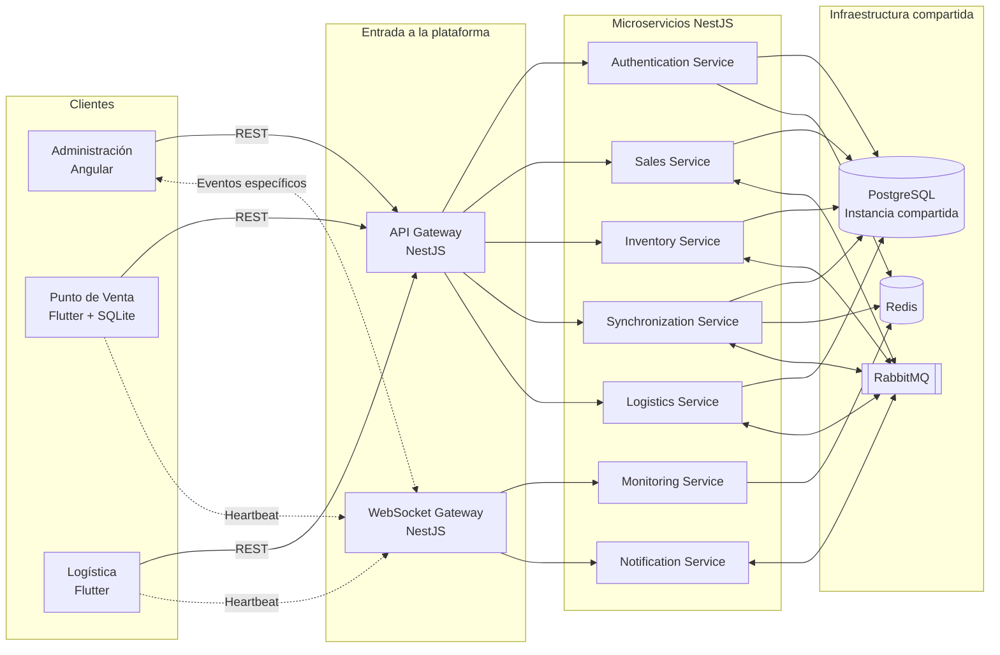

Todos los clientes utilizan la misma plataforma backend.

Sin embargo, cada uno aplica una estrategia de conectividad diferente.

---

# Vista de Alto Nivel

La arquitectura separa las responsabilidades según el tipo de comunicación y persistencia requerido.

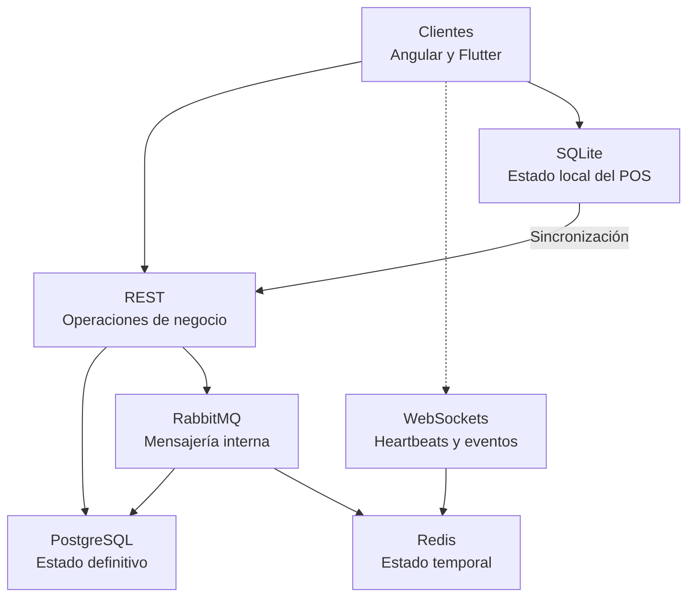

La separación puede resumirse de la siguiente manera:

> **REST procesa solicitudes del negocio. WebSockets comunica eventos inmediatos. RabbitMQ desacopla servicios. Redis coordina estado temporal. PostgreSQL conserva el estado definitivo. SQLite garantiza continuidad local.**

---

# Estrategia de Conectividad por Cliente

Cada cliente selecciona su estrategia según las restricciones del negocio.

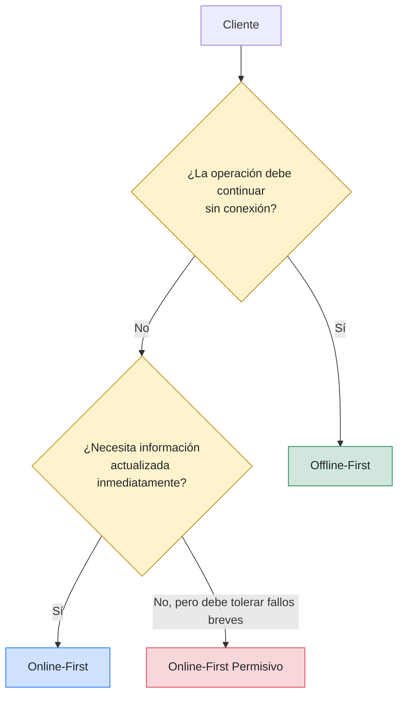

---

# Administración

## Estrategia

**Online-First**

## Tecnología principal

**Angular**

## Objetivo

Mantener una visión actualizada del estado global de la operación.

## Características

- Información actualizada.
- Fuente central de verdad.
- Sin almacenamiento persistente local.
- Consultas mediante REST.
- Notificaciones específicas mediante WebSockets.
- Baja complejidad de sincronización.

## Flujo principal

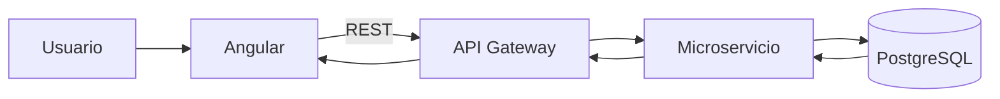

## Actualizaciones en tiempo real

La aplicación administrativa no utiliza WebSockets para todas sus operaciones.

REST continúa siendo el mecanismo principal.

WebSockets se utiliza únicamente para notificaciones que deben llegar al cliente sin esperar una nueva consulta.

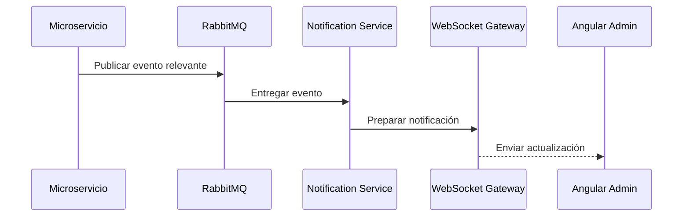

Ejemplos:

- Una terminal cambia de estado.
- Una sincronización termina.
- Se detecta una alerta operativa.
- Una venta afecta un indicador visible.
- Se produce un evento que requiere atención administrativa.

---

# Punto de Venta

## Estrategia

**Offline-First**

## Tecnología principal

**Flutter con SQLite**

## Objetivo

Garantizar la continuidad operativa incluso cuando el servidor no está disponible.

## Características

- Persistencia local.
- Operación autónoma.
- Cola local.
- Sincronización diferida.
- Reintentos automáticos.
- Idempotencia.
- Consistencia eventual.

## Flujo local

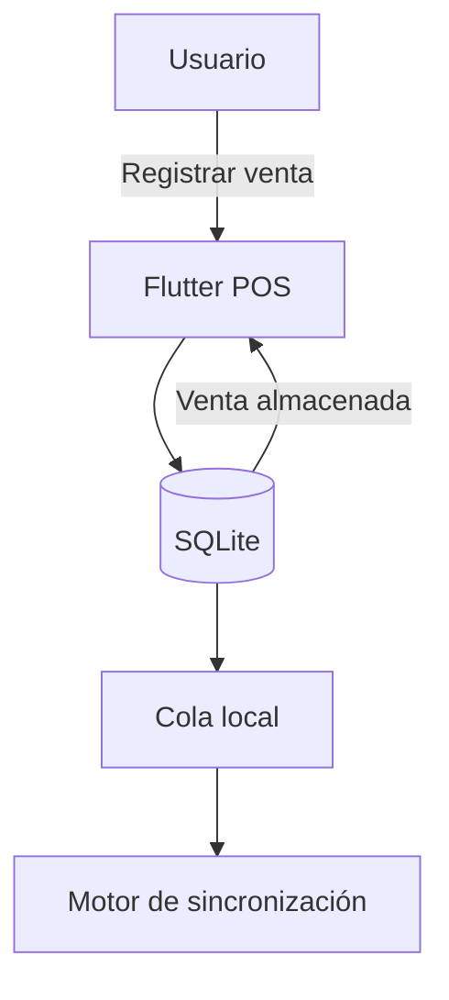

La operación se confirma localmente antes de depender del backend.

Esto permite que el negocio continúe funcionando aunque:

- No exista conexión a Internet.
- El API Gateway no esté disponible.
- RabbitMQ se encuentre temporalmente inaccesible.
- Algún microservicio esté reiniciándose.

## Recuperación de conectividad

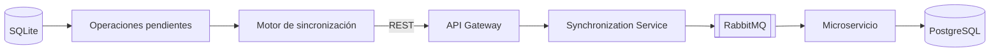

RabbitMQ no reemplaza la cola local.

- SQLite conserva las operaciones cuando el cliente no tiene conexión.
- RabbitMQ coordina el procesamiento cuando la operación ya alcanzó el backend.

---

# Logística

## Estrategia

**Online-First Permisivo**

## Tecnología principal

**Flutter**

## Objetivo

Trabajar principalmente con información centralizada, pero tolerar interrupciones temporales sin perder operaciones.

## Características

- REST como canal principal.
- Caché local temporal.
- Reintentos automáticos.
- Operaciones pendientes limitadas.
- Menor autonomía que el POS.
- Menor complejidad de sincronización.

## Flujo

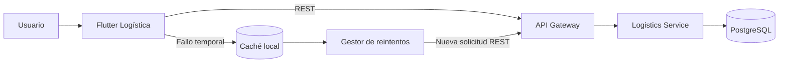

La aplicación logística no pretende operar durante períodos prolongados completamente desconectada.

Su almacenamiento local funciona como una protección temporal y no como una base de datos operativa autónoma.

---

# Tecnologías Utilizadas

Una vez definidas las estrategias de conectividad, se seleccionaron las tecnologías necesarias para implementar cada responsabilidad.

| Tecnología | Responsabilidad |
|---|---|
| **NestJS** | API Gateway, WebSocket Gateway y microservicios |
| **Angular** | Aplicación administrativa Online-First |
| **Flutter** | Aplicaciones de Punto de Venta y logística |
| **SQLite** | Persistencia local y cola de operaciones del POS |
| **PostgreSQL** | Persistencia central y fuente de verdad |
| **Redis** | Heartbeats, sesiones, idempotencia y estado temporal |
| **RabbitMQ** | Mensajería asíncrona entre microservicios |
| **REST** | Operaciones síncronas entre clientes y backend |
| **WebSockets** | Heartbeats y eventos específicos en tiempo real |

---

# Arquitectura de Microservicios

El backend se organiza como un conjunto de servicios con responsabilidades separadas.

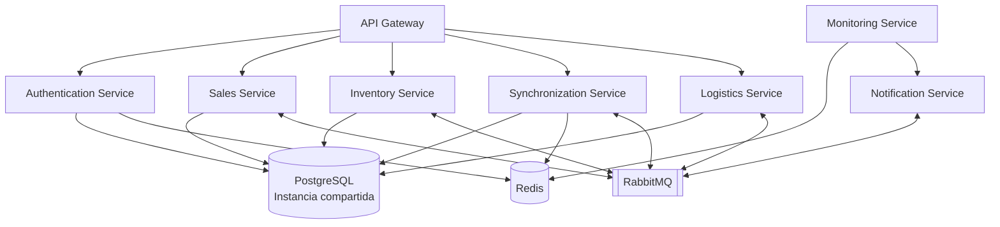

## Responsabilidad de los servicios

| Servicio | Responsabilidad principal |
|---|---|
| **API Gateway** | Punto de entrada, autenticación inicial, validación y enrutamiento |
| **Authentication Service** | Login, sesiones, tokens, RBAC y credenciales temporales |
| **Sales Service** | Registro y procesamiento de ventas |
| **Inventory Service** | Stock, movimientos y disponibilidad |
| **Synchronization Service** | Recepción de operaciones offline, validación y reconciliación |
| **Logistics Service** | Procesamiento de operaciones logísticas |
| **Monitoring Service** | Heartbeats y estado de conectividad |
| **Notification Service** | Distribución de alertas y eventos en tiempo real |

---

# Persistencia Central Compartida

Para mantener el caso de estudio enfocado en conectividad y sincronización, todos los microservicios utilizan una única instancia de PostgreSQL.

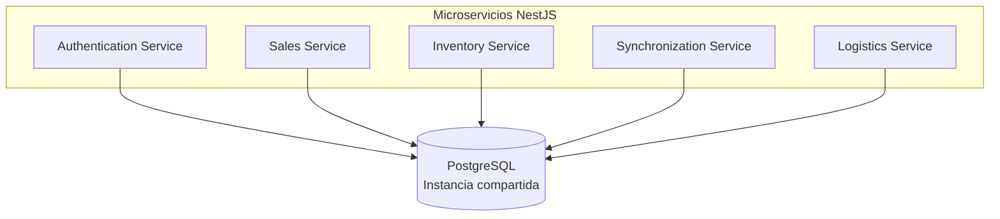

Aunque los servicios comparten la infraestructura de persistencia, cada uno conserva responsabilidades delimitadas.

La separación lógica puede mantenerse mediante:

- Módulos de dominio independientes.
- Repositorios propios por servicio.
- Tablas organizadas por responsabilidad.
- Esquemas separados cuando resulte conveniente.
- Acceso controlado a los datos.
- Contratos definidos entre servicios.
- Reglas que impidan modificar directamente el dominio de otro servicio.

> **Compartir una instancia de PostgreSQL no significa compartir indiscriminadamente las responsabilidades del dominio.**

---

# Decisiones de Persistencia Fuera de Alcance

Este caso de estudio no compara las siguientes alternativas:

- Una base de datos independiente por microservicio.
- Una instancia de PostgreSQL por servicio.
- Transacciones distribuidas.
- Patrones Saga.
- Replicación de datos entre servicios.
- Change Data Capture.
- Event Sourcing.
- CQRS como estrategia principal.
- Consistencia entre múltiples bases de datos.

Estas alternativas son relevantes en arquitecturas distribuidas, pero incorporarlas desviaría el análisis del objetivo central:

> **Evaluar cómo diferentes estrategias de conectividad afectan el comportamiento de los clientes y la sincronización de operaciones.**

---

# Comunicación Cliente-Servidor

La plataforma utiliza una estrategia híbrida.

No todas las operaciones requieren una conexión persistente.

---

## REST

REST es el mecanismo principal de comunicación entre los clientes y el API Gateway.

### Responsabilidades

- Login.
- Refresh Token.
- Consultas.
- Registro de ventas.
- Sincronización de operaciones.
- Actualizaciones de logística.
- Configuración.
- Reportes.
- Confirmaciones.

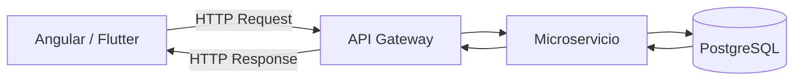

REST se utiliza para operaciones que siguen un modelo de solicitud y respuesta.

---

## WebSockets

WebSockets se utiliza solamente cuando el backend necesita enviar información al cliente sin esperar una nueva solicitud.

### Responsabilidades

- Heartbeats.
- Estado de conectividad.
- Alertas administrativas.
- Cambios de estado relevantes.
- Eventos operativos en tiempo real.
- Resultados de procesos prolongados cuando corresponda.

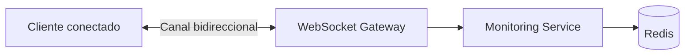

WebSockets complementa a REST, pero no lo reemplaza.

---

# Distribución de la Comunicación

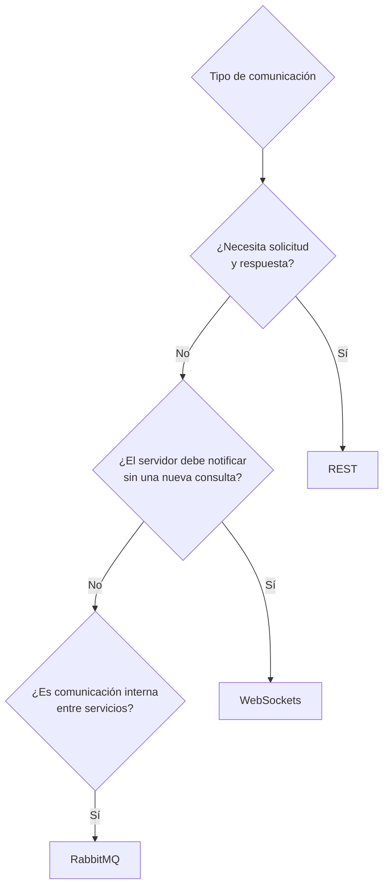

---

# Comunicación Interna

La comunicación interna puede ser síncrona o asíncrona.

## Comunicación síncrona

Se utiliza cuando un componente necesita una respuesta inmediata.

```text
API Gateway
    ↓
Microservicio
    ↓
Respuesta
```

## Comunicación asíncrona

Se utiliza para desacoplar procesos y permitir que diferentes servicios reaccionen a un evento.

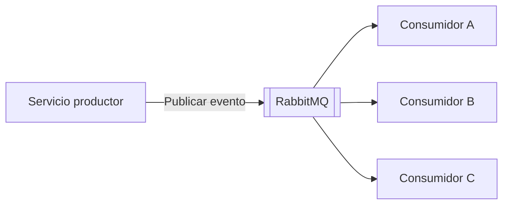

---

# Persistencia

La plataforma utiliza diferentes mecanismos de persistencia según el tipo de información y el nivel de disponibilidad requerido.

---

## Persistencia Local

SQLite se utiliza en el Punto de Venta.

### Responsabilidades

- Registro local de ventas.
- Persistencia de operaciones pendientes.
- Cola de sincronización.
- Recuperación después de reiniciar la aplicación.
- Conservación de errores de sincronización.
- Continuidad operativa.

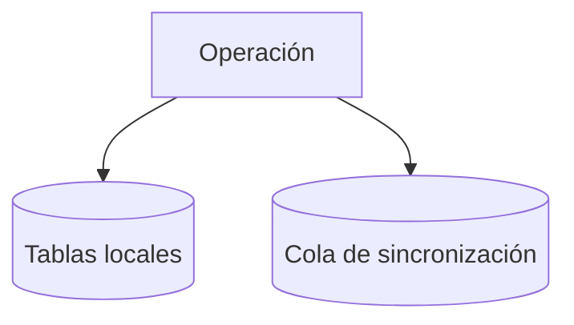

Cada operación pendiente puede mantener:

| Campo | Propósito |
|---|---|
| `operationId` | UUID único de la operación |
| `operationType` | Tipo de operación |
| `payload` | Datos necesarios para procesarla |
| `createdAt` | Fecha de creación local |
| `status` | Estado de sincronización |
| `retryCount` | Cantidad de intentos |
| `lastAttemptAt` | Último intento realizado |
| `lastError` | Último error registrado |
| `syncedAt` | Fecha de confirmación definitiva |

---

## Persistencia Central

PostgreSQL representa la fuente de verdad central del sistema.

### Responsabilidades

- Ventas.
- Inventario.
- Usuarios.
- Clientes.
- Configuración.
- Operaciones logísticas.
- Auditoría.
- Reportes.
- Resultado definitivo de las sincronizaciones.

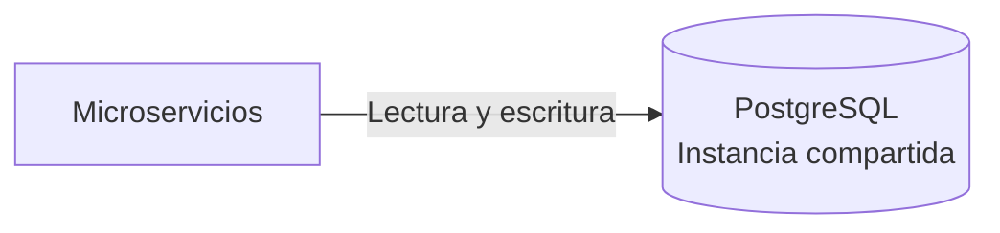

PostgreSQL almacena el estado definitivo.

Redis, RabbitMQ y SQLite no sustituyen esta responsabilidad.

---

# Redis

Redis se utiliza para información temporal y coordinación distribuida.

## Responsabilidades

- Heartbeats.
- Estado de conectividad.
- Sesiones.
- Datos temporales.
- Claves de idempotencia.
- Bloqueos distribuidos.
- Contadores.
- Rate limiting.
- Caché de corta duración.

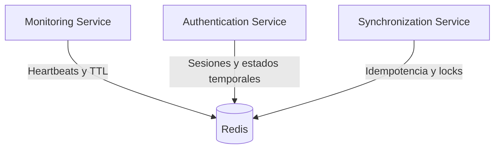

Redis no almacena el estado definitivo del negocio.

Su objetivo consiste en coordinar componentes distribuidos y ofrecer acceso rápido a información temporal.

---

# RabbitMQ

RabbitMQ permite desacoplar el procesamiento interno.

## Responsabilidades

- Publicación de eventos.
- Comunicación entre microservicios.
- Procesamiento asíncrono.
- Reintentos.
- Distribución de trabajo.
- Integraciones.
- Dead Letter Queues.
- Absorción de picos de carga.

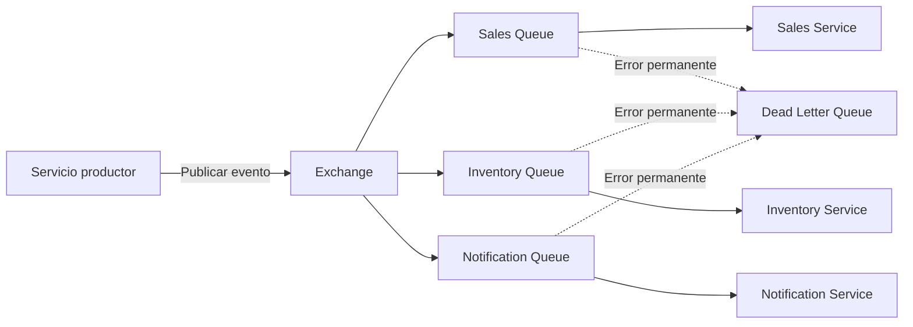

RabbitMQ complementa la arquitectura Offline-First.

No reemplaza la cola local almacenada en SQLite.

---

# Relación entre SQLite, Redis y RabbitMQ

Los tres componentes pueden participar en el procesamiento de operaciones, pero cumplen responsabilidades diferentes.

| Componente | Responsabilidad |
|---|---|
| **SQLite** | Mantener operaciones mientras el cliente está desconectado |
| **Redis** | Mantener estado temporal, idempotencia y coordinación |
| **RabbitMQ** | Transportar eventos y distribuir procesamiento dentro del backend |

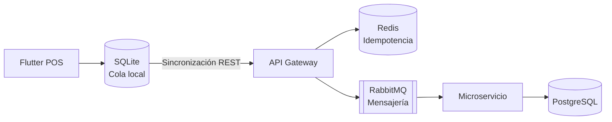

---

# Heartbeats y Estado de Conectividad

Los clientes que necesitan ser monitoreados mantienen una conexión WebSocket con el servicio de monitoreo.

Cada cliente envía periódicamente un heartbeat.

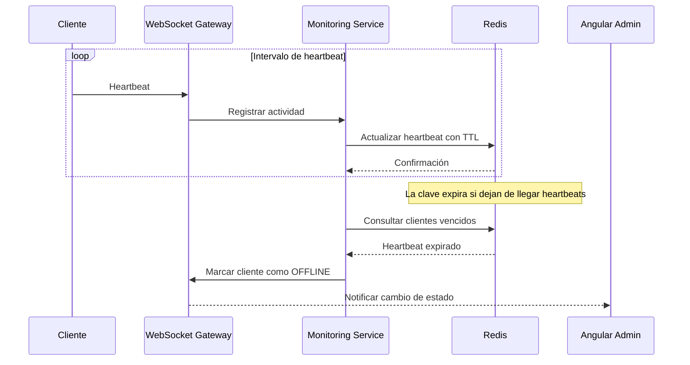

## Clave temporal

```text
client:heartbeat:{clientId}
```

La clave puede almacenar:

```json
{
  "clientId": "pos-001",
  "status": "online",
  "lastSeenAt": "2026-07-17T20:30:00Z",
  "application": "pos",
  "version": "1.0.0"
}
```

El TTL determina cuánto tiempo puede transcurrir sin recibir un latido antes de considerar al cliente desconectado.

RabbitMQ no necesita procesar cada heartbeat.

Puede intervenir solamente cuando se produce un cambio significativo de estado.

```mermaid
flowchart LR

    HEARTBEAT["Heartbeat recibido"]
    REDIS[("Redis TTL")]
    EXPIRED{"¿Expiró?"}
    EVENT["ClientDisconnected"]
    MQ[["RabbitMQ"]]
    NOTIFY["Notification Service"]
    ADMIN["Angular Admin"]

    HEARTBEAT --> REDIS
    REDIS --> EXPIRED

    EXPIRED -->|"No"| REDIS
    EXPIRED -->|"Sí"| EVENT

    EVENT --> MQ
    MQ --> NOTIFY
    NOTIFY -->|"WebSocket"| ADMIN
```

---

# Flujo de Sincronización Offline

El Punto de Venta registra primero la operación de manera local.

Cuando recupera la conectividad, el motor de sincronización envía las operaciones pendientes al backend mediante REST.

```mermaid
sequenceDiagram

    participant POS
    participant SQLite
    participant API as API Gateway
    participant Sync as Synchronization Service
    participant Redis
    participant MQ as RabbitMQ
    participant Sales as Sales Service
    participant DB as PostgreSQL
    participant Notification as Notification Service
    participant Admin as Angular Admin

    POS->>SQLite: Registrar venta local
    SQLite-->>POS: Confirmar operación

    Note over POS,SQLite: La venta se completa sin depender del servidor

    POS->>API: POST /synchronization/operations
    API->>Sync: Enviar lote validado
    Sync->>Redis: Consultar operationId

    alt Operación ya procesada
        Redis-->>Sync: UUID existente
        Sync-->>API: Resultado previamente registrado
        API-->>POS: Confirmación idempotente
        POS->>SQLite: Marcar como sincronizada
    else Operación pendiente
        Redis-->>Sync: UUID no encontrado
        Sync->>MQ: Publicar ProcessSale
        MQ->>Sales: Entregar mensaje
        Sales->>DB: Persistir venta
        DB-->>Sales: Confirmación
        Sales->>Redis: Registrar operationId
        Sales->>MQ: Publicar SaleProcessed
        MQ->>Sync: Entregar resultado
        Sync-->>API: Operación procesada
        API-->>POS: Confirmación REST
        POS->>SQLite: Marcar como sincronizada
        MQ->>Notification: Entregar evento
        Notification-->>Admin: Notificar mediante WebSocket
    end
```

---

# Sincronización por Lotes

Para reducir el número de solicitudes, el POS puede enviar varias operaciones pendientes en una misma petición REST.

```mermaid
flowchart LR

    QUEUE[("Cola local SQLite")]
    BATCH["Construir lote"]
    API["POST /synchronization/batch"]
    VALIDATE["Validar operaciones"]
    PROCESS["Procesar individualmente"]
    RESULT["Resultado por operación"]
    UPDATE["Actualizar SQLite"]

    QUEUE --> BATCH
    BATCH --> API
    API --> VALIDATE
    VALIDATE --> PROCESS
    PROCESS --> RESULT
    RESULT --> UPDATE
```

La respuesta debe identificar el resultado de cada operación:

```json
{
  "batchId": "batch-001",
  "operations": [
    {
      "operationId": "operation-001",
      "status": "SYNCED"
    },
    {
      "operationId": "operation-002",
      "status": "CONFLICT",
      "errorCode": "INSUFFICIENT_STOCK"
    },
    {
      "operationId": "operation-003",
      "status": "RETRY_PENDING",
      "errorCode": "SERVICE_UNAVAILABLE"
    }
  ]
}
```

El éxito de una operación no implica necesariamente el éxito de todo el lote.

---

# Estados de una Operación Local

Una operación no debería representarse únicamente como pendiente o sincronizada.

Puede atravesar diferentes estados.

```mermaid
stateDiagram-v2

    [*] --> Pending: Operación creada

    Pending --> Sending: Iniciar sincronización

    Sending --> Synced: Confirmación definitiva

    Sending --> RetryPending: Timeout o error temporal

    RetryPending --> Sending: Nuevo intento

    Sending --> Conflict: Conflicto de negocio

    Sending --> Failed: Error permanente

    Conflict --> Pending: Conflicto resuelto

    Failed --> Pending: Corrección manual

    Synced --> [*]
```

Estados posibles:

| Estado | Significado |
|---|---|
| `PENDING` | Esperando sincronización |
| `SENDING` | En proceso de envío |
| `RETRY_PENDING` | Esperando un nuevo intento |
| `SYNCED` | Confirmada por el backend |
| `CONFLICT` | Requiere reconciliación |
| `FAILED` | No puede procesarse automáticamente |

---

# Idempotencia

La idempotencia evita que una operación repetida produzca múltiples efectos.

Cada operación generada por el cliente contiene un UUID estable.

```mermaid
flowchart TD

    REQUEST["Operación recibida"]
    ID["Extraer operationId"]
    REDIS{"¿Existe en Redis?"}
    PREVIOUS["Devolver resultado anterior"]
    PROCESS["Procesar operación"]
    DB[("PostgreSQL")]
    SAVE["Registrar operationId"]
    RESPONSE["Responder al cliente"]

    REQUEST --> ID
    ID --> REDIS

    REDIS -->|"Sí"| PREVIOUS
    PREVIOUS --> RESPONSE

    REDIS -->|"No"| PROCESS
    PROCESS --> DB
    DB --> SAVE
    SAVE --> RESPONSE
```

La clave de idempotencia puede seguir una estructura similar a:

```text
idempotency:{clientId}:{operationId}
```

Redis permite realizar una verificación rápida, pero la base de datos central debe mantener una protección adicional.

Ejemplo:

```sql
UNIQUE (client_id, operation_id)
```

Esto evita que dos instancias de un servicio procesen la misma operación simultáneamente y produzcan efectos duplicados.

---

# Reintentos y Dead Letter Queue

Los errores temporales y permanentes requieren tratamientos diferentes.

```mermaid
flowchart TD

    MESSAGE["Mensaje recibido"]
    PROCESS{"¿Procesamiento correcto?"}

    SUCCESS["Confirmar mensaje"]
    RETRY{"¿Error recuperable?"}
    DELAY["Cola de reintento"]
    DLQ["Dead Letter Queue"]
    REVIEW["Revisión manual"]

    MESSAGE --> PROCESS

    PROCESS -->|"Sí"| SUCCESS
    PROCESS -->|"No"| RETRY

    RETRY -->|"Sí"| DELAY
    DELAY --> MESSAGE

    RETRY -->|"No"| DLQ
    DLQ --> REVIEW
```

Ejemplos de errores recuperables:

- Timeout.
- Servicio temporalmente no disponible.
- Bloqueo transitorio de base de datos.
- Pérdida momentánea de conectividad interna.
- Reinicio temporal de un consumidor.

Ejemplos de errores no recuperables:

- Datos inválidos.
- Recurso inexistente.
- Violación de una regla de negocio.
- Operación incompatible con el estado actual.
- Mensaje con formato incorrecto.
- Versión de contrato no soportada.

---

# Flujo Administrativo Online-First

```mermaid
sequenceDiagram

    participant Admin as Angular Admin
    participant API as API Gateway
    participant Inventory as Inventory Service
    participant DB as PostgreSQL
    participant MQ as RabbitMQ
    participant Notification as Notification Service
    participant WS as WebSocket Gateway

    Admin->>API: GET /inventory
    API->>Inventory: Consultar inventario
    Inventory->>DB: Leer datos
    DB-->>Inventory: Resultado
    Inventory-->>API: Inventario actual
    API-->>Admin: Respuesta REST

    Inventory->>MQ: Publicar InventoryChanged
    MQ->>Notification: Entregar evento
    Notification->>WS: Enviar actualización
    WS-->>Admin: Notificación en tiempo real
```

La consulta inicial utiliza REST.

WebSockets se utiliza solamente para informar cambios posteriores relevantes.

---

# Flujo de Logística Online-First Permisivo

```mermaid
sequenceDiagram

    participant User as Usuario
    participant App as Flutter Logística
    participant Cache as Caché local
    participant API as API Gateway
    participant Service as Logistics Service
    participant DB as PostgreSQL

    User->>App: Registrar operación
    App->>API: Solicitud REST

    alt Backend disponible
        API->>Service: Procesar operación
        Service->>DB: Persistir
        DB-->>Service: Confirmación
        Service-->>API: Resultado
        API-->>App: Operación confirmada
    else Interrupción temporal
        API--xApp: Error de conectividad
        App->>Cache: Guardar operación temporal
        App->>App: Programar reintento
        App->>API: Reintentar operación
        API->>Service: Procesar
        Service->>DB: Persistir
        DB-->>Service: Confirmación
        Service-->>API: Resultado
        API-->>App: Confirmación
        App->>Cache: Eliminar operación temporal
    end
```

---

# Disponibilidad Parcial del Sistema

La arquitectura debe tolerar fallos parciales.

```mermaid
flowchart TD

    CLIENT["Cliente"]
    API{"¿API disponible?"}
    SERVICE{"¿Servicio disponible?"}
    MQ{"¿RabbitMQ disponible?"}
    DATABASE{"¿PostgreSQL disponible?"}

    LOCAL["Guardar localmente"]
    RETRY["Programar reintento"]
    ACCEPT["Aceptar para procesamiento"]
    SUCCESS["Operación procesada"]

    CLIENT --> API

    API -->|"No"| LOCAL
    API -->|"Sí"| SERVICE

    SERVICE -->|"No"| RETRY
    SERVICE -->|"Sí"| MQ

    MQ -->|"No"| RETRY
    MQ -->|"Sí"| DATABASE

    DATABASE -->|"No"| RETRY
    DATABASE -->|"Sí"| SUCCESS

    LOCAL --> RETRY
```

No todos los fallos producen la misma respuesta.

- En el POS, la operación puede continuar localmente.
- En Administración, se informa la indisponibilidad.
- En Logística, se guarda temporalmente y se reintenta.
- En RabbitMQ, los mensajes pueden permanecer pendientes.
- En los microservicios, los errores recuperables pueden utilizar reintentos.

---

# Separación de Responsabilidades

| Necesidad | Componente |
|---|---|
| Interfaz administrativa | Angular |
| Aplicaciones POS y logística | Flutter |
| Persistencia local offline | SQLite |
| Persistencia central | PostgreSQL |
| Estado temporal | Redis |
| Claves de idempotencia | Redis y restricciones en PostgreSQL |
| Eventos internos | RabbitMQ |
| Reintentos de backend | RabbitMQ |
| Dead Letter Queue | RabbitMQ |
| Comunicación cliente-servidor | REST |
| Heartbeats | WebSockets |
| Notificaciones en tiempo real | WebSockets |
| Entrada central al backend | API Gateway |
| Coordinación de servicios | NestJS |
| Procesamiento de ventas | Sales Service |
| Reconciliación offline | Synchronization Service |
| Procesamiento logístico | Logistics Service |
| Estado de clientes | Monitoring Service |
| Distribución de notificaciones | Notification Service |

---

# Límites de Responsabilidad

La arquitectura evita utilizar una tecnología para resolver problemas que pertenecen a otra capa.

## SQLite no reemplaza PostgreSQL

SQLite conserva el estado necesario para que el POS opere localmente.

PostgreSQL conserva el estado central y definitivo.

## Redis no reemplaza PostgreSQL

Redis mantiene información rápida y temporal.

No funciona como fuente de verdad del negocio.

## RabbitMQ no reemplaza SQLite

RabbitMQ requiere que la operación haya alcanzado la infraestructura backend.

SQLite conserva las operaciones cuando el cliente todavía no puede comunicarse con el servidor.

## WebSockets no reemplaza REST

WebSockets se reserva para comunicación bidireccional y eventos inmediatos.

REST continúa siendo el canal principal para operaciones de negocio.

## RabbitMQ no confirma por sí solo el resultado del negocio

Publicar un mensaje en RabbitMQ significa que fue aceptado para procesamiento.

No significa necesariamente que la operación haya sido persistida correctamente.

La confirmación definitiva debe representar el resultado real del procesamiento.

## Redis no reemplaza las restricciones de PostgreSQL

Redis ayuda a detectar rápidamente operaciones duplicadas.

Sin embargo, las restricciones de unicidad en PostgreSQL representan la protección definitiva frente a condiciones de carrera o pérdida temporal del caché.

## Los microservicios no deben compartir responsabilidades

Aunque utilicen una instancia compartida de PostgreSQL, cada microservicio debe mantener sus reglas, contratos y responsabilidades delimitadas.

---

# Principios Arquitectónicos

## La conectividad responde al negocio

La arquitectura no aplica una única estrategia de conectividad a toda la plataforma.

Cada cliente utiliza la estrategia mínima necesaria para cumplir sus objetivos operativos.

## La persistencia local tiene un propósito específico

La persistencia local se utiliza cuando la continuidad operativa justifica la complejidad adicional.

## La fuente de verdad continúa siendo central

Aunque algunos clientes operen temporalmente de manera autónoma, PostgreSQL mantiene el estado corporativo definitivo.

## La comunicación en tiempo real es selectiva

WebSockets se utiliza únicamente cuando la inmediatez aporta valor.

## La mensajería desacopla, pero no elimina la consistencia

RabbitMQ permite procesamiento asíncrono, pero las reglas de negocio continúan requiriendo validación, idempotencia y resolución de conflictos.

## Las operaciones deben ser recuperables

Las operaciones pendientes deben sobrevivir cierres inesperados, reinicios y errores temporales.

## Compartir infraestructura no implica compartir dominios

Los microservicios pueden utilizar la misma instancia de PostgreSQL dentro del alcance del caso, pero deben mantener separadas sus responsabilidades funcionales.

## La tecnología es una consecuencia

> **La arquitectura define las responsabilidades. Las tecnologías proporcionan los mecanismos para implementarlas.**

---

# Riesgos Arquitectónicos

La arquitectura introduce desafíos que deben documentarse y probarse.

- Operaciones duplicadas.
- Eventos fuera de orden.
- Sincronizaciones parciales.
- Ventas concurrentes sobre el mismo inventario.
- Conflictos entre estado local y central.
- Clientes desconectados durante períodos prolongados.
- Expiración de credenciales offline.
- Mensajes enviados a Dead Letter Queues.
- Pérdida de confirmaciones.
- Reintentos excesivos.
- Diferencias entre relojes de clientes y servidor.
- Caídas parciales de microservicios.
- Inconsistencias temporales entre servicios.
- Dependencia compartida de una única instancia de PostgreSQL.
- Acceso incorrecto de un servicio a tablas pertenecientes a otro dominio.

Estos escenarios se analizan con mayor profundidad en:

- **SYNCHRONIZATION.md**
- **CONFLICT_SCENARIOS.md**
- **DESIGNDECISIONS.md**

---

# Trade-offs

La solución seleccionada ofrece beneficios concretos, pero también introduce costos.

## Beneficios

- Continuidad operativa del Punto de Venta.
- Mejor experiencia en entornos con conectividad inestable.
- Actualizaciones en tiempo real donde son necesarias.
- Menor uso de conexiones WebSocket.
- Desacoplamiento interno mediante RabbitMQ.
- Recuperación de operaciones pendientes.
- Adaptación de la estrategia según el cliente.
- Menor complejidad de infraestructura al utilizar una instancia compartida de PostgreSQL.

## Costos

- Mayor complejidad de sincronización.
- Necesidad de idempotencia.
- Manejo de estado distribuido.
- Resolución de conflictos.
- Reintentos y recuperación ante fallos.
- Observabilidad de colas y operaciones.
- Dependencia de Redis y RabbitMQ para determinadas capacidades.
- Riesgo de acoplamiento entre servicios por compartir PostgreSQL.
- Necesidad de controlar estrictamente la propiedad lógica de los datos.

---

# Responsabilidad de Cada Componente

| Necesidad | Componente |
|---|---|
| Persistencia local | SQLite |
| Persistencia central | PostgreSQL |
| Estado temporal | Redis |
| Idempotencia rápida | Redis |
| Garantía final contra duplicados | PostgreSQL |
| Eventos internos | RabbitMQ |
| Comunicación cliente-servidor | REST |
| Eventos en tiempo real | WebSockets |
| Heartbeats | WebSockets y Redis |
| Coordinación de servicios | NestJS |
| Continuidad operativa | Flutter y SQLite |
| Procesamiento asíncrono | RabbitMQ |
| Monitoreo de conectividad | Monitoring Service |
| Reconciliación offline | Synchronization Service |

---

# Documentos Relacionados

| Documento | Contenido |
|---|---|
| **README.md** | Problema, restricciones, alternativas y decisión arquitectónica |
| **ARCHITECTURE.md** | Componentes, comunicaciones y flujos técnicos |
| **DESIGNDECISIONS.md** | Decisiones, alternativas y trade-offs |
| **SYNCHRONIZATION.md** | Protocolo de sincronización, estados e idempotencia |
| **CONFLICT_SCENARIOS.md** | Conflictos distribuidos y estrategias de resolución |
| **SECURITY.md** | Seguridad y autenticación en clientes online y offline |
| **RUNNING.md** | Configuración y ejecución local |

---

# Conclusión

La arquitectura combina diferentes estrategias de conectividad dentro de una misma plataforma.

La aplicación administrativa utiliza un modelo Online-First para trabajar con información actualizada.

El Punto de Venta utiliza un modelo Offline-First para garantizar continuidad operativa.

La aplicación logística utiliza un modelo Online-First Permisivo para tolerar interrupciones temporales sin asumir toda la complejidad de un cliente completamente autónomo.

REST funciona como mecanismo principal para las operaciones del negocio.

WebSockets se reserva para heartbeats y eventos que necesitan comunicación inmediata.

RabbitMQ desacopla el procesamiento entre microservicios.

Redis coordina estados temporales e idempotencia.

SQLite permite que el POS continúe operando localmente.

PostgreSQL conserva el estado central y definitivo utilizando una única instancia compartida para el alcance de este caso de estudio.

Esta simplificación permite mantener el análisis enfocado en la conectividad, la continuidad operativa y la sincronización, sin introducir la complejidad adicional de una base de datos independiente por microservicio.

> **Cada cliente utiliza la estrategia de conectividad mínima necesaria para cumplir sus objetivos operativos.**

La tecnología es una consecuencia de esta decisión, no su punto de partida.

---

# Documentos Relacionados

- **SECURITY.md** — Arquitectura de autenticación y seguridad.
- **SYNCHRONIZATION.md** — Sincronización de eventos entre clientes y servidor.
- **CONFLICT_RESOLUTION.md** — Resolución de conflictos de negocio.
- **TEST.md** — Estrategia de pruebas unitarias y automatización.
- **DESIGNDECISIONS.md** — Decisiones de diseño y elecciones tecnológicas.
- **DEPLOYMENT.md** — Estrategia de despliegue y operación.
- **RUNNING.md** — Ejecución del proyecto.
