# 🏛️ Technical Architecture

## Case Study 2: Connectivity Strategies in Distributed Systems

---

# Introduction

This document describes the technical architecture used to implement the various connectivity strategies defined during the problem analysis.

The goal of this architecture is not to impose a single communication mechanism for all clients.

On the contrary, each client uses the mechanism that best addresses its operational constraints.

The platform combines:

- Synchronous communication via REST.
- Real-time communication via WebSockets.
- Asynchronous processing via RabbitMQ.
- Central persistence via PostgreSQL.
- Local persistence via SQLite.
- Temporary state coordination via Redis.
- Microservices developed with NestJS.

Technology is selected after understanding the expected behavior of each client.

---

# Scope

This document focuses on the technical decisions required to implement different connectivity strategies within the same platform.

The case study primarily analyzes:

- Online-First clients.
- Offline-First clients.
- Permissive Online-First clients.
- Local persistence.
- Deferred synchronization.
- Idempotency.
- Asynchronous processing.
- Heartbeats.
- Connectivity monitoring.
- Real-time communication.
- Microservice coordination.

It does not attempt to construct a universal synchronization framework or resolve all possible infrastructure decisions of a distributed architecture.

In particular, independent database per microservice strategy is out of scope.

---

# Architectural Objectives

The architecture aims to achieve the following objectives:

- Allow Point of Sale to continue operating without a connection.
- Maintain up-to-date information in the administration application.
- Tolerate temporary disruptions in the logistics application.
- Prevent duplicate operation processing.
- Decouple internal microservice processing.
- Detect connected and disconnected clients.
- Maintain a central source of truth.
- Limit WebSocket usage strictly to scenarios that genuinely require real-time capabilities.
- Recover operations after failures or restarts.
- Facilitate independent evolution of components.
- Apply complexity only where it delivers business value.

---

# Key Architectural Decisions

The architecture adopts a set of decisions intended to balance operational continuity, consistency, simplicity, and implementation cost.

These decisions do not represent universal rules for all distributed systems.

They respond specifically to the constraints and objectives of this case study.

- **Offline-First only where operational continuity is critical.**  
  Point of Sale must continue recording operations even if the backend or connection is unavailable.

- **Online-First for clients whose main need is working with up-to-date information.**  
  The administration application directly queries the central system state.

- **Permissive Online-First for temporary disruptions.**  
  The logistics application uses the backend as primary source, but temporarily retains operations that cannot be sent.

- **REST as the primary client-server communication mechanism.**  
  Queries, commands, authentication, and synchronizations use a request-response model.

- **WebSockets only when immediate communication adds value.**  
  Used for heartbeats, connectivity state changes, alerts, and specific operational events.

- **RabbitMQ as the internal decoupling mechanism.**  
  Microservices publish and consume events asynchronously without directly depending on immediate availability of other services.

- **PostgreSQL as the central source of truth.**  
  Definitive state of sales, inventory, users, configurations, and operations resides in the central database.

- **Single PostgreSQL instance for the scope of this case study.**  
  Microservices share a PostgreSQL instance while maintaining logical separation of responsibilities.

- **Redis for temporal coordination and idempotency.**  
  Used for heartbeats, sessions, temporary keys, distributed locks, and fast detection of repeated operations.

- **SQLite for Point of Sale local persistence.**  
  Allows recording operations, maintaining a local queue, and recovering pending state after application closes or restarts.

- **PostgreSQL retains definitive state while SQLite retains local operational state.**  
  Local data enables continuity but must be subsequently reconciled with the central source.

- **Operation confirmation represents actual processing.**  
  Publishing a message to RabbitMQ is not considered definitive confirmation. The client receives confirmation when the operation has been processed and its result recorded.

---

# Overall Architecture

The platform comprises three clients, an API Gateway, several microservices, and shared infrastructure components.

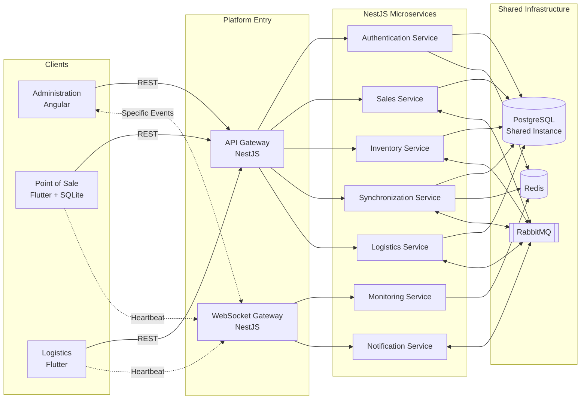

All clients use the same backend platform.

However, each applies a different connectivity strategy.

---

# High-Level View

The architecture separates responsibilities according to the required communication and persistence type.

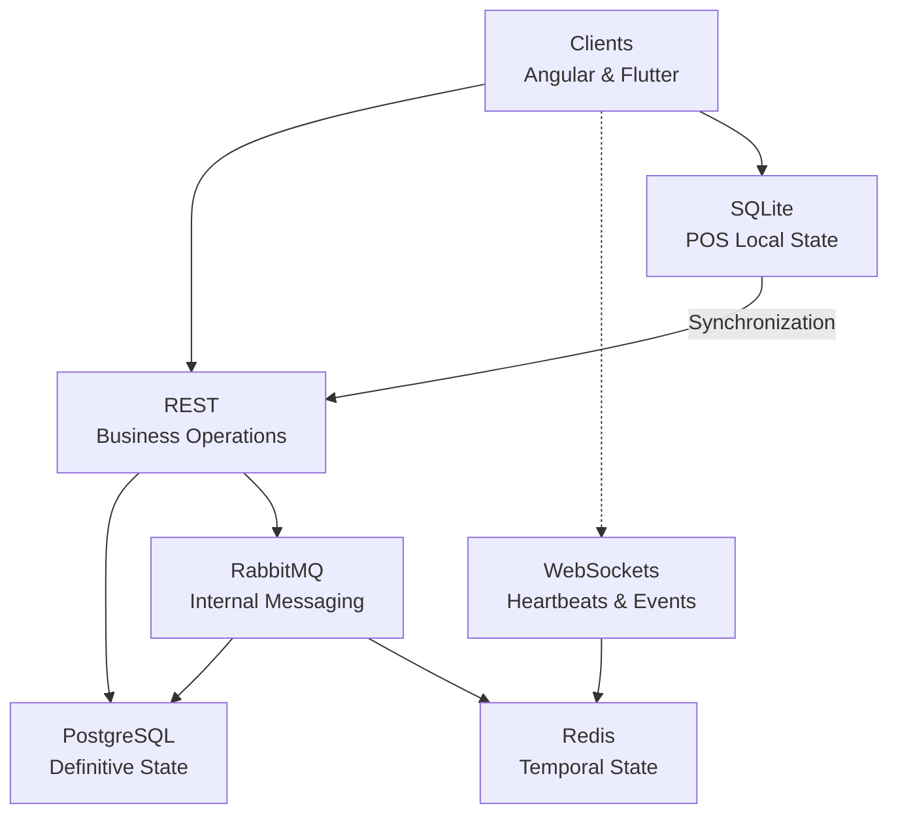

The separation can be summarized as follows:

> **REST processes business requests. WebSockets communicates immediate events. RabbitMQ decouples services. Redis coordinates temporal state. PostgreSQL preserves definitive state. SQLite guarantees local continuity.**

---

# Client Connectivity Strategy

Each client selects its strategy based on business constraints.

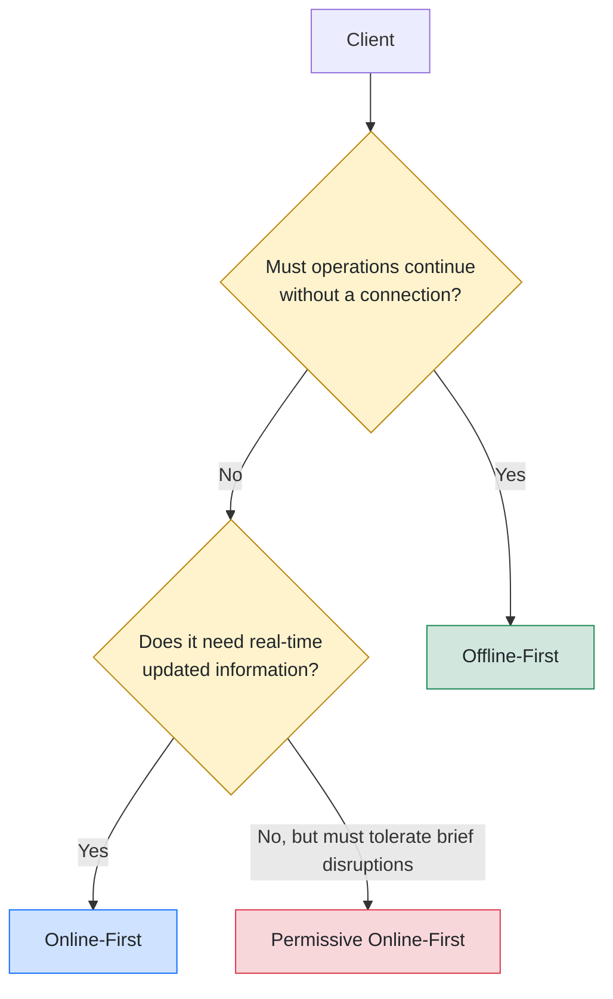

---

# Administration

## Strategy

**Online-First**

## Primary Technology

**Angular**

## Objective

Maintain an updated view of global operational state.

## Characteristics

- Up-to-date information.
- Central source of truth.
- No local persistent storage.
- Queries via REST.
- Specific notifications via WebSockets.
- Low synchronization complexity.

## Main Flow

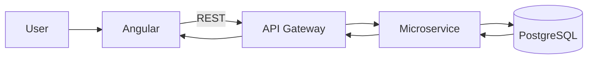

## Real-Time Updates

The administrative application does not use WebSockets for all operations.

REST remains the primary mechanism.

WebSockets is used exclusively for notifications that must reach the client without waiting for a poll.

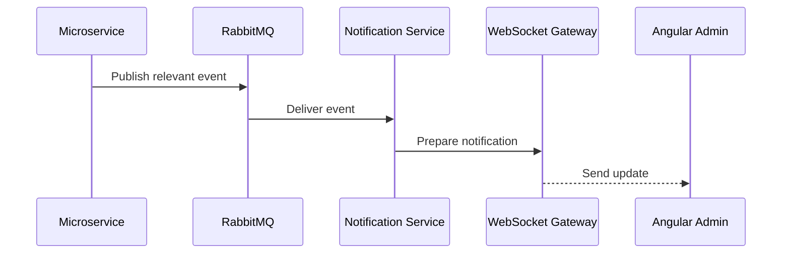

Examples:

- A terminal changes state.
- A synchronization completes.
- An operational alert is detected.
- A sale affects a visible indicator.
- An event occurs requiring administrative attention.

---

# Point of Sale

## Strategy

**Offline-First**

## Primary Technology

**Flutter with SQLite**

## Objective

Guarantee operational continuity even when server is unavailable.

## Characteristics

- Local persistence.
- Autonomous operation.
- Local queue.
- Deferred synchronization.
- Automatic retries.
- Idempotency.
- Eventual consistency.

## Local Flow

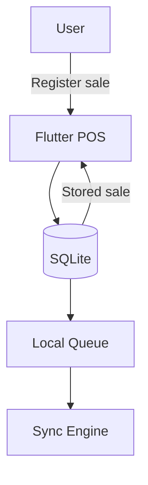

The operation is confirmed locally before depending on the backend.

This allows business operations to continue even if:

- No Internet connection exists.
- API Gateway is unavailable.
- RabbitMQ is temporarily unreachable.
- A microservice is restarting.

## Connectivity Recovery

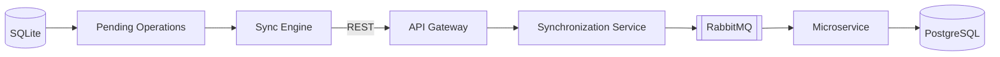

RabbitMQ does not replace the local queue.

- SQLite retains operations when the client is disconnected.
- RabbitMQ coordinates processing once the operation reaches the backend.

---

# Logistics

## Strategy

**Permissive Online-First**

## Primary Technology

**Flutter**

## Objective

Work primarily with centralized data while tolerating temporary disruptions without losing operations.

## Characteristics

- REST as primary channel.
- Temporary local cache.
- Automatic retries.
- Limited pending operations.
- Less autonomy than POS.
- Lower synchronization complexity.

## Flow

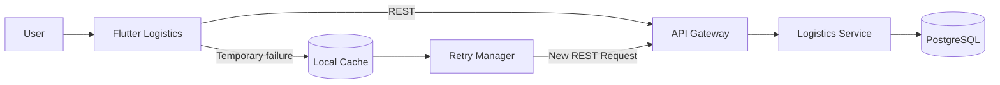

The logistics app is not designed to operate for extended periods fully disconnected.

Its local storage serves as a temporary safeguard rather than an autonomous operational database.

---

# Technologies Used

Once connectivity strategies were established, technologies were selected for each responsibility.

| Technology | Responsibility |
|---|---|
| **NestJS** | API Gateway, WebSocket Gateway, and microservices |
| **Angular** | Online-First administrative application |
| **Flutter** | Point of Sale and logistics applications |
| **SQLite** | Local persistence and POS operation queue |
| **PostgreSQL** | Central persistence and source of truth |
| **Redis** | Heartbeats, sessions, idempotency, and temporal state |
| **RabbitMQ** | Asynchronous messaging between microservices |
| **REST** | Synchronous operations between clients and backend |
| **WebSockets** | Real-time heartbeats and specific events |

---

# Microservice Architecture

The backend is organized as a set of services with separated responsibilities.

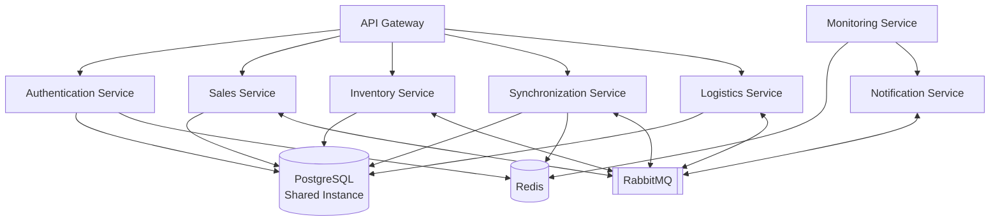

## Service Responsibilities

| Service | Main Responsibility |
|---|---|
| **API Gateway** | Entry point, initial authentication, validation, and routing |
| **Authentication Service** | Login, sessions, tokens, RBAC, and temporary credentials |
| **Sales Service** | Recording and processing sales |
| **Inventory Service** | Stock, movements, and availability |
| **Synchronization Service** | Receiving offline operations, validation, and reconciliation |
| **Logistics Service** | Processing logistics operations |
| **Monitoring Service** | Heartbeats and connectivity state |
| **Notification Service** | Real-time alert and event distribution |

---

# Shared Central Persistence

To keep the case study focused on connectivity and synchronization, all microservices share a single PostgreSQL instance.

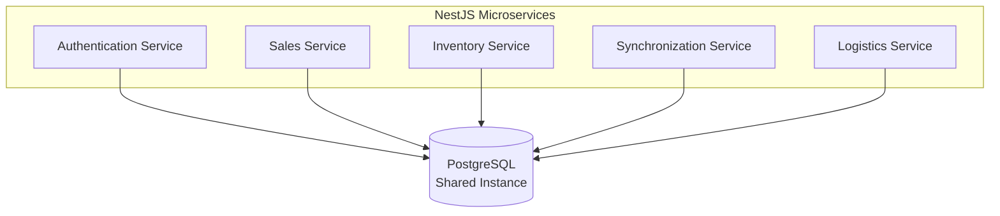

While services share persistence infrastructure, each maintains delimited responsibilities.

Logical separation is maintained via:

- Independent domain modules.
- Service-owned repositories.
- Tables organized by responsibility.
- Separate schemas where appropriate.
- Controlled data access.
- Defined service contracts.
- Rules prohibiting direct modification of another service's domain.

> **Sharing a PostgreSQL instance does not mean indiscriminately sharing domain responsibilities.**

---

# Persistence Decisions Out of Scope

This case study does not compare:

- Independent database per microservice.
- Separate PostgreSQL instance per service.
- Distributed transactions.
- Saga patterns.
- Data replication between services.
- Change Data Capture.
- Event Sourcing.
- CQRS as primary strategy.
- Multi-database consistency.

These alternatives are relevant in distributed architectures, but incorporating them would divert focus from the main objective:

> **Evaluating how different connectivity strategies affect client behavior and operation synchronization.**

---

# Client-Server Communication

The platform uses a hybrid strategy.

Not all operations require a persistent connection.

---

## REST

REST is the primary communication mechanism between clients and API Gateway.

### Responsibilities

- Login.
- Refresh Token.
- Queries.
- Sales registration.
- Operation synchronization.
- Logistics updates.
- Configuration.
- Reports.
- Confirmations.

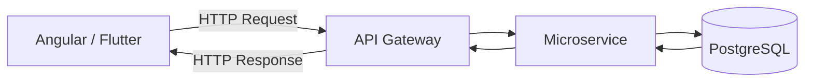

REST is used for request-response operations.

---

## WebSockets

WebSockets is used only when the backend must push information to clients without waiting for a new request.

### Responsibilities

- Heartbeats.
- Connectivity status.
- Administrative alerts.
- Relevant state changes.
- Real-time operational events.
- Results of long-running processes when applicable.

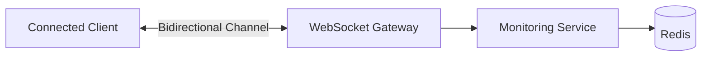

WebSockets complements REST without replacing it.

---

# Communication Distribution

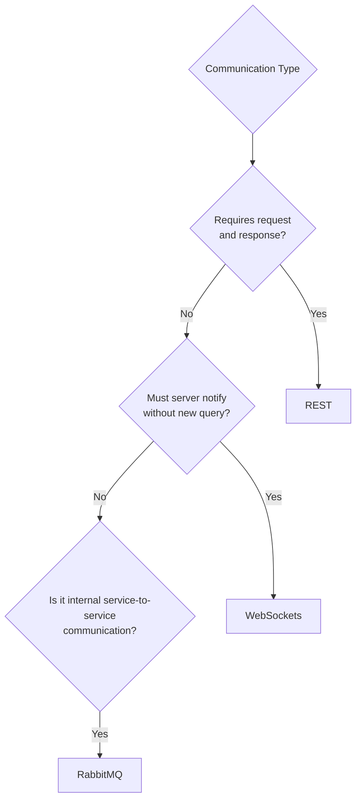

---

# Internal Communication

Internal communication can be synchronous or asynchronous.

## Synchronous Communication

Used when a component needs an immediate response.

```text
API Gateway
    ↓
Microservice
    ↓
Response
```

## Asynchronous Communication

Used to decouple processes and allow different services to react to an event.

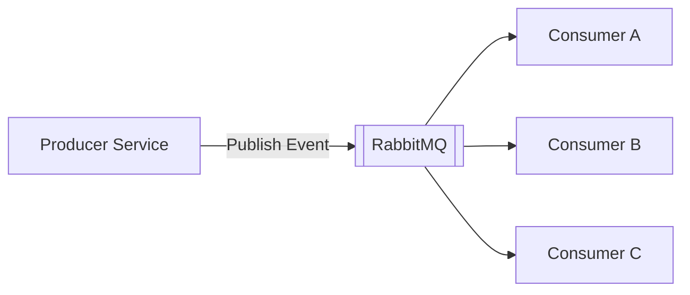

---

# Persistence

The platform employs different persistence mechanisms depending on data type and required availability.

---

## Local Persistence

SQLite is used in the Point of Sale.

### Responsibilities

- Local sales recording.
- Pending operations persistence.
- Synchronization queue.
- Recovery after app restarts.
- Sync error retention.
- Operational continuity.

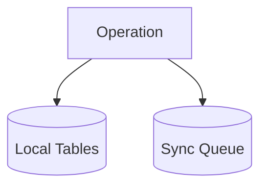

Each pending operation maintains:

| Field | Purpose |
|---|---|
| `operationId` | Unique operation UUID |
| `operationType` | Operation type |
| `payload` | Data needed for processing |
| `createdAt` | Local creation timestamp |
| `status` | Sync status |
| `retryCount` | Retry attempt count |
| `lastAttemptAt` | Last attempt timestamp |
| `lastError` | Last recorded error |
| `syncedAt` | Definitive confirmation timestamp |

---

## Central Persistence

PostgreSQL represents the central source of truth.

### Responsibilities

- Sales.
- Inventory.
- Users.
- Clients.
- Configuration.
- Logistics operations.
- Audit.
- Reports.
- Definitive synchronization results.

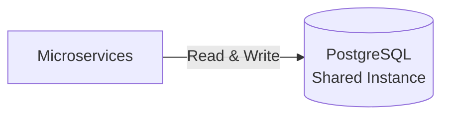

PostgreSQL stores definitive state.

Redis, RabbitMQ, and SQLite do not substitute this responsibility.

---

# Redis

Redis is used for temporal data and distributed coordination.

## Responsibilities

- Heartbeats.
- Connectivity state.
- Sessions.
- Temporary data.
- Idempotency keys.
- Distributed locks.
- Counters.
- Rate limiting.
- Short-lived caching.

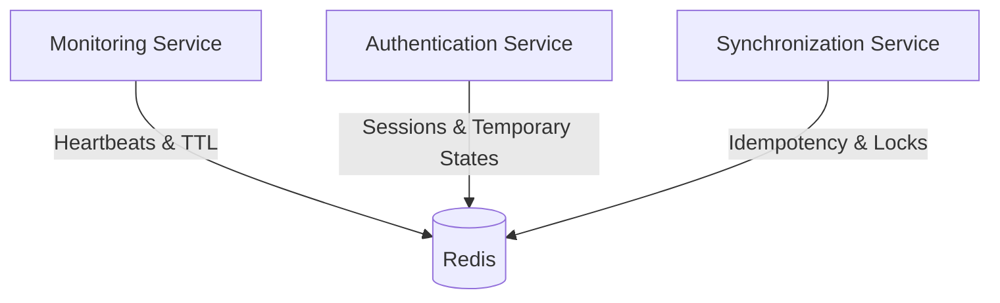

Redis does not store definitive business state.

Its purpose is coordinating distributed components and providing fast access to temporal data.

---

# RabbitMQ

RabbitMQ enables internal processing decoupling.

## Responsibilities

- Event publishing.
- Inter-microservice communication.
- Asynchronous processing.
- Retries.
- Work distribution.
- Integrations.
- Dead Letter Queues.
- Load spike absorption.

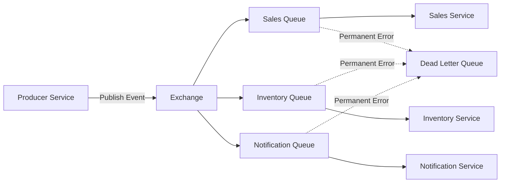

RabbitMQ complements the Offline-First architecture without replacing SQLite local queues.

---

# Relationship Between SQLite, Redis, and RabbitMQ

| Component | Responsibility |
|---|---|
| **SQLite** | Retain operations while client is offline |
| **Redis** | Maintain temporal state, idempotency, and coordination |
| **RabbitMQ** | Transport events and distribute backend processing |

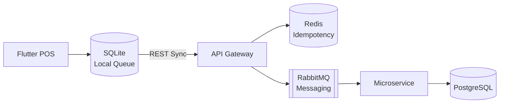

---

# Heartbeats and Connectivity State

Clients requiring monitoring maintain a WebSocket connection with the Monitoring Service.

Each client periodically transmits a heartbeat.

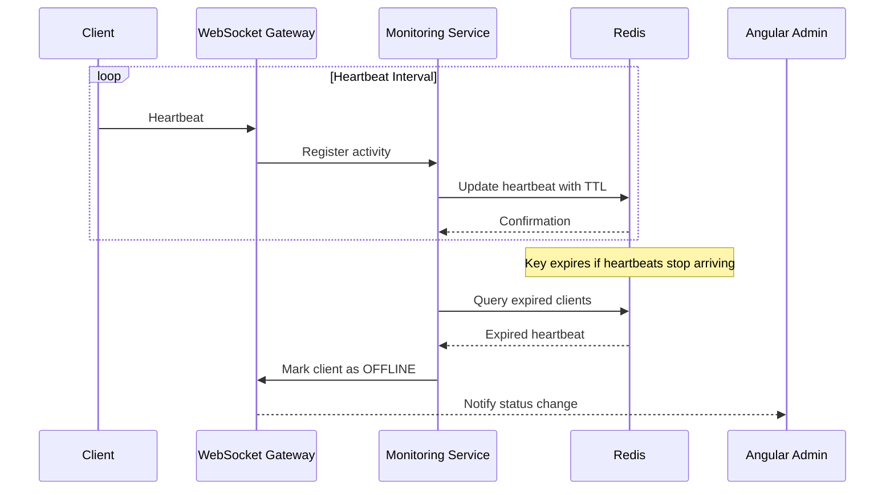

## Temporal Key Structure

```text
client:heartbeat:{clientId}
```

Sample payload:

```json
{
  "clientId": "pos-001",
  "status": "online",
  "lastSeenAt": "2026-07-17T20:30:00Z",
  "application": "pos",
  "version": "1.0.0"
}
```

The TTL determines allowable silent duration before considering the client offline.

```mermaid
flowchart LR

    HEARTBEAT["Heartbeat Received"]
    REDIS[("Redis TTL")]
    EXPIRED{"Expired?"}
    EVENT["ClientDisconnected"]
    MQ[["RabbitMQ"]]
    NOTIFY["Notification Service"]
    ADMIN["Angular Admin"]

    HEARTBEAT --> REDIS
    REDIS --> EXPIRED

    EXPIRED -->|"No"| REDIS
    EXPIRED -->|"Yes"| EVENT

    EVENT --> MQ
    MQ --> NOTIFY
    NOTIFY -->|"WebSocket"| ADMIN
```

---

# Offline Synchronization Flow

The Point of Sale records operations locally first.

Upon connectivity recovery, the synchronization engine sends pending operations to the backend via REST.

```mermaid
sequenceDiagram

    participant POS
    participant SQLite
    participant API as API Gateway
    participant Sync as Synchronization Service
    participant Redis
    participant MQ as RabbitMQ
    participant Sales as Sales Service
    participant DB as PostgreSQL
    participant Notification as Notification Service
    participant Admin as Angular Admin

    POS->>SQLite: Register local sale
    SQLite-->>POS: Confirm operation

    Note over POS,SQLite: Sale completes independently of server

    POS->>API: POST /synchronization/operations
    API->>Sync: Send validated batch
    Sync->>Redis: Query operationId

    alt Already Processed Operation
        Redis-->>Sync: Existing UUID
        Sync-->>API: Previously registered result
        API-->>POS: Idempotent confirmation
        POS->>SQLite: Mark as synced
    else Pending Operation
        Redis-->>Sync: UUID not found
        Sync->>MQ: Publish ProcessSale
        MQ->>Sales: Deliver message
        Sales->>DB: Persist sale
        DB-->>Sales: Confirmation
        Sales->>Redis: Register operationId
        Sales->>MQ: Publish SaleProcessed
        MQ->>Sync: Deliver result
        Sync-->>API: Processed operation
        API-->>POS: REST confirmation
        POS->>SQLite: Mark as synced
        MQ->>Notification: Deliver event
        Notification-->>Admin: Notify via WebSocket
    end
```

---

# Batch Synchronization

To minimize requests, the POS sends multiple pending operations in a single REST request.

```mermaid
flowchart LR

    QUEUE[("SQLite Local Queue")]
    BATCH["Build Batch"]
    API["POST /synchronization/batch"]
    VALIDATE["Validate Operations"]
    PROCESS["Process Individually"]
    RESULT["Per-Operation Result"]
    UPDATE["Update SQLite"]

    QUEUE --> BATCH
    BATCH --> API
    API --> VALIDATE
    VALIDATE --> PROCESS
    PROCESS --> RESULT
    RESULT --> UPDATE
```

Batch responses identify outcomes for each item:

```json
{
  "batchId": "batch-001",
  "operations": [
    {
      "operationId": "operation-001",
      "status": "SYNCED"
    },
    {
      "operationId": "operation-002",
      "status": "CONFLICT",
      "errorCode": "INSUFFICIENT_STOCK"
    },
    {
      "operationId": "operation-003",
      "status": "RETRY_PENDING",
      "errorCode": "SERVICE_UNAVAILABLE"
    }
  ]
}
```

---

# Local Operation States

```mermaid
stateDiagram-v2

    [*] --> Pending: Operation Created

    Pending --> Sending: Start Synchronization

    Sending --> Synced: Definitive Confirmation

    Sending --> RetryPending: Timeout or Temporal Error

    RetryPending --> Sending: Retry Attempt

    Sending --> Conflict: Business Conflict

    Sending --> Failed: Permanent Error

    Conflict --> Pending: Conflict Resolved

    Failed --> Pending: Manual Correction

    Synced --> [*]
```

State descriptions:

| State | Meaning |
|---|---|
| `PENDING` | Awaiting synchronization |
| `SENDING` | In flight to backend |
| `RETRY_PENDING` | Scheduled for re-attempt |
| `SYNCED` | Backend confirmed |
| `CONFLICT` | Reconciliation required |
| `FAILED` | Cannot be processed automatically |

---

# Idempotency

Idempotency guarantees repeated operations produce single effects.

Every operation generated by a client contains a stable UUID.

```mermaid
flowchart TD

    REQUEST["Operation Received"]
    ID["Extract operationId"]
    REDIS{"Exists in Redis?"}
    PREVIOUS["Return Previous Result"]
    PROCESS["Process Operation"]
    DB[("PostgreSQL")]
    SAVE["Register operationId"]
    RESPONSE["Respond to Client"]

    REQUEST --> ID
    ID --> REDIS

    REDIS -->|"Yes"| PREVIOUS
    PREVIOUS --> RESPONSE

    REDIS -->|"No"| PROCESS
    PROCESS --> DB
    DB --> SAVE
    SAVE --> RESPONSE
```

Idempotency key pattern:

```text
idempotency:{clientId}:{operationId}
```

PostgreSQL enforces uniqueness constraints as fallback:

```sql
UNIQUE (client_id, operation_id)
```

---

# Retries and Dead Letter Queue

```mermaid
flowchart TD

    MESSAGE["Message Received"]
    PROCESS{"Successful Processing?"}

    SUCCESS["Acknowledge Message"]
    RETRY{"Recoverable Error?"}
    DELAY["Retry Queue"]
    DLQ["Dead Letter Queue"]
    REVIEW["Manual Review"]

    MESSAGE --> PROCESS

    PROCESS -->|"Yes"| SUCCESS
    PROCESS -->|"No"| RETRY

    RETRY -->|"Yes"| DELAY
    DELAY --> MESSAGE

    RETRY -->|"No"| DLQ
    DLQ --> REVIEW
```

---

# Online-First Administrative Flow

```mermaid
sequenceDiagram

    participant Admin as Angular Admin
    participant API as API Gateway
    participant Inventory as Inventory Service
    participant DB as PostgreSQL
    participant MQ as RabbitMQ
    participant Notification as Notification Service
    participant WS as WebSocket Gateway

    Admin->>API: GET /inventory
    API->>Inventory: Query Inventory
    Inventory->>DB: Read Data
    DB-->>Inventory: Result
    Inventory-->>API: Current Inventory
    API-->>Admin: REST Response

    Inventory->>MQ: Publish InventoryChanged
    MQ->>Notification: Deliver Event
    Notification->>WS: Send Update
    WS-->>Admin: Real-Time Notification
```

---

# Permissive Online-First Logistics Flow

```mermaid
sequenceDiagram

    participant User as User
    participant App as Flutter Logistics
    participant Cache as Local Cache
    participant API as API Gateway
    participant Service as Logistics Service
    participant DB as PostgreSQL

    User->>App: Register Operation
    App->>API: REST Request

    alt Backend Available
        API->>Service: Process Operation
        Service->>DB: Persist
        DB-->>Service: Confirmation
        Service-->>API: Result
        API-->>App: Confirmed Operation
    else Temporary Outage
        API--xApp: Connectivity Error
        App->>Cache: Save Operation Temporarily
        App->>App: Schedule Retry
        App->>API: Retry Operation
        API->>Service: Process
        Service->>DB: Persist
        DB-->>Service: Confirmation
        Service-->>API: Result
        API-->>App: Confirmation
        App->>Cache: Remove Temporary Operation
    end
```

---

# Partial System Availability

```mermaid
flowchart TD

    CLIENT["Client"]
    API{"API Available?"}
    SERVICE{"Service Available?"}
    MQ{"RabbitMQ Available?"}
    DATABASE{"PostgreSQL Available?"}

    LOCAL["Save Locally"]
    RETRY["Schedule Retry"]
    ACCEPT["Accept for Processing"]
    SUCCESS["Operation Processed"]

    CLIENT --> API

    API -->|"No"| LOCAL
    API -->|"Yes"| SERVICE

    SERVICE -->|"No"| RETRY
    SERVICE -->|"Yes"| MQ

    MQ -->|"No"| RETRY
    MQ -->|"Yes"| DATABASE

    DATABASE -->|"No"| RETRY
    DATABASE -->|"Yes"| SUCCESS

    LOCAL --> RETRY
```

---

# Component Responsibility Matrix

| Need | Component |
|---|---|
| Administrative UI | Angular |
| POS & Logistics apps | Flutter |
| Offline local persistence | SQLite |
| Central persistence | PostgreSQL |
| Temporal state | Redis |
| Idempotency keys | Redis & PostgreSQL constraints |
| Internal events | RabbitMQ |
| Backend retries | RabbitMQ |
| Dead Letter Queue | RabbitMQ |
| Client-server communication | REST |
| Heartbeats | WebSockets |
| Real-time notifications | WebSockets |
| Central backend entry | API Gateway |
| Service coordination | NestJS |
| Sales processing | Sales Service |
| Offline reconciliation | Synchronization Service |
| Logistics processing | Logistics Service |
| Client presence state | Monitoring Service |
| Notification distribution | Notification Service |

---

# Architectural Principles

## Connectivity Serves the Business

The architecture does not apply a single connectivity strategy across the platform.

Each client uses the minimum strategy needed to satisfy operational goals.

## Local Persistence Has Specific Purpose

Used when operational continuity justifies added complexity.

## Central Source of Truth Prevails

PostgreSQL maintains definitive corporate state.

## Selective Real-Time Communication

WebSockets is reserved for immediate value events.

## Operations Must Be Recoverable

Pending operations survive unexpected app closures, restarts, and temporal errors.

> **Architecture defines responsibilities. Technologies provide mechanisms to implement them.**

---

# Related Documents

- **SECURITY.md** — Authentication architecture and security.
- **SYNCHRONIZATION.md** — Event synchronization between clients and server.
- **CONFLICT_RESOLUTION.md** — Business conflict resolution.
- **TEST.md** — Unit testing strategy and automation.
- **DESIGNDECISIONS.md** — Design decisions and technology choices.
- **RUNNING.md** — Local project execution.
