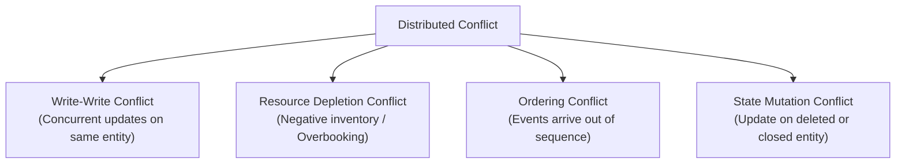
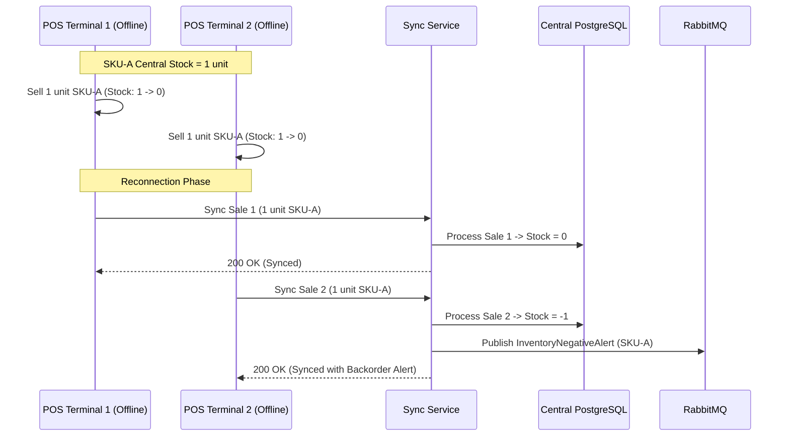

# ⚔️ Conflict Resolution Strategies in Distributed Systems

## Case Study 2: Connectivity Strategies in Distributed Systems

---

# Introduction

In an Offline-First distributed architecture, multiple nodes operate independently without real-time coordination.

When disconnected nodes make concurrent updates to shared resources (e.g. inventory counts, product prices, customer records) and subsequently reconnect, conflicts inevitably occur.

A conflict arises when two or more operations cannot be merged automatically without violating business rules or data integrity.

This document details the conflict taxonomy, resolution algorithms, business domain rules, and edge-case handling strategies implemented in this case study.

---

# Types of Conflicts in Distributed Systems



## 1. Write-Write Conflicts
Two clients modify the same record while disconnected from each other.
*Example*: Client A updates customer address to "Street 1", while Client B updates customer address to "Avenue 2".

## 2. Resource Depletion (Inventory / Overbooking)
Two independent POS terminals sell the last remaining unit of a product while offline.
*Example*: Terminal 1 sells 1 unit of SKU-100 (Stock: 1). Terminal 2 sells 1 unit of SKU-100 (Stock: 1). Total sold offline: 2 units. Available central stock: 1 unit.

## 3. Causal Ordering Conflicts
Events are delivered to the server out of order due to network retries or batching.
*Example*: Client performs `CREATE_CUSTOMER` then `UPDATE_CUSTOMER`. The server receives `UPDATE_CUSTOMER` before `CREATE_CUSTOMER`.

## 4. State Mutation Conflicts
An offline client performs an action on an entity whose state changed centrally in the interim.
*Example*: POS sells item from an invoice that was canceled centrally by Admin.

---

# Conflict Resolution Strategies Evaluated

| Strategy | Description | Advantages | Disadvantages | Suitability for POS |
|---|---|---|---|---|
| **Last-Write-Wins (LWW)** | Highest timestamp overwrites previous values. | Simple, predictable, fast. | Clock drift causes data loss. Ignores concurrent intent. | Suitable ONLY for non-critical attributes (e.g., customer address updates). |
| **Vector Clocks / Version Vectors** | Tracks causal relationships between operations using vector counters. | Accurately detects true concurrency without relying on physical wall clocks. | High storage overhead; requires client vector maintenance. | Suitable for conflict detection, but requires fallback for resolution. |
| **CRDTs (Conflict-free Replicated Data Types)** | Data structures (P-PN Counters, LWW-Element-Set) that converge automatically. | Mathematically proven convergence without central locking. | Complex implementation; restricted to specific commutative operations. | Excellent for inventory balance counters. |
| **Domain Business Rules (Append-Only / Reconciliation)** | Business-logic-driven reconciliation rules (e.g., allow negative stock with backorder alerts). | Protects business continuity and revenue. | Requires custom domain handlers per entity type. | **Adopted strategy for POS Sales & Inventory.** |

---

# Adopted Resolution Strategy per Domain

## 1. Sales Operations: Append-Only Event Stream
Sales transactions recorded offline are **never rejected** due to inventory shortages during synchronization.

- Sales operations are treated as immutable financial audit events (`SALE_CREATED`).
- The backend appends every valid POS sale to PostgreSQL.
- If inventory drops below zero as a result, the system transitions stock into a `NEGATIVE_STOCK_ALERT` state and triggers an asynchronous replenishment task in RabbitMQ.

> **Business Rationale**: The business prefers fulfilling a sale and managing backorder inventory over rejecting a completed customer payment.



---

## 2. Entity Attribute Updates: Dual-Timestamp LWW
For entity updates (e.g., customer info), the system records two timestamps:
- `clientTimestamp`: Physical time when operation was generated locally.
- `serverTimestamp`: Physical time when operation reached PostgreSQL.

Resolution rule:
```sql
UPDATE customers 
SET address = $1, updated_at = $2
WHERE id = $3 AND (updated_at IS NULL OR updated_at < $2);
```

If client timestamps match exactly, tie-breaking falls back to lexicographical sorting of `clientId`.

---

## 3. Clock Drift Management
Physical clocks on client devices cannot be trusted.

To mitigate clock drift:
1. Every WebSocket heartbeat response from server includes server UTC timestamp `serverTime`.
2. The client calculates clock offset: $$\text{Offset} = \text{serverTime} - \text{clientTime}$$
3. All local event timestamps are adjusted using $\text{Offset}$ before storage in SQLite.
4. If drift exceeds 15 minutes, client is flagged for time resynchronization.

---

# Related Documents

- **ARCHITECTURE.md** — High-level system architecture.
- **SYNCHRONIZATION.md** — Batching, idempotency, and retry protocol.
- **SECURITY.md** — Security policies during offline operations.
- **DESIGNDECISIONS.md** — Architectural trade-off analysis.