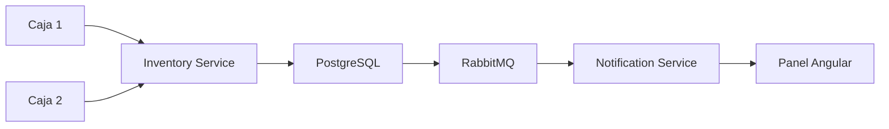
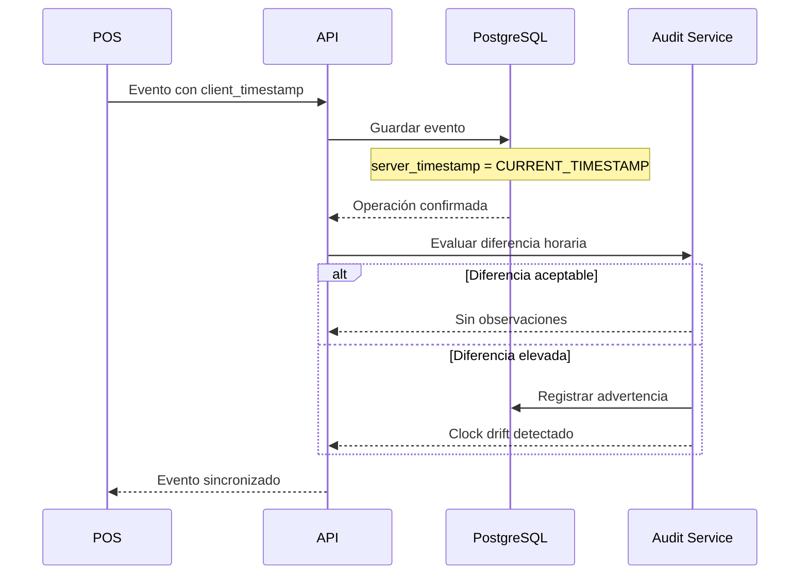
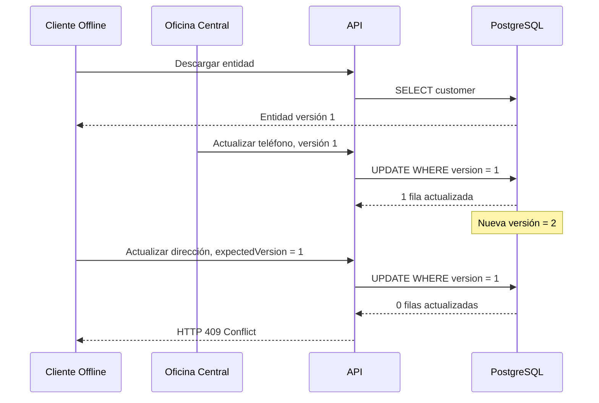
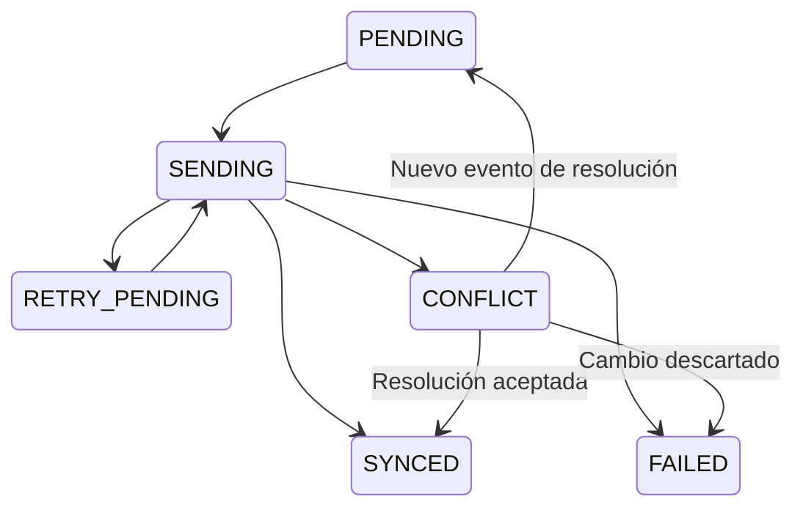
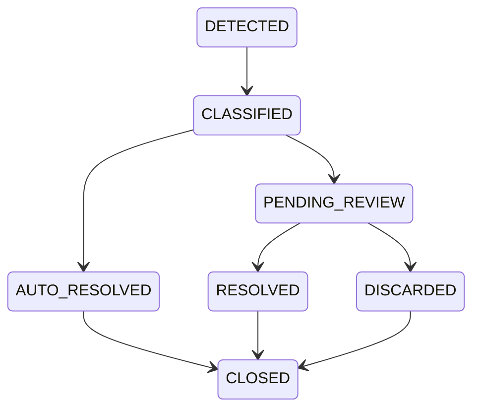

# ⚠️ Resolución de Conflictos en Entornos Offline

## Caso de Estudio 2: Estrategias de Conectividad en Sistemas Distribuidos

---

# Introducción

En una arquitectura Offline-First, la sincronización garantiza que los eventos generados por un cliente lleguen eventualmente al servidor central.

Sin embargo, que un evento llegue correctamente no implica necesariamente que pueda aplicarse sobre el estado actual del sistema.

Mientras un Punto de Venta (POS) permanece desconectado, otros usuarios pueden continuar realizando operaciones sobre la misma información desde distintas sucursales, aplicaciones administrativas o servicios internos.

Cuando el cliente recupera la conectividad e intenta sincronizar sus cambios, el servidor debe determinar cómo reconciliar dichos eventos con el estado actual de la información.

Este proceso recibe el nombre de **resolución de conflictos**.

A diferencia de la sincronización, cuyo objetivo consiste en garantizar la entrega confiable de eventos, la resolución de conflictos pertenece completamente al dominio del negocio y define cómo debe reaccionar el sistema cuando múltiples modificaciones compiten por el mismo estado.

---

# Relación con la Arquitectura

Este documento forma parte del **Caso de Estudio 2: Estrategias de Conectividad en Sistemas Distribuidos**.

Cada documento analiza una responsabilidad diferente de la arquitectura.

| Documento | Responsabilidad |
|-----------|-----------------|
| ARCHITECTURE.md | Arquitectura general del sistema |
| SECURITY.md | Autenticación y autorización |
| SYNCHRONIZATION.md | Sincronización de eventos entre clientes y servidor |
| CONFLICT_SCENARIOS.md | Resolución de conflictos de negocio |

La separación de responsabilidades permite mantener desacopladas las decisiones de infraestructura de las reglas específicas del dominio.

Mientras la sincronización responde a la pregunta:

> ¿Cómo hacer llegar un evento al servidor?

La resolución de conflictos responde a una pregunta completamente distinta:

> ¿Qué hacer cuando ese evento ya no puede aplicarse directamente sobre el estado actual del sistema?

---

# ¿Qué es un Conflicto?

Un conflicto ocurre cuando una operación registrada correctamente por un cliente no puede aplicarse directamente porque el estado del servidor cambió durante el período de desconexión.

Es importante distinguir un conflicto de otras situaciones similares.

| Situación | Descripción |
|-----------|-------------|
| Duplicado | El mismo evento llega varias veces al servidor. |
| Error | El evento contiene datos inválidos o incumple reglas de negocio. |
| Conflicto | El evento es válido, pero el estado cambió antes de sincronizarse. |

Cada caso requiere un tratamiento diferente.

Los duplicados se resuelven mediante mecanismos de **idempotencia**, descritos en **SYNCHRONIZATION.md**.

Los errores se gestionan mediante validaciones de negocio y reglas de integridad.

Los conflictos requieren decisiones específicas del dominio y no pueden resolverse únicamente mediante infraestructura técnica.

---

# Naturaleza de los Conflictos

Los conflictos aparecen únicamente cuando dos o más modificaciones compiten por el mismo estado.

```text
Estado Inicial

        │

        ├──────── Cliente Offline

        │             │

        │             └──── Cambio A

        │

        └──────── Servidor

                      │

                      └──── Cambio B

                     ▼

            Sincronización

                     ▼

              Conflicto
```

Mientras ambos cambios permanecen aislados, el conflicto no existe.

El conflicto aparece únicamente cuando ambos intentan modificar la misma información.

Por esta razón, la sincronización y la resolución de conflictos representan responsabilidades completamente independientes.

---

# Principios de Resolución

La arquitectura presentada en este caso de estudio sigue una serie de principios generales.

## Los hechos históricos no deben modificarse

Las operaciones que representan eventos ya ocurridos, como ventas o devoluciones, deben conservarse de forma permanente.

Una vez registradas, únicamente pueden compensarse mediante nuevos eventos.

Nunca deben editarse.

---

## La continuidad operativa tiene prioridad

Durante una pérdida de conectividad el sistema debe continuar funcionando.

La resolución de conflictos ocurre posteriormente durante la sincronización y no debe impedir la operación diaria del negocio.

---

## La sincronización no debe alterar el pasado

Cuando un evento representa una operación realizada correctamente en el mundo físico, la sincronización no debe modificar su significado histórico.

El objetivo consiste en reflejar fielmente lo ocurrido y no reinterpretarlo utilizando información posterior.

---

## Los conflictos pertenecen al dominio

No existe una única estrategia válida para todos los sistemas.

Cada agregado del dominio define sus propias reglas.

Un conflicto sobre inventario no necesariamente se resuelve igual que un conflicto sobre clientes, precios o configuraciones.

Por esta razón, la infraestructura de sincronización debe permanecer completamente desacoplada de las reglas específicas del negocio.

---

# Clasificación de los Conflictos

En este documento se analizan siete escenarios representativos encontrados frecuentemente en arquitecturas Offline-First.

| Escenario | Tipo de conflicto |
|------------|------------------|
| Eventos de Venta | Historial inmutable |
| Inventario | Sobreventa |
| Cambios de Precio | Estado histórico |
| Revocación de Usuarios | Seguridad |
| Productos Eliminados | Referencias históricas |
| Desincronización Horaria | Auditoría |
| Modificación Concurrente | Concurrencia Optimista |

Cada escenario presenta diferentes restricciones y, por lo tanto, requiere estrategias de resolución distintas.

En los siguientes apartados se analiza cada uno de ellos junto con las decisiones arquitectónicas adoptadas en este caso de estudio.

---

# Escenario 1: Eventos de Venta Inmutables

Las ventas representan hechos históricos del negocio.

Una vez que un cliente realiza una compra y el comprobante es emitido, dicha operación forma parte permanente del historial financiero de la organización.

Modificar posteriormente una venta introduciría problemas de auditoría, conciliación contable y trazabilidad.

Por esta razón, la arquitectura adopta un modelo **Append-Only**, donde cada operación genera un nuevo evento independiente.

```text
Caja 1

↓

Venta A (UUID-1)

↓

Servidor

↓

Historial

+

Caja 2

↓

Venta B (UUID-2)

↓

Historial
```

Cada venta posee un identificador único (`UUID`) y representa un evento inmutable.

El servidor nunca modifica una venta previamente registrada.

Su única responsabilidad consiste en agregar nuevos eventos al historial.

---

## ¿Por qué no modificar una venta?

Supongamos que un cajero registra incorrectamente una venta.

Una solución aparentemente sencilla sería actualizar el registro existente.

```text
Venta

↓

UPDATE

↓

Venta corregida
```

Sin embargo, esta estrategia presenta varios problemas.

- Se pierde el historial original.
- Resulta difícil auditar quién realizó el cambio.
- Se rompe la trazabilidad financiera.
- Se dificulta la conciliación con documentos fiscales.

Desde el punto de vista contable, una venta representa un hecho ocurrido.

Los hechos históricos no deben modificarse.

---

## Corrección mediante Eventos de Compensación

Cuando una venta necesita corregirse, el sistema genera una nueva operación.

Por ejemplo:

```text
Venta

↓

Nota de Crédito

↓

Nueva Venta
```

Cada operación constituye un nuevo evento independiente.

El historial permanece completo.

La secuencia de eventos refleja exactamente lo ocurrido.

---

## Ventajas del Modelo Append-Only

La decisión de utilizar eventos inmutables ofrece múltiples beneficios.

- Historial completamente auditable.
- Trazabilidad total de las operaciones.
- No existen modificaciones concurrentes sobre ventas.
- Simplifica la sincronización.
- Facilita la recuperación ante errores.
- Compatible con arquitecturas Event-Driven.

Además, elimina completamente una categoría de conflictos.

No existen dos usuarios modificando simultáneamente la misma venta.

Simplemente existen nuevos eventos agregados al historial.

---

## Decisión Arquitectónica

Las ventas no se consideran registros editables.

Se consideran eventos históricos.

Por esta razón, la arquitectura evita cualquier operación de actualización sobre ventas previamente registradas.

La resolución de conflictos para este tipo de entidades consiste simplemente en preservar todos los eventos y procesarlos respetando las reglas de negocio correspondientes.

---

# Escenario 2: Sobreventa de Inventario

El conflicto más frecuente en sistemas Offline-First ocurre cuando varias terminales venden simultáneamente la última unidad disponible de un producto.

Supongamos el siguiente escenario.

```text
Inventario Central

Producto X

1 unidad

        │

 ┌──────┴──────┐

 ▼             ▼

Caja 1      Caja 2

Offline     Offline

Stock=1     Stock=1

Venta        Venta

        │

        ▼

Sincronización
```

Ambas cajas observan exactamente el mismo inventario local.

Ambas consideran válida la venta.

El conflicto aparece únicamente cuando ambas operaciones llegan al servidor.

---

## Alternativa A: Rechazar la Segunda Venta

Una primera posibilidad consiste en aceptar únicamente la primera sincronización.

```text
Caja 1

↓

Venta aceptada

↓

Stock = 0

↓

Caja 2

↓

Venta rechazada
```

### Ventajas

- Inventario consistente.
- Nunca existe stock negativo.

### Desventajas

Esta alternativa presenta un problema fundamental.

El conflicto ocurre después de que el cliente ya pagó y recibió físicamente el producto.

Desde la perspectiva del negocio, la venta ya ocurrió.

Rechazarla durante la sincronización genera una inconsistencia entre el sistema y la realidad.

Además, obliga al operador a resolver manualmente una situación que ya no puede revertirse.

---

## Alternativa B: Reservas Centralizadas

Otra posibilidad consiste en solicitar una reserva de inventario antes de vender.

```text
POS

↓

Reservar Stock

↓

Servidor

↓

Confirmación

↓

Venta
```

Esta estrategia elimina prácticamente todos los conflictos de inventario.

Sin embargo, requiere conectividad permanente.

Durante una pérdida de conexión el sistema deja de poder vender.

Como este caso de estudio está orientado a entornos Offline-First, esta alternativa fue descartada.

---

## Alternativa C: Permitir Sobreventa (Decisión Adoptada)

La arquitectura adopta una estrategia diferente.

Ambas ventas son aceptadas.

El inventario central puede quedar temporalmente en un estado negativo.

```text
Inventario

1

↓

Venta A

↓

0

↓

Venta B

↓

-1
```

La sobreventa no representa un error técnico.

Representa una diferencia entre el inventario lógico y el inventario físico.

---

## Mitigación

Cuando el inventario alcanza un valor menor que cero, el servicio de inventario publica un evento.

```text
Inventory Service

↓

Stock Negativo

↓

RabbitMQ

↓

Notification Service

↓

Panel Administrativo
```

Los administradores reciben una alerta indicando que existe una diferencia de inventario que requiere revisión.

Las acciones posteriores pueden incluir:

- Conteo físico.
- Reposición desde el centro de distribución.
- Ajuste administrativo.
- Investigación de posibles pérdidas.

---

## Flujo Arquitectónico



El conflicto deja de ser una excepción técnica.

Se convierte en un proceso operativo administrado por el negocio.

---

## ¿Por qué aceptar el stock negativo?

La decisión se fundamenta en un principio sencillo.

La arquitectura no puede modificar hechos que ya ocurrieron en el mundo físico.

Si un cliente abandonó la tienda con el producto, la venta ya existe.

El sistema debe reflejar esa realidad.

Posteriormente, los procesos administrativos corrigen la diferencia de inventario.

---

## Trade-off

| Decisión | Beneficio | Costo |
|-----------|-----------|--------|
| Rechazar segunda venta | Inventario consistente | Venta real perdida |
| Reservas centralizadas | Elimina conflictos | Requiere conexión permanente |
| Stock negativo (Adoptada) | Continuidad operativa | Requiere conciliación posterior |

---

## Decisión Arquitectónica

La arquitectura prioriza la continuidad del negocio sobre la consistencia inmediata del inventario.

Esta decisión permite que las sucursales continúen operando incluso durante períodos prolongados de desconexión.

Las diferencias de inventario son detectadas automáticamente y tratadas posteriormente mediante procesos administrativos, preservando tanto la operación comercial como la trazabilidad del sistema.

---

# Escenario 3: Cambio de Precio Durante la Desconexión

Mientras un Punto de Venta permanece desconectado, la oficina central puede actualizar el catálogo de productos.

Cuando el POS sincroniza posteriormente una venta, pueden existir dos precios diferentes para el mismo producto.

```text
09:00

Producto X = $100

        │

POS Offline

        │

Venta realizada

        │

──────────────

11:30

Oficina Central

↓

Actualiza precio

↓

Producto X = $120

──────────────

14:00

POS sincroniza venta
```

El servidor recibe una venta con un precio diferente al actualmente registrado en el catálogo.

La pregunta es:

> ¿Debe modificarse automáticamente el precio de la venta?

---

## Alternativa A: Utilizar el Precio Actual

Una primera estrategia consiste en ignorar el precio recibido y utilizar el precio vigente del catálogo.

```text
Venta

↓

Precio recibido = $100

↓

Catálogo = $120

↓

Registrar venta por $120
```

### Ventajas

- Toda la información coincide con el catálogo actual.

### Desventajas

Esta alternativa presenta un problema importante.

El cliente realizó la compra por un precio distinto.

Modificar posteriormente el importe altera un hecho histórico.

Además:

- El comprobante entregado al cliente ya fue emitido.
- El dinero cobrado ya fue recibido.
- La caja del cajero ya fue cerrada.

Desde la perspectiva del negocio, la venta ocurrió utilizando el precio conocido en ese momento.

---

## Alternativa B: Conservar el Precio Histórico (Decisión Adoptada)

La arquitectura considera que el precio forma parte del evento de venta.

Por lo tanto, el servidor registra exactamente el precio contenido en el evento sincronizado.

```text
Venta

↓

Precio = $100

↓

Servidor

↓

Venta registrada = $100

↓

Catálogo actual = $120
```

El cambio de precio afecta únicamente a operaciones futuras.

Nunca modifica transacciones ya realizadas.

---

## Justificación

Una venta representa un hecho histórico.

El catálogo representa el estado actual del negocio.

Ambos conceptos cumplen responsabilidades diferentes.

La sincronización no debe reinterpretar el pasado utilizando información posterior.

---

## Decisión Arquitectónica

Los precios utilizados durante la venta forman parte del evento sincronizado.

El catálogo únicamente determina el precio de futuras operaciones.

---

# Escenario 4: Revocación de Usuarios

Supongamos que un operador inicia sesión correctamente antes de perder conectividad.

Durante ese período, un administrador elimina sus permisos desde la oficina central.

```text
08:00

Usuario inicia sesión

↓

POS Offline

↓

Realiza ventas

──────────────

10:00

Administrador

↓

Revoca permisos

──────────────

13:00

POS sincroniza
```

Cuando las operaciones llegan al servidor aparece la siguiente pregunta.

> ¿Deben rechazarse las ventas?

---

## Alternativa A: Rechazar Todas las Operaciones

El servidor podría verificar el estado actual del usuario.

Si ya no posee permisos, todas las ventas serían rechazadas.

### Ventajas

- Seguridad estricta.

### Desventajas

Esta estrategia introduce un problema importante.

Las operaciones fueron realizadas cuando el usuario todavía poseía una sesión válida.

Rechazar posteriormente dichas ventas produciría una inconsistencia entre el sistema y la operación real.

---

## Alternativa B: Validar el Estado al Momento de la Operación (Decisión Adoptada)

La arquitectura considera que la autorización debe evaluarse cuando la operación ocurre.

No durante la sincronización.

```text
Usuario autorizado

↓

Venta realizada

↓

Evento almacenado

↓

Sincronización

↓

Servidor registra venta
```

La revocación de permisos afecta únicamente a nuevas operaciones.

No modifica eventos previamente registrados.

---

## Justificación

Las ventas representan hechos históricos.

Si el operador estaba correctamente autenticado cuando realizó la operación, el evento continúa siendo válido aunque posteriormente pierda sus permisos.

La sincronización no modifica decisiones de autorización ya tomadas.

---

## Decisión Arquitectónica

La autenticación protege la creación del evento.

La sincronización únicamente transporta dicho evento al servidor.

Ambas responsabilidades permanecen desacopladas.

---

# Escenario 5: Producto Eliminado

Mientras un POS permanece desconectado, un producto puede ser eliminado del catálogo central.

Sin embargo, el operador ya registró ventas utilizando dicho producto.

```text
Producto

↓

Venta Offline

──────────────

Oficina Central

↓

Eliminar producto

──────────────

POS sincroniza venta
```

Durante la sincronización el servidor observa que el producto ya no existe en el catálogo.

---

## Alternativa A: Rechazar la Venta

El servidor podría rechazar cualquier referencia a productos eliminados.

### Ventajas

- Consistencia con el catálogo actual.

### Desventajas

El producto sí existía cuando ocurrió la venta.

Eliminar posteriormente el catálogo no invalida operaciones históricas.

Rechazar la sincronización produciría pérdida de información.

---

## Alternativa B: Mantener la Referencia Histórica (Decisión Adoptada)

La arquitectura conserva la referencia utilizada durante la venta.

```text
Venta

↓

Producto histórico

↓

Servidor

↓

Historial preservado
```

El producto deja de estar disponible para nuevas ventas.

Sin embargo, continúa existiendo como referencia histórica dentro de las transacciones previamente registradas.

---

## Justificación

Los catálogos representan información viva.

Las ventas representan hechos históricos.

Eliminar un elemento del catálogo no modifica operaciones que ocurrieron anteriormente.

Esta separación facilita la auditoría y mantiene la trazabilidad completa del sistema.

---

## Decisión Arquitectónica

Los eventos sincronizados preservan las referencias históricas utilizadas durante la operación.

La eliminación del catálogo afecta únicamente a operaciones futuras.

Nunca invalida transacciones previamente realizadas.

---

# Resumen de los Escenarios Analizados

| Escenario | Estrategia Adoptada |
|------------|--------------------|
| Eventos de Venta | Modelo Append-Only |
| Sobreventa de Inventario | Stock Negativo + Alerta |
| Cambio de Precio | Conservar Precio Histórico |
| Revocación de Usuarios | Validar al momento de la operación |
| Producto Eliminado | Mantener Referencias Históricas |

En todos los casos la arquitectura sigue un mismo principio.

La sincronización no modifica hechos históricos.

Su responsabilidad consiste únicamente en transportar eventos de manera confiable.

Las decisiones relacionadas con el negocio permanecen separadas y son resueltas mediante reglas específicas del dominio.
---

# Escenario 6: Desincronización Horaria

En una arquitectura Offline-First no puede asumirse que todos los dispositivos poseen un reloj correctamente configurado.

Una terminal puede presentar diferencias horarias debido a:

- Configuración incorrecta de fecha y hora.
- Zona horaria mal definida.
- Fallo de la batería CMOS.
- Ajustes manuales realizados por un operador.
- Problemas de sincronización con servidores NTP.
- Manipulación intencional del reloj local.

Si el servidor utiliza exclusivamente la fecha enviada por el cliente, los reportes financieros, cierres de caja y procesos de auditoría podrían quedar ordenados incorrectamente.

```text
Caja 1

Reloj atrasado un día

Venta registrada:
16 de julio, 15:30

        │

        ▼

Servidor recibe la venta:
17 de julio, 09:00
```

En este escenario existen dos momentos diferentes y ambos poseen valor para el negocio.

El primero representa cuándo ocurrió la operación según la terminal.

El segundo representa cuándo el sistema central recibió y persistió la información.

---

## Alternativa A: Confiar únicamente en el reloj del cliente

La primera alternativa consiste en utilizar solamente la marca temporal generada por el POS.

```text
POS

↓

client_timestamp

↓

Servidor
```

### Ventajas

- Refleja el momento registrado por el operador.
- Facilita el cierre local de caja.
- Mantiene el orden de eventos dentro de la terminal.

### Desventajas

- El reloj puede estar desconfigurado.
- La zona horaria puede ser incorrecta.
- La fecha puede haber sido manipulada.
- No permite conocer cuándo ocurrió realmente la sincronización.
- Puede alterar reportes corporativos.

Por estas razones, la marca temporal del cliente no debe considerarse una fuente absoluta de verdad.

---

## Alternativa B: Utilizar únicamente la hora del servidor

Otra opción consiste en ignorar completamente la fecha proporcionada por el cliente.

```text
Evento recibido

↓

CURRENT_TIMESTAMP

↓

Fecha oficial
```

### Ventajas

- Todas las operaciones utilizan un reloj centralizado.
- Facilita la auditoría de ingreso al sistema.
- Evita depender de la configuración de cada terminal.

### Desventajas

En entornos offline, el momento de sincronización puede ocurrir horas o días después de la venta.

Por ejemplo:

```text
Venta realizada:
16 de julio, 18:00

Sincronización:
18 de julio, 08:00
```

Si se utiliza únicamente la hora del servidor, parecería que la venta ocurrió el 18 de julio.

Esto afectaría:

- Arqueos de caja.
- Turnos de operadores.
- Reportes diarios de sucursal.
- Análisis de horarios de venta.
- Secuencia local de operaciones.

---

## Alternativa C: Auditoría Temporal Dual — Decisión Adoptada

La arquitectura registra ambas marcas temporales.

| Campo | Responsabilidad |
|-------|-----------------|
| `client_timestamp` | Momento en que la operación ocurrió según el POS |
| `server_timestamp` | Momento en que el evento ingresó al sistema central |

```sql
CREATE TABLE central_sales (
    id UUID PRIMARY KEY,
    ticket_number TEXT NOT NULL,
    total NUMERIC(12, 2) NOT NULL,
    client_timestamp TIMESTAMPTZ NOT NULL,
    server_timestamp TIMESTAMPTZ NOT NULL DEFAULT CURRENT_TIMESTAMP,
    pos_id UUID NOT NULL
);
```

El servidor nunca reemplaza `client_timestamp` con su propia hora.

En su lugar, conserva ambos valores para diferentes propósitos.

---

## Uso de cada marca temporal

### `client_timestamp`

Se utiliza para:

- Arqueo de caja.
- Reportes locales de la sucursal.
- Identificación del turno del cajero.
- Orden lógico de eventos dentro del POS.
- Reconstrucción de la actividad de la terminal.

### `server_timestamp`

Se utiliza para:

- Auditoría de sincronización.
- Medición de retrasos.
- Seguimiento operativo.
- Procesos consolidados corporativos.
- Detección de terminales desactualizadas.
- Investigación de incidentes.

---

## Medición del retraso de sincronización

La diferencia entre ambas marcas temporales permite estimar cuánto tiempo permaneció pendiente un evento.

```sql
SELECT
    id,
    client_timestamp,
    server_timestamp,
    server_timestamp - client_timestamp AS synchronization_delay
FROM central_sales;
```

Ejemplo:

```text
client_timestamp:
2026-07-16 18:00

server_timestamp:
2026-07-18 08:00

retraso:
1 día y 14 horas
```

Este valor puede utilizarse para detectar:

- Problemas prolongados de conectividad.
- Terminales que no sincronizan.
- Errores en el Sync Engine.
- Acumulación excesiva de eventos.
- Posibles inconsistencias temporales.

---

## Zonas horarias

Las fechas deben almacenarse utilizando una representación inequívoca.

Por esta razón, se recomienda utilizar `TIMESTAMPTZ` en PostgreSQL y transportar las fechas en formato ISO 8601.

```json
{
  "clientTimestamp": "2026-07-17T18:35:24-04:00"
}
```

También puede normalizarse el valor a UTC:

```json
{
  "clientTimestamp": "2026-07-17T22:35:24Z"
}
```

El sistema debe conservar adicionalmente la zona horaria o el desplazamiento utilizado por la terminal cuando esta información sea relevante para auditoría.

```sql
ALTER TABLE central_sales
ADD COLUMN client_timezone TEXT;
```

Ejemplo:

```text
America/Asuncion
```

---

## Ordenamiento de eventos

Las marcas temporales del cliente no deben utilizarse como único criterio para determinar el orden global de los eventos.

En un sistema distribuido pueden ocurrir situaciones como:

```text
Caja 1:
client_timestamp = 10:00

Caja 2:
client_timestamp = 09:55

Caja 2 sincroniza primero
Caja 1 sincroniza después
```

No existe un reloj global perfectamente confiable entre todas las terminales.

Por esta razón, el sistema distingue entre:

- Orden local de la terminal.
- Orden de recepción del servidor.
- Orden de procesamiento.
- Orden lógico del dominio.

Cuando el orden sea crítico, debe utilizarse información adicional, como:

- Número secuencial por terminal.
- Versión de la entidad.
- Identificador del dispositivo.
- Dependencias entre eventos.
- Reglas específicas del dominio.

---

## Secuencia local por terminal

Cada POS puede mantener un contador monotónico local.

```json
{
  "eventId": "8ef4611d-d502-4c18-a80f-23a5048f8db6",
  "posId": "pos-014",
  "sequence": 4587,
  "clientTimestamp": "2026-07-17T18:35:24-04:00"
}
```

La combinación de `pos_id` y `sequence` permite reconstruir el orden de eventos dentro de una terminal, incluso si su reloj fue modificado.

```sql
ALTER TABLE central_sales
ADD COLUMN local_sequence BIGINT NOT NULL;

ALTER TABLE central_sales
ADD CONSTRAINT unique_pos_sequence
UNIQUE (pos_id, local_sequence);
```

Esta secuencia no establece un orden global entre todas las cajas.

Únicamente garantiza el orden interno de cada dispositivo.

---

## Detección de desviaciones horarias

El servidor puede comparar el reloj del cliente con su propia hora.

```text
server_timestamp - client_timestamp
```

Si la diferencia supera un umbral razonable, el sistema genera una advertencia.

```text
Diferencia menor a 5 minutos

↓

Operación normal
```

```text
Diferencia mayor a 24 horas

↓

Alerta de reloj desincronizado
```

La alerta no invalida automáticamente la venta.

El evento representa una operación que ya ocurrió.

Sin embargo, la desviación debe quedar registrada para auditoría.

---

## Flujo de Auditoría Temporal



---

## Decisión Arquitectónica

La arquitectura no intenta determinar una única hora verdadera.

En su lugar, conserva las diferentes perspectivas temporales del evento.

- La hora del cliente representa el momento operativo declarado.
- La hora del servidor representa el momento de recepción verificable.
- La secuencia local representa el orden interno del dispositivo.

Esta combinación proporciona mayor trazabilidad que depender exclusivamente de un solo reloj.

---

# Escenario 7: Modificación Concurrente

No todas las entidades del sistema son inmutables.

Los clientes, productos, direcciones, configuraciones y condiciones comerciales pueden modificarse después de su creación.

Esto introduce uno de los conflictos más representativos de los sistemas distribuidos.

Un operador modifica una entidad desde la oficina central.

Mientras tanto, otro cliente permanece desconectado y modifica una versión anterior de la misma entidad.

```text
Versión 1

       │

       ├── Cambio A
       │   Oficina Central
       │
       └── Cambio B
           Cliente Offline
```

Cuando el cliente recupera conectividad, ambas modificaciones compiten por el mismo estado.

---

## Ejemplo

Supongamos que un cliente posee la siguiente información:

```json
{
  "id": "b7d8773e-79cc-45ad-9d85-6af8c92a8cb1",
  "name": "Distribuidora Central",
  "address": "Ruta 2",
  "phone": "0981-555-100",
  "version": 1
}
```

La oficina central modifica el número telefónico.

```text
phone:

0981-555-100

↓

0981-555-200
```

El servidor incrementa la versión.

```json
{
  "id": "b7d8773e-79cc-45ad-9d85-6af8c92a8cb1",
  "name": "Distribuidora Central",
  "address": "Ruta 2",
  "phone": "0981-555-200",
  "version": 2
}
```

Mientras tanto, el cliente offline modifica la dirección utilizando todavía la versión 1.

```json
{
  "entityId": "b7d8773e-79cc-45ad-9d85-6af8c92a8cb1",
  "expectedVersion": 1,
  "changes": {
    "address": "Ruta 2, kilómetro 15"
  }
}
```

Cuando el evento llega al servidor, la versión esperada ya no coincide con la versión actual.

---

## El problema de sobrescribir directamente

Sin mecanismos de detección, el servidor podría ejecutar una actualización convencional.

```sql
UPDATE customers
SET
    address = 'Ruta 2, kilómetro 15',
    phone = '0981-555-100'
WHERE id = 'b7d8773e-79cc-45ad-9d85-6af8c92a8cb1';
```

Esta operación restauraría accidentalmente el número telefónico anterior.

El cambio realizado desde la oficina central se perdería silenciosamente.

```text
Versión del servidor

Teléfono actualizado

↓

Sincronización offline

↓

Teléfono sobrescrito con valor antiguo
```

Este problema se conoce como **Lost Update**.

---

## Control de Concurrencia Optimista

La arquitectura adopta **Optimistic Concurrency Control**.

Cada entidad modificable contiene un número de versión.

```sql
CREATE TABLE customers (
    id UUID PRIMARY KEY,
    name TEXT NOT NULL,
    address TEXT,
    phone TEXT,
    version INTEGER NOT NULL DEFAULT 1,
    updated_at TIMESTAMPTZ NOT NULL DEFAULT CURRENT_TIMESTAMP
);
```

El cliente conserva la versión que conocía cuando realizó la modificación.

Durante la sincronización, el servidor actualiza la entidad únicamente si dicha versión continúa vigente.

```sql
UPDATE customers
SET
    address = 'Ruta 2, kilómetro 15',
    version = version + 1,
    updated_at = CURRENT_TIMESTAMP
WHERE id = 'b7d8773e-79cc-45ad-9d85-6af8c92a8cb1'
  AND version = 1;
```

Si la entidad continúa en la versión 1, la actualización se aplica.

Si ya se encuentra en la versión 2, ninguna fila es modificada.

El servidor detecta entonces un conflicto de concurrencia.

---

## ¿Por qué utilizar concurrencia optimista?

Una estrategia basada en bloqueos no resulta viable para clientes offline.

```text
Cliente descarga entidad

↓

Bloquear registro

↓

Cliente permanece desconectado durante horas
```

Mantener un bloqueo durante un período indefinido impediría que otros usuarios trabajen sobre la entidad.

La concurrencia optimista asume que la mayoría de las modificaciones no entrarán en conflicto.

No bloquea el registro.

Solamente verifica la versión cuando intenta aplicar el cambio.

---

## Flujo de Detección



---

## Respuesta del Servidor

Cuando el conflicto no puede resolverse automáticamente, el servidor responde con `HTTP 409 Conflict`.

```json
{
  "status": "CONFLICT",
  "errorCode": "VERSION_MISMATCH",
  "entityId": "b7d8773e-79cc-45ad-9d85-6af8c92a8cb1",
  "expectedVersion": 1,
  "currentVersion": 2,
  "clientChanges": {
    "address": "Ruta 2, kilómetro 15"
  },
  "serverState": {
    "name": "Distribuidora Central",
    "address": "Ruta 2",
    "phone": "0981-555-200",
    "version": 2
  }
}
```

Esta respuesta proporciona suficiente información para decidir cómo continuar.

El servidor no descarta silenciosamente el cambio.

Tampoco sobrescribe automáticamente la versión actual.

---

## Alternativa A: Last Write Wins

La última escritura recibida reemplaza el estado anterior.

```text
Cambio A

↓

Cambio B

↓

Estado final = Cambio B
```

### Ventajas

- Implementación sencilla.
- No requiere intervención manual.
- El sistema siempre converge hacia un único estado.

### Desventajas

- Puede eliminar información válida.
- El orden de llegada no representa necesariamente el orden real.
- Los relojes pueden estar desincronizados.
- Una modificación antigua puede llegar después y sobrescribir una más reciente.

En sistemas Offline-First, el último evento recibido no necesariamente constituye el último evento ocurrido.

---

## Alternativa B: Server Wins

El servidor conserva su versión y rechaza el cambio enviado por el cliente.

```text
Versión del servidor = 2

Versión del cliente = 1

↓

Conservar servidor
```

### Ventajas

- Protege el estado central.
- Evita sobrescrituras accidentales.
- Ofrece una política determinista.

### Desventajas

- El cambio offline puede perderse.
- Requiere informar al operador.
- Puede obligar al usuario a repetir la operación.

Esta estrategia resulta adecuada para configuraciones controladas exclusivamente desde la oficina central.

---

## Alternativa C: Client Wins

La modificación del cliente reemplaza la versión existente en el servidor.

### Ventajas

- Preserva la operación realizada offline.
- Reduce interrupciones para el operador.

### Desventajas

- Puede eliminar cambios más recientes.
- No respeta necesariamente la autoridad del servidor.
- Puede comprometer configuraciones críticas.
- Puede producir pérdida silenciosa de datos.

Esta estrategia únicamente resulta razonable en información cuyo propietario exclusivo sea el dispositivo local.

---

## Alternativa D: Merge Automático

El servidor puede combinar ambas modificaciones cuando afectan campos diferentes.

Versión inicial:

```json
{
  "address": "Ruta 2",
  "phone": "0981-555-100",
  "version": 1
}
```

Cambio realizado en el servidor:

```json
{
  "phone": "0981-555-200"
}
```

Cambio realizado offline:

```json
{
  "address": "Ruta 2, kilómetro 15"
}
```

Resultado combinado:

```json
{
  "address": "Ruta 2, kilómetro 15",
  "phone": "0981-555-200",
  "version": 3
}
```

### Ventajas

- Conserva modificaciones independientes.
- Reduce intervención humana.
- Evita descartar cambios válidos.

### Desventajas

- Requiere conocer los campos modificados.
- No funciona cuando ambos cambios afectan el mismo atributo.
- Dos cambios técnicamente diferentes pueden ser semánticamente incompatibles.
- Incrementa la complejidad del servidor.

---

## Registro de cambios parciales

Para realizar un merge seguro, el evento debe contener únicamente los atributos modificados.

```json
{
  "eventId": "9d890ca4-b2cb-4581-8b1e-8e5d46c1ea90",
  "entityId": "b7d8773e-79cc-45ad-9d85-6af8c92a8cb1",
  "action": "CUSTOMER_UPDATED",
  "expectedVersion": 1,
  "changes": {
    "address": "Ruta 2, kilómetro 15"
  }
}
```

Enviar el objeto completo aumenta el riesgo de sobrescribir datos que el cliente nunca intentó modificar.

```json
{
  "name": "Distribuidora Central",
  "address": "Ruta 2, kilómetro 15",
  "phone": "0981-555-100"
}
```

En este ejemplo, el valor antiguo del teléfono viajaría nuevamente al servidor y podría reemplazar una actualización reciente.

Por esta razón, los eventos de modificación deben representar cambios explícitos y no copias completas del estado cuando se pretenda realizar un merge por campos.

---

## Alternativa E: Resolución Manual

Cuando dos modificaciones afectan el mismo campo o producen un resultado ambiguo, el sistema conserva ambas versiones.

```text
Versión del servidor

vs.

Cambio del cliente
```

Un operador puede decidir:

- Mantener el estado del servidor.
- Aplicar el cambio del cliente.
- Combinar manualmente ambos valores.
- Descartar la modificación.
- Crear una nueva versión corregida.

### Ventajas

- Evita pérdida silenciosa de información.
- Permite aplicar conocimiento del negocio.
- Resulta apropiada para datos críticos.

### Desventajas

- Incrementa la carga operativa.
- Requiere una interfaz administrativa.
- Retrasa la resolución del evento.
- Puede acumular conflictos pendientes.

---

## Estado específico para conflictos

Un conflicto no representa un fallo técnico transitorio.

Reintentar el mismo evento sin modificarlo producirá exactamente el mismo resultado.

Por esta razón, el evento no debe permanecer en `RETRY_PENDING`.

Tampoco debería clasificarse simplemente como `FAILED`.

La máquina de estados incorpora una condición específica.



El estado `CONFLICT` indica que:

- El evento llegó correctamente.
- El servidor pudo interpretarlo.
- No existe un error de conectividad.
- La operación no puede aplicarse automáticamente.
- Se requiere una política de resolución.

---

## Persistencia de conflictos

Los conflictos deben almacenarse de forma auditable.

```sql
CREATE TABLE synchronization_conflicts (
    id UUID PRIMARY KEY,
    event_id UUID NOT NULL,
    entity_type TEXT NOT NULL,
    entity_id UUID NOT NULL,
    expected_version INTEGER NOT NULL,
    current_version INTEGER NOT NULL,
    client_changes JSONB NOT NULL,
    server_state JSONB NOT NULL,
    status TEXT NOT NULL DEFAULT 'PENDING',
    created_at TIMESTAMPTZ NOT NULL DEFAULT CURRENT_TIMESTAMP,
    resolved_at TIMESTAMPTZ,
    resolved_by UUID,
    resolution TEXT
);
```

Esto permite:

- Mostrar conflictos pendientes.
- Auditar decisiones.
- Identificar patrones frecuentes.
- Medir el tiempo de resolución.
- Reconstruir el estado previo.
- Investigar pérdida o sobrescritura de datos.

---

## Decisión Adoptada

La arquitectura utiliza una política híbrida.

| Tipo de entidad o modificación | Estrategia |
|--------------------------------|------------|
| Ventas y devoluciones | Append-Only |
| Campos distintos y compatibles | Merge automático |
| Mismo campo modificado | Resolución manual |
| Configuración corporativa crítica | Server Wins |
| Información exclusivamente local | Client Wins, cuando el dominio lo permita |
| Información de baja criticidad | Last Write Wins, de forma explícita |

No existe una política universal para todas las entidades.

Cada agregado del dominio debe definir:

- Qué campos pueden modificarse offline.
- Qué versión debe conservarse.
- Cuándo se permite un merge.
- Qué conflictos requieren intervención.
- Qué actor posee autoridad sobre cada dato.

---

## Principio Arquitectónico

El versionado detecta el conflicto.

No lo resuelve.

```text
Optimistic Concurrency Control

↓

Detectar que el estado cambió

↓

Política del dominio

↓

Resolver el conflicto
```

La infraestructura puede descubrir que dos modificaciones compiten por el mismo estado.

Sin embargo, únicamente las reglas del negocio pueden determinar cuál debe prevalecer.

Por esta razón, la detección de concurrencia y la resolución funcional permanecen deliberadamente separadas.

---

# Matriz General de Resolución

Los conflictos analizados en este documento no pueden resolverse mediante una única política global.

Cada tipo de información posee características diferentes.

Las ventas representan hechos históricos.

El inventario representa un estado operativo que puede divergir temporalmente.

Los precios forman parte del contexto histórico de una transacción.

Las configuraciones corporativas pueden requerir autoridad central.

Las entidades editables necesitan versionado y detección de concurrencia.

Por esta razón, la arquitectura utiliza una matriz de resolución basada en el tipo de dato y en su impacto sobre el negocio.

| Tipo de información | Estrategia principal | Resultado esperado |
|---------------------|----------------------|--------------------|
| Ventas | Append-Only | Preservar todos los eventos |
| Devoluciones | Evento de compensación | Mantener trazabilidad |
| Inventario | Aceptar sobreventa y alertar | Continuidad operativa |
| Precio de venta | Conservar valor histórico | No alterar transacciones pasadas |
| Usuario revocado | Validar autorización al crear el evento | Preservar operaciones ya realizadas |
| Producto eliminado | Mantener referencia histórica | Evitar pérdida de transacciones |
| Marcas temporales | Dual Timestamp | Separar hora operativa y hora de recepción |
| Entidades editables | Optimistic Concurrency Control | Detectar versiones obsoletas |
| Campos compatibles | Merge automático | Conservar cambios independientes |
| Campos incompatibles | Resolución manual | Evitar pérdida silenciosa |
| Configuración crítica | Server Wins | Preservar autoridad central |
| Información exclusivamente local | Client Wins | Respetar propiedad del dispositivo |
| Datos de baja criticidad | Last Write Wins | Simplificar convergencia |

Esta matriz no debe interpretarse como una regla universal.

Representa las decisiones adoptadas específicamente para este caso de estudio.

---

# Patrones Arquitectónicos Utilizados

La arquitectura combina diferentes patrones para responder a problemas distintos.

| Patrón | Responsabilidad |
|--------|-----------------|
| Append-Only | Preservar hechos históricos |
| Event Compensation | Corregir operaciones sin modificar el pasado |
| Eventual Consistency | Permitir convergencia después de la desconexión |
| Store and Forward | Persistir operaciones antes de sincronizarlas |
| Idempotency | Evitar procesamiento duplicado |
| Negative Inventory | Preservar continuidad comercial |
| Dual Timestamp | Mantener auditoría temporal |
| Local Sequence | Reconstruir el orden dentro de una terminal |
| Optimistic Concurrency Control | Detectar escrituras basadas en versiones antiguas |
| Field-Level Merge | Combinar cambios compatibles |
| Manual Resolution | Resolver conflictos ambiguos |
| Server Wins | Proteger configuraciones centrales |
| Client Wins | Preservar datos controlados localmente |
| Last Write Wins | Resolver datos no críticos mediante una política simple |

Estos patrones no son intercambiables.

Cada uno resuelve un problema específico.

Por ejemplo:

- La idempotencia evita procesar dos veces el mismo evento.
- El versionado detecta dos eventos diferentes que compiten por el mismo estado.
- El merge combina modificaciones compatibles.
- La resolución manual interviene cuando el sistema no puede decidir automáticamente.

---

# Idempotencia y Concurrencia

Uno de los errores más frecuentes al diseñar sistemas distribuidos consiste en tratar la idempotencia y la concurrencia como si resolvieran el mismo problema.

No es así.

## Idempotencia

La idempotencia protege al sistema cuando el mismo evento es reenviado varias veces.

```text
Evento A

↓

Reintento

↓

Evento A

↓

Procesar una única vez
```

El identificador del evento es el mismo.

La operación de negocio también es la misma.

---

## Concurrencia

La concurrencia aparece cuando dos eventos diferentes intentan modificar la misma entidad.

```text
Evento A

↓

Modificar Cliente

Evento B

↓

Modificar el mismo Cliente
```

Ambos eventos pueden ser válidos e idempotentes.

Aun así, pueden entrar en conflicto entre sí.

La idempotencia no puede determinar cuál modificación debe prevalecer.

Para eso se requiere versionado y una política del dominio.

---

## Diferencia Conceptual

| Problema | Pregunta |
|----------|----------|
| Idempotencia | ¿Este evento ya fue procesado? |
| Concurrencia | ¿El estado cambió desde que el cliente lo conoció? |
| Resolución de conflicto | ¿Qué modificación debe prevalecer? |

Mantener estas responsabilidades separadas simplifica el diseño y evita reglas ambiguas.

---

# Detección y Resolución

La detección de conflictos y su resolución también representan responsabilidades diferentes.

```text
Versionado

↓

Detectar conflicto

↓

Clasificar conflicto

↓

Aplicar política

↓

Registrar resolución
```

El versionado únicamente informa que la entidad cambió.

No determina automáticamente qué cambio es correcto.

La resolución puede requerir:

- Server Wins.
- Client Wins.
- Last Write Wins.
- Merge automático.
- Intervención manual.
- Creación de un evento compensatorio.

La elección pertenece al dominio.

---

# Niveles de Resolución

La arquitectura organiza la resolución en tres niveles.

## Nivel 1: Resolución Automática

Se utiliza cuando el resultado puede determinarse sin ambigüedad.

Ejemplos:

- Evento duplicado.
- Cambios sobre campos diferentes.
- Venta con precio histórico.
- Producto eliminado después de la venta.
- Inventario negativo permitido.

```text
Conflicto detectado

↓

Regla determinista

↓

Resolución automática
```

---

## Nivel 2: Resolución Asistida

El sistema propone una solución, pero requiere confirmación.

Ejemplos:

- Dos direcciones diferentes.
- Cambio de teléfono y dirección con dependencias comerciales.
- Cliente con información parcialmente incompatible.

```text
Conflicto

↓

Servidor propone merge

↓

Operador revisa

↓

Confirmar o modificar
```

---

## Nivel 3: Resolución Manual

Se utiliza cuando el sistema no puede determinar una respuesta segura.

Ejemplos:

- Dos modificaciones sobre el mismo campo crítico.
- Condiciones comerciales contradictorias.
- Configuraciones que afectan facturación.
- Cambios con consecuencias legales o fiscales.

```text
Conflicto

↓

Conservar ambas versiones

↓

Intervención humana

↓

Nueva versión resuelta
```

Esta clasificación evita que todos los conflictos terminen automáticamente en una cola manual.

---

# Registro de Resoluciones

Toda resolución debe conservar suficiente información para reconstruir la decisión.

El sistema debe registrar:

- Evento original.
- Estado conocido por el cliente.
- Estado actual del servidor.
- Estrategia aplicada.
- Resultado final.
- Usuario o proceso que resolvió el conflicto.
- Fecha de resolución.
- Motivo de la decisión.

Ejemplo:

```sql
CREATE TABLE conflict_resolutions (
    id UUID PRIMARY KEY,
    conflict_id UUID NOT NULL,
    strategy TEXT NOT NULL,
    previous_server_state JSONB NOT NULL,
    client_changes JSONB NOT NULL,
    resolved_state JSONB,
    resolved_by UUID,
    resolution_reason TEXT,
    resolved_at TIMESTAMPTZ NOT NULL DEFAULT CURRENT_TIMESTAMP
);
```

Este registro facilita:

- Auditoría.
- Investigación de incidentes.
- Reversión controlada.
- Análisis de patrones.
- Mejora de reglas automáticas.
- Cumplimiento regulatorio.

---

# Ciclo de Vida de un Conflicto

Un conflicto debe poseer un ciclo de vida explícito.



## `DETECTED`

El servidor identifica una incompatibilidad.

## `CLASSIFIED`

El conflicto se asigna a una categoría conocida.

## `AUTO_RESOLVED`

Una regla determinista resuelve el caso.

## `PENDING_REVIEW`

Se requiere intervención de un operador.

## `RESOLVED`

Un operador seleccionó o construyó el estado final.

## `DISCARDED`

El cambio fue rechazado explícitamente.

## `CLOSED`

La resolución quedó persistida y auditada.

---

# Observabilidad

Los conflictos no deben permanecer ocultos dentro de logs técnicos.

La arquitectura debe exponer métricas funcionales.

Ejemplos:

- Número de conflictos detectados.
- Conflictos por tipo de entidad.
- Conflictos por sucursal.
- Tiempo medio de resolución.
- Porcentaje resuelto automáticamente.
- Número de eventos descartados.
- Cantidad de sobreventas.
- Desviaciones horarias por terminal.
- Clientes con versiones desactualizadas.
- Conflictos pendientes de revisión.

Estas métricas permiten identificar problemas estructurales.

Por ejemplo:

```text
Gran cantidad de conflictos de precio

↓

POS permanece demasiado tiempo sin actualizar catálogo
```

```text
Muchas sobreventas en una sucursal

↓

Inventario local poco confiable
```

```text
Conflictos frecuentes sobre clientes

↓

Modelo de propiedad de datos mal definido
```

La resolución de conflictos no debe tratarse únicamente como manejo de errores.

También constituye una fuente de información sobre el comportamiento operativo del sistema.

---

# Alertas Operativas

No todos los conflictos necesitan una alerta inmediata.

La prioridad depende de su impacto.

| Severidad | Ejemplo | Acción |
|-----------|---------|--------|
| Baja | Reloj desviado algunos minutos | Registrar métrica |
| Media | Merge automático aplicado | Notificación informativa |
| Alta | Stock negativo | Alerta administrativa |
| Crítica | Conflicto sobre configuración fiscal | Bloquear y escalar |

Una clasificación adecuada evita generar fatiga de alertas.

---

# Garantías de la Arquitectura

La arquitectura proporciona las siguientes garantías.

| Garantía | Estado |
|----------|--------|
| Las ventas históricas no se sobrescriben | ✅ |
| Los eventos duplicados no se procesan nuevamente | ✅ |
| Los conflictos de versión son detectados | ✅ |
| Los cambios compatibles pueden combinarse | ✅ |
| Los conflictos ambiguos se preservan para revisión | ✅ |
| Las decisiones quedan auditadas | ✅ |
| El sistema puede operar sin conectividad | ✅ |
| El inventario siempre permanece no negativo | ❌ |
| Todos los conflictos se resuelven automáticamente | ❌ |
| Existe un orden global perfecto de eventos | ❌ |
| El reloj del cliente se considera totalmente confiable | ❌ |
| Una política única sirve para todos los dominios | ❌ |

Estas limitaciones son deliberadas.

Intentar garantizar todas las propiedades simultáneamente introduciría una complejidad desproporcionada o eliminaría la capacidad de operar offline.

---

# Trade-offs Generales

## Continuidad Operativa vs. Consistencia Inmediata

Permitir operaciones offline mejora la disponibilidad.

Sin embargo, el estado local puede divergir temporalmente del servidor.

```text
Mayor disponibilidad

↓

Mayor posibilidad de conflictos
```

La arquitectura acepta esta divergencia y la gestiona posteriormente.

---

## Automatización vs. Seguridad

Resolver todos los conflictos automáticamente reduce la carga operativa.

Sin embargo, también incrementa el riesgo de tomar decisiones incorrectas.

```text
Más automatización

↓

Menos revisión humana

↓

Mayor riesgo en casos ambiguos
```

Por esta razón, únicamente los casos deterministas se resuelven automáticamente.

---

## Historial Completo vs. Volumen de Datos

El modelo Append-Only conserva una trazabilidad completa.

A cambio, el volumen histórico crece permanentemente.

Esto requiere:

- Políticas de archivado.
- Particionamiento.
- Índices adecuados.
- Retención diferenciada.
- Almacenamiento analítico separado.

---

## Merge Automático vs. Complejidad

El merge por campos reduce conflictos manuales.

Sin embargo, exige conocer exactamente qué atributos fueron modificados.

También puede producir combinaciones técnicamente válidas pero funcionalmente incorrectas.

Por esta razón, el merge debe aplicarse únicamente sobre entidades y campos explícitamente autorizados.

---

## Server Wins vs. Pérdida de Cambios Locales

Server Wins protege el estado central.

Sin embargo, puede descartar trabajo realizado durante la desconexión.

Esta estrategia debe utilizarse solamente cuando la autoridad del servidor sea clara.

---

## Client Wins vs. Integridad Central

Client Wins preserva la operación del dispositivo.

Sin embargo, puede reemplazar información más reciente o más confiable.

Debe limitarse a datos cuya propiedad pertenezca exclusivamente al cliente.

---

# Decisiones que no deben Universalizarse

Las decisiones de este caso de estudio responden a un sistema POS de retail y distribución.

No deben trasladarse automáticamente a otros dominios.

Por ejemplo:

- Un sistema bancario no necesariamente permitiría saldo negativo por una operación offline.
- Un sistema médico podría requerir resolución manual antes de combinar datos clínicos.
- Un sistema de control industrial podría priorizar seguridad sobre disponibilidad.
- Una plataforma colaborativa podría utilizar CRDT.
- Un sistema logístico podría requerir orden causal entre eventos.
- Una aplicación de mensajería podría aceptar Last Write Wins para ciertos metadatos.

La estrategia correcta depende de:

- Criticidad de los datos.
- Reversibilidad de la operación.
- Impacto financiero.
- Requisitos regulatorios.
- Propiedad de la información.
- Tiempo máximo de desconexión.
- Necesidad de auditoría.
- Capacidad de intervención humana.

---

# Principios Finales

La arquitectura desarrollada en este documento puede resumirse mediante los siguientes principios.

- Los hechos históricos se preservan.
- Los eventos duplicados se eliminan mediante idempotencia.
- Las versiones obsoletas se detectan mediante concurrencia optimista.
- Los cambios compatibles pueden combinarse.
- Los conflictos ambiguos se conservan para revisión.
- La infraestructura detecta conflictos, pero el dominio los resuelve.
- El orden de llegada no representa necesariamente el orden real.
- Los relojes de los clientes no constituyen una fuente absoluta de verdad.
- La continuidad operativa puede requerir aceptar estados temporalmente inconsistentes.
- Toda resolución relevante debe quedar auditada.
- No existe una estrategia universal para todos los tipos de datos.

---

# Conclusión

La sincronización y la resolución de conflictos representan dos responsabilidades distintas dentro de una arquitectura Offline-First.

La sincronización se ocupa de transportar eventos de manera confiable desde los clientes hacia el servidor central.

La resolución de conflictos determina cómo integrar esos eventos cuando el estado del sistema cambió durante el período de desconexión.

```text
Sincronización

↓

Garantizar entrega

↓

Detección de conflicto

↓

Aplicar reglas del dominio

↓

Convergencia
```

La arquitectura presentada no intenta evitar por completo los conflictos.

En un sistema distribuido con clientes desconectados, eliminarlos totalmente requeriría sacrificar la disponibilidad y depender de una conexión permanente.

En su lugar, el sistema busca:

- Detectarlos explícitamente.
- Clasificarlos correctamente.
- Resolver automáticamente los casos deterministas.
- Preservar los casos ambiguos.
- Mantener una trazabilidad completa.
- Permitir que el negocio continúe operando.

Las ventas se modelan como eventos inmutables.

Las correcciones se representan mediante eventos compensatorios.

Las sobreventas se aceptan y se convierten en alertas operativas.

Los precios y referencias históricas se conservan.

Las diferencias horarias se auditan mediante múltiples marcas temporales.

Las modificaciones concurrentes se detectan mediante versionado optimista.

Los conflictos que no pueden resolverse automáticamente son tratados como estados explícitos y no como simples errores técnicos.

Esta separación entre infraestructura, concurrencia y reglas de negocio permite construir sistemas Offline-First más resilientes, auditables y fáciles de evolucionar.

La principal lección del caso de estudio es que un conflicto no representa necesariamente un fallo del sistema.

En muchos casos representa una consecuencia natural de permitir que múltiples componentes continúen operando de forma independiente.

La calidad de la arquitectura no depende de impedir que esa situación ocurra, sino de disponer de mecanismos claros, seguros y observables para reconciliarla posteriormente.

---

# Documentos Relacionados

Este documento forma parte del **Caso de Estudio 2: Estrategias de Conectividad en Sistemas Distribuidos**.

Para comprender la arquitectura completa se recomienda consultar:

- **ARCHITECTURE.md** — Arquitectura general del sistema.
- **SECURITY.md** — Autenticación, autorización y seguridad offline.
- **SYNCHRONIZATION.md** — Entrega, reintentos, batching e idempotencia.
- **CONFLICT_RESOLUTION.md** — Resolución de conflictos de negocio.
- **TEST.md** — Estrategia de pruebas unitarias y automatización.
- **DESIGNDECISIONS.md** — Decisiones de diseño y elecciones tecnológicas.
- **DEPLOYMENT.md** — Estrategia de despliegue y operación.
- **RUNNING.md** — Ejecución del proyecto.