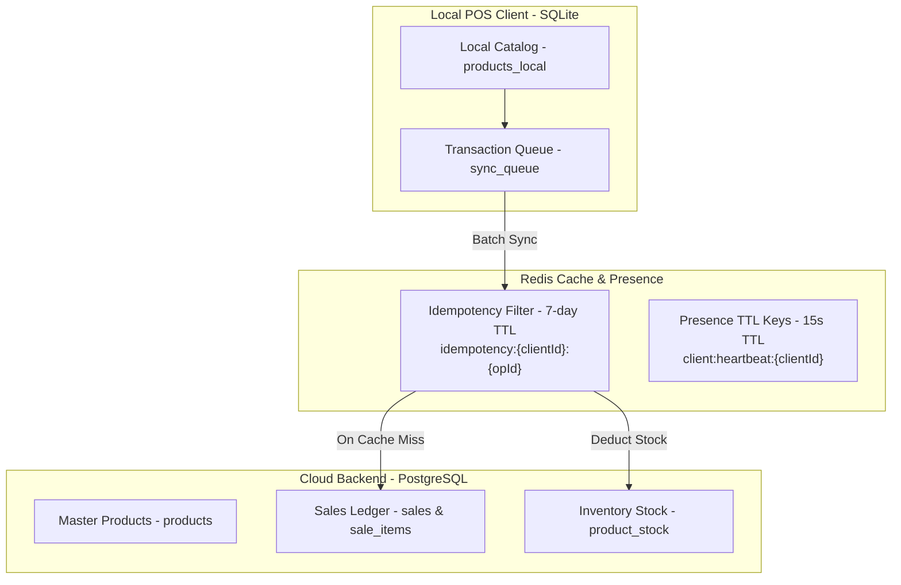
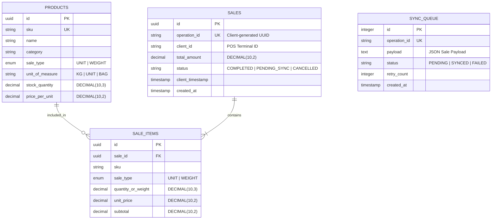

# 🗄️ Database Architecture & Data Strategy

### Connectivity Strategies in Distributed Systems

---

# Introduction

In a distributed point-of-sale (POS) system designed for intermittent connectivity, the database architecture must balance local operational autonomy with central enterprise data integrity.

This document specifies the multi-tier data storage model, entity schemas, idempotency constraints, and precision rules for the **Cattle & Beef Products POS** domain.

---

# Domain Scope & Boundaries

To maintain technical focus, the business domain covers **Beef Products & Farm Supplies**:

### In-Scope
- **Weighted Products (`WEIGHT`)**: Beef cuts, bulk feed, and weighed products measured in kilograms (e.g., 0.8 kg of beef tenderloin at $15.00/kg).
- **Unit Products (`UNIT`)**: Packaged meat products, feed sacks, supplements, and farm equipment sold by piece or count (e.g., 5 sacks of mineral feed).

### Out-of-Scope
- Live animal movement registration, herd traceability, and regulatory veterinary permits (excluded to keep focus on connectivity architecture).

---

# Multi-Tier Data Storage Architecture

The data strategy utilizes three distinct storage tiers:

---

# Entity-Relationship Diagram (ERD)

---

# Schema Specification

## 1. Central Products (`products`)
Stores the master product catalog in PostgreSQL.

| Column | Type | Constraints | Description |
|---|---|---|---|
| `id` | UUID | PRIMARY KEY | Unique product identifier |
| `sku` | VARCHAR(50) | UNIQUE, NOT NULL | Stock Keeping Unit (e.g., `BEEF-RIB-01`, `FEED-SUPP-50`) |
| `name` | VARCHAR(100) | NOT NULL | Product display name |
| `category` | VARCHAR(50) | NOT NULL | Product category (`BEEF_CUTS`, `FEED`, `SUPPLEMENTS`) |
| `sale_type` | VARCHAR(10) | NOT NULL | Selling strategy: `UNIT` or `WEIGHT` |
| `unit_of_measure` | VARCHAR(10) | NOT NULL | Unit designation (`KG`, `UNIT`, `BAG`) |
| `stock_quantity` | DECIMAL(10, 3) | NOT NULL, DEFAULT 0 | Current stock balance (supports fractional weights) |
| `price_per_unit` | DECIMAL(10, 2) | NOT NULL | Price per unit or price per kilogram |

## 2. Central Sales Ledger (`sales` & `sale_items`)
Append-only transactional ledger in PostgreSQL.

### Table: `sales`
| Column | Type | Constraints | Description |
|---|---|---|---|
| `id` | UUID | PRIMARY KEY | Central sale ID |
| `operation_id` | VARCHAR(100) | UNIQUE, NOT NULL | Client-generated operation UUID for idempotency |
| `client_id` | VARCHAR(50) | NOT NULL | Originating POS terminal ID |
| `total_amount` | DECIMAL(10, 2) | NOT NULL | Total transaction monetary value |
| `status` | VARCHAR(20) | NOT NULL | Sale status (`COMPLETED`, `CANCELLED`) |
| `client_timestamp` | TIMESTAMP | NOT NULL | Exact time sale occurred on local POS |
| `created_at` | TIMESTAMP | DEFAULT NOW() | Server processing timestamp |

### Table: `sale_items`
| Column | Type | Constraints | Description |
|---|---|---|---|
| `id` | UUID | PRIMARY KEY | Item line ID |
| `sale_id` | UUID | FOREIGN KEY -> `sales.id` | Associated sale |
| `sku` | VARCHAR(50) | NOT NULL | Product SKU |
| `sale_type` | VARCHAR(10) | NOT NULL | `UNIT` or `WEIGHT` |
| `quantity_or_weight` | DECIMAL(10, 3) | NOT NULL | Sold quantity (e.g., `2.000`) or weight (e.g., `0.800` kg) |
| `unit_price` | DECIMAL(10, 2) | NOT NULL | Price per unit or price per kg at time of sale |
| `subtotal` | DECIMAL(10, 2) | NOT NULL | Calculated line item cost (`quantity_or_weight * unit_price`) |

## 3. Local POS Queue (`sync_queue`)
Local SQLite table managed by the offline POS client.

| Column | Type | Constraints | Description |
|---|---|---|---|
| `id` | INTEGER | PRIMARY KEY AUTOINCREMENT | Local sequence ID |
| `operation_id` | TEXT | UNIQUE, NOT NULL | Client-generated UUID |
| `payload` | TEXT | NOT NULL | Serialized JSON transaction payload |
| `status` | TEXT | NOT NULL | Sync status (`PENDING`, `SYNCED`, `FAILED`) |
| `retry_count` | INTEGER | DEFAULT 0 | Number of synchronization attempts |
| `created_at` | TIMESTAMP | DEFAULT CURRENT_TIMESTAMP | Local creation timestamp |

---

# Idempotency & Data Integrity Rules

### 1. Multi-Layer Idempotency Defense
- **Fast Path (In-Memory Redis)**: Prior to processing a sale, `sync-service` checks key `idempotency:{clientId}:{operationId}` in Redis. If found, returns cached result immediately without hitting PostgreSQL.
- **Fallback Guard (PostgreSQL Constraints)**: The `sales` table enforces `UNIQUE (operation_id)`. If a duplicate bypasses Redis, PostgreSQL rejects duplicate inserts gracefully.

### 2. Weighted Calculation Precision
- All weights are stored with 3 decimal places (`DECIMAL(10,3)`).
- Subtotals are rounded to 2 decimal places using banker's rounding (`ROUND(quantity_or_weight * unit_price, 2)`).
- Example: `0.800 kg` of Beef Ribs at `$15.50/kg` = `0.800 * 15.50 = $12.40`.
