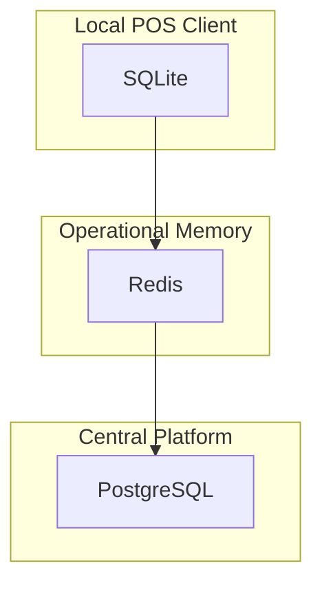
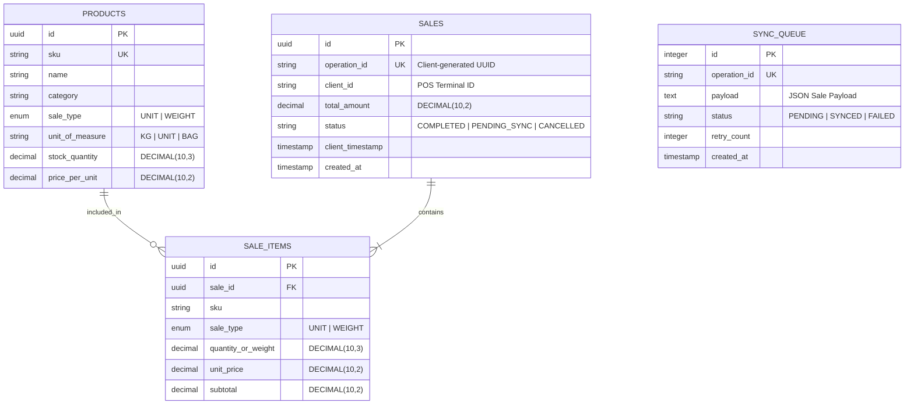
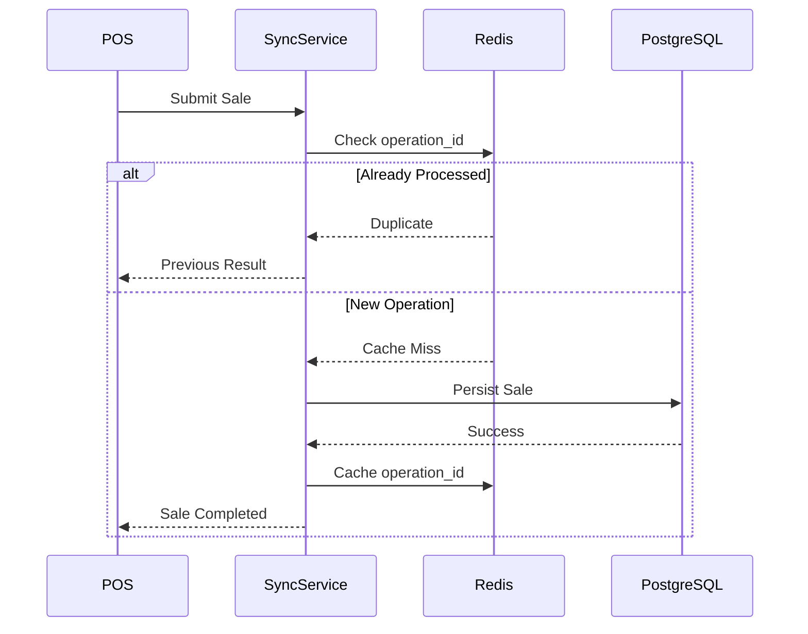
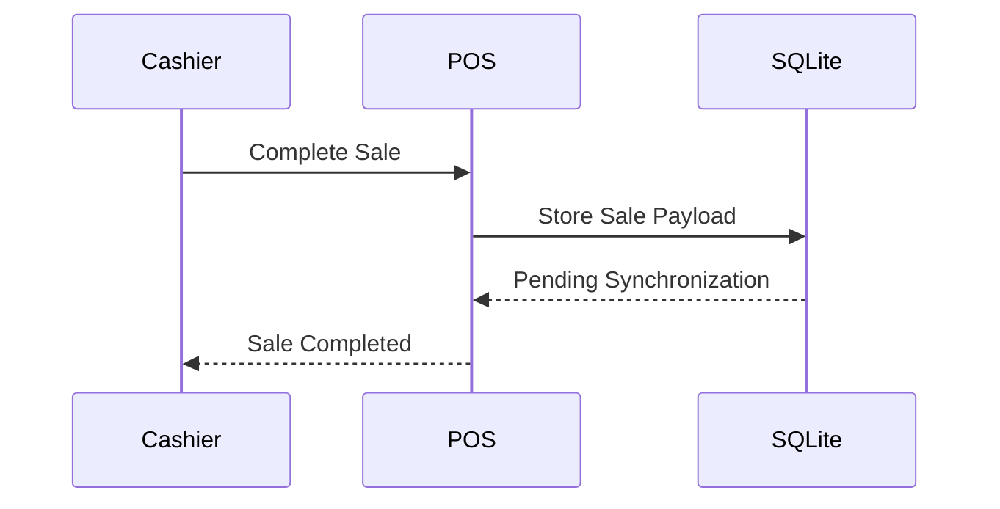
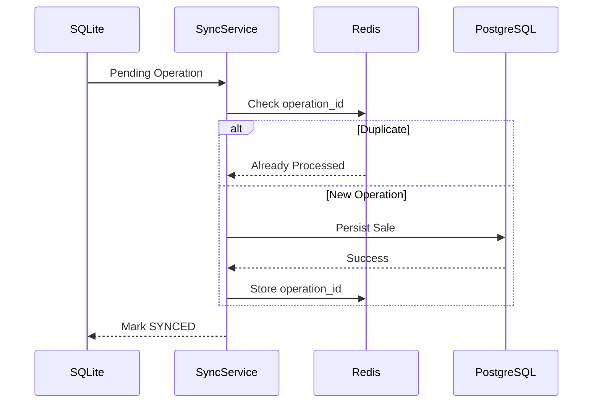

# 🗄️ Data Architecture & Persistence Strategy

### Connectivity Strategies in Distributed Systems

---

# Introduction

Connectivity architecture affects much more than network communication.

Once a system is expected to continue operating during network interruptions, the way data is stored, synchronized, and validated changes significantly.

Instead of relying on a single centralized database, different storage technologies assume different responsibilities depending on the operational needs of the business.

This document describes the persistence strategy adopted for the **Connectivity Strategies** case study, explaining how data is distributed across storage layers, how entities are modeled, and how the architecture guarantees consistency while allowing clients to operate independently.

Rather than focusing on database implementation details, this document explains the engineering decisions that shaped the data architecture.

---

# Relationship with the Connectivity Architecture

The data architecture is a direct consequence of the connectivity strategy adopted by the platform.

Business requirements determine how clients are expected to operate. Those operational requirements define each client's responsibilities, which ultimately shape the persistence strategy and the data model.

```text
Business Requirements
        ↓
Connectivity Strategy
        ↓
Client Responsibilities
        ↓
Persistence Requirements
        ↓
Data Architecture
        ↓
Technology Selection
```

This design process intentionally avoids selecting technologies first.

Instead, storage technologies are introduced only after the architectural responsibilities have been identified.

---

# Why a Dedicated Data Strategy?

Traditional online applications usually rely on a single centralized database.

That approach works well while every client has permanent connectivity.

However, once clients are expected to continue operating offline, new engineering challenges emerge.

Some examples include:

- Local autonomy during connectivity loss.
- Reliable synchronization after reconnection.
- Duplicate operation prevention.
- Temporary operational state.
- Conflict detection.
- Eventual consistency.
- Data integrity across distributed clients.

These requirements cannot be solved by a single storage technology.

Instead, this architecture distributes responsibilities across multiple persistence layers, each optimized for a different engineering concern.

---

# Multi-Tier Persistence Architecture

The platform separates persistence into three independent storage layers.



Each layer serves a different purpose.

Rather than duplicating data, responsibilities are intentionally separated according to the operational characteristics of each storage technology.

---

# Storage Responsibilities

## SQLite — Local Operational Storage

SQLite enables the client to continue operating without requiring permanent connectivity.

Its primary responsibilities include:

- Local product catalog.
- Pending synchronization queue.
- Temporary operational data.
- Local transaction history required for synchronization.

SQLite is **not** considered the source of truth.

Its purpose is to preserve business continuity while the client remains disconnected.

---

## Redis — Operational State

Redis stores short-lived operational information that allows distributed services to coordinate efficiently.

Typical responsibilities include:

- Idempotency validation.
- Presence tracking.
- Heartbeats.
- Temporary synchronization metadata.

Redis intentionally stores volatile information.

If Redis becomes unavailable, the system can rebuild its operational state without compromising business data.

---

## PostgreSQL — System of Record

PostgreSQL represents the authoritative source of business information.

Its responsibilities include:

- Product catalog.
- Sales ledger.
- Inventory.
- Historical transactions.
- Business reporting.

Every synchronized operation eventually becomes part of the central database once validation has been completed successfully.

PostgreSQL remains the single source of truth across the platform.

---

# Architectural Principles

The persistence architecture follows several engineering principles.

## Separation of Responsibilities

Each storage technology solves a different problem.

No storage layer attempts to replace another.

---

## Local Autonomy

Clients should continue operating whenever business rules allow it, even when communication with the server is temporarily unavailable.

---

## Central Authority

Although clients may operate independently, the server remains responsible for maintaining the authoritative business state.

---

## Eventual Consistency

Temporary inconsistencies are accepted while clients remain offline.

The synchronization process is responsible for converging every client toward the same business state once connectivity returns.

---

## Operational Simplicity

Each persistence layer should remain as simple as possible, assuming only the responsibilities required by the architecture.

Complexity is introduced only where it provides measurable value.

---

# Domain Scope

To keep the engineering discussion focused, the business domain covers **Beef Products & Farm Supplies**.

The objective is not to model livestock management itself, but to provide a realistic business scenario for evaluating connectivity strategies.

## In Scope

### Weighted Products (`WEIGHT`)

Products sold by weight.

Examples include:

- Beef cuts
- Bulk feed
- Agricultural products measured in kilograms

Example:

```
0.850 kg Beef Tenderloin
```

---

### Unit Products (`UNIT`)

Products sold individually.

Examples include:

- Feed bags
- Supplements
- Farm equipment
- Packaged products

Example:

```
5 Feed Bags
```

---

## Out of Scope

The following business capabilities are intentionally excluded:

- Animal traceability
- Herd management
- Veterinary records
- Government regulatory integrations

These topics belong to future engineering case studies and are outside the scope of connectivity architecture.

---

# Entity Relationship Model

The entity model is intentionally designed to support intermittent connectivity rather than a permanently connected environment.

Unlike a traditional online POS system, the architecture introduces additional entities that enable disconnected operation, reliable synchronization, and eventual consistency.

Business entities remain simple and focused on their domain responsibilities, while synchronization concerns are isolated within dedicated persistence structures.

The following ERD represents the persistence model used throughout the case study.



---

# Entity Responsibilities

Although the model appears similar to a conventional POS database, several entities exist specifically because the platform supports intermittent connectivity.

Each entity has a clearly defined responsibility.

| Entity | Primary Responsibility |
|---------|------------------------|
| `products` | Master product catalog maintained by the central platform |
| `sales` | Business transaction ledger |
| `sale_items` | Individual products included in each sale |
| `sync_queue` | Local persistence for operations waiting to be synchronized |

Notice that only **sync_queue** exists exclusively because of the chosen connectivity strategy.

Without Offline-First capabilities, this table would not be necessary.

---

# Schema Specification

The schema is divided according to the responsibilities introduced by the persistence architecture.

Instead of storing every piece of information in a single database, business data and synchronization metadata are intentionally separated.

---

# 1. Central Product Catalog (`products`)

The `products` table represents the authoritative catalog maintained by the central platform.

Every POS terminal receives a synchronized copy of this catalog, allowing products to remain available even during connectivity interruptions.

The catalog stores only business information.

It does not contain synchronization metadata because synchronization responsibilities belong to independent persistence structures.

| Column | Type | Constraints | Description |
|---|---|---|---|
| id | UUID | PRIMARY KEY | Unique product identifier |
| sku | VARCHAR(50) | UNIQUE, NOT NULL | Stock Keeping Unit |
| name | VARCHAR(100) | NOT NULL | Product display name |
| category | VARCHAR(50) | NOT NULL | Product category |
| sale_type | VARCHAR(10) | NOT NULL | UNIT or WEIGHT |
| unit_of_measure | VARCHAR(10) | NOT NULL | KG, UNIT or BAG |
| stock_quantity | DECIMAL(10,3) | NOT NULL | Available stock |
| price_per_unit | DECIMAL(10,2) | NOT NULL | Selling price |

---

# 2. Sales Ledger (`sales`)

The `sales` table stores completed business transactions.

Unlike traditional POS systems, every sale includes information that enables distributed synchronization.

The most important attribute is `operation_id`, generated by the client before synchronization begins.

This identifier guarantees that the same business operation can be recognized regardless of how many synchronization attempts occur.

The table also records two different timestamps.

- `client_timestamp` represents when the sale actually occurred.
- `created_at` represents when the central platform accepted the operation.

Separating these timestamps preserves business chronology even after prolonged offline periods.

| Column | Type | Constraints | Description |
|---|---|---|---|
| id | UUID | PRIMARY KEY | Central sale identifier |
| operation_id | VARCHAR(100) | UNIQUE | Client generated operation identifier |
| client_id | VARCHAR(50) | NOT NULL | Originating POS terminal |
| total_amount | DECIMAL(10,2) | NOT NULL | Total transaction amount |
| status | VARCHAR(20) | NOT NULL | Business status |
| client_timestamp | TIMESTAMP | NOT NULL | Local execution time |
| created_at | TIMESTAMP | DEFAULT NOW() | Server processing time |

---

# 3. Sale Items (`sale_items`)

Each sale consists of one or more individual line items.

The table intentionally supports both unit-based and weight-based products through the shared field `quantity_or_weight`.

This simplifies the sales model while preserving the business rules defined for both selling strategies.

Historical prices are stored directly in the transaction.

This prevents future catalog price changes from affecting previously completed sales.

| Column | Type | Constraints | Description |
|---|---|---|---|
| id | UUID | PRIMARY KEY | Sale item identifier |
| sale_id | UUID | FK | Parent sale |
| sku | VARCHAR(50) | NOT NULL | Product SKU |
| sale_type | VARCHAR(10) | NOT NULL | UNIT or WEIGHT |
| quantity_or_weight | DECIMAL(10,3) | NOT NULL | Sold quantity |
| unit_price | DECIMAL(10,2) | NOT NULL | Price at sale time |
| subtotal | DECIMAL(10,2) | NOT NULL | Line subtotal |

---

# 4. Local Synchronization Queue (`sync_queue`)

Unlike the previous entities, `sync_queue` is not part of the business domain.

Its sole responsibility is supporting Offline-First operation.

Whenever connectivity is unavailable, completed sales are serialized as JSON payloads and stored locally.

The synchronization service processes these operations once communication with the server becomes available again.

Keeping synchronization metadata separate from business entities simplifies both the persistence model and the synchronization workflow.

| Column | Type | Constraints | Description |
|---|---|---|---|
| id | INTEGER | PRIMARY KEY AUTOINCREMENT | Local sequence |
| operation_id | TEXT | UNIQUE | Client operation identifier |
| payload | TEXT | NOT NULL | Serialized sale payload |
| status | TEXT | NOT NULL | Synchronization status |
| retry_count | INTEGER | DEFAULT 0 | Retry attempts |
| created_at | TIMESTAMP | DEFAULT CURRENT_TIMESTAMP | Local creation time |

---

# Data Flow Across the Platform

The persistence architecture is only one part of the solution.

Equally important is understanding how information moves across the platform while clients transition between connected and disconnected states.

Unlike traditional online systems, data does not always travel directly from the client to the central database.

Instead, operations follow different execution paths depending on the client's connectivity strategy.

---

# Online Transaction Flow

When connectivity is available, completed sales are synchronized immediately.



The synchronization service validates the operation before writing business data.

Redis provides a fast idempotency filter, while PostgreSQL guarantees final consistency through database constraints.

---

# Offline Transaction Flow

When connectivity is unavailable, business operations continue locally.

Instead of blocking the user, completed sales are persisted inside the local synchronization queue.



From the cashier's perspective, the sale is completed successfully even though the central platform has not yet received the transaction.

Business continuity takes priority over immediate synchronization.

---

# Deferred Synchronization

Once connectivity becomes available again, pending operations are transmitted to the synchronization service.



Synchronization is transparent to the cashier.

The client simply processes pending operations until the local queue becomes empty.

---

# Persistence Responsibilities During Synchronization

Different persistence technologies participate at different stages of the synchronization process.

| Storage | Responsibility |
|----------|----------------|
| SQLite | Stores pending business operations |
| Redis | Prevents duplicate processing |
| PostgreSQL | Persists validated business data |

Each storage layer performs only the responsibilities assigned by the architecture.

No storage technology attempts to solve every persistence concern.

---

# Why Synchronization Metadata Is Stored Separately

Business entities should remain focused on business information.

Synchronization introduces additional technical concerns that should not pollute the domain model.

Examples include:

- Retry counters
- Synchronization status
- Serialized payloads
- Queue ordering
- Temporary failures

Keeping synchronization metadata inside `sync_queue` allows business entities such as `sales` and `sale_items` to remain independent of the synchronization process.

This separation simplifies maintenance and preserves a clear distinction between business data and infrastructure concerns.

---

# Engineering Considerations

The persistence strategy intentionally prioritizes operational continuity over immediate consistency.

This introduces several engineering trade-offs.

### Advantages

- Continuous operation during connectivity loss.
- Clear separation between business and synchronization data.
- Reduced coupling between clients and central services.
- Reliable recovery after network interruptions.

### Trade-offs

- Increased architectural complexity.
- Additional synchronization logic.
- Temporary data duplication.
- Eventual rather than immediate consistency.

These trade-offs are accepted because they directly support the primary business objective: allowing the platform to continue operating despite intermittent connectivity.

---

# Idempotency Strategy

Distributed systems must assume that the same operation may be transmitted multiple times.

Network interruptions, client retries, service restarts, and uncertain delivery acknowledgements can all cause duplicate requests.

Rather than attempting to prevent retries, the architecture ensures that repeated operations always produce the same result.

The synchronization service therefore implements a multi-layer idempotency strategy.

---

## First Layer — Redis Fast Validation

Before processing any incoming operation, the synchronization service checks whether the operation has already been processed.

```
idempotency:{clientId}:{operationId}
```

If the key exists, the service immediately returns the previously generated result without accessing PostgreSQL.

This reduces unnecessary database load while providing a fast response for duplicate requests.

Redis is treated purely as an optimization layer.

---

## Second Layer — PostgreSQL Integrity Constraint

Redis should never be considered the only protection mechanism.

If Redis becomes unavailable or its cache expires, PostgreSQL remains responsible for guaranteeing data integrity.

The `sales.operation_id` column is protected by a unique constraint.

```
UNIQUE(operation_id)
```

This guarantees that even if duplicate requests reach the database, only one business transaction is accepted.

The remaining requests are safely rejected without corrupting business data.

---

## Why Two Layers?

Each layer addresses a different engineering concern.

| Layer | Responsibility |
|--------|----------------|
| Redis | Fast duplicate detection |
| PostgreSQL | Final business integrity |

The architecture intentionally avoids relying on a single mechanism.

Performance and correctness are treated as independent concerns.

---

# Data Integrity Rules

The persistence strategy follows several rules that remain valid regardless of connectivity conditions.

## Immutable Sales

Completed sales are never modified.

Corrections are represented as new business operations rather than updates to historical transactions.

This preserves an auditable business history.

---

## Historical Prices

Product prices are copied into each sale item when the transaction occurs.

Future catalog price changes must never affect previously completed sales.

---

## Independent Product Catalog

The synchronized product catalog is read-only from the perspective of POS clients.

Catalog updates originate only from the central platform.

This prevents conflicting product definitions across multiple clients.

---

## Stable Operation Identifiers

Every business operation receives a globally unique identifier before synchronization begins.

The identifier remains unchanged throughout the operation's entire lifecycle.

This allows the synchronization service to recognize repeated transmissions without relying on timestamps or network ordering.

---

# Precision Rules

Retail systems involving weighted products require deterministic calculations.

Floating-point arithmetic is intentionally avoided.

---

## Product Quantities

Weighted products are stored using:

```
DECIMAL(10,3)
```

Example:

```
0.850 kg
```

This precision is sufficient for commercial weighing while avoiding floating-point errors.

---

## Monetary Values

Prices and totals are stored using:

```
DECIMAL(10,2)
```

Representing currency using fixed precision ensures deterministic financial calculations.

---

## Line Item Calculation

Each sale item calculates its subtotal independently.

```
subtotal = quantity_or_weight × unit_price
```

The calculated subtotal is persisted instead of being recomputed later.

Historical financial information therefore remains immutable.

---

## Rounding

All monetary values are rounded to two decimal places using banker's rounding.

Consistent rounding guarantees identical calculations across different services and programming languages.

---

# Failure Recovery

Network interruptions are expected rather than treated as exceptional situations.

Whenever synchronization fails, the original business operation remains safely stored inside the local synchronization queue.

The client simply retries the operation later.

No business information is discarded.

This approach prioritizes business continuity over immediate synchronization.

---

# Architectural Decisions

Several architectural decisions directly influenced the persistence strategy.

| Decision | Motivation |
|----------|------------|
| SQLite for local persistence | Enables autonomous operation while offline |
| Redis for operational state | High-speed transient data without permanent persistence |
| PostgreSQL as System of Record | Central business authority |
| Local synchronization queue | Guarantees reliable deferred synchronization |
| UUID operation identifiers | Enables idempotent processing across distributed clients |
| Immutable sales ledger | Preserves historical business integrity |
| Eventual consistency | Prioritizes operational continuity over immediate consistency |

Each decision introduces additional implementation complexity, but directly supports the operational requirements defined by the connectivity strategy.

---

# Engineering Trade-offs

No persistence strategy is universally optimal.

The chosen architecture intentionally balances operational continuity against implementation complexity.

## Advantages

- Clients continue operating during connectivity loss.
- Reliable deferred synchronization.
- Strong protection against duplicate operations.
- Clear separation between business data and synchronization metadata.
- Improved resilience to temporary infrastructure failures.
- Centralized business authority with decentralized execution.

---

## Trade-offs

- More persistence components.
- Additional synchronization logic.
- Greater implementation complexity.
- Temporary duplication of business data.
- Eventual rather than immediate consistency.

These trade-offs are accepted because uninterrupted business operation is considered more valuable than immediate synchronization.

---

# Conclusion

Connectivity strategy influences far more than network communication.

Once clients are expected to operate independently, persistence architecture, data modeling, synchronization, and integrity mechanisms become integral parts of the overall system design.

Rather than relying on a single database, this case study distributes persistence responsibilities across SQLite, Redis, and PostgreSQL, allowing each technology to solve the problem for which it is best suited.

The resulting architecture enables autonomous client operation, reliable synchronization, strong business integrity, and eventual consistency while maintaining a clear separation between business data and infrastructure concerns.

The persistence strategy presented throughout this document is therefore not simply a database design.

It is a direct consequence of the architectural decisions made to support distributed connectivity.