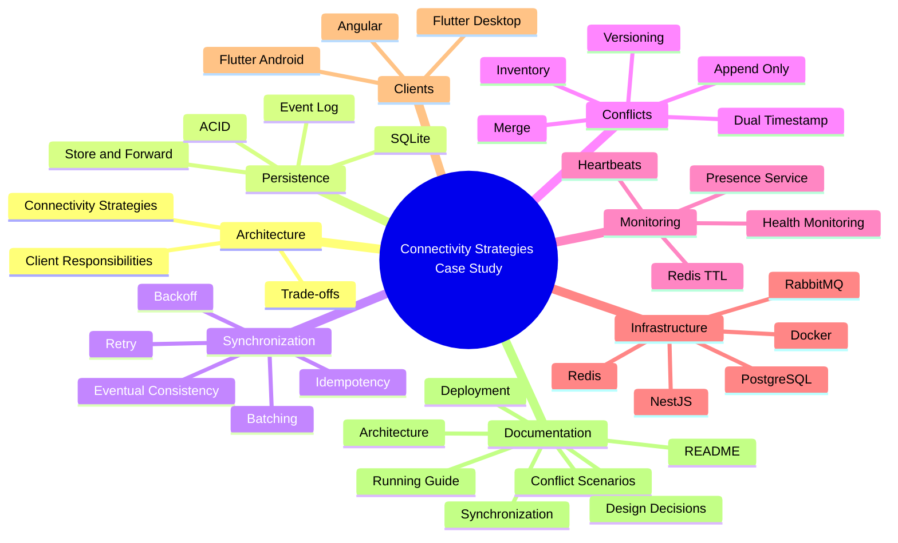

# ⚙️ Decisiones de Diseño

## Caso de Estudio 2: Estrategias de Conectividad en Sistemas Distribuidos

---

# Propósito de este Documento

Diseñar una arquitectura distribuida implica tomar decisiones que afectan directamente la disponibilidad, la consistencia, la complejidad operativa y la experiencia de los usuarios.

En este caso de estudio no se buscó construir únicamente una aplicación funcional, sino analizar cómo distintas estrategias arquitectónicas responden a restricciones reales del negocio.

Cada decisión presentada en este documento parte de una pregunta concreta, evalúa distintas alternativas y justifica la solución finalmente adoptada junto con sus compromisos (*trade-offs*).

El objetivo no es demostrar que existe una única solución correcta, sino explicar por qué determinadas decisiones resultan más apropiadas para este escenario.

---

# Roadmap del Caso de Estudio

El siguiente mapa resume los principales bloques arquitectónicos desarrollados a lo largo del proyecto.

Cada uno representa un conjunto de decisiones que, en conjunto, permiten construir una plataforma distribuida resiliente frente a pérdidas de conectividad.



Cada uno de estos bloques será desarrollado en las siguientes secciones, explicando las decisiones que permitieron construir una arquitectura capaz de operar incluso cuando parte de la infraestructura deja de estar disponible.

---

# Antes de Diseñar la Arquitectura

Antes de seleccionar tecnologías, patrones o componentes, fue necesario responder una serie de preguntas sobre el dominio del problema.

Estas preguntas guiaron todas las decisiones descritas posteriormente.

## ¿Puede el negocio dejar de operar cuando falla Internet?

No.

El proceso de venta constituye la actividad principal del negocio y no puede depender completamente de la disponibilidad de la red.

Esta restricción conduce a la necesidad de incorporar mecanismos que permitan continuar operando sin conexión.

---

## ¿Todas las aplicaciones requieren el mismo nivel de autonomía?

No.

Cada aplicación cumple una responsabilidad diferente.

Mientras el Punto de Venta debe continuar funcionando durante cortes prolongados de conectividad, el panel administrativo necesita trabajar sobre información centralizada y actualizada.

Esto descarta la idea de utilizar una única estrategia de conectividad para todos los clientes.

---

## ¿Toda la información necesita sincronizarse inmediatamente?

No.

Existen operaciones que pueden diferirse algunos segundos o minutos sin afectar al negocio.

Otras, en cambio, requieren consistencia inmediata.

La arquitectura debe ser capaz de distinguir ambos escenarios.

---

## ¿Qué es más importante: disponibilidad o consistencia?

La respuesta depende del proceso de negocio.

En el Punto de Venta se prioriza la disponibilidad para garantizar la continuidad de las ventas.

En la Administración se prioriza la consistencia para asegurar que las decisiones se tomen sobre información consolidada.

La arquitectura no intenta maximizar una única propiedad, sino equilibrarlas según las necesidades de cada cliente.

---

## ¿Dónde debe ubicarse la complejidad?

Una decisión importante consistió en evitar distribuir complejidad innecesariamente.

No todos los clientes requieren sincronización, resolución de conflictos o persistencia local.

Cada componente incorpora únicamente las capacidades que necesita para cumplir su responsabilidad.

Este principio reduce el mantenimiento del sistema y evita resolver problemas que, en la práctica, nunca llegarían a producirse.

---

# Una Estrategia Única No Es Suficiente

Con frecuencia se asume que todas las aplicaciones de un sistema distribuido deben compartir el mismo modelo de conectividad.

Sin embargo, esta aproximación obliga a todos los clientes a aceptar las mismas limitaciones, incluso cuando sus responsabilidades son completamente distintas.

Por ejemplo:

- Un panel administrativo no necesita operar durante varios días sin conexión.
- Un Punto de Venta no puede detener las ventas por una pérdida de Internet.
- Una aplicación logística únicamente necesita tolerar interrupciones temporales de señal.

Cada cliente presenta necesidades diferentes.

En consecuencia, también requiere una estrategia de conectividad diferente.

Este razonamiento constituye el punto de partida del resto de las decisiones descritas en este documento.
# Selección de Estrategias de Conectividad

Una vez identificadas las restricciones del negocio, la siguiente decisión consistió en determinar cómo deberían comunicarse las distintas aplicaciones con el servidor.

La solución más sencilla habría sido utilizar una única estrategia de conectividad para toda la plataforma. Sin embargo, esta aproximación habría obligado a todos los clientes a asumir las mismas limitaciones, independientemente de sus responsabilidades.

En lugar de ello, la arquitectura adopta una estrategia específica para cada aplicación.

---

## ¿Todas las aplicaciones necesitan comportarse igual?

No.

Aunque todas forman parte del mismo ecosistema, sus responsabilidades son completamente distintas.

Un Punto de Venta, un panel administrativo y una aplicación logística operan bajo condiciones diferentes y responden a necesidades del negocio que no siempre coinciden.

La arquitectura reconoce estas diferencias y adapta la estrategia de conectividad a cada cliente.

---

## Alternativa A: Online-First para toda la plataforma

En este modelo, todas las operaciones dependen de una comunicación inmediata con el servidor.

```text
Cliente

↓

Servidor

↓

Respuesta

↓

Operación
```

### Ventajas

- Información siempre actualizada.
- Arquitectura más simple.
- Sin mecanismos de sincronización.
- Menor complejidad en el cliente.

### Limitaciones

- Una pérdida de conectividad detiene la operación.
- La disponibilidad depende completamente de la infraestructura.
- La latencia impacta directamente en la experiencia del usuario.

Para un panel administrativo este comportamiento resulta aceptable.

Para un Punto de Venta, no.

---

## Alternativa B: Offline-First para toda la plataforma

Otra posibilidad consistía en convertir todas las aplicaciones en clientes Offline-First.

```text
Cliente

↓

Persistencia Local

↓

Cola de Eventos

↓

Sincronización

↓

Servidor
```

### Ventajas

- Alta disponibilidad.
- Autonomía frente a fallos de red.
- Menor dependencia del servidor.

### Limitaciones

- Mayor complejidad de desarrollo.
- Resolución de conflictos.
- Persistencia local.
- Versionado.
- Sincronización.
- Reconciliación.

Muchas aplicaciones nunca necesitarían estas capacidades.

Implementarlas supondría un coste innecesario.

---

# Decisión Adoptada

La arquitectura adopta una estrategia híbrida.

Cada cliente utiliza el modelo de conectividad que mejor responde a sus responsabilidades.

| Cliente | Estrategia |
|----------|------------|
| Administración | Online-First Estricto |
| Punto de Venta | Offline-First |
| Logística | Online-First Permisivo |

En lugar de buscar una única solución para todos los escenarios, la plataforma optimiza cada aplicación de manera independiente.

---

# ¿Por qué el Punto de Venta es Offline-First?

La prioridad del Punto de Venta consiste en garantizar la continuidad de las ventas.

Una interrupción de Internet no debería impedir que una sucursal continúe operando.

Por este motivo, el POS registra las ventas localmente y difiere la sincronización con el servidor.

```text
Venta

↓

SQLite

↓

Event Log

↓

Sincronización

↓

Servidor
```

De esta forma, el servidor deja de formar parte del flujo crítico de atención al cliente.

---

# ¿Por qué la Administración es Online-First?

El panel administrativo cumple una función distinta.

Su responsabilidad consiste en administrar información global del sistema.

Por ejemplo:

- Usuarios.
- Roles.
- Parámetros fiscales.
- Inventario consolidado.
- Reportes.
- Configuración.

Trabajar con información desactualizada podría conducir a decisiones incorrectas.

Por ello, la aplicación siempre consulta y modifica la información directamente sobre el servidor.

La autoridad permanece centralizada.

---

# ¿Por qué la Aplicación de Logística utiliza un modelo híbrido?

La aplicación logística representa un punto intermedio.

Un repartidor puede atravesar zonas sin cobertura durante algunos minutos.

Sin embargo, tampoco necesita un motor completo de sincronización como el utilizado por el Punto de Venta.

La arquitectura adopta un modelo **Online-First Permisivo**.

```text
Intentar Servidor

↓

¿Disponible?

↓

Sí → Procesar

↓

No

↓

Guardar Temporalmente

↓

Reintentar
```

Este enfoque proporciona tolerancia frente a pérdidas temporales de conectividad sin introducir la complejidad completa de una arquitectura Offline-First.

---

# Comparación de Estrategias

| Característica | Administración | Punto de Venta | Logística |
|----------------|----------------|----------------|------------|
| Estrategia | Online-First | Offline-First | Online-First Permisivo |
| Persistencia Local | No | SQLite | Caché + Cola |
| Escritura Offline | No | Sí | Limitada |
| Lectura Offline | No | Sí | Parcial |
| Sincronización | No | Completa | Parcial |
| Resolución de Conflictos | No | Sí | Limitada |
| Complejidad | Baja | Alta | Media |

La arquitectura evita incorporar capacidades innecesarias en aplicaciones que no las requieren.

Cada cliente implementa únicamente la complejidad necesaria para cumplir su responsabilidad.

---

# Trade-offs

| Decisión | Beneficio | Costo |
|----------|-----------|--------|
| Online-First | Consistencia inmediata | Dependencia permanente de la red |
| Offline-First | Máxima disponibilidad | Sincronización y resolución de conflictos |
| Online-First Permisivo | Equilibrio entre simplicidad y disponibilidad | Persistencia temporal y reintentos |

No existe una estrategia universalmente superior.

Cada una optimiza propiedades diferentes del sistema.

La decisión consiste en seleccionar la estrategia más adecuada para cada proceso del negocio y no en aplicar el mismo modelo de conectividad a todas las aplicaciones.
