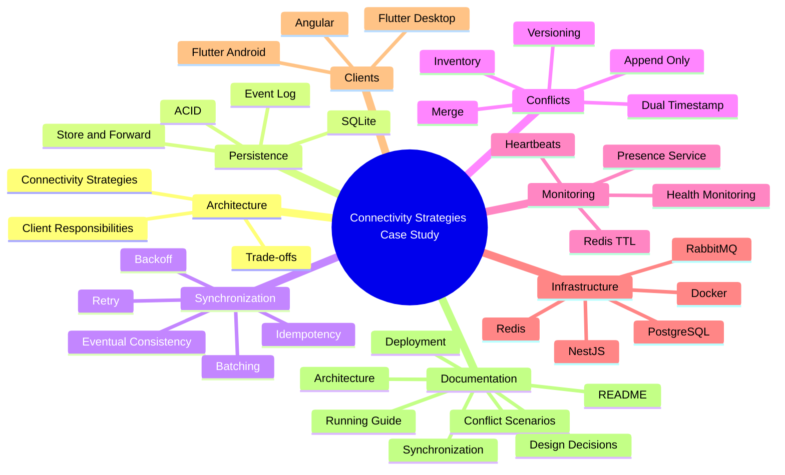

# ⚙️ Decisiones de Diseño

## Caso de Estudio 2: Estrategias de Conectividad en Sistemas Distribuidos

---

# Propósito de este Documento

Diseñar una arquitectura distribuida implica tomar decisiones que afectan directamente la disponibilidad, la consistencia, la complejidad operativa y la experiencia de los usuarios.

En este caso de estudio no se buscó construir únicamente una aplicación funcional, sino analizar cómo distintas estrategias arquitectónicas responden a restricciones reales del negocio.

Cada decisión presentada en este documento parte de una pregunta concreta, evalúa distintas alternativas y justifica la solución finalmente adoptada junto con sus compromisos (*trade-offs*).

El objetivo no es demostrar que existe una única solución correcta, sino explicar por qué determinadas decisiones resultan más apropiadas para este escenario.

---

# Roadmap del Caso de Estudio

El siguiente mapa resume los principales bloques arquitectónicos desarrollados a lo largo del proyecto.

Cada uno representa un conjunto de decisiones que, en conjunto, permiten construir una plataforma distribuida resiliente frente a pérdidas de conectividad.



Cada uno de estos bloques será desarrollado en las siguientes secciones, explicando las decisiones que permitieron construir una arquitectura capaz de operar incluso cuando parte de la infraestructura deja de estar disponible.

---

# Antes de Diseñar la Arquitectura

Antes de seleccionar tecnologías, patrones o componentes, fue necesario responder una serie de preguntas sobre el dominio del problema.

Estas preguntas guiaron todas las decisiones descritas posteriormente.

## ¿Puede el negocio dejar de operar cuando falla Internet?

No.

El proceso de venta constituye la actividad principal del negocio y no puede depender completamente de la disponibilidad de la red.

Esta restricción conduce a la necesidad de incorporar mecanismos que permitan continuar operando sin conexión.

---

## ¿Todas las aplicaciones requieren el mismo nivel de autonomía?

No.

Cada aplicación cumple una responsabilidad diferente.

Mientras el Punto de Venta debe continuar funcionando durante cortes prolongados de conectividad, el panel administrativo necesita trabajar sobre información centralizada y actualizada.

Esto descarta la idea de utilizar una única estrategia de conectividad para todos los clientes.

---

## ¿Toda la información necesita sincronizarse inmediatamente?

No.

Existen operaciones que pueden diferirse algunos segundos o minutos sin afectar al negocio.

Otras, en cambio, requieren consistencia inmediata.

La arquitectura debe ser capaz de distinguir ambos escenarios.

---

## ¿Qué es más importante: disponibilidad o consistencia?

La respuesta depende del proceso de negocio.

En el Punto de Venta se prioriza la disponibilidad para garantizar la continuidad de las ventas.

En la Administración se prioriza la consistencia para asegurar que las decisiones se tomen sobre información consolidada.

La arquitectura no intenta maximizar una única propiedad, sino equilibrarlas según las necesidades de cada cliente.

---

## ¿Dónde debe ubicarse la complejidad?

Una decisión importante consistió en evitar distribuir complejidad innecesariamente.

No todos los clientes requieren sincronización, resolución de conflictos o persistencia local.

Cada componente incorpora únicamente las capacidades que necesita para cumplir su responsabilidad.

Este principio reduce el mantenimiento del sistema y evita resolver problemas que, en la práctica, nunca llegarían a producirse.

---

# Una Estrategia Única No Es Suficiente

Con frecuencia se asume que todas las aplicaciones de un sistema distribuido deben compartir el mismo modelo de conectividad.

Sin embargo, esta aproximación obliga a todos los clientes a aceptar las mismas limitaciones, incluso cuando sus responsabilidades son completamente distintas.

Por ejemplo:

- Un panel administrativo no necesita operar durante varios días sin conexión.
- Un Punto de Venta no puede detener las ventas por una pérdida de Internet.
- Una aplicación logística únicamente necesita tolerar interrupciones temporales de señal.

Cada cliente presenta necesidades diferentes.

En consecuencia, también requiere una estrategia de conectividad diferente.

Este razonamiento constituye el punto de partida del resto de las decisiones descritas en este documento.
# Selección de Estrategias de Conectividad

Una vez identificadas las restricciones del negocio, la siguiente decisión consistió en determinar cómo deberían comunicarse las distintas aplicaciones con el servidor.

La solución más sencilla habría sido utilizar una única estrategia de conectividad para toda la plataforma. Sin embargo, esta aproximación habría obligado a todos los clientes a asumir las mismas limitaciones, independientemente de sus responsabilidades.

En lugar de ello, la arquitectura adopta una estrategia específica para cada aplicación.

---

## ¿Todas las aplicaciones necesitan comportarse igual?

No.

Aunque todas forman parte del mismo ecosistema, sus responsabilidades son completamente distintas.

Un Punto de Venta, un panel administrativo y una aplicación logística operan bajo condiciones diferentes y responden a necesidades del negocio que no siempre coinciden.

La arquitectura reconoce estas diferencias y adapta la estrategia de conectividad a cada cliente.

---

## Alternativa A: Online-First para toda la plataforma

En este modelo, todas las operaciones dependen de una comunicación inmediata con el servidor.

```text
Cliente

↓

Servidor

↓

Respuesta

↓

Operación
```

### Ventajas

- Información siempre actualizada.
- Arquitectura más simple.
- Sin mecanismos de sincronización.
- Menor complejidad en el cliente.

### Limitaciones

- Una pérdida de conectividad detiene la operación.
- La disponibilidad depende completamente de la infraestructura.
- La latencia impacta directamente en la experiencia del usuario.

Para un panel administrativo este comportamiento resulta aceptable.

Para un Punto de Venta, no.

---

## Alternativa B: Offline-First para toda la plataforma

Otra posibilidad consistía en convertir todas las aplicaciones en clientes Offline-First.

```text
Cliente

↓

Persistencia Local

↓

Cola de Eventos

↓

Sincronización

↓

Servidor
```

### Ventajas

- Alta disponibilidad.
- Autonomía frente a fallos de red.
- Menor dependencia del servidor.

### Limitaciones

- Mayor complejidad de desarrollo.
- Resolución de conflictos.
- Persistencia local.
- Versionado.
- Sincronización.
- Reconciliación.

Muchas aplicaciones nunca necesitarían estas capacidades.

Implementarlas supondría un coste innecesario.

---

# Decisión Adoptada

La arquitectura adopta una estrategia híbrida.

Cada cliente utiliza el modelo de conectividad que mejor responde a sus responsabilidades.

| Cliente | Estrategia |
|----------|------------|
| Administración | Online-First Estricto |
| Punto de Venta | Offline-First |
| Logística | Online-First Permisivo |

En lugar de buscar una única solución para todos los escenarios, la plataforma optimiza cada aplicación de manera independiente.

---

# ¿Por qué el Punto de Venta es Offline-First?

La prioridad del Punto de Venta consiste en garantizar la continuidad de las ventas.

Una interrupción de Internet no debería impedir que una sucursal continúe operando.

Por este motivo, el POS registra las ventas localmente y difiere la sincronización con el servidor.

```text
Venta

↓

SQLite

↓

Event Log

↓

Sincronización

↓

Servidor
```

De esta forma, el servidor deja de formar parte del flujo crítico de atención al cliente.

---

# ¿Por qué la Administración es Online-First?

El panel administrativo cumple una función distinta.

Su responsabilidad consiste en administrar información global del sistema.

Por ejemplo:

- Usuarios.
- Roles.
- Parámetros fiscales.
- Inventario consolidado.
- Reportes.
- Configuración.

Trabajar con información desactualizada podría conducir a decisiones incorrectas.

Por ello, la aplicación siempre consulta y modifica la información directamente sobre el servidor.

La autoridad permanece centralizada.

---

# ¿Por qué la Aplicación de Logística utiliza un modelo híbrido?

La aplicación logística representa un punto intermedio.

Un repartidor puede atravesar zonas sin cobertura durante algunos minutos.

Sin embargo, tampoco necesita un motor completo de sincronización como el utilizado por el Punto de Venta.

La arquitectura adopta un modelo **Online-First Permisivo**.

```text
Intentar Servidor

↓

¿Disponible?

↓

Sí → Procesar

↓

No

↓

Guardar Temporalmente

↓

Reintentar
```

Este enfoque proporciona tolerancia frente a pérdidas temporales de conectividad sin introducir la complejidad completa de una arquitectura Offline-First.

---

# Comparación de Estrategias

| Característica | Administración | Punto de Venta | Logística |
|----------------|----------------|----------------|------------|
| Estrategia | Online-First | Offline-First | Online-First Permisivo |
| Persistencia Local | No | SQLite | Caché + Cola |
| Escritura Offline | No | Sí | Limitada |
| Lectura Offline | No | Sí | Parcial |
| Sincronización | No | Completa | Parcial |
| Resolución de Conflictos | No | Sí | Limitada |
| Complejidad | Baja | Alta | Media |

La arquitectura evita incorporar capacidades innecesarias en aplicaciones que no las requieren.

Cada cliente implementa únicamente la complejidad necesaria para cumplir su responsabilidad.

---

# Trade-offs

| Decisión | Beneficio | Costo |
|----------|-----------|--------|
| Online-First | Consistencia inmediata | Dependencia permanente de la red |
| Offline-First | Máxima disponibilidad | Sincronización y resolución de conflictos |
| Online-First Permisivo | Equilibrio entre simplicidad y disponibilidad | Persistencia temporal y reintentos |

No existe una estrategia universalmente superior.

Cada una optimiza propiedades diferentes del sistema.

La decisión consiste en seleccionar la estrategia más adecuada para cada proceso del negocio y no en aplicar el mismo modelo de conectividad a todas las aplicaciones.
# Selección del Motor de Persistencia Local

Una vez definida la estrategia **Offline-First** para el Punto de Venta, surgió una nueva decisión arquitectónica.

## ¿Dónde deben almacenarse las operaciones mientras el cliente permanece desconectado?

La respuesta a esta pregunta determina gran parte de la confiabilidad del sistema.

Si una venta no puede persistirse correctamente de forma local, tampoco podrá sincronizarse posteriormente con el servidor.

Por ello, el almacenamiento local deja de ser un simple mecanismo de caché y pasa a convertirse en un componente crítico de la arquitectura.

---

## ¿Qué necesitaba realmente el Punto de Venta?

Antes de elegir una tecnología fue necesario identificar los requisitos del dominio.

El almacenamiento local debía ser capaz de:

- Registrar ventas de manera confiable.
- Mantener relaciones entre tickets, productos, impuestos y pagos.
- Garantizar integridad incluso ante apagones o cierres inesperados.
- Permitir consultas eficientes durante la operación diaria.
- Integrarse de forma sencilla con Flutter Desktop.

Más que un almacenamiento rápido, el Punto de Venta necesitaba un almacenamiento confiable.

---

## Alternativa A: Bases de datos NoSQL locales

Se evaluaron motores como Isar y Hive.

Estos motores ofrecen un excelente rendimiento y una integración muy sencilla con Flutter.

### Ventajas

- Alto rendimiento.
- Modelo orientado a objetos.
- Excelente integración con Flutter.
- Baja complejidad para almacenar documentos.

### Limitaciones

El modelo de una venta rara vez consiste en un único documento.

Una venta involucra múltiples entidades relacionadas.

Por ejemplo:

```text
Venta

├── Cliente

├── Productos

├── Impuestos

├── Métodos de Pago

└── Eventos de Sincronización
```

Mantener estas relaciones utilizando un modelo documental habría trasladado parte de la responsabilidad de consistencia hacia la aplicación.

---

## Alternativa B: SQLite

SQLite representa un motor relacional ligero ampliamente utilizado en aplicaciones móviles y de escritorio.

### Ventajas

- Transacciones ACID.
- Integridad referencial.
- Consultas SQL.
- Amplio soporte en Flutter.
- Despliegue sin servicios adicionales.
- Archivo único por base de datos.

Estas características encajan naturalmente con el modelo relacional de un Punto de Venta.

---

# Decisión Adoptada

Se seleccionó **SQLite** como motor de persistencia local.

La decisión no respondió únicamente a su popularidad, sino a su capacidad para preservar la consistencia de las operaciones locales.

La venta deja de depender del servidor, pero no puede depender de estructuras de datos inconsistentes.

SQLite proporciona garantías suficientes para mantener esa consistencia incluso cuando el dispositivo pierde energía o finaliza inesperadamente la aplicación.

---

# ¿Por qué era importante ACID?

En una arquitectura Offline-First, una venta registrada localmente representa la fuente de verdad hasta que ocurre la sincronización.

Esto significa que una operación incompleta podría propagarse posteriormente al servidor.

Las propiedades ACID ayudan a evitar este escenario.

| Propiedad | Beneficio para el POS |
|------------|-----------------------|
| Atomicidad | La venta se registra completamente o no se registra. |
| Consistencia | Se respetan las reglas de integridad del modelo. |
| Aislamiento | Las operaciones concurrentes no interfieren entre sí. |
| Durabilidad | Una venta confirmada permanece almacenada incluso tras un apagón. |

Estas garantías reducen considerablemente el riesgo de inconsistencias durante la operación sin conexión.

---

# Integridad Referencial

Una venta no está formada por una única fila.

Existe una relación entre múltiples entidades.

```text
Venta

↓

Detalle de Venta

↓

Producto

↓

Método de Pago

↓

Impuestos
```

Mantener estas relaciones mediante claves foráneas permite que el propio motor detecte inconsistencias antes de que lleguen a formar parte de la base de datos.

De esta manera, la aplicación delega parte de la validación estructural al sistema gestor de base de datos.

---

# Persistencia y Sincronización

Otro aspecto importante consiste en que el almacenamiento local no guarda únicamente información del negocio.

También registra el estado de sincronización de cada operación.

Por ejemplo:

```text
Venta

↓

SQLite

↓

Event Log

↓

Pendiente de Sincronización
```

Esto permite que el cliente continúe operando independientemente de la disponibilidad del servidor y sincronice los eventos posteriormente.

La estructura y el funcionamiento del Event Log se desarrollan con mayor detalle en el documento **SYNCHRONIZATION.md**.

---

# Trade-offs

| Decisión | Beneficio | Costo |
|----------|-----------|--------|
| SQLite | Integridad, relaciones y transacciones ACID | Modelo relacional más estructurado |
| Isar / Hive | Alto rendimiento y simplicidad | Mayor responsabilidad de consistencia en la aplicación |

La arquitectura prioriza la confiabilidad de las operaciones sobre la simplicidad del modelo de almacenamiento.

En este escenario, preservar correctamente una venta resulta más importante que optimizar algunos milisegundos de acceso a los datos.

---

# Relación con el Resto de la Arquitectura

La persistencia local constituye el punto de partida de las siguientes decisiones del sistema.

Una vez garantizado que las operaciones pueden almacenarse de forma segura, el siguiente desafío consiste en responder una nueva pregunta:

> **¿Cómo sincronizar esa información con el servidor cuando la conectividad vuelve a estar disponible?**

Esta decisión conduce al diseño del mecanismo de sincronización, el cual se desarrolla en las siguientes secciones del documento.

# Diseño del Mecanismo de Sincronización

Una vez garantizado que las operaciones podían persistirse localmente, surgió una nueva pregunta.

## ¿Cuándo deben enviarse los datos al servidor?

Existen varias posibilidades.

La primera consiste en enviar cada operación inmediatamente después de realizarse.

La segunda consiste en esperar hasta que el usuario decida sincronizar manualmente.

La tercera consiste en registrar las operaciones localmente y permitir que un proceso en segundo plano las sincronice automáticamente cuando exista conectividad.

Cada alternativa presenta ventajas y limitaciones.

---

## Alternativa A: Sincronización Inmediata

En este modelo, cada operación intenta enviarse al servidor en el momento en que ocurre.

```text
Venta

↓

Servidor

↓

Respuesta

↓

Confirmación
```

### Ventajas

- Información centralizada inmediatamente.
- Menor cantidad de datos pendientes.
- Flujo sencillo de implementar.

### Limitaciones

- Requiere conectividad permanente.
- Una falla de red interrumpe la operación.
- La experiencia del usuario depende de la latencia del servidor.

Este enfoque contradice el objetivo principal de un sistema Offline-First.

---

## Alternativa B: Sincronización Manual

Otra posibilidad consiste en permitir que el usuario decida cuándo enviar la información al servidor.

```text
Venta

↓

SQLite

↓

Usuario presiona "Sincronizar"

↓

Servidor
```

### Ventajas

- Implementación sencilla.
- El usuario controla el momento de sincronización.

### Limitaciones

- Depende completamente de la intervención del usuario.
- Existe el riesgo de olvidar sincronizar.
- Puede acumular una gran cantidad de operaciones pendientes.

La confiabilidad del sistema queda condicionada al comportamiento del operador.

---

## Decisión Adoptada

La arquitectura implementa una sincronización automática en segundo plano.

Cada operación se registra localmente y un proceso independiente verifica periódicamente si existe conectividad para iniciar la sincronización.

```text
Venta

↓

SQLite

↓

Event Log

↓

Proceso de Sincronización

↓

Servidor
```

Este enfoque desacopla completamente la operación del usuario respecto al estado de la red.

Mientras el cliente pueda almacenar información localmente, el negocio continúa funcionando.

---

# ¿Por qué utilizar un Event Log?

La sincronización no trabaja directamente sobre las tablas del negocio.

En su lugar, utiliza un registro independiente de eventos pendientes.

Cada operación realizada por el usuario genera un evento que posteriormente será procesado por el sincronizador.

Este enfoque permite:

- Mantener un historial de operaciones pendientes.
- Reintentar únicamente los eventos que fallaron.
- Evitar recorrer continuamente todas las tablas del sistema.
- Desacoplar la lógica de negocio del proceso de sincronización.

La implementación detallada del Event Log se describe en **SYNCHRONIZATION.md**.

---

# ¿Por qué sincronizar en segundo plano?

La sincronización puede tardar algunos segundos dependiendo del volumen de información o de la calidad de la conexión.

Ejecutarla dentro del flujo principal de la aplicación afectaría directamente la experiencia del usuario.

Al ejecutarse como un proceso independiente:

- El usuario puede continuar trabajando.
- Las ventas no quedan bloqueadas.
- La interfaz permanece responsiva.
- La sincronización puede reanudarse automáticamente tras una interrupción.

La arquitectura busca que el proceso de sincronización sea prácticamente transparente para el usuario.

---

# ¿Qué ocurre si la sincronización falla?

Una falla durante la sincronización no implica una pérdida de información.

Los eventos permanecen registrados localmente hasta que el servidor confirme su procesamiento.

Esto permite que el sistema vuelva a intentar la sincronización cuando las condiciones sean favorables.

El mecanismo de reintentos, Backoff e Idempotencia se desarrolla en el documento **SYNCHRONIZATION.md**.

---

# Trade-offs

| Decisión | Beneficio | Costo |
|----------|-----------|--------|
| Sincronización inmediata | Datos centralizados al instante | Dependencia permanente de la red |
| Sincronización manual | Implementación sencilla | Depende del usuario |
| Sincronización automática | Transparencia y mayor disponibilidad | Mayor complejidad en el cliente |

La arquitectura prioriza la continuidad operativa sobre la simplicidad de implementación.

Automatizar la sincronización reduce la intervención del usuario y disminuye la probabilidad de errores operativos.

---

# Relación con el Resto de la Arquitectura

Sincronizar información entre múltiples clientes implica aceptar que dos dispositivos pueden modificar los mismos datos antes de comunicarse con el servidor.

Esto introduce un nuevo desafío arquitectónico:

> **¿Cómo resolver los conflictos que aparecen cuando varios clientes sincronizan información sobre los mismos recursos?**

La siguiente sección describe las decisiones adoptadas para manejar estos escenarios y preservar la consistencia del sistema.
# Monitoreo de Conectividad

La sincronización automática permite enviar información cuando la conectividad está disponible.

Sin embargo, esto plantea una nueva pregunta.

## ¿Cómo sabe el sistema que un cliente continúa conectado?

Una conexión establecida no garantiza que el dispositivo siga operativo.

Un equipo puede apagarse, perder Internet, cerrar inesperadamente la aplicación o quedar aislado de la red sin notificar al servidor.

La arquitectura necesita un mecanismo que permita detectar estos escenarios de forma automática.

---

## Alternativa A: Confiar en la Conexión

La opción más simple consiste en asumir que un cliente permanece conectado mientras exista una conexión abierta con el servidor.

### Ventajas

- Implementación sencilla.
- No requiere procesos adicionales.
- Bajo consumo de recursos.

### Limitaciones

- No detecta correctamente desconexiones inesperadas.
- Las sesiones pueden permanecer activas aunque el cliente ya no exista.
- La información sobre clientes conectados deja de ser confiable.

En sistemas distribuidos, asumir que una conexión sigue activa puede producir estados inconsistentes.

---

## Alternativa B: Verificación Periódica (Heartbeat)

Otra alternativa consiste en que cada cliente envíe periódicamente una señal indicando que continúa operativo.

```text
Cliente

↓

Heartbeat

↓

Servidor

↓

Actualizar Estado
```

Mientras el servidor continúe recibiendo estos mensajes dentro del intervalo esperado, considera que el cliente permanece conectado.

Si dejan de recibirse, el cliente se marca como desconectado.

---

# Decisión Adoptada

La arquitectura implementa un mecanismo de **Heartbeats** para supervisar el estado de cada cliente.

Cada aplicación envía periódicamente una señal al servidor indicando que continúa operativa.

El servidor utiliza esta información para mantener un registro actualizado de los clientes activos.

Esta decisión permite detectar desconexiones sin depender del cierre correcto de la aplicación.

---

# ¿Por qué utilizar Redis?

El estado de conexión cambia constantemente.

Guardar esta información en una base de datos relacional implicaría realizar escrituras continuas sobre información de naturaleza temporal.

En su lugar, la arquitectura utiliza Redis para almacenar el estado de presencia de los clientes.

Redis ofrece operaciones rápidas en memoria y permite trabajar de forma eficiente con información de corta duración.

---

# ¿Por qué utilizar TTL?

Cada Heartbeat actualiza el tiempo de vida (TTL) asociado al cliente.

Mientras los Heartbeats continúen llegando, el registro permanece activo.

Si dejan de recibirse, Redis elimina automáticamente el estado del cliente una vez expirado el TTL.

Este mecanismo evita procesos adicionales de limpieza y simplifica la detección de clientes desconectados.

---

# Presence Service

La responsabilidad de supervisar el estado de los clientes se concentra en un servicio específico.

Este servicio se encarga de:

- Registrar Heartbeats.
- Actualizar el estado de presencia.
- Detectar clientes inactivos.
- Informar qué dispositivos permanecen conectados.

Centralizar esta responsabilidad evita duplicar lógica en otros componentes del sistema.

---

# Trade-offs

| Decisión | Beneficio | Costo |
|----------|-----------|--------|
| Confiar en la conexión | Implementación simple | No detecta desconexiones inesperadas |
| Heartbeats + Redis | Estado de presencia confiable y actualizado | Incrementa ligeramente el tráfico entre cliente y servidor |

La arquitectura prioriza la confiabilidad del monitoreo frente al pequeño costo adicional generado por los Heartbeats.

---

# Relación con el Resto de la Arquitectura

El monitoreo de conectividad complementa la estrategia Offline-First.

Mientras la sincronización garantiza que las operaciones pendientes puedan enviarse al servidor cuando exista conectividad, el Presence Service permite conocer en todo momento qué clientes permanecen activos.

Con estas decisiones, la arquitectura cubre tres aspectos fundamentales:

- Persistencia local para mantener la operación sin conexión.
- Sincronización automática para recuperar la consistencia cuando vuelve la red.
- Monitoreo continuo para conocer el estado de los clientes distribuidos.

La siguiente sección aborda las decisiones relacionadas con las reglas de negocio y los compromisos arquitectónicos asumidos para equilibrar disponibilidad y consistencia.

