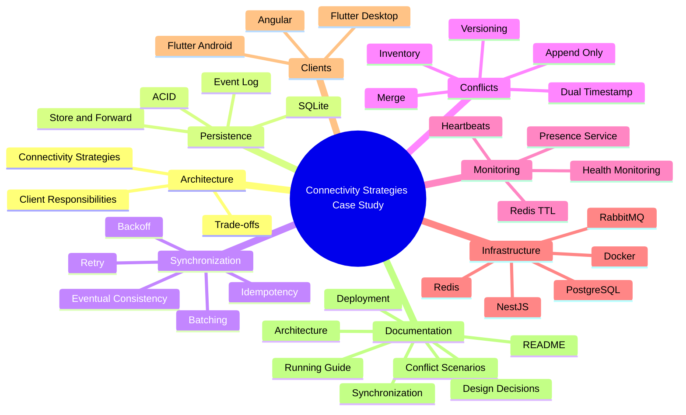

# ⚙️ Decisiones de Diseño

## Caso de Estudio 2: Estrategias de Conectividad en Sistemas Distribuidos

---

# Propósito de este Documento

Diseñar una arquitectura distribuida implica tomar decisiones que afectan directamente la disponibilidad, la consistencia, la complejidad operativa y la experiencia de los usuarios.

En este caso de estudio no se buscó construir únicamente una aplicación funcional, sino analizar cómo distintas estrategias arquitectónicas responden a restricciones reales del negocio.

Cada decisión presentada en este documento parte de una pregunta concreta, evalúa distintas alternativas y justifica la solución finalmente adoptada junto con sus compromisos (*trade-offs*).

El objetivo no es demostrar que existe una única solución correcta, sino explicar por qué determinadas decisiones resultan más apropiadas para este escenario.

---

# Roadmap del Caso de Estudio

El siguiente mapa resume los principales bloques arquitectónicos desarrollados a lo largo del proyecto.

Cada uno representa un conjunto de decisiones que, en conjunto, permiten construir una plataforma distribuida resiliente frente a pérdidas de conectividad.

Cada uno de estos bloques será desarrollado en las siguientes secciones, explicando las decisiones que permitieron construir una arquitectura capaz de operar incluso cuando parte de la infraestructura deja de estar disponible.

---

# Antes de Diseñar la Arquitectura

Antes de seleccionar tecnologías, patrones o componentes, fue necesario responder una serie de preguntas sobre el dominio del problema.

Estas preguntas guiaron todas las decisiones descritas posteriormente.

## ¿Puede el negocio dejar de operar cuando falla Internet?

No.

El proceso de venta constituye la actividad principal del negocio y no puede depender completamente de la disponibilidad de la red.

Esta restricción conduce a la necesidad de incorporar mecanismos que permitan continuar operando sin conexión.

---

## ¿Todas las aplicaciones requieren el mismo nivel de autonomía?

No.

Cada aplicación cumple una responsabilidad diferente.

Mientras el Punto de Venta debe continuar funcionando durante cortes prolongados de conectividad, el panel administrativo necesita trabajar sobre información centralizada y actualizada.

Esto descarta la idea de utilizar una única estrategia de conectividad para todos los clientes.

---

## ¿Toda la información necesita sincronizarse inmediatamente?

No.

Existen operaciones que pueden diferirse algunos segundos o minutos sin afectar al negocio.

Otras, en cambio, requieren consistencia inmediata.

La arquitectura debe ser capaz de distinguir ambos escenarios.

---

## ¿Qué es más importante: disponibilidad o consistencia?

La respuesta depende del proceso de negocio.

En el Punto de Venta se prioriza la disponibilidad para garantizar la continuidad de las ventas.

En la Administración se prioriza la consistencia para asegurar que las decisiones se tomen sobre información consolidada.

La arquitectura no intenta maximizar una única propiedad, sino equilibrarlas según las necesidades de cada cliente.

---

## ¿Dónde debe ubicarse la complejidad?

Una decisión importante consistió en evitar distribuir complejidad innecesariamente.

No todos los clientes requieren sincronización, resolución de conflictos o persistencia local.

Cada componente incorpora únicamente las capacidades que necesita para cumplir su responsabilidad.

Este principio reduce el mantenimiento del sistema y evita resolver problemas que, en la práctica, nunca llegarían a producirse.

---

# Una Estrategia Única No Es Suficiente

Con frecuencia se asume que todas las aplicaciones de un sistema distribuido deben compartir el mismo modelo de conectividad.

Sin embargo, esta aproximación obliga a todos los clientes a aceptar las mismas limitaciones, incluso cuando sus responsabilidades son completamente distintas.

Por ejemplo:

- Un panel administrativo no necesita operar durante varios días sin conexión.
- Un Punto de Venta no puede detener las ventas por una pérdida de Internet.
- Una aplicación logística únicamente necesita tolerar interrupciones temporales de señal.

Cada cliente presenta necesidades diferentes.

En consecuencia, también requiere una estrategia de conectividad diferente.

Este razonamiento constituye el punto de partida del resto de las decisiones descritas en este documento.