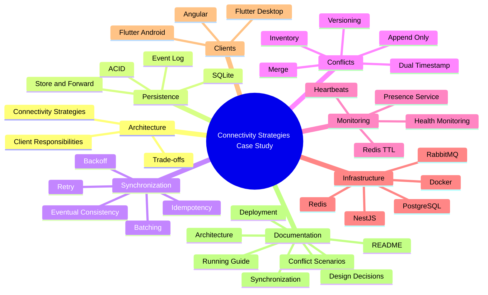

# ⚙️ Design Decisions

## Case Study 2: Connectivity Strategies in Distributed Systems

---

# Purpose of This Document

Designing a distributed architecture involves making decisions that directly affect availability, consistency, operational complexity, and user experience.

In this case study, the goal was not merely to build a functional application, but to analyze how different architectural strategies answer real business constraints.

Every decision presented in this document stems from a concrete engineering question, evaluates multiple alternatives, and justifies the final choice along with its trade-offs.

The objective is not to prove that a single correct solution exists, but to explain why specific decisions are most appropriate for this scenario.

---

# Case Study Roadmap

The following map summarizes the main architectural blocks developed throughout the project.

Each block represents a set of decisions that collectively build a resilient distributed platform capable of handling connectivity loss.



Each of these blocks is developed in subsequent sections, explaining the decisions that enabled an architecture capable of operating even when parts of the infrastructure become unavailable.

---

# Before Designing the Architecture

Before selecting technologies, patterns, or components, it was necessary to answer a series of domain-specific questions.

These questions guided all decisions described below.

## Can the business stop operating when Internet fails?

No.

The sales process constitutes the core business activity and cannot depend entirely on network availability.

This constraint drives the necessity for mechanisms that allow continuous offline operation.

---

## Do all applications require the same degree of autonomy?

No.

Each application serves a distinct responsibility.

While Point of Sale must continue operating during extended network outages, the administrative panel requires working with centralized, up-to-date data.

This eliminates the idea of enforcing a single connectivity strategy across all clients.

---

## Does all information need immediate synchronization?

No.

Certain operations can be deferred by seconds or minutes without impacting the business.

Others require immediate consistency.

The architecture must differentiate both scenarios.

---

## Which is more important: availability or consistency?

The answer depends on the specific business process.

In Point of Sale, availability is prioritized to ensure sales continuity.

In Administration, consistency is prioritized to ensure decisions are based on consolidated data.

The architecture does not attempt to maximize a single property universally, but balances them per client requirement.

---

## Where should complexity reside?

An important decision was avoiding unnecessary distribution of complexity.

Not all clients require synchronization, conflict resolution, or local persistence.

Each component incorporates only the capabilities needed to fulfill its responsibility.

This principle reduces system maintenance and avoids solving problems that, in practice, would never occur.

---

# A Single Strategy Is Not Enough

It is frequently assumed that all applications in a distributed system should share the same connectivity model.

However, this approach forces all clients to accept the same limitations, even when their responsibilities are completely distinct.

For example:

- An administrative panel does not need to operate for days offline.
- A Point of Sale cannot halt sales due to lost Internet connectivity.
- A logistics app only needs to tolerate temporary signal disruptions.

Each client presents different requirements.

Consequently, each requires a different connectivity strategy.

This reasoning forms the foundation of all subsequent decisions.

---

# Selection of Connectivity Strategies

Once business constraints were identified, the next decision was determining how applications should communicate with the server.

The simplest solution would have been applying a single connectivity strategy across the platform. However, that approach would have forced all clients into identical constraints regardless of their responsibilities.

Instead, the architecture adopts a client-specific strategy.

---

## Do all applications need identical behavior?

No.

Although sharing the same ecosystem, their responsibilities differ completely.

Point of Sale, administrative panel, and logistics application operate under different conditions and address distinct business needs.

The architecture recognizes these differences and tailors the connectivity strategy to each client.

---

## Alternative A: All Online-First

All operations depend on immediate server communication.

```text
Client
  │
  ▼
Server
  │
  ▼
Response
  │
  ▼
Operation
```

### Advantages

- Always up-to-date data.
- Simpler architecture.
- No sync mechanisms.
- Reduced client complexity.

### Limitations

- Connectivity loss halts operations.
- Availability depends entirely on infrastructure.
- Network latency directly impacts user experience.

For an administrative panel, this is acceptable. For Point of Sale, it is not.

---

## Alternative B: All Offline-First

Convert all applications into Offline-First clients.

```text
Client
  │
  ▼
Local Persistence
  │
  ▼
Event Queue
  │
  ▼
Synchronization
  │
  ▼
Server
```

### Advantages

- High availability.
- Network fault autonomy.
- Reduced server dependency.

### Limitations

- High development complexity.
- Conflict resolution.
- Local persistence management.
- Versioning & reconciliation overhead.

Many applications would never utilize these capabilities, making implementation cost unnecessary.

---

# Adopted Decision

The architecture adopts a hybrid strategy.

| Client | Strategy |
|----------|------------|
| Administration | Strict Online-First |
| Point of Sale | Offline-First |
| Logistics | Permissive Online-First |

Instead of seeking a one-size-fits-all solution, each application is optimized independently.

---

# Why is Point of Sale Offline-First?

POS priority is guaranteeing sales continuity.

An Internet disruption must not prevent a store branch from operating.

Thus, POS registers sales locally and defers server synchronization.

```text
Sale -> SQLite -> Event Log -> Synchronization -> Server
```

The server is removed from the critical customer checkout path.

---

# Why is Administration Online-First?

The admin panel manages global system state (users, roles, fiscal parameters, consolidated inventory, reports).

Operating on outdated data could lead to incorrect business decisions.

Therefore, the admin app always queries and modifies data directly on the server. Central authority is maintained.

---

# Why does Logistics use a hybrid model?

A delivery driver may pass through areas without cellular coverage for minutes.

However, full synchronization engines like POS are unnecessary.

The architecture adopts a **Permissive Online-First** model.

```text
Try Server -> Available?
  - Yes: Process
  - No:  Temporarily Save locally -> Retry
```

Provides fault tolerance against brief outages without full Offline-First complexity.

---

# Strategy Comparison Matrix

| Feature | Administration | Point of Sale | Logistics |
|----------------|----------------|----------------|------------|
| Strategy | Online-First | Offline-First | Permissive Online-First |
| Local Persistence | No | SQLite | Cache + Queue |
| Offline Write | No | Yes | Limited |
| Offline Read | No | Yes | Partial |
| Synchronization | No | Full | Partial |
| Conflict Resolution | No | Yes | Limited |
| Complexity | Low | High | Medium |

---

# Strategy Trade-offs

| Decision | Benefit | Cost |
|----------|-----------|--------|
| Online-First | Immediate consistency | Permanent network dependency |
| Offline-First | Maximum availability | Sync & conflict resolution |
| Permissive Online-First | Simplicity / availability balance | Temporary persistence & retries |

---

# Selection of Local Persistence Engine

For the Offline-First Point of Sale, where should operations be stored while offline?

POS local storage is not a simple cache; it is a critical architecture component.

## Domain Requirements

- Reliably record sales.
- Maintain relationships (receipts, products, taxes, payments).
- Guarantee ACID integrity during power loss or unexpected app termination.
- Efficient daily operation queries.
- Clean integration with Flutter Desktop.

## Alternative A: Local NoSQL (Isar, Hive)
- High performance, object model.
- However, complex multi-entity sales relations (sale -> items -> payments -> taxes) push relational consistency handling into application code.

## Alternative B: SQLite (Selected)
- ACID transactions.
- Foreign key referential integrity.
- SQL querying & single-file database.
- Perfect match for relational sales models.

| Decision | Benefit | Cost |
|----------|-----------|--------|
| SQLite | Integrity, relations, ACID transactions | Structured relational schema |
| Isar / Hive | High performance & simplicity | Application-side consistency burden |

---

# Synchronization Mechanism Design

## When should data be sent to the server?

The architecture implements **Automatic Background Synchronization**.

Operations write to local SQLite first. A background process periodically checks connectivity and syncs pending events using an **Event Log**.

- Non-blocking for user checkout.
- Retries failed events gracefully.
- Transparent background operation.

---

# Connectivity Monitoring (Heartbeats & Presence)

How does the server know a client is still connected?

Open connections do not guarantee operational health (app crashes, power cuts, silent drops).

The architecture uses **Heartbeats** sent periodically over WebSockets to a dedicated Presence Service.

Heartbeat state is kept in **Redis with TTL** (`client:heartbeat:{clientId}`).

If heartbeats stop, TTL expires automatically in Redis, triggering a `ClientDisconnected` event published to RabbitMQ and delivered to the Angular Admin panel via WebSockets.

| Decision | Benefit | Cost |
|----------|-----------|--------|
| Rely on Connection | Simple implementation | Misses silent disconnections |
| Heartbeats + Redis TTL | Reliable, real-time presence status | Minor traffic overhead |

---

# Business Decisions & Architectural Trade-offs

## Should POS allow offline sales?
Yes. Halting sales during outages causes direct financial loss. Availability is prioritized over immediate central consistency.

## Who holds data authority?
The central server remains final authority. Clients store operational copies; upon reconnection, server reconciles and consolidates data.

## What is stored locally?
Only operational data needed for branch continuity (products, local stock, active prices, pending sync queue). Global reports and user administration stay central.

---

# Architectural Decision Summary

| Decision | Alternatives | Adopted Choice | Justification |
|----------|------------------------|-------------------|---------------|
| Connectivity Strategy | All Online, All Offline, Hybrid | Client-Specific | Different client responsibilities require tailored strategies. |
| Point of Sale | Online vs Offline | Offline-First | Sales continuity overrides immediate central consistency. |
| Admin Panel | Online vs Offline | Online-First | Requires consolidated real-time data for decisions. |
| Logistics App | Online vs Offline | Permissive Online-First | Tolerates brief outages without full offline engine complexity. |
| Local Persistence | Hive/Isar vs SQLite | SQLite | ACID transactions and relational integrity for sales. |
| Synchronization | Immediate, Manual, Automatic | Automatic Background | Non-blocking user experience with automatic retries. |
| Operation Log | Business table polling vs Event Log | Event Log | Decouples business domain from sync mechanism. |
| Connection Status | Open socket vs Heartbeats | Heartbeats + Redis TTL | Accurately detects silent disconnects. |
| Data Authority | Client vs Server | Server | Ensures single consolidated source of truth post-reconciliation. |

---

# Conclusion

Designing a distributed architecture is far more than selecting tools.

Each choice represents a balance between simplicity, availability, consistency, and operational complexity.

This case study demonstrates how a hybrid architecture responds flexibly to diverse connectivity conditions while safeguarding business continuity.
