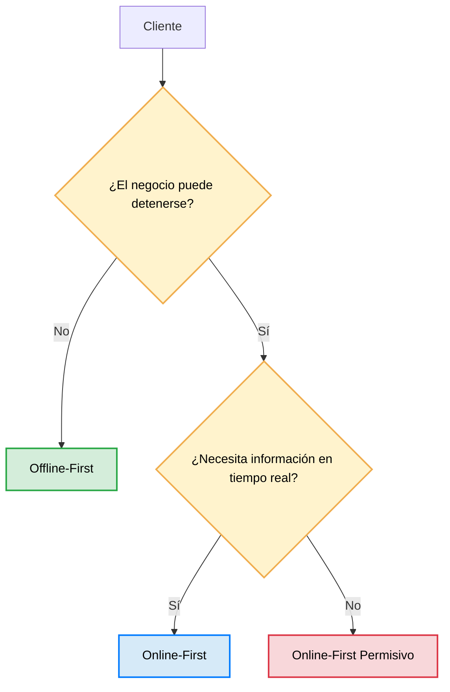
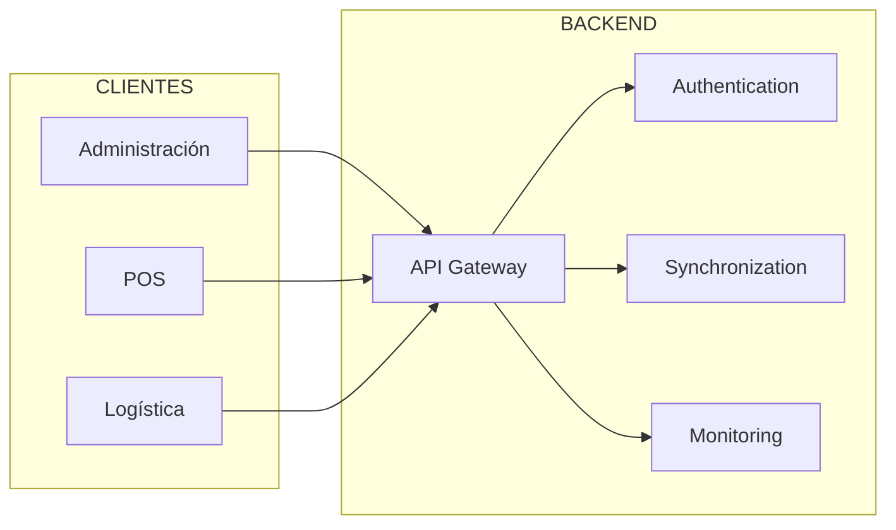

# 🏛️ Caso de Estudio 2: Estrategias de Conectividad en Sistemas Distribuidos

### Cómo seleccionar entre Offline-First y Online-First según las reglas del negocio

---

# Introducción

Cuando se diseña un sistema distribuido, la conectividad suele asumirse como un recurso permanente.

Sin embargo, muchos entornos reales no funcionan bajo esa premisa. Una conexión inestable, una red saturada o incluso una pérdida completa de comunicación forman parte del comportamiento normal del sistema.

En ese contexto surge una pregunta de ingeniería que condiciona toda la arquitectura:

> **¿Cómo debe comportarse una aplicación cuando la conectividad deja de estar garantizada?**

Responder esta pregunta implica mucho más que decidir si una aplicación será *Offline-First* o *Online-First*. Significa comprender primero qué espera el negocio de cada cliente, cuáles son sus restricciones operativas y qué consecuencias tendría detener su funcionamiento.

Este caso de estudio documenta el proceso de análisis utilizado para seleccionar distintas estrategias de conectividad dentro de una misma plataforma, demostrando que una única solución rara vez satisface las necesidades de todos los usuarios.

La arquitectura presentada no parte de una tecnología específica.

Parte de una pregunta de ingeniería.

---

# Alcance

Este caso de estudio no pretende demostrar que exista una estrategia universal para construir sistemas distribuidos.

Tampoco busca implementar un framework de sincronización reutilizable o comparar tecnologías desde el punto de vista del rendimiento.

Su objetivo es documentar el razonamiento arquitectónico que permitió seleccionar distintas estrategias de conectividad según las restricciones del negocio, analizar las alternativas consideradas y justificar las decisiones adoptadas.

Las tecnologías utilizadas representan únicamente una posible implementación de dichas decisiones.

---

# Problema de Negocio

La plataforma está compuesta por tres aplicaciones que colaboran sobre el mismo ecosistema de servicios.

Aunque todas consumen la misma infraestructura, sus responsabilidades son completamente diferentes.

Diseñar una única estrategia de conectividad para todos los clientes implicaría introducir complejidad innecesaria en algunos casos o limitar capacidades críticas en otros.

Comprender estas diferencias fue el punto de partida del proceso de diseño.

---

## Administración

El sistema administrativo concentra la visión global de la operación.

Sus principales responsabilidades incluyen:

- Administración de usuarios.
- Gestión de permisos.
- Monitoreo operacional.
- Visualización de indicadores.
- Supervisión del estado de los clientes.
- Consulta de información consolidada.

La información presentada debe mantenerse actualizada para reflejar el estado real de la plataforma.

Por esta razón, la disponibilidad de información en tiempo real representa una necesidad operativa.

---

## Punto de Venta (POS)

El Punto de Venta posee la restricción más importante del sistema.

> **El negocio no puede dejar de vender debido a una pérdida de conectividad.**

Cada venta representa una operación crítica.

La indisponibilidad temporal del servidor no debe impedir registrar nuevas transacciones.

Esto implica que el cliente debe ser capaz de operar de forma autónoma durante períodos prolongados, almacenando operaciones localmente hasta recuperar la comunicación con la plataforma.

La continuidad operativa tiene mayor prioridad que la sincronización inmediata.

---

## Aplicación de Logística

La aplicación utilizada por el personal de logística presenta un escenario diferente.

Los usuarios necesitan:

- Consultar información operativa.
- Registrar entregas.
- Actualizar estados.
- Reportar movimientos.

Aunque la pérdida temporal de conectividad puede ocurrir durante la operación diaria, detener momentáneamente estas actividades no representa el mismo impacto que detener un Punto de Venta.

Sin embargo, la pérdida de información sí resulta inaceptable.

La estrategia de conectividad debía contemplar esta diferencia.

---

# Restricciones del Sistema

Antes de evaluar cualquier tecnología fue necesario identificar las restricciones impuestas por el negocio.

Estas restricciones delimitan el conjunto de soluciones posibles y condicionan todas las decisiones posteriores.

- El Punto de Venta debe continuar operando incluso sin conexión.
- La administración necesita información prácticamente en tiempo real.
- La aplicación logística debe tolerar interrupciones temporales sin comprometer la integridad de los datos.
- Todos los clientes comparten el mismo backend, aunque no comparten las mismas necesidades operativas.
- La sincronización no debe producir operaciones duplicadas.
- El servidor debe conservar la autoridad sobre la información crítica.
- La autenticación debe seguir siendo segura incluso cuando un cliente permanezca desconectado durante largos períodos.
- El sistema debe detectar automáticamente clientes desconectados.

Estas restricciones explican por qué una única estrategia de conectividad no resulta adecuada para toda la plataforma.

---

# Objetivos Arquitectónicos

A partir de estas restricciones se definieron los objetivos que debía cumplir la solución.

- Garantizar la continuidad operativa.
- Minimizar la pérdida de información.
- Mantener la consistencia del sistema.
- Reducir la complejidad cuando no aporta valor.
- Adaptar la estrategia de conectividad según las necesidades de cada cliente.
- Reutilizar la infraestructura de autenticación desarrollada en el Caso de Estudio 1.
- Mantener una arquitectura extensible para futuros clientes.

Estos objetivos servirán posteriormente como criterio para evaluar las distintas alternativas de diseño.

---

# Preguntas que Guiaron este Caso de Estudio

Antes de escribir una sola línea de código surgieron varias preguntas de ingeniería.

Responderlas permitió descartar alternativas y comprender mejor las restricciones del problema.

## Conectividad

- ¿Todos los clientes necesitan la misma estrategia de conectividad?
- ¿Qué operaciones pueden detenerse cuando se pierde la conexión y cuáles deben continuar funcionando?
- ¿Cómo cambia el comportamiento esperado del sistema después de minutos, horas o incluso días sin conectividad?

## Persistencia

- ¿Qué información debe considerarse fuente de verdad en el cliente?
- ¿Qué información debe permanecer exclusivamente en el servidor?
- ¿Cuándo una caché local resulta suficiente?
- ¿Cuándo es necesario un motor completo de sincronización?

## Sincronización

- ¿Cómo garantizar que una operación sincronizada varias veces produzca un único efecto?
- ¿Cómo reconciliar estados distintos entre cliente y servidor?
- ¿Cómo resolver conflictos generados por múltiples clientes?

## Observabilidad

- ¿Cómo detectar clientes desconectados?
- ¿Cómo conocer el estado de miles de clientes sin mantener conexiones permanentes?
- ¿Cómo informar cambios de estado al administrador en tiempo real?

## Seguridad

- ¿Cómo se comporta la autenticación durante largos períodos offline?
- ¿Qué responsabilidades deben permanecer exclusivamente del lado del servidor?
- ¿Cómo administrar sesiones, credenciales temporales y cambios obligatorios de contraseña cuando la conectividad deja de estar garantizada?

---

A partir de estas preguntas fue posible comenzar a evaluar distintas alternativas arquitectónicas.
# Alternativas Evaluadas

Antes de definir la arquitectura final se analizaron distintas estrategias de conectividad.

El objetivo no consistía en identificar cuál era técnicamente superior, sino cuál respondía mejor a las restricciones del negocio.

Cada alternativa resolvía correctamente algunos escenarios, pero también introducía limitaciones importantes en otros.

---

## Alternativa 1 — Todo Online-First

La primera posibilidad consistía en mantener todos los clientes conectados permanentemente al servidor.

Cada operación dependería de la disponibilidad de la infraestructura central.

```text
Cliente
    │
    ▼
Servidor
    │
Respuesta
```

### Ventajas

- Arquitectura relativamente sencilla.
- Fuente única de verdad.
- Sin mecanismos complejos de sincronización.
- Menor mantenimiento del cliente.

### Desventajas

- El Punto de Venta deja de operar cuando pierde conectividad.
- Mayor dependencia de la infraestructura.
- Mala experiencia de usuario en redes inestables.
- El negocio queda condicionado por la disponibilidad del servidor.

Esta alternativa resultó adecuada para algunos clientes, pero incompatible con las necesidades operativas del POS.

---

## Alternativa 2 — Todo Offline-First

La segunda alternativa consistía en permitir que todos los clientes funcionaran completamente desconectados.

Cada aplicación mantendría almacenamiento local y sincronizaría posteriormente con el servidor.

```text
Cliente

SQLite / Isar

↓

Motor de Sincronización

↓

Servidor
```

### Ventajas

- Máxima disponibilidad.
- Independencia de la conectividad.
- Excelente experiencia de usuario.
- Continuidad operativa.

### Desventajas

- Mayor complejidad de implementación.
- Sincronización de estados.
- Resolución de conflictos.
- Gestión de consistencia eventual.
- Mayor coste de mantenimiento.

Aunque esta alternativa resolvía completamente el problema del POS, incorporaba una complejidad innecesaria para clientes que nunca necesitaban operar desconectados.

---

## Alternativa 3 — Estrategia Específica por Cliente

La tercera alternativa consistía en abandonar la idea de utilizar una única estrategia para toda la plataforma.

En su lugar, cada cliente adoptaría el modelo de conectividad más adecuado según sus restricciones operativas.

| Cliente | Estrategia |
|----------|------------|
| Administración | Online-First |
| Punto de Venta | Offline-First |
| Logística | Online-First Permisivo |

Esta alternativa permitió introducir complejidad únicamente donde generaba valor.

---

# Decisión Arquitectónica

Tras evaluar las alternativas se adoptó una arquitectura híbrida.

La decisión no surgió de una preferencia tecnológica, sino del análisis de las reglas del negocio.

En lugar de preguntarse:

> ¿Qué tecnología utilizaremos?

La arquitectura respondió primero una pregunta diferente:

> **¿Qué necesita cada cliente para cumplir correctamente su función?**

---

## Árbol de Decisión

La estrategia de conectividad se seleccionó siguiendo una secuencia de preguntas.



Este diagrama resume la lógica utilizada para seleccionar la estrategia de conectividad de cada aplicación.

La tecnología utilizada posteriormente es únicamente una consecuencia de esta decisión.

---

## Arquitectura Resultante



Aunque todos los clientes utilizan el mismo backend, cada uno mantiene una estrategia de comunicación distinta.

La arquitectura deja de estar definida por la infraestructura y comienza a estar definida por las necesidades del negocio.

---

# Tecnologías Utilizadas

Una vez definida la arquitectura fue posible seleccionar las tecnologías que implementaban cada responsabilidad.

Estas herramientas representan una implementación posible de la solución descrita en este caso de estudio.

No constituyen la única combinación válida.

---

## Clientes

| Cliente | Tecnología | Estrategia |
|----------|------------|------------|
| Administración | Angular | Online-First |
| Punto de Venta | Flutter Desktop | Offline-First |
| Logística | Flutter Android | Online-First Permisivo |

---

## Backend

| Tecnología | Responsabilidad |
|------------|-----------------|
| NestJS | API Gateway y servicios principales |
| REST | Comunicación síncrona |
| WebSockets | Actualizaciones en tiempo real |
| RabbitMQ | Procesamiento asíncrono |

---

## Persistencia

| Tecnología | Responsabilidad |
|------------|-----------------|
| PostgreSQL | Persistencia central |
| SQLite / Isar | Persistencia local del POS |
| Redis | Estados temporales, sesiones y Heartbeats |

---

## Seguridad

- JWT
- Refresh Tokens
- RBAC
- Credenciales Temporales
- Cambio Obligatorio de Contraseña
- Step Token

---

## Sincronización

- Cola local
- UUID por operación
- Idempotencia
- Reintentos automáticos
- Consistencia Eventual
- Heartbeats
- TTL en Redis

---

## Relación entre Arquitectura y Tecnología

Las tecnologías utilizadas no determinaron la arquitectura.

Ocurrió exactamente lo contrario.

Primero se identificaron las restricciones del sistema.

Posteriormente se diseñó la estrategia de conectividad.

Finalmente se seleccionaron las herramientas capaces de implementar dichas decisiones.

> **Las decisiones arquitectónicas definen las responsabilidades. Las tecnologías proporcionan los mecanismos para implementarlas.**

---

# Trade-offs de la Solución

Elegir una estrategia distinta para cada cliente también implica aceptar ciertos compromisos.

## Beneficios

- Continuidad operativa.
- Mejor experiencia de usuario.
- Complejidad localizada.
- Arquitectura adaptable.
- Mejor aprovechamiento de cada tecnología.

## Costes

- Mayor complejidad de sincronización.
- Gestión de estados distribuidos.
- Resolución de conflictos.
- Mayor esfuerzo de observabilidad.
- Mayor complejidad operacional.

Toda decisión arquitectónica implica aceptar beneficios y costes.

Comprender esos compromisos resulta más importante que conocer las tecnologías utilizadas.
# Comportamiento Operacional

Una vez definida la arquitectura y la estrategia de conectividad de cada cliente, resulta necesario comprender cómo se comporta el sistema durante la operación diaria.

Cada aplicación sigue un flujo diferente porque responde a necesidades distintas del negocio.

---

# Administración — Online-First

El cliente administrativo trabaja siempre sobre información actualizada.

Cada operación consulta directamente los servicios de la plataforma y refleja inmediatamente los cambios producidos por otros clientes.

```text
Usuario

↓

Angular

↓

REST / WebSockets

↓

NestJS

↓

PostgreSQL
```

## Características

- Información en tiempo real.
- Fuente única de verdad.
- Sin almacenamiento persistente local.
- Baja complejidad de sincronización.

---

# Punto de Venta — Offline-First

El Punto de Venta prioriza la continuidad operativa.

Las operaciones nunca dependen directamente de la disponibilidad del servidor.

Cuando existe conectividad, las operaciones se sincronizan automáticamente.

Cuando la conectividad desaparece, la aplicación continúa funcionando utilizando almacenamiento local.

```text
Venta

↓

SQLite

↓

Cola Local

↓

Motor de Sincronización

↓

API Gateway

↓

PostgreSQL
```

## Características

- Continuidad operativa.
- Persistencia local.
- Sincronización automática.
- Idempotencia.
- Consistencia eventual.

---

# Logística — Online-First Permisivo

La aplicación logística mantiene una estrategia intermedia.

Normalmente trabaja conectada al servidor.

Cuando la comunicación falla, conserva temporalmente las operaciones pendientes hasta recuperar la conectividad.

```text
Operación

↓

Caché Local

↓

Reintentos

↓

Servidor
```

## Características

- Prioriza información actualizada.
- Tolera interrupciones temporales.
- Reintentos automáticos.
- Baja complejidad respecto al POS.

---

# Estrategia de Autenticación

Este caso de estudio reutiliza la arquitectura de autenticación desarrollada en el Caso de Estudio 1.

No se pretende volver a explicar JWT, RBAC o Refresh Tokens.

El objetivo consiste en analizar cómo estos mecanismos se comportan cuando la conectividad deja de estar garantizada.

Las capacidades reutilizadas incluyen:

- JWT Authentication
- Refresh Tokens
- RBAC
- Credenciales Temporales
- Cambio Obligatorio de Contraseña
- Step Token
- Gestión de Sesiones

La principal diferencia consiste en evaluar cómo mantener una experiencia segura cuando algunos clientes pueden permanecer desconectados durante largos períodos.

---

# Conceptos de Ingeniería Explorados

Este caso de estudio explora conceptos habituales en el diseño de sistemas distribuidos.

## Arquitectura

- Offline-First
- Online-First
- Arquitecturas Híbridas
- Diseño Basado en Restricciones
- Arquitectura Guiada por Reglas de Negocio

---

## Sistemas Distribuidos

- Consistencia Eventual
- Idempotencia
- Reconciliación de Estados
- Sincronización Distribuida

---

## Disponibilidad

- Continuidad Operativa
- Recuperación ante Fallos
- Tolerancia a Particiones
- Degradación Controlada

---

## Observabilidad

- Heartbeats
- Estado de Conectividad
- Detección Automática de Clientes Offline
- Monitoreo Operacional

---

## Seguridad

- Gestión de Sesiones
- Tokens Distribuidos
- Control de Acceso
- Credenciales Temporales

---

# Lo que Demuestra este Caso de Estudio

Este proyecto no intenta demostrar que Offline-First sea superior a Online-First.

Tampoco intenta demostrar lo contrario.

Su propósito consiste en mostrar que la arquitectura de conectividad debe responder a las necesidades del negocio y no a preferencias tecnológicas.

Comprender cuándo utilizar cada estrategia resulta mucho más importante que conocer una tecnología específica.

En otras palabras,

> **La mejor estrategia de conectividad depende completamente de las restricciones que el negocio impone al sistema.**

---

# ¿Quién Puede Beneficiarse de este Caso de Estudio?

## Junior Developers

- Comprender cuándo utilizar Offline-First.
- Diferenciar Online-First de Online-First Permisivo.
- Introducirse en conceptos de sincronización.
- Relacionar tecnologías con responsabilidades arquitectónicas.

---

## Mid-Level Developers

- Analizar trade-offs.
- Diseñar clientes con distintas estrategias de conectividad.
- Comprender consistencia eventual.
- Evaluar mecanismos de sincronización.

---

## Senior Developers

- Analizar decisiones arquitectónicas.
- Evaluar restricciones del negocio.
- Comparar alternativas.
- Adaptar estrategias de conectividad según distintos escenarios.
- Identificar responsabilidades entre clientes, infraestructura y backend.

---

# Documentación

Este caso de estudio se complementa con documentación adicional que profundiza en distintos aspectos de la arquitectura y del proceso de diseño.

| Documento | Descripción |
|------------|-------------|
| **ARCHITECTURE.md** | Arquitectura general, componentes, diagramas y relaciones entre los servicios. |
| **DESIGNDECISIONS.md** | Decisiones arquitectónicas, alternativas evaluadas y análisis de trade-offs. |
| **SYNCHRONIZATION.md** | Estrategias de sincronización, consistencia eventual, colas locales e idempotencia. |
| **CONFLICT_RESOLUTION.md** | Escenarios reales de conflictos distribuidos, alternativas analizadas y decisiones adoptadas para preservar la consistencia del sistema. |
| **SECURITY.md** | Seguridad de la plataforma, gestión de tokens y autenticación offline. |
| **RUNNING.md** | Configuración y ejecución local del proyecto. |

---

# Lecciones Aprendidas

Diseñar una única estrategia de conectividad para toda una plataforma suele conducir a soluciones innecesariamente complejas o insuficientes para determinados escenarios.

La arquitectura mejora cuando cada cliente recibe únicamente la complejidad que realmente necesita.

Las decisiones arquitectónicas más efectivas no nacen de la tecnología elegida.

**Nacen de comprender el problema, identificar las restricciones, evaluar alternativas y seleccionar la solución que mejor responde a las necesidades del negocio.**

---

# Más Allá de la Implementación

La implementación presentada demuestra cómo una estrategia híbrida de conectividad puede adaptarse a diferentes necesidades operativas.

Sin embargo, implementar una arquitectura *Offline-First* representa únicamente una parte del desafío.

Los escenarios más complejos aparecen cuando el sistema comienza a operar en condiciones reales, donde la conectividad es intermitente, múltiples clientes modifican la misma información y las operaciones pueden llegar fuera de orden o repetirse.

Algunos ejemplos incluyen:

- Dos clientes modificando el mismo registro de forma simultánea.
- Operaciones duplicadas debido a reintentos.
- Sincronizaciones después de varias horas o días sin conexión.
- Tokens expirados durante largos períodos offline.
- Eventos recibidos en un orden diferente al que fueron generados.
- Sincronizaciones parciales o interrumpidas.
- Clientes con relojes desincronizados.
- Errores permanentes durante la sincronización.

Cada uno de estos escenarios requiere decisiones arquitectónicas que van mucho más allá de la implementación de un mecanismo de sincronización.

Por esta razón, este repositorio incorpora **CONFLICT_RESOLUTION.md**, un documento dedicado a analizar estos escenarios, estudiar las alternativas consideradas y justificar las decisiones adoptadas para preservar la consistencia e integridad del sistema.

El objetivo no es presentar una solución universal, sino documentar el proceso de razonamiento utilizado para enfrentar problemas habituales en sistemas distribuidos.

---

# Próximo Paso

La implementación presentada constituye una posible respuesta a este problema de ingeniería.

Sin embargo, el verdadero objetivo de este caso de estudio no es únicamente mostrar el resultado final, sino documentar el proceso de análisis que permitió llegar a él.

Si deseas profundizar en la arquitectura, las decisiones tomadas y los desafíos de la sincronización distribuida, puedes continuar con los siguientes documentos:

- 📘 **ARCHITECTURE.md**
- 📘 **DESIGNDECISIONS.md**
- 📘 **SYNCHRONIZATION.md**
- 📘 **CONFLICT_RESOLUTION.md**
- 📘 **SECURITY.md**
- 📘 **TEST.md**
- 📘 **RUNNING.md**
