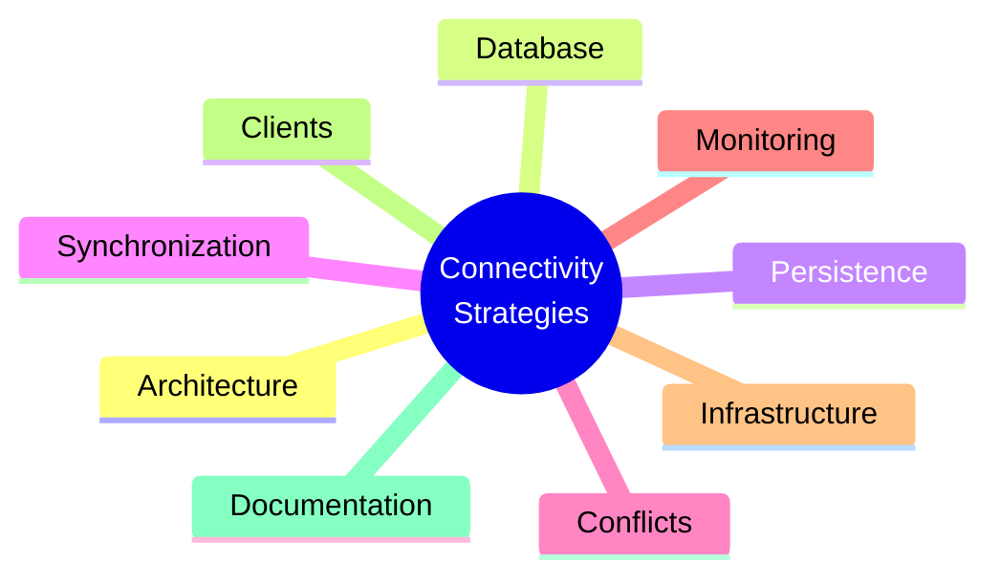
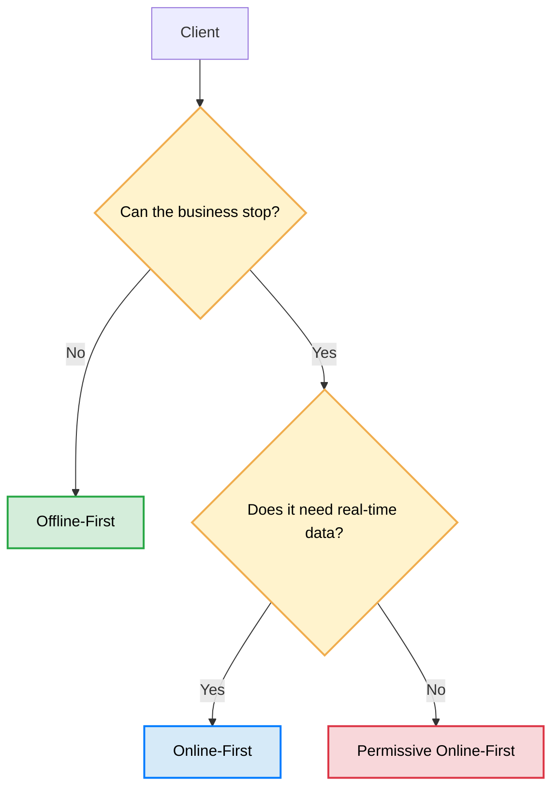
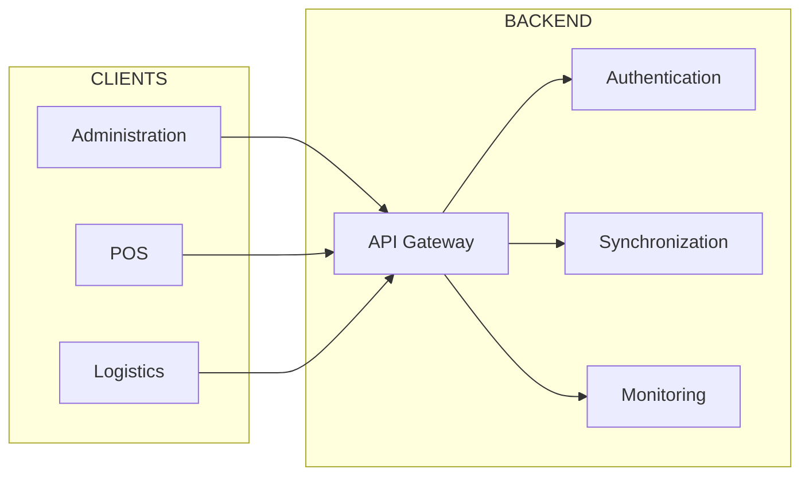

# 🏛️ Case Study 2: Connectivity Strategies in Distributed Systems

### How to Select Between Offline-First and Online-First Based on Business Rules

---

# Introduction

When designing a distributed system, network connectivity is often assumed to be a permanent resource.

However, many real-world environments do not operate under that premise. An unstable connection, a congested network, or even a complete loss of communication are part of normal system behavior.

In this context, an engineering question arises that conditions the entire architecture:

> **How should an application behave when connectivity is no longer guaranteed?**

Answering this question involves much more than deciding whether an application will be *Offline-First* or *Online-First*. It means first understanding what the business expects from each client, what its operational constraints are, and what the consequences of stopping its operation would be.

This case study documents the analysis process used to select different connectivity strategies within the same platform, demonstrating that a single solution rarely satisfies the needs of all users.

The presented architecture does not start from a specific technology.

It starts from an engineering question.

---

# 🧭 Architectural Map



---

# Scope

This case study does not claim to demonstrate that a universal strategy exists for building distributed systems.

Nor does it seek to implement a reusable synchronization framework or compare technologies from a performance perspective.

Its goal is to document the architectural reasoning that allowed selecting different connectivity strategies based on business constraints, analyzing the considered alternatives, and justifying the adopted decisions.

The technologies used represent only one possible implementation of those decisions.

---

# Business Problem

The platform consists of three applications that collaborate over the same ecosystem of services.

Although all of them consume the same infrastructure, their responsibilities are completely different.

Designing a single connectivity strategy for all clients would introduce unnecessary complexity in some cases or limit critical capabilities in others.

Understanding these differences was the starting point of the design process.

---

## Administration

The administrative system concentrates the global operational view.

Its main responsibilities include:

- User management.
- Permission management.
- Operational monitoring.
- Indicator visualization.
- Client state supervision.
- Consolidated information queries.

The information presented must remain updated to reflect the real state of the platform.

For this reason, real-time information availability represents an operational necessity.

---

## Point of Sale (POS)

The Point of Sale has the most critical constraint in the system.

> **The business cannot stop selling due to a loss of connectivity.**

Every sale represents a critical operation.

Temporary unavailability of the server must not prevent recording new transactions.

This implies that the client must be capable of operating autonomously for prolonged periods, storing operations locally until communication with the platform is recovered.

Operational continuity takes precedence over immediate synchronization.

---

## Logistics Application

The application used by logistics personnel presents a different scenario.

Users need to:

- Query operational information.
- Register deliveries.
- Update statuses.
- Report movements.

Although temporary loss of connectivity can occur during daily operations, momentarily stopping these activities does not have the same impact as stopping a Point of Sale.

However, loss of information is unacceptable.

The connectivity strategy had to account for this difference.

---

# System Constraints

Before evaluating any technology, it was necessary to identify the constraints imposed by the business.

These constraints delimit the set of possible solutions and condition all subsequent decisions.

- The Point of Sale must continue operating even without a connection.
- Administration requires near-real-time information.
- The logistics application must tolerate temporary disruptions without compromising data integrity.
- All clients share the same backend, even though they do not share the same operational needs.
- Synchronization must not produce duplicate operations.
- The server must retain authority over critical information.
- Authentication must remain secure even when a client remains offline for extended periods.
- The system must automatically detect disconnected clients.

These constraints explain why a single connectivity strategy is not suitable for the entire platform.

---

# Architectural Objectives

Based on these constraints, the objectives that the solution had to meet were defined.

- Guarantee operational continuity.
- Minimize data loss.
- Maintain system consistency.
- Reduce complexity where it adds no value.
- Adapt the connectivity strategy according to the needs of each client.
- Reuse the authentication infrastructure developed in Case Study 1.
- Maintain an extensible architecture for future clients.

These objectives later served as criteria to evaluate design alternatives.

---

# Questions That Guided This Case Study

Before writing a single line of code, several engineering questions arose.

Answering them allowed discarding alternatives and better understanding the problem constraints.

## Connectivity

- Do all clients need the same connectivity strategy?
- Which operations can stop when connection is lost, and which must continue functioning?
- How does expected system behavior change after minutes, hours, or even days without connectivity?

## Persistence

- What information should be considered the source of truth in the client?
- What information should reside exclusively on the server?
- When is a local cache sufficient?
- When is a full synchronization engine necessary?

## Synchronization

- How can we guarantee that an operation synchronized multiple times produces a single effect?
- How can we reconcile differing states between client and server?
- How can we resolve conflicts generated by multiple clients?

## Observability

- How can we detect disconnected clients?
- How can we monitor the state of thousands of clients without maintaining permanent connections?
- How can we inform the administrator of state changes in real time?

## Security

- How does authentication behave during extended offline periods?
- Which responsibilities must remain exclusively server-side?
- How can sessions, temporary credentials, and mandatory password changes be managed when connectivity is no longer guaranteed?

---

Starting from these questions, it was possible to begin evaluating different architectural alternatives.

# Evaluated Alternatives

Before defining the final architecture, different connectivity strategies were analyzed.

The goal was not to identify which was technically superior, but which better answered business constraints.

Each alternative correctly resolved some scenarios, but also introduced significant limitations in others.

---

## Alternative 1 — All Online-First

The first possibility was to keep all clients permanently connected to the server.

Every operation would depend on central infrastructure availability.

```text
Client
  │
  ▼
Server
  │
Response
```

### Advantages

- Relatively simple architecture.
- Single source of truth.
- No complex synchronization mechanisms.
- Lower client maintenance.

### Disadvantages

- The Point of Sale stops operating when connectivity is lost.
- Higher dependency on infrastructure.
- Poor user experience on unstable networks.
- Business operations are constrained by server availability.

This alternative proved suitable for some clients, but incompatible with POS operational needs.

---

## Alternative 2 — All Offline-First

The second alternative was to allow all clients to function completely disconnected.

Each application would maintain local storage and synchronize later with the server.

```text
Client

SQLite / Isar

↓

Sync Engine

↓

Server
```

### Advantages

- Maximum availability.
- Connectivity independence.
- Excellent user experience.
- Operational continuity.

### Disadvantages

- Higher implementation complexity.
- State synchronization.
- Conflict resolution.
- Eventual consistency management.
- Higher maintenance cost.

Although this alternative completely solved the POS problem, it introduced unnecessary complexity for clients that never needed offline operations.

---

## Alternative 3 — Client-Specific Strategy

The third alternative was to abandon the idea of using a single strategy across the platform.

Instead, each client would adopt the connectivity model best suited to its operational constraints.

| Client | Strategy |
|----------|------------|
| Administration | Online-First |
| Point of Sale | Offline-First |
| Logistics | Permissive Online-First |

This alternative allowed introducing complexity only where it generated value.

---

# Architectural Decision

After evaluating alternatives, a hybrid architecture was adopted.

The decision did not stem from technological preference, but from analyzing business rules.

Instead of asking:

> Which technology will we use?

The architecture answered a different question first:

> **What does each client need to properly perform its function?**

---

## Decision Tree

The connectivity strategy was selected following a sequence of questions.



This diagram summarizes the logic used to select each application's connectivity strategy.

The technology used subsequently is merely a consequence of this decision.

---

## Resulting Architecture



Although all clients use the same backend, each maintains a distinct communication strategy.

Architecture ceases to be defined by infrastructure and begins to be defined by business needs.

---

# Technologies Used

Once the architecture was defined, it was possible to select technologies that implemented each responsibility.

These tools represent one possible implementation of the solution described in this case study.

They do not constitute the only valid combination.

---

## Clients

| Client | Technology | Strategy |
|----------|------------|------------|
| Administration | Angular | Online-First |
| Point of Sale | Flutter Desktop | Offline-First |
| Logistics | Flutter Android | Permissive Online-First |

---

## Backend

| Technology | Responsibility |
|------------|-----------------|
| NestJS | API Gateway and core services |
| REST | Synchronous communication |
| WebSockets | Real-time updates |
| RabbitMQ | Asynchronous processing |

---

## Persistence

| Technology | Responsibility |
|------------|-----------------|
| PostgreSQL | Central persistence |
| SQLite / Isar | Local POS persistence |
| Redis | Temporary states, sessions, and Heartbeats |

---

## Security

- JWT
- Refresh Tokens
- RBAC
- Temporary Credentials
- Mandatory Password Change
- Step Token

---

## Synchronization

- Local queue
- UUID per operation
- Idempotency
- Automatic retries
- Eventual Consistency
- Heartbeats
- Redis TTL

---

## Relationship Between Architecture and Technology

The technologies used did not dictate the architecture.

The exact opposite occurred.

First, system constraints were identified.

Next, the connectivity strategy was designed.

Finally, tools capable of implementing those decisions were selected.

> **Architectural decisions define responsibilities. Technologies provide mechanisms to implement them.**

---

# Solution Trade-offs

Choosing a different strategy for each client also implies accepting certain trade-offs.

## Benefits

- Operational continuity.
- Better user experience.
- Localized complexity.
- Adaptable architecture.
- Better leverage of each technology.

## Costs

- Higher synchronization complexity.
- Distributed state management.
- Conflict resolution.
- Greater observability effort.
- Higher operational complexity.

Every architectural decision implies accepting benefits and costs.

Understanding those trade-offs is far more important than knowing the technologies used.

---

# Operational Behavior

Once architecture and each client's connectivity strategy are defined, it is necessary to understand how the system behaves during daily operations.

Each application follows a different flow because it responds to distinct business needs.

---

# Administration — Online-First

The administrative client always works with up-to-date information.

Every operation directly queries platform services and immediately reflects changes produced by other clients.

```text
User

↓

Angular

↓

REST / WebSockets

↓

NestJS

↓

PostgreSQL
```

## Characteristics

- Real-time information.
- Single source of truth.
- No local persistent storage.
- Low synchronization complexity.

---

# Point of Sale — Offline-First

The Point of Sale prioritizes operational continuity.

Operations never directly depend on server availability.

When connectivity exists, operations synchronize automatically.

When connectivity vanishes, the application continues functioning using local storage.

```text
Sale

↓

SQLite

↓

Local Queue

↓

Sync Engine

↓

API Gateway

↓

PostgreSQL
```

## Characteristics

- Operational continuity.
- Local persistence.
- Automatic synchronization.
- Idempotency.
- Eventual consistency.

---

# Logistics — Permissive Online-First

The logistics application maintains an intermediate strategy.

Normally, it works connected to the server.

When communication fails, it temporarily retains pending operations until connectivity is recovered.

```text
Operation

↓

Local Cache

↓

Retries

↓

Server
```

## Characteristics

- Prioritizes updated information.
- Tolerates temporary disruptions.
- Automatic retries.
- Lower complexity relative to POS.

---

# Authentication Strategy

This case study reuses the authentication architecture developed in Case Study 1.

It does not intend to re-explain JWT, RBAC, or Refresh Tokens.

The objective is to analyze how these mechanisms behave when connectivity is no longer guaranteed.

Reused capabilities include:

- JWT Authentication
- Refresh Tokens
- RBAC
- Temporary Credentials
- Mandatory Password Change
- Step Token
- Session Management

The main difference is evaluating how to maintain a secure experience when some clients remain offline for extended periods.

---

# Engineering Concepts Explored

This case study explores common concepts in distributed systems design.

## Architecture

- Offline-First
- Online-First
- Hybrid Architectures
- Constraint-Based Design
- Business-Rule-Driven Architecture

---

## Distributed Systems

- Eventual Consistency
- Idempotency
- State Reconciliation
- Distributed Synchronization

---

## Availability

- Operational Continuity
- Failure Recovery
- Partition Tolerance
- Graceful Degradation

---

## Observability

- Heartbeats
- Connectivity State
- Automatic Offline Client Detection
- Operational Monitoring

---

## Security

- Session Management
- Distributed Tokens
- Access Control
- Temporary Credentials

---

# What This Case Study Demonstrates

This project does not try to prove that Offline-First is superior to Online-First.

Nor does it try to prove the opposite.

Its purpose is to show that connectivity architecture must respond to business needs, not technological preferences.

Understanding when to use each strategy is far more important than knowing a specific technology.

In other words,

> **The best connectivity strategy depends entirely on the constraints that the business imposes on the system.**

---

# Who Can Benefit from This Case Study?

## Junior Developers

- Understand when to use Offline-First.
- Differentiate Online-First from Permissive Online-First.
- Get introduced to synchronization concepts.
- Relate technologies to architectural responsibilities.

---

## Mid-Level Developers

- Analyze trade-offs.
- Design clients with different connectivity strategies.
- Understand eventual consistency.
- Evaluate synchronization mechanisms.

---

## Senior Developers

- Analyze architectural decisions.
- Evaluate business constraints.
- Compare alternatives.
- Adapt connectivity strategies to different scenarios.
- Identify responsibilities between clients, infrastructure, and backend.

---

# Documentation

This case study is complemented by additional documentation that delves deeper into different aspects of architecture and design process.

| Document | Description |
|------------|-------------|
| **ARCHITECTURE.md** | Overall architecture, components, diagrams, and service relationships. |
| **DESIGNDECISIONS.md** | Architectural decisions, evaluated alternatives, and trade-off analysis. |
| **SYNCHRONIZATION.md** | Synchronization strategies, eventual consistency, local queues, and idempotency. |
| **CONFLICT_RESOLUTION.md** | Real distributed conflict scenarios, analyzed alternatives, and decisions adopted to preserve system consistency. |
| **SECURITY.md** | Platform security, token management, and offline authentication. |
| **RUNNING.md** | Setup and local execution of the project. |

---

# Lessons Learned

Designing a single connectivity strategy for an entire platform usually leads to unnecessarily complex solutions or solutions insufficient for certain scenarios.

Architecture improves when each client receives only the complexity it genuinely needs.

The most effective architectural decisions do not stem from the chosen technology.

**They stem from understanding the problem, identifying constraints, evaluating alternatives, and selecting the solution that best answers business needs.**

---

# Beyond Implementation

The presented implementation demonstrates how a hybrid connectivity strategy can adapt to different operational needs.

However, implementing an *Offline-First* architecture represents only part of the challenge.

The most complex scenarios appear when the system operates under real conditions, where connectivity is intermittent, multiple clients modify the same information, and operations arrive out of order or repeated.

Some examples include:

- Two clients modifying the same record simultaneously.
- Duplicate operations due to retries.
- Synchronizations after several hours or days offline.
- Tokens expired during extended offline periods.
- Events received in a different order than generated.
- Partial or interrupted synchronizations.
- Clients with desynchronized clocks.
- Permanent errors during synchronization.

Each of these scenarios requires architectural decisions that go far beyond implementing a synchronization mechanism.

For this reason, this repository incorporates **CONFLICT_RESOLUTION.md**, a document dedicated to analyzing these scenarios, studying considered alternatives, and justifying decisions adopted to preserve system consistency and integrity.

The goal is not to present a universal solution, but to document the reasoning process used to face common distributed systems problems.

---

# Next Step

The presented implementation constitutes one possible answer to this engineering problem.

However, the real objective of this case study is not merely to show the final result, but to document the analytical process that made it possible to arrive at it.

- 📘 [ARCHITECTURE.md](ARCHITECTURE.md)
- 📘 [DESIGNDECISIONS.md](DESIGNDECISIONS.md)
- 📘 [DATABASE.md](DATABASE.md)
- 📘 [SYNCHRONIZATION.md](SYNCHRONIZATION.md)
- 📘 [CONFLICT_RESOLUTION.md](CONFLICT_RESOLUTION.md)
- 📘 [SECURITY.md](SECURITY.md)
- 📘 [TEST.md](TEST.md)
- 📘 [IMPLEMENTACION.md](IMPLEMENTACION.md)
- 📘 [RUNNING.md](RUNNING.md)
