# 🔐 Seguridad y Autenticación Distribuida

## Caso de Estudio 2: Estrategias de Conectividad en Sistemas Distribuidos

---

# Introducción

La arquitectura definida en este caso de estudio está compuesta por clientes con diferentes necesidades de conectividad:

- Administración — Online-First.
- Punto de Venta — Offline-First.
- Logística — Online-First Permisivo.

Estas diferencias no solamente modifican la estrategia de comunicación y persistencia. También condicionan la forma en que deben administrarse la identidad, las credenciales, las sesiones y los permisos.

La aplicación administrativa puede depender del backend para validar cada sesión y renovar sus credenciales. El Punto de Venta, en cambio, debe continuar operando durante interrupciones prolongadas de conectividad.

Esto genera una tensión arquitectónica entre dos necesidades del negocio:

- Reducir el riesgo asociado con sesiones y credenciales comprometidas.
- Evitar que la pérdida de conectividad detenga la operación comercial.

La solución adoptada combina autenticación centralizada, tokens de corta duración, sesiones revocables y un mecanismo de autenticación offline controlado para terminales previamente autorizadas.

Este documento describe las decisiones de autenticación y seguridad aplicadas dentro de la arquitectura del caso de estudio.

---
# Relación con el Caso de Estudio 1

El Caso de Estudio 1 definió una arquitectura de autenticación centralizada basada en usuarios, roles, JWT, Refresh Tokens, RBAC, Step Tokens y gestión de sesiones.

Este documento reutiliza esa arquitectura y analiza cómo debe adaptarse cuando algunos clientes pueden permanecer desconectados durante períodos prolongados.

La diferencia principal no se encuentra en los mecanismos de autenticación utilizados, sino en la forma en que dichos mecanismos se comportan cuando la conectividad deja de estar garantizada.

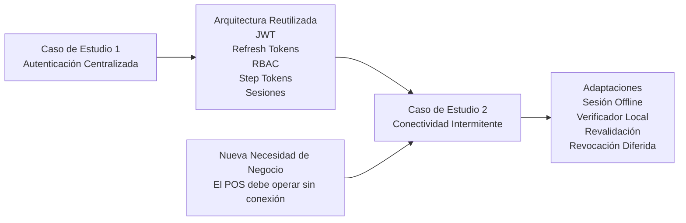

# Objetivos de Seguridad

La estrategia implementada busca:

- Centralizar la identidad de los usuarios.
- Restringir la creación de cuentas a administradores autorizados.
- Evitar que las credenciales temporales otorguen acceso permanente.
- Aplicar cambio obligatorio de contraseña durante el primer acceso.
- Emitir Access Tokens de corta duración.
- Mantener Refresh Tokens revocables.
- Permitir continuidad operativa del POS durante desconexiones.
- Evitar que el POS se convierta en una fuente independiente de identidades.
- Proteger el almacenamiento local ante acceso físico no autorizado.
- Aplicar autorización por roles y permisos.
- Mantener trazabilidad mediante eventos y registros de auditoría.
- Separar autenticación, autorización, sesiones y sincronización.

---

# Principios Arquitectónicos

La estrategia se basa en los siguientes principios:

1. **PostgreSQL es la fuente de verdad de identidad.**

   Los usuarios, roles, estados y credenciales centrales se administran exclusivamente desde el backend.

2. **El POS no crea ni administra identidades.**

   El almacenamiento local únicamente permite validar usuarios previamente autorizados por el servidor.

3. **La autenticación offline es una excepción controlada.**

   No reemplaza la autenticación central ni crea una segunda base independiente de usuarios.

4. **Los tokens tienen responsabilidades diferentes.**

   Un Access Token no cumple la misma función que un Refresh Token, un Step Token o una sesión local offline.

5. **La autorización no depende solamente de la interfaz.**

   Ocultar una opción en Angular o Flutter no sustituye la validación de permisos en el backend.

6. **La pérdida de conectividad no debe equivaler a acceso ilimitado.**

   El modo offline mantiene restricciones de tiempo, dispositivo, usuario y operación.

7. **Los datos sensibles se almacenan con el mínimo alcance posible.**

   El cliente no replica el hash central de contraseña ni conserva información que no necesita para operar.

---

# Arquitectura Técnica de Seguridad

La siguiente vista representa los componentes involucrados y los límites de confianza existentes entre clientes, gateway, servicios y almacenamiento.

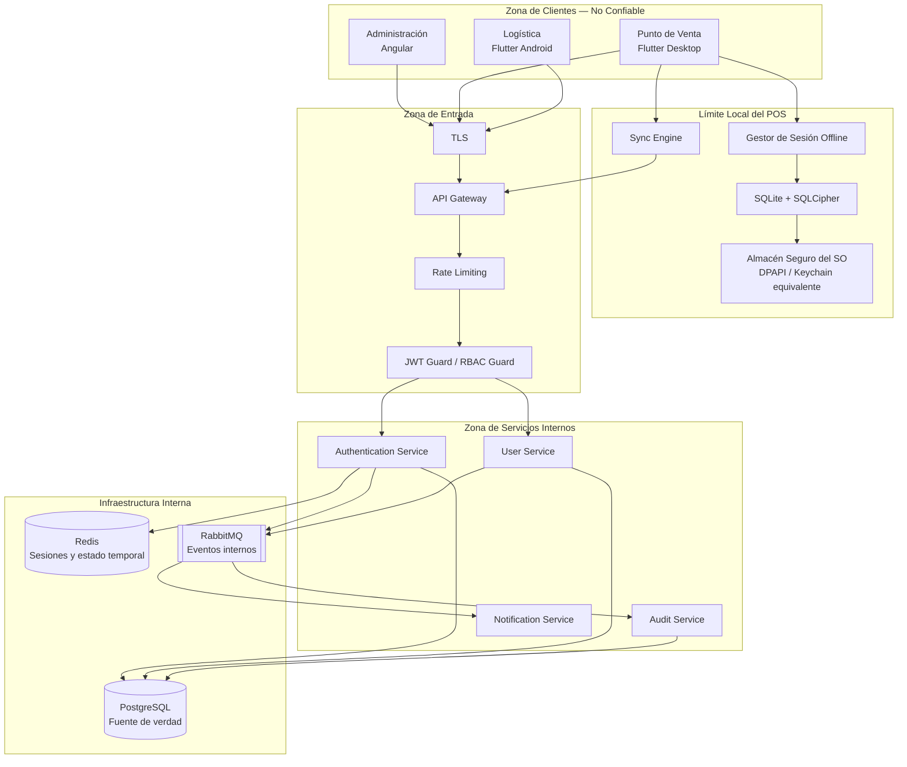

## Límites de confianza

La arquitectura reconoce varios límites de confianza:

- Los clientes no se consideran confiables.
- El API Gateway valida la identidad antes de enrutar solicitudes.
- Los microservicios no confían ciegamente en información enviada por el cliente.
- RabbitMQ se utiliza únicamente dentro de la infraestructura interna.
- SQLite pertenece a un dispositivo potencialmente expuesto a robo o manipulación.
- Redis contiene datos temporales, pero no sustituye la fuente de verdad.
- PostgreSQL mantiene el estado persistente y autoritativo.

---

# Componentes y Responsabilidades

| Componente | Responsabilidad |
|---|---|
| API Gateway | Recibir solicitudes, validar tokens, aplicar políticas básicas y enrutar operaciones. |
| Authentication Service | Validar credenciales, emitir tokens, rotar Refresh Tokens y administrar sesiones. |
| User Service | Administrar usuarios, roles, estados y reglas de incorporación. |
| PostgreSQL | Mantener usuarios, credenciales, roles, permisos, sesiones persistentes y auditoría. |
| Redis | Almacenar Step Tokens, sesiones activas, identificadores revocados y controles temporales. |
| RabbitMQ | Publicar eventos internos de seguridad sin exponerlos directamente a los clientes. |
| Notification Service | Enviar credenciales temporales y notificaciones de seguridad. |
| Audit Service | Registrar eventos relevantes para trazabilidad. |
| SQLite | Mantener información mínima para operación y autenticación offline. |
| SQLCipher | Cifrar el archivo local de SQLite. |
| Almacén seguro del sistema operativo | Proteger las claves utilizadas para abrir la base local. |

---

# Estados del Usuario

El usuario puede encontrarse en diferentes estados durante su ciclo de vida.

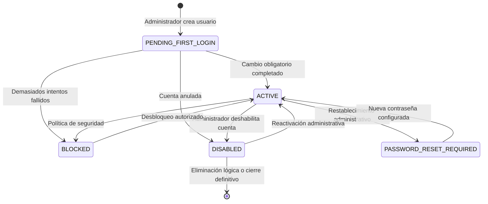

Estados principales:

| Estado | Significado |
|---|---|
| `PENDING_FIRST_LOGIN` | El usuario conserva una contraseña temporal y todavía no completó su incorporación. |
| `ACTIVE` | Puede autenticarse y operar según sus permisos. |
| `BLOCKED` | El acceso fue bloqueado temporalmente. |
| `DISABLED` | La cuenta fue deshabilitada administrativamente. |
| `PASSWORD_RESET_REQUIRED` | Debe definir una nueva contraseña antes de obtener una sesión completa. |

---

# Ciclo de Credenciales Temporales Corporativas

La creación de usuarios se encuentra restringida a administradores autorizados.

El administrador no define una contraseña permanente para el colaborador. El sistema genera una contraseña temporal de un solo propósito, que deberá ser sustituida durante el primer acceso.

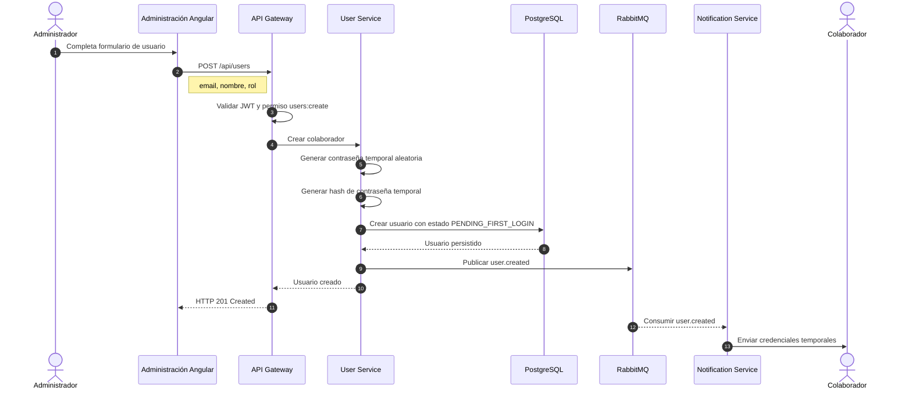

## Datos almacenados

PostgreSQL puede mantener:

- Identificador del usuario.
- Correo electrónico.
- Nombre.
- Rol asignado.
- Hash de la contraseña temporal.
- Estado `PENDING_FIRST_LOGIN`.
- Fecha de creación.
- Fecha de expiración de la contraseña temporal.
- Identificador del administrador que creó la cuenta.

La contraseña temporal nunca debe almacenarse en texto plano después de ser generada.

## Corrección sobre el Step Token

El Step Token no se genera durante la creación del usuario.

Generarlo en ese momento implicaría crear una autorización antes de que el colaborador haya demostrado conocer la contraseña temporal.

El Step Token se emite solamente después de:

1. Recibir el correo y la contraseña temporal.
2. Intentar iniciar sesión.
3. Validar correctamente la contraseña temporal.
4. Confirmar que el estado es `PENDING_FIRST_LOGIN`.

---

# Cambio Obligatorio de Contraseña

La contraseña temporal no permite acceder directamente a los recursos del negocio.

Cuando el usuario demuestra conocerla, el servidor devuelve un Step Token con alcance limitado.

Ese token solamente permite ejecutar la transición de contraseña.

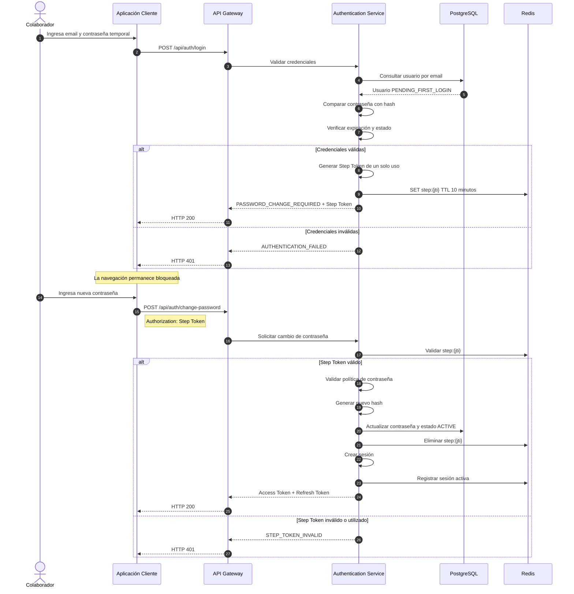

---

# Step Token

El Step Token es una credencial temporal de alcance reducido.

No representa una sesión completa y no debe ser aceptado por endpoints generales.

## Alcance permitido

Puede autorizar únicamente operaciones como:

```text
POST /api/auth/change-password
```

No debe permitir:

- Consultar ventas.
- Crear facturas.
- Acceder a reportes.
- Modificar usuarios.
- Consultar inventario.
- Renovar sesiones.
- Utilizar permisos del rol asignado.

## Claims sugeridos

```json
{
  "sub": "user-uuid",
  "jti": "step-token-uuid",
  "type": "password_change",
  "scope": ["password:change"],
  "iat": 1710000000,
  "exp": 1710000600
}
```

## Controles

- Expiración corta, por ejemplo 10 minutos.
- Uso único.
- Validación del `jti` en Redis.
- Eliminación después de utilizarse.
- Invalidación si cambia el estado del usuario.
- No reutilizable como Access Token.
- Algoritmo y claves diferenciables de los tokens de sesión cuando sea posible.

---

# Autenticación Normal

Una vez que el usuario se encuentra en estado `ACTIVE`, puede iniciar una sesión normal.

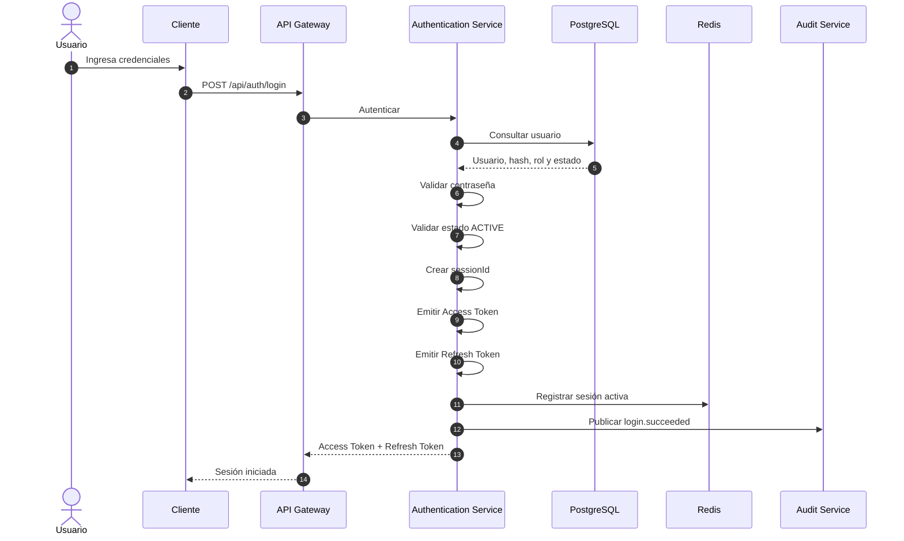

---

# Modelo de Tokens

La arquitectura utiliza diferentes tipos de credenciales.

| Credencial | Finalidad | Duración sugerida |
|---|---|---:|
| Access Token | Autorizar solicitudes del usuario | 15 minutos |
| Refresh Token | Renovar una sesión | 7 días |
| Step Token | Completar una transición específica | 10 minutos |
| Sesión offline local | Mantener operación en un POS autorizado | Según política local |
| Token de dispositivo | Identificar una terminal registrada | Según política de dispositivo |

## Access Token

El Access Token contiene información suficiente para validar una solicitud sin consultar las credenciales del usuario en cada operación.

Claims sugeridos:

```json
{
  "sub": "user-uuid",
  "sid": "session-uuid",
  "role": "CASHIER",
  "permissions": [
    "sales:create",
    "sales:read"
  ],
  "client": "POS",
  "deviceId": "device-uuid",
  "iat": 1710000000,
  "exp": 1710000900
}
```

El token no debe incluir:

- Contraseñas.
- Hashes de contraseña.
- Refresh Tokens.
- Información confidencial innecesaria.
- Datos que puedan cambiar frecuentemente sin una estrategia de invalidación.

## Refresh Token

El Refresh Token permite renovar la sesión sin solicitar nuevamente la contraseña.

Debe tratarse como una credencial de alta sensibilidad.

Controles recomendados:

- Rotación en cada renovación.
- Almacenamiento del hash del token en el backend.
- Asociación con una sesión.
- Asociación opcional con un dispositivo.
- Revocación individual.
- Revocación global por usuario.
- Detección de reutilización.

---

# Ciclo de Vida de la Sesión

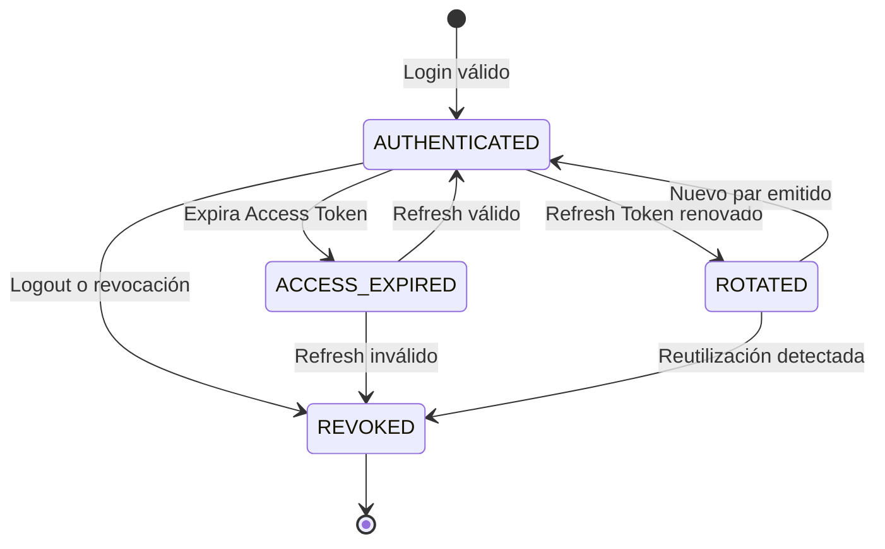

## Rotación del Refresh Token

Cuando el cliente solicita una renovación:

1. Envía el Refresh Token actual.
2. El servidor valida firma, expiración y sesión.
3. Compara el token contra su representación almacenada.
4. Marca el token anterior como utilizado.
5. Emite un nuevo Access Token.
6. Emite un nuevo Refresh Token.
7. Actualiza la sesión.

Si un Refresh Token ya rotado vuelve a utilizarse, puede indicar robo o duplicación de credenciales.

En ese caso, la estrategia puede revocar toda la familia de tokens de la sesión.

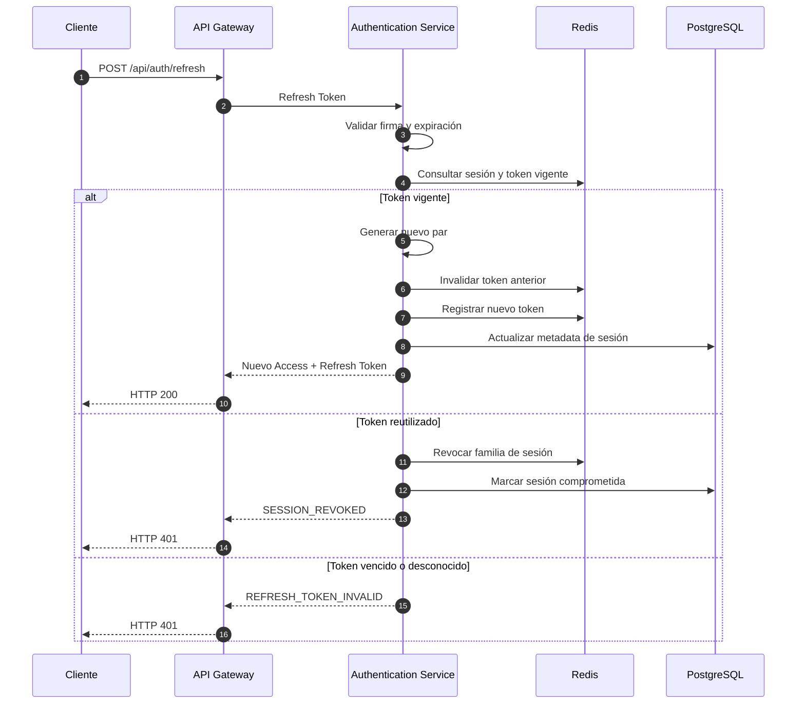

---

# Autorización Basada en Roles
 
La autenticación responde:

> ¿Quién es el usuario?

La autorización responde:

> ¿Qué operaciones puede realizar?

La plataforma utiliza RBAC para asignar permisos según responsabilidades del negocio.

Ejemplo:

| Rol | Permisos |
|---|---|
| `ADMIN` | Administrar usuarios, configuración, reportes y auditoría. |
| `MANAGER` | Consultar reportes, inventario y operaciones. |
| `CASHIER` | Crear ventas, consultar productos y operar caja. |
| `LOGISTICS` | Consultar y actualizar operaciones logísticas autorizadas. |

La validación debe ejecutarse en más de una capa:

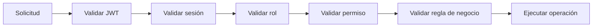

Un usuario puede poseer el permiso `sales:update`, pero una regla adicional puede impedirle modificar:

- Ventas cerradas.
- Ventas de otra sucursal.
- Ventas sincronizadas.
- Ventas fuera de su turno.
- Operaciones superiores a un límite autorizado.

Por tanto, RBAC no reemplaza las reglas de negocio.

---

# Continuidad Operativa del Punto de Venta

El ciclo de vida estándar de los tokens se mantiene deliberadamente corto:

- **Access Token:** 15 minutos.
- **Refresh Token:** 7 días.

Esta configuración reduce el impacto de un token comprometido, pero introduce una restricción para el POS Offline-First.

Cuando el POS pierde conectividad:

- El Access Token puede expirar.
- El Refresh Token no puede enviarse al servidor.
- Redis no puede consultarse.
- La revocación central no puede conocerse inmediatamente.
- El usuario todavía necesita vender y operar la caja.

Un diseño puramente online bloquearía la aplicación después de 15 minutos.

Para evitarlo, el POS implementa una sesión offline local previamente autorizada.

---

# Estrategia de Autenticación Offline

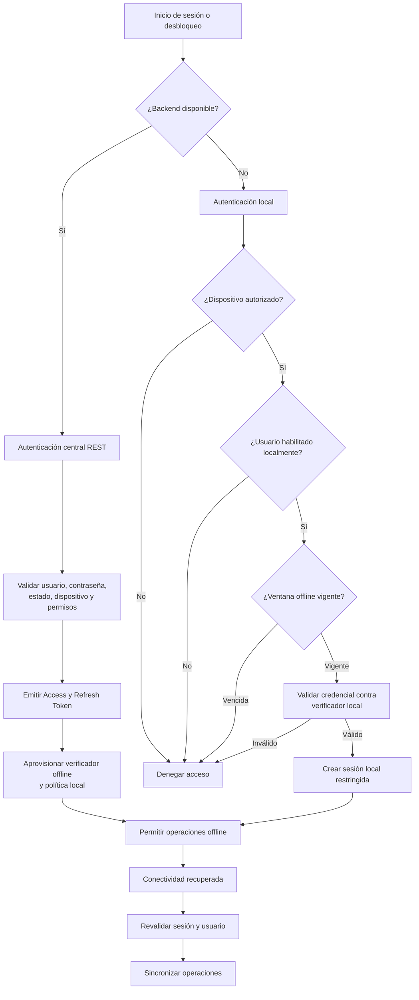

---

# Aprovisionamiento del Acceso Offline

El POS solamente habilita autenticación offline después de un login central válido.

Durante ese proceso, el servidor y el cliente establecen la información mínima necesaria para futuras validaciones locales.

El cliente puede almacenar:

- Identificador del usuario.
- Identificador del dispositivo.
- Rol y permisos permitidos offline.
- Fecha de la última autenticación central.
- Fecha máxima de validez offline.
- Identificador de la sesión central.
- Versión de política de seguridad.
- Verificador criptográfico local.
- Metadatos necesarios para renovación y reconciliación.

El cliente no debe almacenar:

- Contraseña en texto plano.
- Hash de contraseña utilizado por el servidor.
- Claves privadas del backend.
- Tokens sin protección.
- Permisos administrativos innecesarios.
- Información completa de otros usuarios.

---

# Verificador Criptográfico Local

El servidor almacena su propio hash de contraseña, por ejemplo generado con Argon2id o bcrypt.

Ese hash no se replica en el POS.

Después de una autenticación online exitosa, el cliente genera un verificador local independiente.

Conceptualmente:

```text
credencial ingresada
        +
salt local aleatorio
        +
contexto del dispositivo
        ↓
función de derivación de clave
        ↓
verificador local
```

El verificador:

- Es diferente del hash central.
- Tiene un salt único por usuario y dispositivo.
- Solo se utiliza en esa instalación.
- Se encuentra dentro de SQLite cifrado.
- No puede utilizarse directamente para autenticarse contra el backend.

Esto reduce el impacto de una extracción de la base local.

---

# Protección de SQLite

SQLCipher protege el archivo de SQLite mediante cifrado.

Sin embargo, cifrar la base no es suficiente si la clave de cifrado se almacena junto al archivo.

La clave debe protegerse mediante mecanismos del sistema operativo.

En Windows puede utilizarse:

- DPAPI.
- Windows Credential Manager.
- TPM cuando esté disponible.
- Protección asociada al usuario o al equipo.

La estrategia recomendada es:

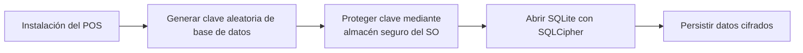

No se recomienda derivar toda la seguridad exclusivamente de datos de hardware como:

- Número de serie.
- Dirección MAC.
- Nombre del equipo.
- Identificador visible del disco.

Estos valores pueden ser predecibles, clonables o modificables.

Pueden formar parte del contexto del dispositivo, pero no deben sustituir una clave aleatoria protegida por el sistema operativo.

---

# Sesión Offline Local

La sesión offline no es un JWT emitido por el backend.

Es un estado local restringido que permite operar mientras el servidor no está disponible.

Puede contener:

```json
{
  "localSessionId": "local-session-uuid",
  "userId": "user-uuid",
  "deviceId": "device-uuid",
  "centralSessionId": "session-uuid",
  "offlineRole": "CASHIER",
  "issuedAt": "2026-07-18T10:00:00Z",
  "validUntil": "2026-07-19T10:00:00Z",
  "lastOnlineValidation": "2026-07-18T10:00:00Z",
  "policyVersion": 3
}
```

La sesión debe limitar:

- Duración máxima offline.
- Usuarios permitidos.
- Número de intentos fallidos.
- Funciones disponibles.
- Terminal autorizada.
- Sucursal.
- Caja.
- Turno.
- Límites monetarios.
- Operaciones administrativas.

---

# Operaciones Permitidas Offline

No todos los permisos online deben trasladarse al modo offline.

Ejemplo:

| Operación | Online | Offline |
|---|:---:|:---:|
| Crear venta | Sí | Sí |
| Consultar catálogo local | Sí | Sí |
| Cerrar una venta local | Sí | Sí |
| Crear usuarios | Sí, según rol | No |
| Cambiar roles | Sí, según rol | No |
| Consultar auditoría global | Sí | No |
| Eliminar ventas sincronizadas | Según regla | No |
| Configurar seguridad | Sí, según rol | No |
| Emitir reembolsos elevados | Según autorización | Limitado o no permitido |

La autenticación offline no implica replicar toda la autoridad del usuario.

---

# Intentos Fallidos Offline

El POS debe limitar intentos de autenticación incluso sin Redis.

Puede mantener localmente:

- Número de intentos fallidos.
- Fecha del último intento.
- Tiempo de bloqueo.
- Incremento progresivo de espera.
- Identificador del usuario y dispositivo.

Ejemplo:

```text
3 intentos fallidos → espera de 30 segundos
5 intentos fallidos → bloqueo de 5 minutos
10 intentos fallidos → bloqueo local hasta reconexión o intervención autorizada
```

Los contadores deben persistirse dentro de la base cifrada para evitar que reiniciar la aplicación restablezca el límite.

---

# Recuperación de Conectividad

Cuando la red vuelve a estar disponible, el POS debe revalidar su estado antes de sincronizar operaciones sensibles.

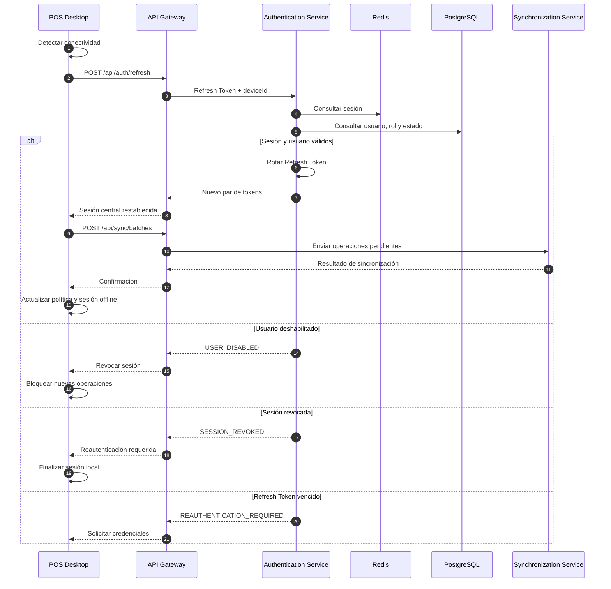

---

# Revocación Durante una Desconexión

La revocación inmediata requiere conectividad.

Si un administrador deshabilita a un usuario mientras el POS permanece desconectado, la terminal no puede conocer el cambio hasta recuperar comunicación.

Este comportamiento constituye un trade-off explícito de la arquitectura Offline-First.

La mitigación se basa en:

- Ventana máxima de operación offline.
- Revalidación obligatoria al reconectar.
- Permisos offline reducidos.
- Asociación usuario-dispositivo.
- Registro de la última validación central.
- Bloqueo de operaciones críticas offline.
- Actualización de políticas después de cada conexión.
- Revocación del Refresh Token.
- Auditoría de operaciones realizadas durante la desconexión.

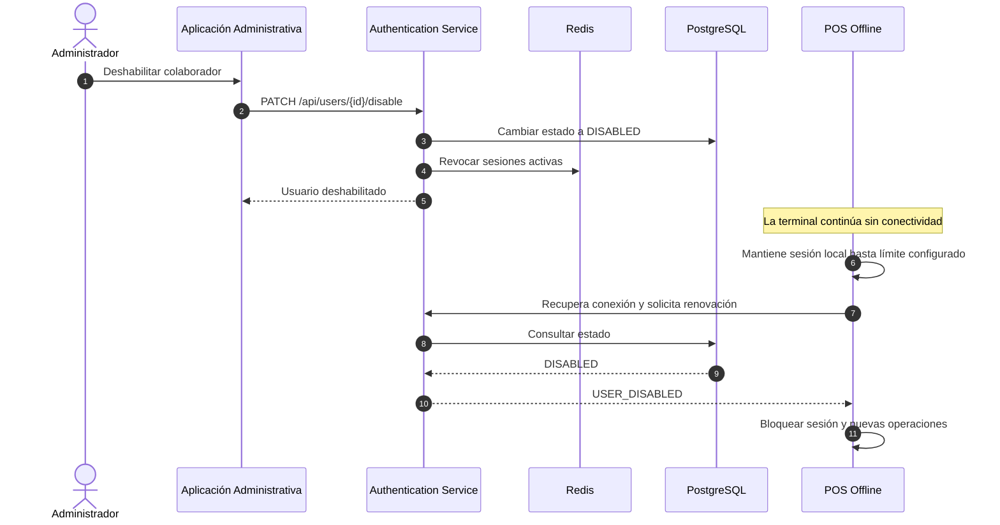

No puede afirmarse que la revocación es instantánea mientras el cliente está desconectado. Debe documentarse como una limitación conocida.

---

# Cambio de Contraseña y Sesiones Existentes

Cuando un usuario cambia su contraseña, la estrategia puede:

- Mantener las demás sesiones.
- Revocar solamente la sesión actual.
- Revocar todas las sesiones del usuario.

Para este caso de estudio, la alternativa más segura es revocar todas las sesiones después de:

- Cambio administrativo de contraseña.
- Recuperación de contraseña.
- Sospecha de compromiso.
- Reutilización de Refresh Token.
- Cambio de rol crítico.
- Deshabilitación del usuario.

Una sesión offline ya iniciada solo conocerá esta revocación al recuperar la conectividad o alcanzar su ventana máxima local.

---

# Eventos de Seguridad

RabbitMQ distribuye eventos internos para desacoplar autenticación, notificaciones y auditoría.

Ejemplos:

```text
user.created
user.activated
user.disabled
user.role.changed
authentication.succeeded
authentication.failed
password.changed
password.reset.requested
session.created
session.refreshed
session.revoked
refresh_token.reuse_detected
offline_session.provisioned
offline_session.revalidated
device.registered
device.revoked
```

Flujo:

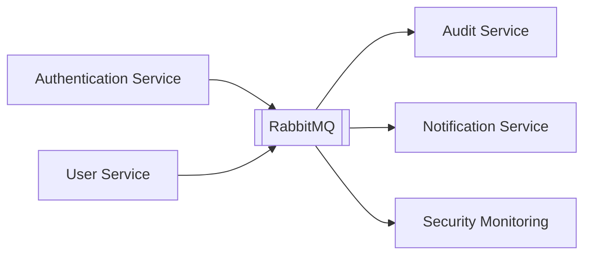

RabbitMQ no autentica al usuario final.

Su función es distribuir eventos internos entre servicios internos después de que una operación de seguridad ya fue procesada.

---

# Auditoría

Los eventos críticos deben registrar:

- Identificador del usuario.
- Identificador de sesión.
- Identificador del dispositivo.
- Cliente utilizado.
- Fecha y hora.
- Dirección IP cuando exista conectividad.
- Resultado.
- Motivo del rechazo.
- Operación solicitada.
- Usuario administrador responsable, cuando aplique.
- Correlation ID.
- Estado online u offline.

Ejemplo conceptual:

```json
{
  "event": "authentication.failed",
  "userId": "user-uuid",
  "deviceId": "device-uuid",
  "client": "POS",
  "connectionMode": "ONLINE",
  "reason": "INVALID_CREDENTIALS",
  "occurredAt": "2026-07-18T13:20:00Z",
  "correlationId": "request-uuid"
}
```

La auditoría no debe almacenar:

- Contraseñas.
- Tokens completos.
- Hashes sensibles.
- Claves criptográficas.
- Contenido confidencial innecesario.

---

# Amenazas Consideradas

| Amenaza | Mitigación |
|---|---|
| Robo de Access Token | Expiración corta, TLS y almacenamiento protegido. |
| Robo de Refresh Token | Rotación, revocación y detección de reutilización. |
| Reutilización de Step Token | Token de un solo uso almacenado en Redis. |
| Fuerza bruta | Rate limiting, bloqueo progresivo y auditoría. |
| Robo físico del POS | SQLCipher y clave protegida por el sistema operativo. |
| Copia de SQLite a otro dispositivo | Asociación con dispositivo y clave no exportable. |
| Usuario revocado durante desconexión | Ventana offline limitada y revalidación al reconectar. |
| Manipulación de permisos en el cliente | Validación de autorización en el backend. |
| Reenvío de operaciones offline | UUID, idempotencia y validación durante sincronización. |
| Token firmado pero sesión revocada | Validación de sesión en Redis para operaciones sensibles. |
| Filtración de logs | Exclusión de tokens, contraseñas y material criptográfico. |

---

# Trade-offs

## Tokens de corta duración

Beneficios:

- Reducen el período de exposición.
- Limitan el impacto de un Access Token robado.

Costo:

- Requieren renovación frecuente.
- No resuelven por sí solos la operación offline.

## Sesión offline

Beneficios:

- Permite continuidad operativa.
- Evita bloquear el POS ante cortes de red.

Costo:

- La revocación no puede ser inmediata.
- Requiere protección local adicional.
- Introduce estado distribuido.

## Redis para sesiones

Beneficios:

- Permite revocación rápida.
- Facilita Step Tokens y controles temporales.
- Mejora la coordinación entre instancias.

Costo:

- Agrega dependencia operativa.
- Requiere estrategia ante indisponibilidad.

## SQLCipher y almacenamiento seguro

Beneficios:

- Reduce exposición ante robo físico.
- Protege la información persistida.

Costo:

- Aumenta la complejidad de distribución y recuperación de claves.
- No protege completamente un dispositivo ya comprometido mientras está desbloqueado.

---

# Reglas Aplicadas al Caso de Estudio

La estrategia final establece que:

- Solo un administrador autorizado puede crear colaboradores.
- Toda cuenta nueva comienza en `PENDING_FIRST_LOGIN`.
- La contraseña temporal tiene expiración.
- El Step Token se emite después de validar la contraseña temporal.
- El Step Token es de un solo uso.
- El usuario obtiene una sesión completa únicamente después de cambiar la contraseña.
- El Access Token dura 15 minutos.
- El Refresh Token dura 7 días y se rota.
- Las sesiones pueden revocarse.
- El POS solo habilita modo offline después de una autenticación online válida.
- El POS no almacena el hash central de contraseña.
- La sesión offline está asociada al usuario y al dispositivo.
- Los permisos offline son más restrictivos que los permisos online.
- La sesión offline posee una vigencia máxima.
- Al reconectar, el POS debe revalidar identidad, sesión y estado.
- PostgreSQL continúa siendo la fuente de verdad.
- Redis conserva únicamente estado temporal.
- RabbitMQ comunica eventos internos.
- SQLite conserva únicamente la información mínima necesaria para mantener la operación.

---

# Riesgos Residuales

Aunque se implementen las mitigaciones anteriores, permanecen riesgos que no pueden eliminarse completamente:

- Un usuario revocado puede continuar operando durante una ventana offline ya autorizada.
- Un dispositivo completamente comprometido puede exponer información mientras la aplicación está desbloqueada.
- La pérdida del Refresh Token durante una desconexión prolongada puede requerir autenticación online.
- Un error en el reloj local puede afectar la evaluación de expiraciones.
- La recuperación de claves del dispositivo debe planificarse para evitar pérdida permanente de información.
- Las operaciones offline deben validarse nuevamente al sincronizarse.

Estos riesgos se aceptan dentro del alcance porque la continuidad operativa constituye una necesidad central del negocio.

---

# Fuera de Alcance

Este documento no implementa:

- OAuth 2.0 como proveedor externo.
- OpenID Connect.
- SAML.
- LDAP.
- Active Directory.
- Passkeys.
- Biometría.
- Autenticación multifactor empresarial.
- Zero Trust completo.
- Gestión de secretos mediante HSM.
- Attestation avanzada de dispositivos.

Estas alternativas pueden incorporarse posteriormente sin modificar el principio central de identidad centralizada y operación offline controlada.

---

# Documentos Relacionados

- **ARCHITECTURE.md** — Arquitectura general del sistema.
- **SYNCHRONIZATION.md** — Sincronización de eventos entre clientes y servidor.
- **CONFLICT_RESOLUTION.md** — Resolución de conflictos de negocio.
- **TEST.md** — Estrategia de pruebas unitarias y automatización.
- **DESIGNDECISIONS.md** — Decisiones de diseño y elecciones tecnológicas.
- **DEPLOYMENT.md** — Estrategia de despliegue y operación.
- **RUNNING.md** — Ejecución del proyecto.

---

# Conclusión

La estrategia de autenticación no puede definirse de manera aislada de las necesidades de conectividad.

En la aplicación administrativa, la autenticación puede depender completamente del backend. En el Punto de Venta, esa misma decisión bloquearía la operación durante una interrupción de red.

Por este motivo, el sistema conserva una identidad centralizada, pero permite que terminales previamente autorizadas mantengan una sesión local restringida durante períodos controlados de desconexión.

Los Access Tokens, Refresh Tokens, Step Tokens, Redis, PostgreSQL, RabbitMQ, SQLCipher y el almacenamiento seguro del sistema operativo no fueron seleccionados como componentes independientes.

Cada tecnología responde a una responsabilidad concreta dentro de la estrategia:

- PostgreSQL mantiene la identidad autoritativa.
- Redis administra estado temporal y revocable.
- JWT transporta identidad y permisos durante sesiones online.
- Refresh Tokens permiten renovar sesiones.
- Step Tokens controlan transiciones sensibles.
- RabbitMQ distribuye eventos internos.
- SQLite mantiene continuidad operativa.
- SQLCipher protege el almacenamiento local.

La arquitectura resultante acepta que seguridad y disponibilidad generan trade-offs, y documenta explícitamente dónde se encuentran esos límites.
