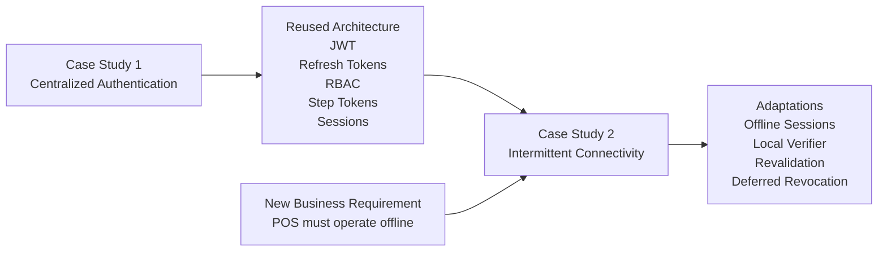
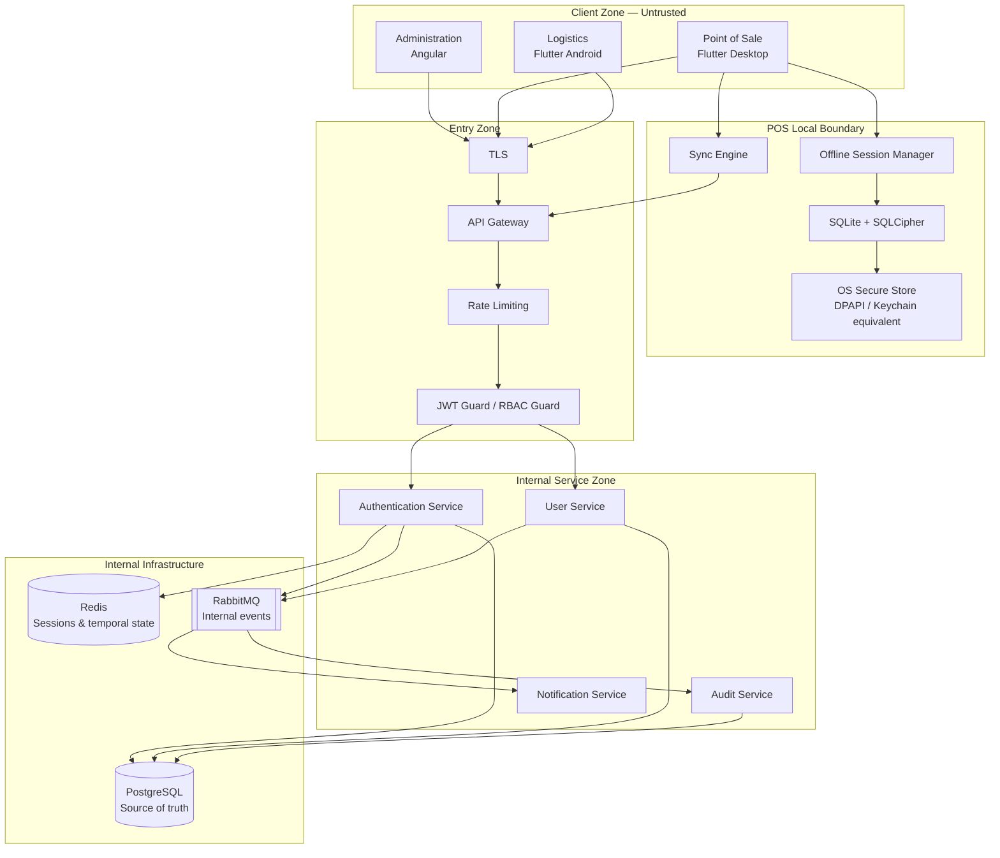
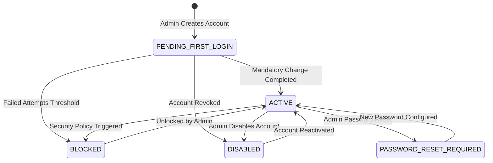

# 🔐 Distributed Security and Authentication

## Case Study 2: Connectivity Strategies in Distributed Systems

---

# Introduction

The architecture defined in this case study consists of clients with distinct connectivity requirements:

- Administration — Online-First.
- Point of Sale — Offline-First.
- Logistics — Permissive Online-First.

These differences affect not only communication and persistence strategies, but also condition how identity, credentials, sessions, and permissions are managed.

The administration app relies on the backend to validate sessions and renew credentials. The Point of Sale, by contrast, must continue operating during extended network outages.

This creates architectural tension between two business needs:

- Reduce risk associated with compromised sessions and credentials.
- Prevent network disconnections from halting commercial operations.

The adopted solution combines centralized authentication, short-lived tokens, revocable sessions, and a controlled offline authentication mechanism for pre-authorized terminals.

---

# Relationship to Case Study 1

Case Study 1 established a centralized authentication architecture based on users, roles, JWTs, Refresh Tokens, RBAC, Step Tokens, and session management.

This document reuses that architecture and adapts it for clients remaining offline for extended periods.

The difference lies not in the authentication mechanisms themselves, but in how they behave when connectivity is no longer guaranteed.

---

# Security Objectives

- Centralize user identity.
- Restrict account creation to authorized administrators.
- Prevent temporary credentials from granting permanent access.
- Enforce mandatory password change on first login.
- Issue short-lived Access Tokens.
- Maintain revocable Refresh Tokens.
- Allow POS operational continuity during network outages.
- Prevent POS from becoming an independent identity source.
- Protect local storage against unauthorized physical access.
- Enforce role- and permission-based authorization.
- Maintain auditability via events and audit logs.

---

# Architectural Principles

1. **PostgreSQL is the source of truth for identity.**
2. **POS does not create or manage identities.**
3. **Offline authentication is a controlled exception.**
4. **Tokens have distinct responsibilities.**
5. **Authorization does not rely solely on UI controls.**
6. **Connectivity loss must not equal unrestricted access.**
7. **Sensitive data is stored with minimal exposure.**

---

# Technical Security Architecture

---

# User Account Lifecycle

---

# Step Token & Temporary Credentials

A temporary credential generated during user creation allows initial login.

Upon successful initial authentication with a temporary credential, the server issues a single-use **Step Token** scoped exclusively to password updates (`POST /api/auth/change-password`).

Step Tokens cannot access general business resources, reports, or domain operations.

---

# Token Model & Expirations

| Credential | Purpose | Suggested Expiration |
|---|---|---:|
| Access Token | Authorize API requests | 15 minutes |
| Refresh Token | Session renewal | 7 days |
| Step Token | Specific multi-step transition | 10 minutes |
| Local Offline Session | POS operation during outages | Configured policy (e.g., 24-48 hours) |

---

# Refresh Token Rotation & Security

When renewing sessions:
1. Client sends current Refresh Token.
2. Backend validates signature, expiration, and session state in Redis.
3. Old token is invalidated and replaced with a new Access/Refresh token pair.
4. If a previously rotated token is reused, token theft is detected, and the entire token family for that session is revoked immediately.

---

# Offline POS Security Architecture

- **Pre-Authorization Required**: POS enables offline mode only after a successful online authentication.
- **Local Verifier**: POS derives a local cryptographic verifier using PBKDF2/Argon2 from the user's password + device-specific salt. The central database password hash is never stored on the client.
- **SQLCipher Database Encryption**: SQLite local database is encrypted with SQLCipher.
- **OS Secure Key Storage**: Database encryption keys are stored in Windows DPAPI / Credential Manager or OS Keychain.
- **Restricted Offline Permissions**: Administrative and high-risk operations (user creation, large refunds, system configuration) are strictly blocked in offline mode.
- **Automatic Re-Validation**: Upon network reconnection, POS must re-validate sessions with the backend before syncing offline transactions.

---

# Related Documents

- **ARCHITECTURE.md** — Overall system architecture.
- **SYNCHRONIZATION.md** — Event synchronization between clients and server.
- **CONFLICT_RESOLUTION.md** — Conflict resolution strategies.
- **TEST.md** — Testing strategy.
- **DESIGNDECISIONS.md** — Design decisions.
- **RUNNING.md** — Local execution guide.
