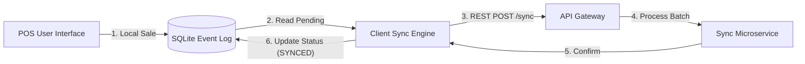
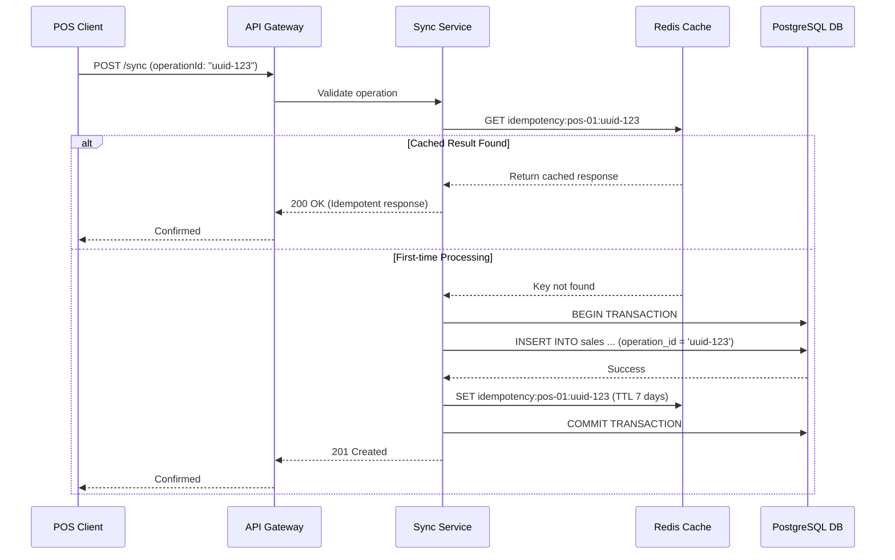
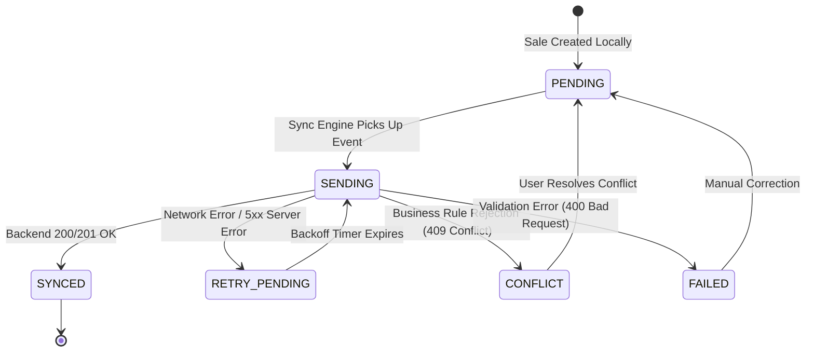

# 🔄 Synchronization and Eventual Consistency

## Case Study 2: Connectivity Strategies in Distributed Systems

---

# Introduction

In a distributed system with Offline-First clients (such as the Point of Sale), network disconnections are not exceptional failures — they are expected operational states.

When a client operates disconnected, it generates local state changes (sales, stock deductions, receipt generation) that must eventually be communicated to the central backend.

This document describes the technical synchronization protocol, idempotency controls, event logging, retry backoff algorithms, and state reconciliation mechanisms used to maintain eventual consistency across all clients.

---

# Key Synchronization Objectives

1. **Guarantee At-Least-Once Delivery**: No local operations recorded by the POS should ever be silently lost.
2. **Ensure Exactly-Once Processing via Idempotency**: Network retries or duplicate uploads must not cause duplicated sales, double-counting of revenues, or duplicate inventory decrements.
3. **Decouple User Operations from Network Latency**: POS checkout completes locally in milliseconds regardless of network health.
4. **Resilient Batch Processing**: Support batching multiple offline operations into single requests with granular per-operation success/failure tracking.
5. **Eventual Consistency**: Reconcile client local states with the central PostgreSQL database once connectivity is restored.

---

# Core Concepts

## Store and Forward

When offline, the POS client stores operations in a local SQLite Event Log queue (`PENDING` state).

When network connectivity is restored, the synchronization engine reads pending items from SQLite and forwards them to the API Gateway.



## Idempotency Key Pattern

Every operation generated by a client receives a globally unique, immutable UUID (`operationId`) at the exact moment of local creation.

When the backend receives an operation:
1. It queries Redis using key `idempotency:{clientId}:{operationId}`.
2. If found, it returns the stored result immediately without re-executing domain logic.
3. If not found, it processes the operation inside a PostgreSQL database transaction with a `UNIQUE (client_id, operation_id)` constraint, then stores the result in Redis.



---

# Local Operation Lifecycle

An operation recorded in the POS SQLite database transitions through explicit state machine states:



| State | Description |
|---|---|
| `PENDING` | Operation stored locally, awaiting transmission. |
| `SENDING` | In-flight payload currently sent over HTTP to the Gateway. |
| `SYNCED` | Successfully processed and acknowledged by backend. |
| `RETRY_PENDING` | Temporary failure encountered; scheduled for exponential backoff retry. |
| `CONFLICT` | Business rule failure requiring reconciliation (e.g., negative stock, price version mismatch). |
| `FAILED` | Malformed operation or fatal error requiring manual operator intervention. |

---

# Exponential Backoff and Jitter

To prevent thundering herd problems when network connectivity returns after a widespread outage, the client sync engine uses exponential backoff with randomized jitter:

$$\text{Delay} = \min\left(\text{MaxDelay}, \text{BaseDelay} \times 2^{\text{attempt}} + \text{RandomJitter}\right)$$

- `BaseDelay`: 2 seconds
- `MaxDelay`: 300 seconds (5 minutes)
- `MaxAttempts`: 10 attempts before escalating alert

---

# Batch Synchronization Protocol

Operations are sent in batches to reduce HTTP header overhead:

### Request Format (`POST /api/synchronization/batch`)
```json
{
  "clientId": "pos-terminal-04",
  "batchId": "batch-889102",
  "sentAt": "2026-07-19T21:40:00Z",
  "operations": [
    {
      "operationId": "d9b2e3f4-1122-3344-5566-778899aabbcc",
      "type": "SALE_CREATED",
      "timestamp": "2026-07-19T20:15:00Z",
      "payload": {
        "total": 149.99,
        "items": [
          { "sku": "PROD-001", "qty": 2, "unitPrice": 49.99 },
          { "sku": "PROD-002", "qty": 1, "unitPrice": 50.00 }
        ]
      }
    }
  ]
}
```

### Response Format (Per-Operation Granular Status)
```json
{
  "batchId": "batch-889102",
  "processedAt": "2026-07-19T21:40:02Z",
  "results": [
    {
      "operationId": "d9b2e3f4-1122-3344-5566-778899aabbcc",
      "status": "SYNCED",
      "code": 200,
      "message": "Operation processed successfully"
    }
  ]
}
```

---

# Related Documents

- **ARCHITECTURE.md** — Overall architecture and microservice interaction.
- **CONFLICT_RESOLUTION.md** — In-depth conflict handling algorithms (LWW, Vector Clocks, CRDTs).
- **SECURITY.md** — Offline token security and local DB encryption.
- **DESIGNDECISIONS.md** — Rationale for Store and Forward choices.