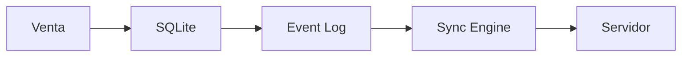
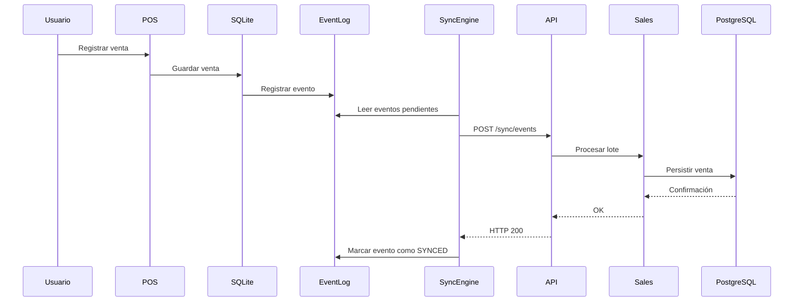
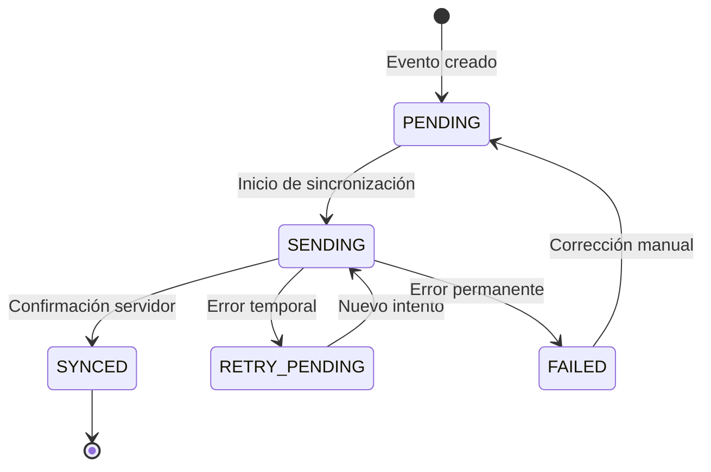
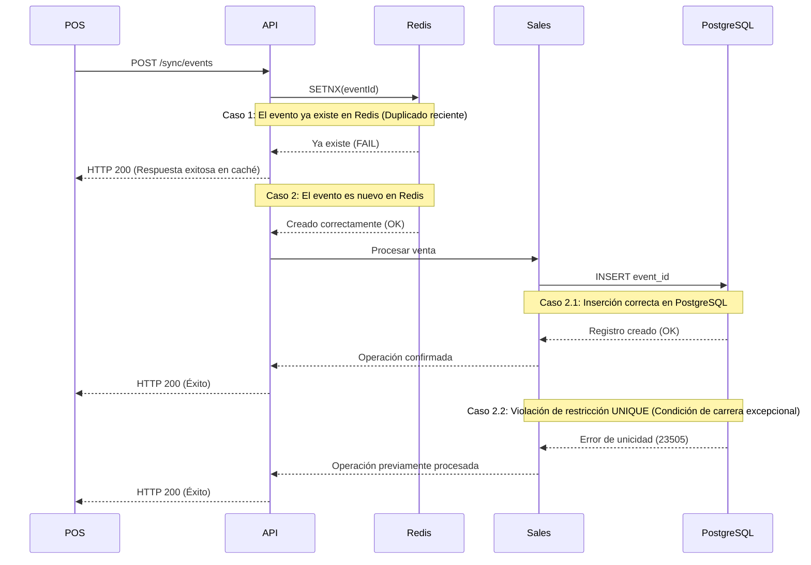

# 🔄 Sincronización de Datos y Consistencia Eventual

## Caso de Estudio 2: Estrategias de Conectividad en Sistemas Distribuidos

---

# Introducción

En una arquitectura distribuida no todos los clientes mantienen una conexión permanente con el servidor central. Las interrupciones de red, las pérdidas temporales de conectividad o incluso la operación completamente desconectada forman parte de la realidad de numerosos dominios de negocio como puntos de venta, logística, dispositivos móviles, sistemas IoT y aplicaciones industriales.

En este caso de estudio, el Punto de Venta (POS) debe continuar operando incluso cuando la comunicación con el servidor no está disponible. Desde la perspectiva del negocio, una venta nunca puede depender de la existencia de una conexión a Internet.

Esta necesidad obliga a desacoplar el procesamiento local del procesamiento centralizado, permitiendo que ambos evolucionen de forma independiente hasta que la conectividad sea restablecida.

Como consecuencia, el sistema adopta un modelo basado en persistencia local, sincronización diferida y consistencia eventual.

---

# Relación con el Caso de Estudio 1

El Caso de Estudio 1 definió una arquitectura de autenticación centralizada basada en JWT, Refresh Tokens, RBAC y administración de sesiones.

Este documento no modifica dicha arquitectura.

En cambio, analiza cómo deben sincronizarse las operaciones de negocio cuando algunos clientes pueden permanecer desconectados durante largos períodos de tiempo.

La autenticación garantiza la identidad del usuario.

La sincronización garantiza la convergencia de los datos.

Ambas arquitecturas trabajan de forma complementaria.

---
# Relación con ARCHITECTURE.md

ARCHITECTURE.md describe los componentes generales de la plataforma y las responsabilidades de cada tecnología.

Este documento profundiza específicamente en:

- Persistencia Local
- Event Log
- Sync Engine
- Batching
- Backoff
- Idempotencia
- Consistencia Eventual

La arquitectura general explica dónde ocurre la sincronización.

Este documento explica cómo ocurre.

# Objetivos de Sincronización

El motor de sincronización persigue los siguientes objetivos arquitectónicos:

- Permitir que el negocio continúe funcionando sin conectividad.
- Evitar la pérdida de información durante fallos de red.
- Persistir localmente todas las operaciones.
- Reintentar automáticamente las operaciones pendientes.
- Evitar duplicados durante la sincronización.
- Garantizar la convergencia del estado entre cliente y servidor.
- Reducir el consumo de ancho de banda.
- Minimizar el impacto de interrupciones temporales.

La sincronización no busca mantener una consistencia inmediata.

Su objetivo consiste en garantizar que todos los clientes converjan eventualmente hacia el mismo estado lógico.

---
# Contenido

- Consistencia Eventual y CAP
- Arquitectura del Sync Engine
- Event Log
- Estados de Sincronización
- Batching
- Backoff
- Idempotencia
- Conflictos
- Principios Arquitectónicos

# Principio Store and Forward

La arquitectura implementa el patrón **Store and Forward**.

Este patrón establece que una operación nunca depende de la disponibilidad inmediata del servidor.

Toda operación realizada por el usuario sigue el siguiente flujo:

1. La operación se registra localmente.
2. Se almacena de forma persistente.
3. Se agrega al registro de eventos pendientes.
4. El usuario continúa trabajando normalmente.
5. Cuando existe conectividad, el motor de sincronización envía los eventos pendientes al servidor.

De esta forma el usuario nunca percibe interrupciones provocadas por la red.



Este patrón es ampliamente utilizado en sistemas Offline-First, terminales bancarias, cajeros automáticos, dispositivos IoT y aplicaciones móviles.

---

# Consistencia Eventual y Teorema CAP

La sincronización se encuentra directamente relacionada con el Teorema CAP.

CAP establece que, ante una partición de red, un sistema distribuido solamente puede priorizar dos de las siguientes propiedades:

- Consistencia (Consistency)
- Disponibilidad (Availability)
- Tolerancia a Particiones (Partition Tolerance)

```text
       [ Consistencia ]
              /\
             /  \
            /    \
   [ RDBMS ]      [ POS Offline-First ]
          /        \
         / Partición \
        /______________\
[ Disponibilidad ] ---- [ Tolerancia a Particiones ]
```

Durante una interrupción de red, el sistema toma decisiones diferentes dependiendo del componente involucrado.

### Servidor Central

El servidor prioriza:

- Consistencia
- Tolerancia a Particiones

El estado almacenado en PostgreSQL debe mantenerse consistente incluso si algunos clientes permanecen desconectados.

Las reglas de negocio nunca son violadas para mantener la disponibilidad.

---

### Punto de Venta (POS)

El Punto de Venta prioriza:

- Disponibilidad
- Tolerancia a Particiones

El cajero debe continuar registrando ventas independientemente del estado de la red.

Interrumpir la operación comercial por una pérdida de Internet sería un costo de negocio inaceptable.

---

### Consistencia Eventual

Aunque cliente y servidor pueden contener estados diferentes durante un período de tiempo, ambos convergerán eventualmente hacia el mismo estado una vez que la sincronización finalice correctamente.

Esta propiedad se conoce como **Consistencia Eventual (Eventual Consistency)**.

La consistencia deja de ser inmediata para convertirse en una propiedad alcanzada mediante sincronización.
---

# Arquitectura del Motor de Sincronización

La sincronización no depende de un único componente, sino de un conjunto de servicios que colaboran para transportar una operación desde el cliente hasta el sistema central.

Cada componente posee una responsabilidad específica dentro del proceso de sincronización.

```mermaid
flowchart LR

USER["Cajero"]

POS["POS Desktop"]

SQLITE["SQLite"]

EVENTLOG["Event Log"]

ENGINE["Sync Engine"]

REST["REST API"]

API["API Gateway"]

RABBIT["RabbitMQ"]

SERVICE["Sales Service"]

DB["PostgreSQL"]

USER --> POS

POS --> SQLITE

SQLITE --> EVENTLOG

EVENTLOG --> ENGINE

ENGINE --> REST

REST --> API

API --> RABBIT

RABBIT --> SERVICE

SERVICE --> DB
```



Cada uno de estos componentes participa únicamente en una parte del proceso, reduciendo el acoplamiento entre el cliente y el servidor.

---

# Responsabilidades Arquitectónicas

La separación de responsabilidades constituye uno de los principios fundamentales de esta arquitectura.

| Componente | Responsabilidad |
|------------|-----------------|
| POS Desktop | Registrar operaciones realizadas por el usuario. |
| SQLite | Persistencia inmediata de la información local. |
| Event Log | Registrar todas las operaciones pendientes de sincronización. |
| Sync Engine | Detectar conectividad, enviar eventos y administrar reintentos. |
| REST API | Exponer el punto de entrada para sincronización. |
| API Gateway | Validar autenticación, autorización e idempotencia inicial. |
| RabbitMQ | Desacoplar el procesamiento del ingreso de solicitudes. |
| Sales Service | Ejecutar reglas de negocio. |
| PostgreSQL | Mantener el estado definitivo del sistema. |

Esta división permite que cada componente evolucione de forma independiente sin afectar el resto de la arquitectura.

---

# Flujo General de Sincronización

Una operación realizada por el usuario sigue el siguiente recorrido:

1. El cajero registra una venta.
2. La venta se almacena en SQLite.
3. Se genera un evento de sincronización.
4. El evento permanece pendiente.
5. El motor detecta conectividad.
6. Se envía el lote de eventos.
7. El servidor valida la autenticidad.
8. El servicio procesa la operación.
9. PostgreSQL confirma la transacción.
10. El POS marca el evento como sincronizado.



---

# Persistencia Local

La persistencia local constituye la base del modelo Offline-First.

Cuando el usuario realiza una operación, esta no depende de la disponibilidad del servidor.

La aplicación registra inmediatamente la información dentro de SQLite.

Esta persistencia permite:

- Continuar operando sin Internet.
- Recuperar información después de un cierre inesperado.
- Mantener reportes locales.
- Evitar pérdida de información.

SQLite representa el estado operativo del cliente.

No reemplaza al servidor central.

---

# El Event Log

Además de almacenar la información de negocio, el sistema mantiene un registro independiente de eventos pendientes.

Este registro recibe el nombre de **Event Log**.

Su función consiste exclusivamente en registrar qué operaciones aún deben sincronizarse con el servidor.

La separación entre datos de negocio y eventos de sincronización permite desacoplar completamente ambas responsabilidades.

```text
SQLite

├── Ventas
├── Clientes
├── Productos
├── Caja
└── Event Log
        │
        ├── SALE_CREATED
        ├── SALE_UPDATED
        ├── CASH_OPEN
        ├── CASH_CLOSE
        └── STOCK_UPDATED
```

El Event Log nunca representa el estado actual del negocio.

Representa únicamente operaciones pendientes.

---

# ¿Por qué separar las ventas del Event Log?

Podría parecer suficiente almacenar únicamente las ventas.

Sin embargo, hacerlo presenta varios problemas.

Por ejemplo:

- No existe forma sencilla de conocer qué registros ya fueron sincronizados.
- El sistema tendría que inspeccionar continuamente todas las tablas.
- Las operaciones de sincronización quedarían mezcladas con la lógica de negocio.
- La incorporación de nuevos tipos de eventos aumentaría considerablemente la complejidad.

Al separar el Event Log del modelo de dominio:

- Las ventas continúan siendo entidades de negocio.
- El Event Log se convierte en una cola persistente de sincronización.
- El motor puede trabajar únicamente sobre los eventos pendientes.
- Nuevos tipos de operaciones pueden incorporarse sin modificar la estructura de las tablas principales.

Este patrón resulta ampliamente utilizado en arquitecturas distribuidas y sistemas orientados a eventos.

---

# Motor de Sincronización (Sync Engine)

El **Sync Engine** es un proceso ejecutado en segundo plano cuya responsabilidad consiste en mantener sincronizado el cliente con el servidor.

El usuario nunca interactúa directamente con este componente.

Entre sus responsabilidades se encuentran:

- Detectar disponibilidad de red.
- Leer eventos pendientes.
- Construir lotes de sincronización.
- Administrar reintentos.
- Aplicar Exponential Backoff.
- Actualizar estados.
- Registrar errores.
- Reanudar sincronizaciones interrumpidas.

El motor funciona de forma completamente independiente de la interfaz de usuario.

Incluso si el operador continúa registrando ventas, el Sync Engine puede seguir enviando eventos previamente almacenados.

Esta independencia reduce el acoplamiento entre la experiencia del usuario y la comunicación con el servidor.

---

# Beneficios de esta Arquitectura

La separación entre Persistencia Local, Event Log y Sync Engine proporciona varias ventajas arquitectónicas.

- Continuidad operativa.
- Recuperación automática tras fallos.
- Desacoplamiento entre negocio y sincronización.
- Mayor resiliencia frente a interrupciones de red.
- Incorporación sencilla de nuevos tipos de eventos.
- Reintentos completamente automáticos.
- Escalabilidad del proceso de sincronización.
- Base sólida para implementar consistencia eventual.

Esta arquitectura constituye el núcleo del modelo Offline-First desarrollado en este caso de estudio.
---

# Estructura del Event Log

El **Event Log** constituye una cola persistente de eventos pendiente de sincronización.

Cada operación realizada por el usuario genera un nuevo registro dentro de esta tabla.

A diferencia de las tablas de dominio (Ventas, Clientes, Productos), el Event Log no representa entidades de negocio, sino acciones que aún deben propagarse al sistema central.

Cada evento contiene toda la información necesaria para ser procesado independientemente del estado actual de la aplicación.

```sql
CREATE TABLE local_sync_events (

    event_id TEXT PRIMARY KEY,

    action TEXT NOT NULL,

    payload TEXT NOT NULL,

    created_at TIMESTAMP DEFAULT CURRENT_TIMESTAMP,

    status TEXT DEFAULT 'PENDING',

    retry_count INTEGER DEFAULT 0,

    last_error TEXT,

    synced_at TIMESTAMP

);
```

---

# Descripción de cada campo

| Campo | Descripción |
|---------|-------------|
| event_id | Identificador único (UUID v4) generado por el cliente. |
| action | Tipo de operación realizada. |
| payload | Información serializada de la operación. |
| created_at | Fecha de creación del evento. |
| status | Estado actual dentro del proceso de sincronización. |
| retry_count | Número de intentos realizados. |
| last_error | Último error registrado durante el envío. |
| synced_at | Fecha en que el servidor confirmó el procesamiento. |

El uso de un UUID permite que cada evento pueda identificarse de forma única dentro de todo el sistema distribuido.

---

# ¿Por qué almacenar el Payload completo?

Una pregunta frecuente consiste en por qué almacenar un JSON completo en lugar de únicamente el identificador de la venta.

La razón principal es la independencia del evento.

El motor de sincronización debe poder reenviar una operación incluso después de:

- Reiniciar la aplicación.
- Reiniciar el sistema operativo.
- Cambios posteriores sobre la venta.
- Actualizaciones del modelo de datos.

Cada evento representa una fotografía completa de la operación en el momento en que ocurrió.

Esto evita depender del estado actual de otras tablas durante la sincronización.

---

# Acciones del Event Log

Cada registro representa una operación de negocio.

Por ejemplo:

```text
SALE_CREATED

SALE_UPDATED

SALE_CANCELLED

PAYMENT_REGISTERED

CUSTOMER_CREATED

CASH_OPEN

CASH_CLOSE

STOCK_ADJUSTED
```

La sincronización no procesa tablas.

Procesa eventos.

Esta diferencia resulta fundamental dentro de arquitecturas distribuidas.

---

# Ciclo de Vida del Evento

Cada evento atraviesa una serie de estados desde su creación hasta su sincronización definitiva.



Cada transición representa una decisión del motor de sincronización.

---

# Estado PENDING

Un evento entra en estado **PENDING** inmediatamente después de ser creado.

En este momento:

- La información ya fue almacenada localmente.
- El usuario puede continuar trabajando.
- No existe garantía de que el servidor conozca todavía la operación.

Todos los eventos comienzan en este estado.

---

# Estado SENDING

Cuando el Sync Engine detecta conectividad disponible, selecciona un conjunto de eventos pendientes.

Antes de enviarlos cambia su estado a:

```text
SENDING
```

Este estado evita que dos procesos intenten sincronizar simultáneamente el mismo evento.

Mientras un evento permanezca en SENDING no puede ser reenviado por otro proceso del cliente.

---

# Estado SYNCED

El servidor confirma que el evento fue procesado correctamente.

En ese momento el cliente actualiza:

```text
status = SYNCED

synced_at = Fecha actual
```

Los eventos sincronizados permanecen almacenados únicamente como registro histórico o pueden eliminarse posteriormente mediante políticas de limpieza.

---

# Estado RETRY_PENDING

No todos los errores implican que la operación haya fallado.

Por ejemplo:

- pérdida de Internet
- timeout
- servidor temporalmente fuera de servicio
- error HTTP 503
- gateway timeout

Estos errores son considerados transitorios.

El motor actualiza el estado a:

```text
RETRY_PENDING
```

El evento volverá a intentarse posteriormente.

---

# Estado FAILED

Existen errores que no pueden resolverse mediante reintentos automáticos.

Por ejemplo:

- Payload inválido.
- Usuario inexistente.
- Producto eliminado.
- Violación de reglas de negocio.
- Error de validación.

En estos casos el servidor responde con un error permanente.

El evento pasa a:

```text
FAILED
```

Ahora será necesaria una intervención del operador o del sistema administrativo.

---

# ¿Por qué diferenciar RETRY_PENDING de FAILED?

Esta separación evita intentar indefinidamente operaciones que nunca podrán completarse.

| RETRY_PENDING | FAILED |
|---------------|---------|
| Error temporal | Error permanente |
| Reintento automático | Requiere intervención |
| Problemas de infraestructura | Problemas de negocio |
| El evento sigue siendo válido | El evento debe corregirse |

Esta distinción reduce el consumo de recursos y simplifica el monitoreo operativo.

---

# Máquina de Estados

El Event Log puede entenderse como una máquina de estados finitos.

Cada transición posee una única dirección permitida.

```text
PENDING

↓

SENDING

↓

SYNCED
```

o bien

```text
PENDING

↓

SENDING

↓

RETRY_PENDING

↓

SENDING

↓

SYNCED
```

o finalmente

```text
PENDING

↓

SENDING

↓

FAILED
```

La existencia de estados explícitos simplifica el diagnóstico de incidencias y facilita la recuperación automática tras reinicios inesperados.

---

# Recuperación después de un Reinicio

Si la aplicación se cierra mientras existen eventos pendientes, la sincronización puede continuar posteriormente sin pérdida de información.

Al iniciar nuevamente el sistema:

1. El Sync Engine consulta el Event Log.
2. Localiza todos los eventos pendientes.
3. Reinicia el proceso de sincronización.
4. Continúa exactamente desde el último estado persistido.

Gracias a esta estrategia, la sincronización resulta completamente resiliente frente a cierres inesperados del cliente.

---

# Ventajas del Modelo Basado en Estados

La utilización de una máquina de estados proporciona múltiples beneficios:

- Facilita el seguimiento del progreso de cada evento.
- Permite implementar reintentos controlados.
- Simplifica la recuperación tras fallos.
- Reduce duplicados.
- Facilita auditorías.
- Permite monitorear el estado general de la sincronización.
- Hace que el comportamiento del sistema sea completamente determinista.

En lugar de depender únicamente del éxito o fracaso de una petición HTTP, cada operación posee un ciclo de vida claramente definido y persistente.
---

# Estrategias de Sincronización

Una vez que los eventos han sido registrados dentro del Event Log, el siguiente desafío consiste en enviarlos al servidor de manera eficiente.

Podría parecer razonable sincronizar cada operación inmediatamente después de ser creada.

Sin embargo, este enfoque presenta varios problemas:

- Mayor cantidad de conexiones HTTP.
- Incremento del consumo de ancho de banda.
- Mayor uso de CPU en cliente y servidor.
- Mayor latencia acumulada.
- Mayor probabilidad de fallos durante conexiones inestables.

Por esta razón, el motor de sincronización implementa varias estrategias orientadas a optimizar el proceso de sincronización.

---

# Sincronización por Lotes (Batching)

En lugar de enviar cada evento individualmente, el Sync Engine agrupa múltiples operaciones dentro de una única solicitud HTTP.

```text
+-------------------+
| Venta #1 (UUID)   |
+-------------------+

+-------------------+
| Venta #2 (UUID)   |
+-------------------+

+-------------------+
| Venta #3 (UUID)   |
+-------------------+

        │
        ▼

+--------------------------------------+
| POST /api/sync/events                |
|                                      |
|  [ Evento1, Evento2, Evento3 ]       |
+--------------------------------------+
```

De esta manera se reduce considerablemente el número de solicitudes enviadas al servidor.

---

# Beneficios del Batching

Agrupar eventos ofrece múltiples ventajas.

- Reduce el número de conexiones TCP.
- Disminuye el tamaño total de las cabeceras HTTP.
- Reduce el costo de autenticación por solicitud.
- Aprovecha mejor el ancho de banda disponible.
- Incrementa el rendimiento general del sistema.
- Disminuye la carga del API Gateway.

En redes móviles o conexiones inestables esta optimización puede representar una diferencia considerable en el tiempo total de sincronización.

---

# ¿Cuántos eventos debe contener un lote?

No existe un tamaño universal.

Depende de diversos factores:

- Velocidad de la red.
- Tamaño promedio del payload.
- Capacidad del servidor.
- Memoria disponible.
- Latencia aceptable.

Por ejemplo:

| Tamaño del lote | Escenario |
|-----------------|-----------|
| 10 eventos | Redes lentas |
| 50 eventos | Escenario general |
| 100 eventos | Redes rápidas |
| 500 eventos | Sincronización masiva |

La arquitectura debe permitir modificar este parámetro sin afectar el resto del sistema.

---

# Ventanas de Sincronización

El Sync Engine tampoco envía eventos continuamente.

Generalmente trabaja mediante ciclos.

```text
Tiempo

|------5 segundos------|

↓

Buscar eventos pendientes

↓

Construir lote

↓

Enviar

↓

Esperar siguiente ciclo
```

Esta estrategia reduce el consumo de CPU cuando no existen operaciones pendientes.

---

# Exponential Backoff

No todos los errores justifican un nuevo intento inmediato.

Si el servidor permanece fuera de servicio, reenviar continuamente la misma solicitud únicamente aumenta la congestión de la red.

Por esta razón el motor implementa **Exponential Backoff**.

Después de cada fallo temporal el tiempo de espera aumenta progresivamente.

```text
Retraso = min(2^retryCount * 1000 ms, 300000 ms)
```

Donde:

- retryCount representa el número de intentos realizados.
- El tiempo máximo se limita a cinco minutos.

---

# Ejemplo de Backoff

| Intento | Espera |
|---------|---------:|
| 1 | 1 segundo |
| 2 | 2 segundos |
| 3 | 4 segundos |
| 4 | 8 segundos |
| 5 | 16 segundos |
| 6 | 32 segundos |
| 7 | 64 segundos |
| ... | ... |
| Máximo | 300 segundos |

El incremento exponencial evita que miles de clientes saturen simultáneamente el servidor después de una interrupción.

---

# ¿Por qué no usar un intervalo fijo?

Supongamos que existen 5.000 POS.

Si todos intentan sincronizar exactamente cada segundo:

```text
Servidor

↓

5000 solicitudes

↓

1 segundo

↓

5000 solicitudes

↓

1 segundo

↓

5000 solicitudes
```

Cuando el servidor vuelva a estar disponible recibirá una avalancha inmediata de solicitudes.

Este fenómeno se conoce como **Retry Storm**.

El Exponential Backoff distribuye naturalmente los intentos en el tiempo reduciendo la presión sobre la infraestructura.

---

# Respuesta Parcial del Servidor

Cada evento dentro del lote se procesa de forma independiente.

El fallo de un evento no implica el rechazo completo del lote.

Por ejemplo:

```json
{
    "status":"PARTIAL",
    "processedIds":[
        "event-1",
        "event-2",
        "event-3"
    ],
    "failedIds":[
        {
            "eventId":"event-4",
            "errorCode":"INVALID_PAYLOAD",
            "message":"Campo total inexistente."
        }
    ]
}
```

Esta estrategia evita reenviar eventos que ya fueron procesados correctamente.

---

# Actualización del Event Log

Una vez recibida la respuesta, el cliente actualiza únicamente los eventos correspondientes.

```text
Event 1

PENDING

↓

SYNCED

------------------

Event 2

PENDING

↓

SYNCED

------------------

Event 3

PENDING

↓

FAILED
```

Cada evento evoluciona de manera independiente.

No existe un estado global para el lote completo.

---

# Beneficios del Procesamiento Parcial

Procesar cada evento individualmente proporciona varias ventajas.

- Reduce retransmisiones innecesarias.
- Disminuye el consumo de ancho de banda.
- Simplifica la recuperación ante errores.
- Facilita la auditoría.
- Evita bloquear operaciones válidas por errores aislados.

Este enfoque incrementa considerablemente la resiliencia del proceso de sincronización.

---

# Optimización del Tráfico

La combinación de Batching y Exponential Backoff permite optimizar el uso de la red.


En lugar de enviar cientos de pequeñas solicitudes, el sistema transmite grupos compactos de operaciones reduciendo significativamente el costo de comunicación.

---

# Consideraciones Arquitectónicas

El objetivo del motor de sincronización no consiste únicamente en enviar información.

También debe hacerlo de forma eficiente, resiliente y escalable.

Para ello combina distintas estrategias complementarias:

- Batching para reducir conexiones.
- Exponential Backoff para administrar reintentos.
- Procesamiento parcial para evitar retransmisiones.
- Actualización independiente de estados.
- Ventanas de sincronización para reducir consumo de recursos.

Estas decisiones permiten que la sincronización continúe funcionando correctamente incluso cuando existen miles de clientes operando simultáneamente sobre una infraestructura distribuida.
---

# Idempotencia y Procesamiento Seguro de Eventos

Uno de los mayores desafíos en sistemas distribuidos consiste en garantizar que una operación de negocio sea procesada una única vez, incluso cuando el cliente debe reenviarla varias veces debido a fallos de comunicación.

En una red distribuida no existe garantía de que una respuesta HTTP llegue correctamente al cliente.

Por ejemplo:

1. El servidor procesa una venta correctamente.
2. PostgreSQL confirma la transacción.
3. El servidor intenta responder con HTTP 200.
4. La conexión se interrumpe antes de que el cliente reciba la respuesta.

Desde la perspectiva del cliente, la operación parece haber fallado.

Sin embargo, desde la perspectiva del servidor, la venta ya fue registrada correctamente.

Si el cliente reenvía la operación sin un mecanismo de protección, el resultado sería una venta duplicada.

Por esta razón, la arquitectura implementa un modelo de procesamiento idempotente.

---

# ¿Qué es la Idempotencia?

Una operación es **idempotente** cuando puede ejecutarse múltiples veces produciendo exactamente el mismo resultado que si hubiese sido ejecutada una sola vez.

En otras palabras:

> Procesar el mismo evento dos, tres o cien veces nunca modifica nuevamente el estado del sistema.

Este principio constituye uno de los pilares fundamentales de cualquier arquitectura basada en sincronización diferida.

---

# Ejemplo de Duplicación

Sin mecanismos de idempotencia:

```text
Cliente

↓

POST Venta

↓

Servidor

↓

INSERT Venta

↓

HTTP 200

↓

❌ La respuesta nunca llega

↓

Cliente vuelve a enviar la venta

↓

Servidor

↓

INSERT nuevamente

↓

❌ Venta duplicada
```

El problema no se encuentra en el cliente.

El problema consiste en que la red no garantiza la entrega de respuestas.

---

# Objetivos de la Idempotencia

La arquitectura busca garantizar que:

- Un evento pueda reenviarse múltiples veces.
- La operación de negocio se ejecute una única vez.
- Los reintentos automáticos no produzcan duplicados.
- La recuperación después de un fallo sea completamente segura.

---

# Modelos de Entrega

En sistemas distribuidos suelen mencionarse tres estrategias de entrega.

## At-Most-Once

El evento se intenta enviar una única vez.

Si ocurre un error de red, el evento puede perderse.

```text
Enviar

↓

Error

↓

Evento perdido
```

Ventaja:

- Simplicidad.

Desventaja:

- Riesgo de pérdida de información.

---

## At-Least-Once

El evento se reenvía tantas veces como sea necesario hasta obtener confirmación.

```text
Enviar

↓

Error

↓

Reintentar

↓

Reintentar

↓

Reintentar

↓

Confirmación
```

Ventaja:

- Nunca se pierde información.

Desventaja:

- El servidor puede recibir duplicados.

---

## Exactly-Once

Procesar exactamente una vez parece el objetivo ideal.

Sin embargo, en sistemas distribuidos reales lograr Exactly-Once extremo a extremo resulta extremadamente complejo y costoso.

Por esta razón, la mayoría de arquitecturas modernas implementan una combinación de:

- Entrega **At-Least-Once**
- Procesamiento **Idempotente**

Desde la perspectiva funcional, el resultado es equivalente:

El cliente puede reenviar eventos múltiples veces, mientras que el servidor garantiza que cada operación de negocio se procese una única vez.

Esta es la estrategia adoptada en este caso de estudio.

---

# Arquitectura de Idempotencia

La protección contra duplicados se implementa mediante dos niveles de seguridad.

```text
Cliente

↓

API Gateway

↓

Redis

↓

Sales Service

↓

PostgreSQL
```

Cada componente protege una parte diferente del proceso.

---

# Primera Línea de Defensa: Redis

Al recibir un evento, el API Gateway consulta Redis.

```
EXISTS event:{eventId}
```

Si el identificador ya existe:

- El evento ya fue procesado.
- No vuelve a ejecutarse la lógica de negocio.
- El servidor responde inmediatamente con éxito.

Si no existe:

- Se registra temporalmente el identificador.
- El procesamiento continúa.

Redis actúa como una memoria extremadamente rápida para detectar duplicados recientes.

---

# Uso de SETNX

En lugar de realizar simplemente:

```
SET
```

el sistema utiliza una operación atómica similar a:

```
SETNX event:{eventId}
```

SETNX significa:

> Set if Not Exists.

Esta instrucción garantiza que únicamente el primer proceso consiga registrar el identificador.

Si dos solicitudes llegan simultáneamente con el mismo UUID, solamente una continuará.

La otra reconocerá inmediatamente que el evento ya está siendo procesado.

Esto reduce considerablemente las condiciones de carrera.

---

# Tiempo de Vida (TTL)

Las claves almacenadas en Redis no permanecen indefinidamente.

Cada identificador posee un tiempo de expiración (TTL).

Por ejemplo:

```
SETNX event:{uuid}

TTL = 24 horas
```

El TTL evita el crecimiento ilimitado del almacenamiento temporal.

Redis únicamente protege eventos recientes.

La consistencia definitiva permanece delegada al servidor central.

---

# Segunda Línea de Defensa: PostgreSQL

Redis acelera la detección de duplicados.

Sin embargo, no constituye la fuente definitiva de verdad.

La protección final se implementa mediante restricciones de unicidad.

```sql
ALTER TABLE central_sales_events

ADD CONSTRAINT unique_event_uuid

UNIQUE(event_id);
```

Si un evento logra superar Redis debido a una condición excepcional, PostgreSQL rechazará automáticamente la inserción.

---

# ¿Por qué dos niveles?

Redis y PostgreSQL cumplen responsabilidades distintas.

| Redis | PostgreSQL |
|--------|------------|
| Muy rápido | Consistencia definitiva |
| Memoria temporal | Persistencia permanente |
| Reduce carga | Garantiza integridad |
| TTL | Restricciones UNIQUE |

La combinación de ambos niveles incrementa tanto el rendimiento como la seguridad del sistema.

---

# Flujo Completo de Idempotencia



---

# ¿Qué ocurre si el servidor procesa la venta pero el cliente nunca recibe la respuesta?

Este es uno de los escenarios más importantes en sistemas distribuidos.

1. El servidor registra correctamente la venta.
2. PostgreSQL confirma la transacción.
3. La conexión se pierde antes de enviar HTTP 200.
4. El POS interpreta que la sincronización falló.
5. El Sync Engine reenvía el mismo evento.
6. Redis o PostgreSQL detectan el UUID existente.
7. El servidor responde exitosamente sin volver a ejecutar la operación.

Desde la perspectiva del usuario:

- No existe venta duplicada.
- No existe pérdida de información.
- El sistema converge correctamente.

---

# Beneficios de la Arquitectura

La estrategia de idempotencia proporciona múltiples ventajas.

- Permite reintentos automáticos seguros.
- Elimina duplicados.
- Tolera interrupciones de red.
- Reduce condiciones de carrera.
- Facilita la recuperación tras fallos.
- Mantiene la consistencia del sistema central.

La combinación de entrega **At-Least-Once** con procesamiento **Idempotente** constituye una de las estrategias más utilizadas en arquitecturas distribuidas modernas, ya que permite equilibrar disponibilidad, resiliencia e integridad de los datos sin introducir la complejidad de un modelo Exactly-Once distribuido.
---

# Conflictos de Sincronización

Hasta este punto se ha asumido que todos los eventos pendientes pueden sincronizarse correctamente una vez restablecida la conectividad.

Sin embargo, en sistemas distribuidos esto no siempre ocurre.

Mientras un cliente permanece desconectado, el estado del sistema central puede continuar evolucionando debido a operaciones realizadas por otros usuarios, otros puntos de venta o procesos automáticos.

Como consecuencia, algunos eventos ya no podrán aplicarse de manera automática cuando finalmente sean sincronizados.

Estos escenarios reciben el nombre de **conflictos de sincronización**.

---

# Duplicado, Error y Conflicto

Aunque suelen confundirse, estos conceptos representan situaciones completamente diferentes.

| Situación | Descripción |
|-----------|-------------|
| Duplicado | El mismo evento llega múltiples veces al servidor. Se resuelve mediante idempotencia. |
| Error | La operación contiene datos inválidos o incumple reglas de negocio. |
| Conflicto | El estado del sistema cambió mientras el cliente permanecía desconectado. |

La arquitectura presentada en este documento resuelve únicamente el problema de la entrega segura de eventos.

La resolución de conflictos pertenece a una capa superior de la lógica de negocio.

---

# Ejemplos de Conflictos

Algunos ejemplos frecuentes incluyen:

- Dos POS venden simultáneamente el último producto disponible.
- Un usuario pierde permisos mientras permanece desconectado.
- Un producto fue eliminado antes de sincronizar una venta.
- Un cliente fue fusionado o eliminado.
- El precio cambió durante la desconexión.
- Un documento fue modificado desde otro dispositivo.

En todos estos casos la sincronización puede completarse correctamente desde el punto de vista técnico, pero la operación requiere una decisión adicional desde la perspectiva del negocio.

---

# Estrategias de Resolución

No existe una única estrategia válida para todos los sistemas.

La decisión depende completamente del dominio de negocio.

Algunas estrategias comunes son:

| Estrategia | Descripción |
|------------|-------------|
| Server Wins | El estado del servidor prevalece sobre el cliente. |
| Client Wins | La última modificación reemplaza la información existente. |
| Merge | El sistema combina automáticamente ambas modificaciones. |
| Manual Resolution | Un operador decide cómo resolver el conflicto. |

Este caso de estudio no impone una estrategia específica.

Su objetivo consiste en proporcionar una arquitectura capaz de detectar estos escenarios y delegar su resolución a las reglas de negocio correspondientes.

Los distintos escenarios serán analizados con mayor profundidad en el documento **CONFLICT_SCENARIOS.md**.

---

# Principios Arquitectónicos

La arquitectura de sincronización desarrollada en este caso de estudio se fundamenta en los siguientes principios:

- La operación del negocio nunca depende de la conectividad inmediata.
- Toda operación debe persistirse localmente antes de ser sincronizada.
- Los eventos constituyen la unidad fundamental de sincronización.
- La sincronización debe ser resiliente frente a interrupciones de red.
- Los reintentos deben realizarse de manera controlada.
- El servidor debe procesar cada evento una única vez mediante mecanismos de idempotencia.
- La consistencia entre cliente y servidor se alcanza de manera eventual.
- Los conflictos de negocio deben resolverse de forma explícita y separada del mecanismo de sincronización.

Estos principios permiten construir sistemas capaces de operar de manera confiable incluso en entornos con conectividad intermitente.

---

# Conclusión

La sincronización representa uno de los componentes más críticos dentro de una arquitectura Offline-First.

A diferencia de un sistema tradicional, donde todas las operaciones dependen de una conexión permanente con el servidor, este modelo traslada parte de la responsabilidad al cliente, permitiéndole registrar operaciones, almacenarlas de forma persistente y sincronizarlas posteriormente cuando la conectividad esté disponible.

Para lograrlo, la arquitectura combina diversos principios y patrones ampliamente utilizados en sistemas distribuidos:

- Store and Forward.
- Consistencia Eventual.
- Event Log.
- Batching.
- Exponential Backoff.
- Procesamiento At-Least-Once.
- Idempotencia.
- Persistencia Local.
- Reintentos Automáticos.

Ninguno de estos mecanismos, por sí solo, resulta suficiente para garantizar una sincronización confiable.

Es la combinación de todos ellos la que permite construir un sistema resiliente, capaz de tolerar fallos de red, interrupciones inesperadas y reintentos continuos sin comprometer la integridad de la información.

Más que un mecanismo de comunicación, la sincronización constituye una decisión arquitectónica que define la forma en que un sistema distribuido mantiene la coherencia entre componentes que pueden permanecer desconectados durante largos períodos de tiempo.

---

# Documentos Relacionados

Este documento forma parte del **Caso de Estudio 2: Estrategias de Conectividad en Sistemas Distribuidos**.

Para comprender completamente la arquitectura se recomienda continuar con los siguientes documentos:

- **ARCHITECTURE.md** — Arquitectura general del sistema.
- **SECURITY.md** — Arquitectura de autenticación y seguridad.
- **CONFLICT_RESOLUTION.md** — Resolución de conflictos de sincronización.
- **TEST.md** — Estrategia de pruebas unitarias y automatización.
- **DESIGNDECISIONS.md** — Decisiones de diseño y elecciones tecnológicas.
- **DEPLOYMENT.md** — Estrategia de despliegue y operación.
- **RUNNING.md** — Ejecución del proyecto.