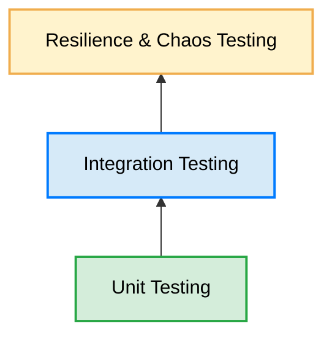

# Testing Strategy Traceability

The testing strategy defined in this document is aligned with the architectural decisions and components described throughout the rest of the project documentation.

Each test suite verifies specific behaviors of the distributed system, ensuring that design decisions can be objectively validated.

| Document | Verified Aspects |
|-----------|------------------|
| **ARCHITECTURE.md** | Service communication, API Gateway, Redis, RabbitMQ, and component monitoring. |
| **SECURITY.md** | Login, Step Token, Refresh Token, authorization, credential expiration, and authentication security. |
| **SYNCHRONIZATION.md** | Store and Forward, Event Log, Retry, Exponential Backoff, and Idempotency. |
| **CONFLICT_RESOLUTION.md** | Event deduplication, concurrency, negative inventory, and conflict resolution. |
| **DESIGNDECISIONS.md** | Validation of key architectural decisions adopted during system design. |

---

# Distributed Testing Pyramid

The automation strategy follows an adaptation of the classic testing pyramid tailored for distributed architectures with Offline-First clients.

## 1. Unit Testing

Forms the foundation of the automation strategy and verifies the business logic of each NestJS service in isolation, using mock objects (*Mocks*) for external dependencies such as TypeORM, Redis, and RabbitMQ.

---

## 2. Integration Testing

Validates interactions between different system components, verifying communication between the API Gateway, PostgreSQL, Redis, and RabbitMQ under representative distributed architecture scenarios.

---

## 3. Resilience and Chaos Testing

Evaluates system behavior under failure conditions inherent to distributed architectures, such as network partitions, connectivity loss, event duplication, race conditions, and clock drift between clients and server.

---

> **Note**
>
> The following scenarios represent resilience tests designed to validate architectural behavior under failure conditions typical of distributed systems. Depending on the execution environment, these scenarios can be implemented through automated tests, integration environments, or controlled simulations.

---

# Test Coverage Matrix

| Evaluated Module | Test File | Primary Scenarios |
|-----------------|-------------------|------------------------|
| **Authentication** | `auth.service.spec.ts` | Login, Step Token, Password Change, and Refresh Token. |
| **Users** | `users.service.spec.ts` | User creation, temporary password, and RabbitMQ event publishing. |
| **Synchronization** | `sync.service.spec.ts` | Idempotency, event deduplication, negative inventory, and sales processing. |
| **Monitoring** | `monitoring.service.spec.ts` | Heartbeats, Redis TTL expiration, and presence state updates. |

---

# Scope of Testing Strategy

This document describes the proposed validation strategy for the case study and the main scenarios considered during architectural design.

The scope includes:

- Unit testing of domain services.
- Integration testing between components.
- Validation of synchronization and idempotency.
- Resilience scenarios facing infrastructure failures.
- Verification of asynchronous events and monitoring mechanisms.

Out of scope for this document:

- Performance Testing.
- Load Testing.
- Stress Testing.
- External security audits.
- Penetration Testing.

These aspects require specialized tools, infrastructure, and methodologies that exceed the scope of this case study.

---

# Conclusion

The testing strategy presented in this document seeks to validate both functional behavior and resilience of a distributed architecture based on differentiated connectivity strategies.

Beyond proving that each component works in isolation, testing verifies that the system maintains fundamental properties under infrastructure failures, loss of connectivity, and concurrent event processing.

This approach allows evaluating architectural decisions such as local persistence, deferred synchronization, idempotency, Heartbeat monitoring, and asynchronous service communication.

Together, the tests provide a systematic mechanism to validate that decisions described in **ARCHITECTURE.md**, **SECURITY.md**, **SYNCHRONIZATION.md**, **CONFLICT_RESOLUTION.md**, and **DESIGNDECISIONS.md** behave in accordance with the goals established for this case study.

Although this document does not address performance testing or specialized security audits, it establishes a solid foundation to validate functionality, integrity, and resilience of the system under representative scenarios of a distributed environment.
