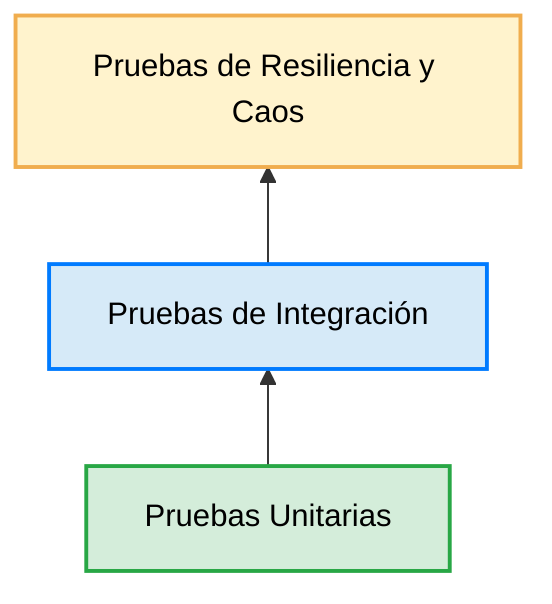

# Trazabilidad de la Estrategia de Pruebas

La estrategia de pruebas definida en este documento se encuentra alineada con las decisiones arquitectónicas y los componentes descritos en el resto de la documentación del proyecto.

Cada conjunto de pruebas verifica comportamientos específicos del sistema distribuido, garantizando que las decisiones de diseño puedan validarse de manera objetiva.

| Documento | Aspectos Verificados |
|-----------|----------------------|
| **ARCHITECTURE.md** | Comunicación entre servicios, API Gateway, Redis, RabbitMQ y monitoreo de componentes. |
| **SECURITY.md** | Login, Step Token, Refresh Token, autorización, expiración de credenciales y seguridad de autenticación. |
| **SYNCHRONIZATION.md** | Store and Forward, Event Log, Retry, Exponential Backoff e Idempotencia. |
| **CONFLICT_RESOLUTION.md** | Deduplicación de eventos, concurrencia, stock negativo y resolución de conflictos. |
| **DESIGNDECISIONS.md** | Validación de las principales decisiones arquitectónicas adoptadas durante el diseño del sistema. |

---

# Pirámide de Pruebas Distribuidas

La estrategia de automatización sigue una adaptación de la pirámide clásica de pruebas para arquitecturas distribuidas con clientes Offline-First.

## 1. Pruebas Unitarias

Constituyen la base de la estrategia de automatización y verifican la lógica de negocio de cada servicio de NestJS en aislamiento, utilizando objetos simulados (*Mocks*) para dependencias externas como TypeORM, Redis y RabbitMQ.

---

## 2. Pruebas de Integración

Validan la interacción entre los distintos componentes del sistema, verificando la comunicación entre el API Gateway, PostgreSQL, Redis y RabbitMQ bajo escenarios representativos de la arquitectura distribuida.

---

## 3. Pruebas de Resiliencia y Caos

Evalúan el comportamiento del sistema frente a fallos propios de arquitecturas distribuidas, como particiones de red, pérdida de conectividad, duplicación de eventos, condiciones de carrera y desviaciones temporales entre clientes y servidor.

---

> **Nota**
>
> Los siguientes escenarios representan pruebas de resiliencia diseñadas para validar el comportamiento de la arquitectura frente a fallos propios de sistemas distribuidos. Dependiendo del entorno de ejecución, estos escenarios pueden implementarse mediante pruebas automatizadas, entornos de integración o simulaciones controladas.

---

# Matriz de Cobertura de Pruebas

| Módulo Evaluado | Archivo de Prueba | Escenarios Principales |
|-----------------|-------------------|------------------------|
| **Autenticación** | `auth.service.spec.ts` | Login, Step Token, Cambio de Contraseña y Refresh Token. |
| **Usuarios** | `users.service.spec.ts` | Creación de usuarios, contraseña temporal y publicación de eventos en RabbitMQ. |
| **Sincronización** | `sync.service.spec.ts` | Idempotencia, deduplicación de eventos, stock negativo y procesamiento de ventas. |
| **Monitoreo** | `monitoring.service.spec.ts` | Heartbeats, expiración de TTL en Redis y actualización del estado de presencia. |

---

# Alcance de la Estrategia de Pruebas

Este documento describe la estrategia de validación propuesta para el caso de estudio y los principales escenarios considerados durante el diseño de la arquitectura.

El alcance incluye:

- Pruebas unitarias de los servicios de dominio.
- Pruebas de integración entre componentes.
- Validación de sincronización e idempotencia.
- Escenarios de resiliencia frente a fallos de infraestructura.
- Verificación de eventos asíncronos y mecanismos de monitoreo.

No forman parte del alcance de este documento:

- Pruebas de rendimiento (*Performance Testing*).
- Pruebas de carga (*Load Testing*).
- Pruebas de estrés (*Stress Testing*).
- Auditorías externas de seguridad.
- Pruebas de penetración (*Penetration Testing*).

Estos aspectos requieren herramientas, infraestructura y metodologías especializadas que exceden el objetivo de este caso de estudio.

---

# Conclusión

La estrategia de pruebas presentada en este documento busca validar tanto el comportamiento funcional como la resiliencia de una arquitectura distribuida basada en estrategias de conectividad diferenciadas.

Más allá de comprobar que cada componente funciona de manera aislada, las pruebas verifican que el sistema mantenga sus propiedades fundamentales ante fallos de infraestructura, pérdida de conectividad y procesamiento concurrente de eventos.

Esta aproximación permite evaluar decisiones arquitectónicas como la persistencia local, la sincronización diferida, la idempotencia, el monitoreo mediante Heartbeats y la comunicación asíncrona entre servicios.

En conjunto, las pruebas proporcionan un mecanismo sistemático para validar que las decisiones descritas en **ARCHITECTURE.md**, **SECURITY.md**, **SYNCHRONIZATION.md**, **CONFLICT_RESOLUTION.md** y **DESIGNDECISIONS.md** se comportan conforme a los objetivos planteados para este caso de estudio.

Aunque este documento no aborda pruebas de rendimiento o auditorías de seguridad especializadas, establece una base sólida para validar la funcionalidad, la integridad y la resiliencia del sistema bajo escenarios representativos de un entorno distribuido.
