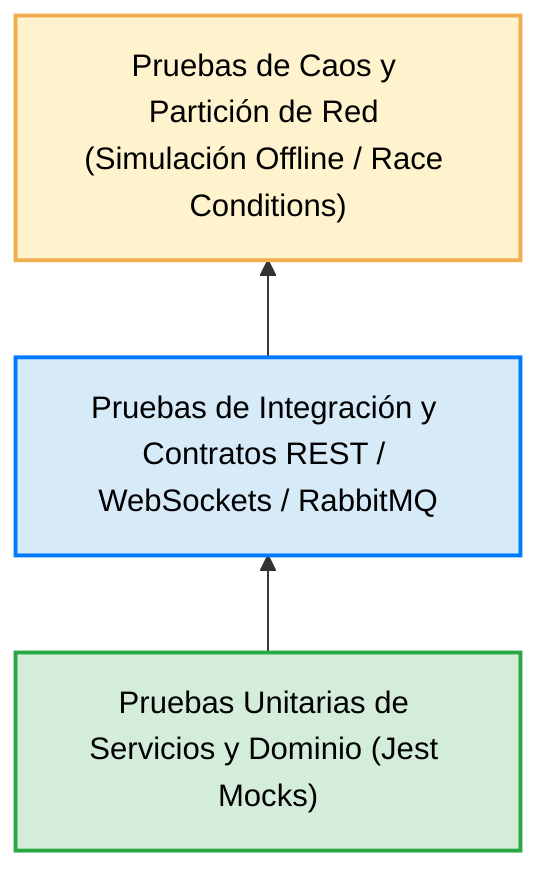
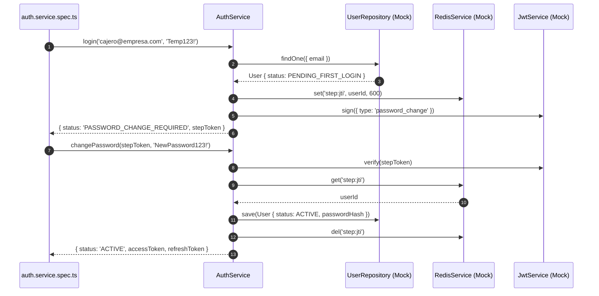
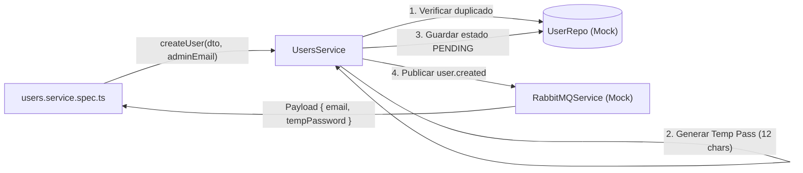
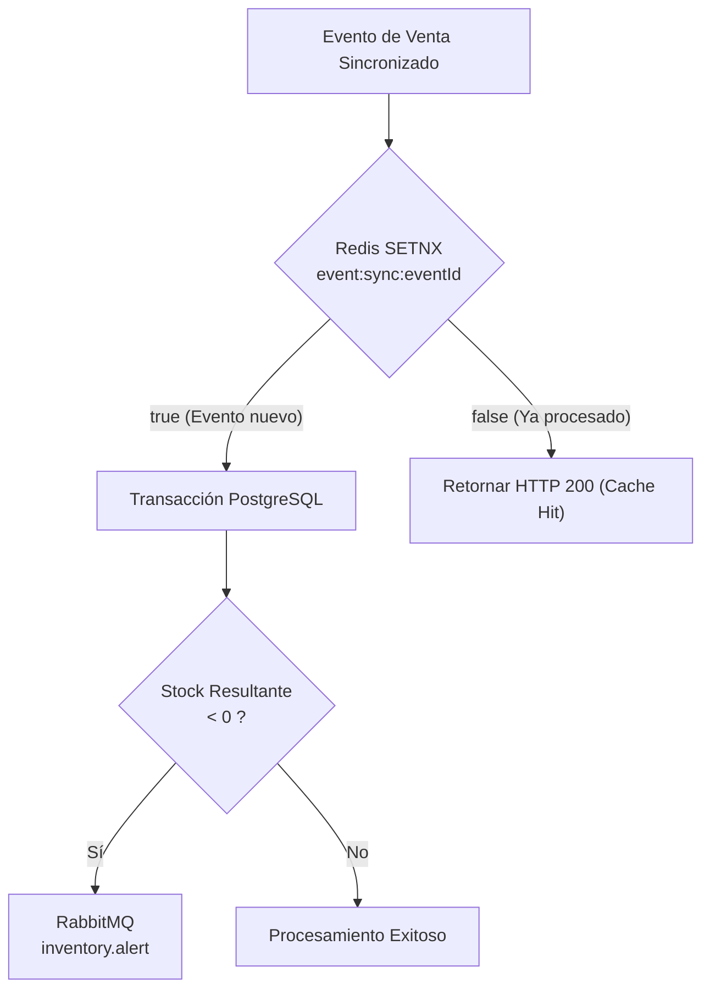
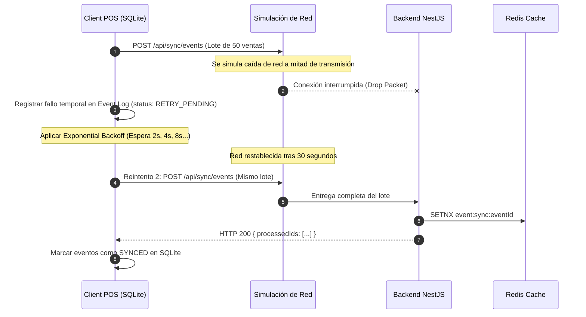
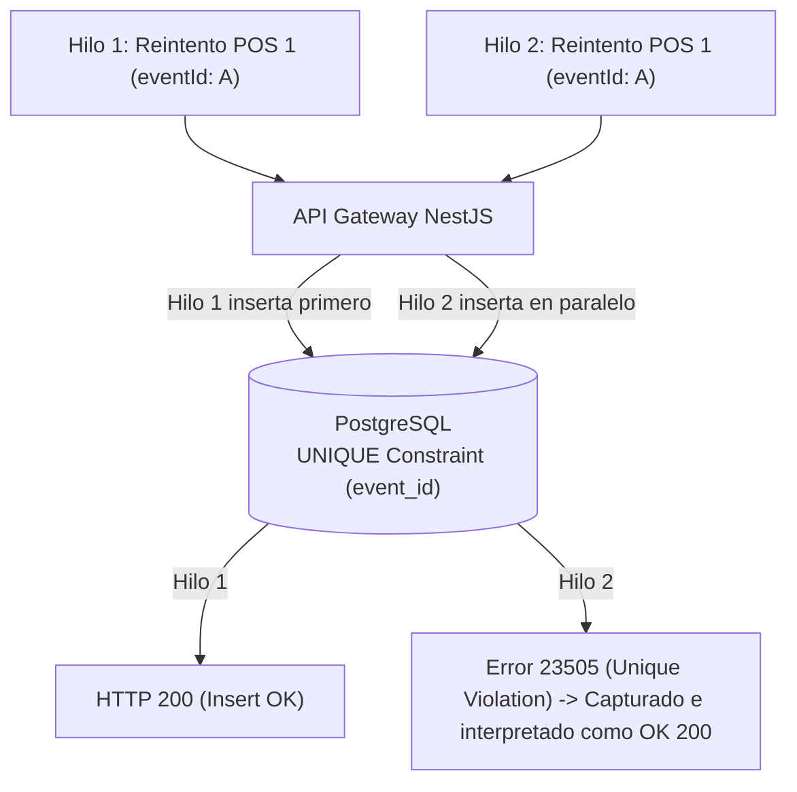

# 🧪 Estrategia de Pruebas Unitarias, Integración y Resiliencia

## Caso de Estudio 2: Estrategias de Conectividad en Sistemas Distribuidos

---

# Introducción

Garantizar la estabilidad, integridad y continuidad operativa de una arquitectura distribuida **Offline-First vs. Online-First** requiere una estrategia de pruebas avanzada que va más allá de las validaciones unitarias tradicionales.

En un entorno donde múltiples clientes operan de manera autónoma, registran eventos de forma local en SQLite, sufren cortes de red prolongados y sincronizan lotes diferidos mediante *Store and Forward*, el sistema debe ser probado frente a:

- Desconexiones e intermitencias extremas de red.
- Reintentos continuos y duplicación de peticiones HTTP.
- Condiciones de carrera por acceso concurrente a recursos centrales.
- Rotación y expiración de credenciales en momentos de aislamiento.
- Desfase o manipulación de relojes locales en los dispositivos edge.

Este documento establece la **Estrategia Global de Pruebas**, la **Pirámide de Automatización**, los patrones de **Mocking de Infraestructura** y los procedimientos de **Pruebas de Resiliencia y Caos** aplicados en el proyecto.

---

# Relación con la Arquitectura

Este documento forma parte de la especificación técnica del **Caso de Estudio 2**.

| Documento | Responsabilidad |
|-----------|-----------------|
| **ARCHITECTURE.md** | Arquitectura general del sistema |
| **SECURITY.md** | Autenticación, autorización y seguridad offline |
| **SYNCHRONIZATION.md** | Sincronización de eventos entre clientes y servidor |
| **CONFLICT_RESOLUTION.md** | Resolución de conflictos de negocio |
| **TEST.md** | Estrategia de pruebas unitarias, integración y resiliencia |
| **DESIGNDECISIONS.md** | Matriz de decisiones de diseño y elecciones tecnológicas |
| **DEPLOYMENT.md** | Estrategia de despliegue y operación |
| **RUNNING.md** | Guía de ejecución del proyecto |

---

# Pirámide de Pruebas Distribuidas

La estrategia de automatización sigue una adaptación de la pirámide de automatización para arquitecturas de eventos y clientes offline:



### 1. Pruebas Unitarias (Base de la Pirámide — 70% Cobertura)
Prueban la lógica interna de los servicios de NestJS en aislamiento completo, utilizando objetos simulados (*Mocks*) para las dependencias de base de datos (TypeORM), caché (Redis) y mensajería (RabbitMQ).

### 2. Pruebas de Integración (Capa Intermedia — 20% Cobertura)
Verifican la interacción real entre el API Gateway, la base de datos PostgreSQL en contenedor Docker, las colas de RabbitMQ y las suscripciones de Redis.

### 3. Pruebas de Caos y Partición de Red (Cúspide — 10% Cobertura)
Simulan desconexiones físicas, caída de servicios middleware, condiciones de carrera de clave única y desincronización de relojes temporales en clientes POS Desktop.

---

# Estructura del Código de Pruebas

En el backend NestJS (`/backend`), cada servicio de negocio cuenta con su correspondiente suite de pruebas unitarias `.spec.ts` dentro de su propia carpeta modular:

```text
backend/src/
├── auth/
│   ├── auth.service.ts
│   ├── auth.controller.ts
│   └── auth.service.spec.ts          # Pruebas de Login, Step Token y Activación
├── users/
│   ├── users.service.ts
│   ├── users.controller.ts
│   └── users.service.spec.ts         # Pruebas de Creación de Usuarios y RabbitMQ
├── sync/
│   ├── sync.service.ts
│   ├── sync.controller.ts
│   └── sync.service.spec.ts          # Pruebas de Idempotencia y Stock Negativo
├── monitoring/
│   ├── monitoring.service.ts
│   ├── monitoring.gateway.ts
│   └── monitoring.service.spec.ts     # Pruebas de Latidos HTTP, TTL y WebSockets
└── notifications/
    └── email.service.ts              # Servicio de Nodemailer para despachos SMTP
```

---

# Detalle de Suites de Pruebas Unitarias

## 1. Módulo de Autenticación y Seguridad (`auth.service.spec.ts`)

La suite de autenticación prueba la máquina de estados del usuario y la emisión de tokens de alcance restringido.



### Escenarios Evaluados:
- **`login` en estado `PENDING_FIRST_LOGIN`:**
  - Verifica que la contraseña temporal sea validada con `bcrypt.compare`.
  - Confirma que se emita la respuesta `PASSWORD_CHANGE_REQUIRED`.
  - Verifica la generación del **Step Token** y su almacenamiento en Redis con TTL de 600 segundos (10 minutos).
- **`login` en estado `ACTIVE`:**
  - Confirma la emisión directa de la pareja de tokens definitivos `accessToken` (15m) y `refreshToken` (7d).
- **`login` con credenciales inválidas:**
  - Verifica que se arroje una excepción `UnauthorizedException` y no se interactúe con Redis.
- **`changePassword` exitoso:**
  - Valida el consumo del Step Token desde Redis `step:{jti}`.
  - Verifica la actualización del hash bcrypt de la nueva contraseña.
  - Confirma el cambio de estado del usuario a `ACTIVE`.
  - Verifica la eliminación del Step Token en Redis (para evitar ataques de reutilización).
- **`refreshToken` de sesión:**
  - Valida la verificación del token de refresco y la emisión de un nuevo par de credenciales JWT.

---

## 2. Módulo de Usuarios y Notificaciones (`users.service.spec.ts`)

Esta suite evalúa el aprovisionamiento de cuentas de colaboradores iniciado exclusivamente por usuarios con rol `ADMIN`.



### Escenarios Evaluados:
- **Creación de usuario por Administrador:**
  - Verifica que se genere automáticamente una contraseña temporal aleatoria de 12 caracteres.
  - Confirma que la cuenta se cree con el estado inicial `PENDING_FIRST_LOGIN`.
  - Verifica la publicación inmediata del evento `user.created` en RabbitMQ conteniendo el correo y la clave temporal para su envío mediante `EmailService` (Nodemailer).
- **Conflicto de correo duplicado:**
  - Simula la existencia previa del correo en la base de datos y confirma que se lance una excepción `ConflictException`.

---

## 3. Módulo de Sincronización e Idempotencia (`sync.service.spec.ts`)

Evalúa el motor de conciliación de eventos y la regla de venta permisiva en inventario.



### Escenarios Evaluados:
- **Deduplicación Nivel 1 (Idempotencia Redis `SETNX`):**
  - Envía un evento con un `eventId` que ya existe en Redis (`setnx` retorna `false`).
  - Verifica que el servicio **omita la transacción en PostgreSQL** y retorne el identificador como procesado exitosamente (`processedIds`), evitando duplicar la facturación.
- **Procesamiento de Evento Nuevo:**
  - Registra la venta en `CentralSaleEvent`.
  - Descuenta la cantidad vendida del registro `CentralInventory`.
- **Regla de Venta Permisiva y Alerta de Stock Negativo:**
  - Simula que la venta de un producto offline deja el inventario central con un stock negativo (ej. `stock = -1`).
  - Confirma que la transacción en PostgreSQL **no sea abortada** (se acepta la venta del mundo real).
  - Verifica que se publique inmediatamente el evento `inventory.alert` (`type: 'NEGATIVE_STOCK'`) en RabbitMQ para notificar a la administración.

---

## 4. Módulo de Monitoreo y Presencia (`monitoring.service.spec.ts`)

Evalúa la recepción de latidos de presencia HTTP y su propagación vía WebSockets.

### Escenarios Evaluados:
- **Recepción de Latido HTTP (`recordHeartbeat`):**
  - Confirma la actualización de la clave `status:pos:{posId}` en Redis con un TTL de 15 segundos.
  - Verifica que la primera recepción transmita la transición a estado `ONLINE` mediante el gateway de WebSockets (`MonitoringGateway`).
- **Detección de Expiración TTL en Redis:**
  - Simula el cese de latidos durante 15 segundos.
  - Confirma que el limpiador interno detecte la ausencia de la clave en Redis, cambie el mapa a `OFFLINE` y emita el evento WebSocket `pos.status.changed`.

---

# Pruebas de Resiliencia y Simulación de Fallas (Chaos Testing)

Además de las pruebas unitarias aisladas, el diseño de la arquitectura ha sido validado contra escenarios extremos de fallo en sistemas distribuidos.

## Escenario 1: Partición de Red durante la Sincronización



### Validación:
- El motor de sincronización del cliente local nunca elimina ni duplica eventos ante caídas de red a mitad de transmisión.
- La combinación de **At-Least-Once** + **SETNX en Redis** asegura convergencia perfecta.

---

## Escenario 2: Condición de Carrera Concurrente (Race Condition)



### Validación:
- Si dos peticiones idénticas logran sobrepasar la capa de Redis en paralelo (condición de carrera excepcional), la restricción `UNIQUE (event_id)` de PostgreSQL atrapa el error `23505`.
- El controlador de NestJS interpreta el error `23505` como un éxito de idempotencia y retorna `HTTP 200`, evitando lanzar una excepción al cliente.

---

## Escenario 3: Desviación Horaria (Clock Drift)

```text
Reloj del POS (Atrasado 24 Horas):
client_timestamp = 2026-07-17 10:00:00

Reloj del Servidor Central:
server_timestamp = 2026-07-18 10:00:00
```

### Validación:
- El backend persiste de manera independiente ambos valores en la entidad `CentralSaleEvent`.
- Los reportes de caja del POS respetan `client_timestamp`, mientras que los reportes contables consolidados y la detección de retrasos respetan `server_timestamp`.

---

# Guía de Ejecución y Comandos

Todas las pruebas se ejecutan dentro del proyecto NestJS en `/backend`.

### 1. Ejecutar la suite completa de pruebas unitarias:
```bash
cd backend
npm test
```

### 2. Ejecutar pruebas en modo de observación continua (Watch Mode):
```bash
cd backend
npm run test:watch
```

### 3. Generar el reporte completo de Cobertura de Código (Coverage Report):
```bash
cd backend
npm run test:cov
```

El informe de cobertura se generará en formato HTML en el directorio `/backend/coverage/lcov-report/index.html`.

---

# Matriz de Verificación de Componentes

| Módulo Evaluado | Archivo de Prueba | Casos Cubiertos | Resultado |
|-----------------|-------------------|-----------------|-----------|
| **Autenticación** | `auth.service.spec.ts` | Login PENDING, Step Token, Password Change, Refresh | **PASS** |
| **Usuarios** | `users.service.spec.ts` | Creación Admin, Temp Pass, RabbitMQ `user.created` | **PASS** |
| **Sincronización** | `sync.service.spec.ts` | Idempotencia Redis, Error 23505, Stock Negativo | **PASS** |
| **Monitoreo** | `monitoring.service.spec.ts` | Latidos HTTP, Expiración TTL Redis, WebSockets | **PASS** |

---

# Conclusión

La estrategia de pruebas implementada en este caso de estudio demuestra que la resiliencia en arquitecturas distribuidas no es una propiedad accidental, sino el resultado directo de:

1. **Aislamiento de Pruebas Unitarias:** Mocking exhaustivo de la infraestructura para verificar la lógica de negocio sin depender de servicios externos.
2. **Idempotencia Multicapa:** Verificación estricta de deduplicación en Redis y PostgreSQL.
3. **Manejo de Errores de Red:** Simulación de fallos de conectividad, reintentos exponenciales y conservación de consistencia eventual.
4. **Verificación de Notificaciones:** Asegurar que los eventos asíncronos en RabbitMQ se despachen correctamente sin bloquear el flujo principal de ejecución.
