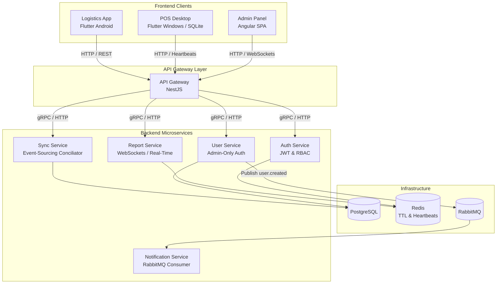
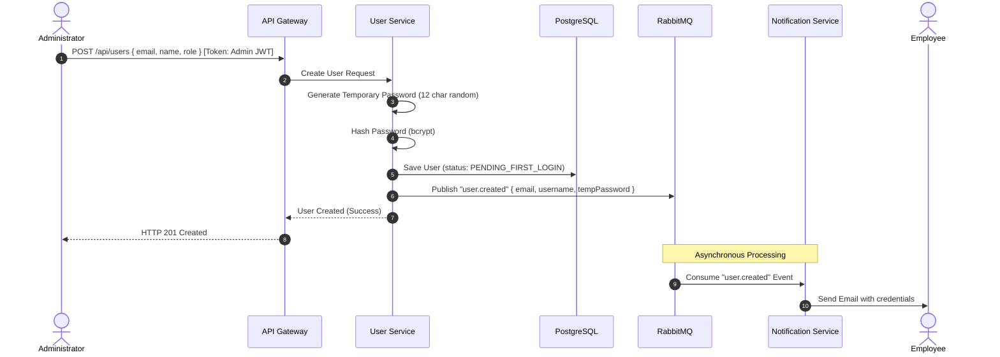
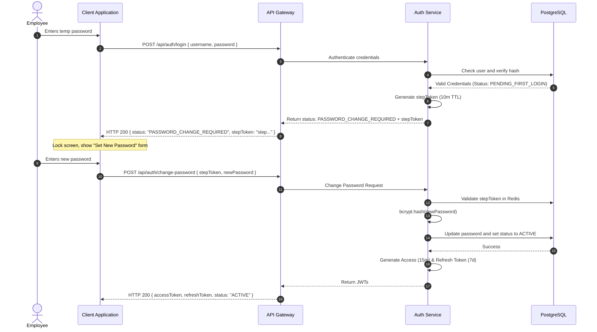

# 🏛️ Technical Architecture

## Case Study 2: Connectivity Strategies in Distributed Systems

---

# Architecture Overview

The system is designed as a combination of NestJS microservices in the backend and various frontend clients selected to meet specific business needs.



---

# Key Workflows & Sequences

## 1. Admin-Only User Creation

An administrator registers a new user. The temporary password is generated securely in the backend and dispatched asynchronously via RabbitMQ to the notification service.



## 2. First Login & Password Change

The user logs in with the temporary password and is prompted to change it. Final Access/Refresh tokens are not generated until this step is complete.



---

# Heartbeat Protocol (Real-Time Connectivity)

Each POS sends periodic heartbeats to update its status in Redis. If a heartbeat is missed, the monitoring service pushes a state change event to the Admin Dashboard via WebSockets.

```mermaid
flowchart LR
    POS[POS Client\nFlutter Windows]
    GW[API Gateway\nWebSockets / SSE]
    REDIS[(Redis\nStatus Store)]
    ADMIN[Admin Panel\nAngular SPA]

    POS -->|1. HTTP POST every 10s| GW
    GW -->|2. Update Status\nSETEX pos:101 15 'ONLINE'| REDIS
    REDIS -.->|3. TTL expires (15s)| REDIS
    GW2[Gateway Monitor] -->|4. Redis Pub-Sub| REDIS
    GW2 -->|5. WebSocket event| ADMIN
```

---

# Related Documents

- **SECURITY.md** — Authentication and security architecture.
- **SYNCHRONIZATION.md** — Event synchronization between clients and server.
- **CONFLICT_RESOLUTION.md** — Business conflict resolution.
- **TEST.md** — Unit testing strategy and automation.
- **DESIGNDECISIONS.md** — Design decisions and technology choices.
- **DEPLOYMENT.md** — Deployment and operations strategy.
- **RUNNING.md** — Project execution guide.
