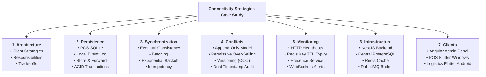
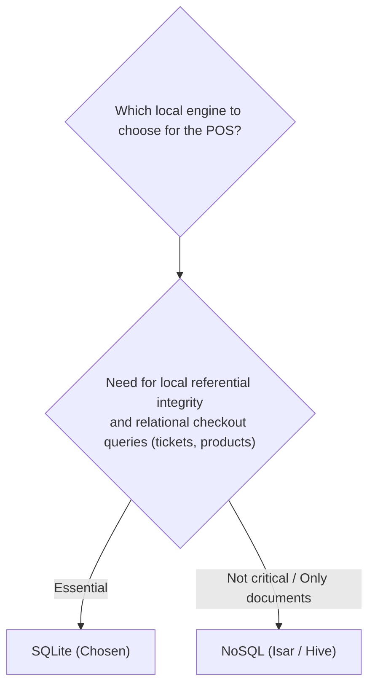
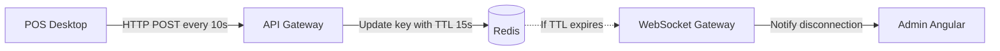

# ⚙️ Design Decisions

## Case Study 2: Connectivity Strategies in Distributed Systems

---

# Purpose

This document justifies the engineering reasoning and technical criteria adopted to design connectivity, local persistence, and client monitoring.

These decisions balance operational continuity, data consistency, and implementation complexity based on real business requirements.

---

# Case Study Roadmap

The following diagram summarizes the main architectural blocks developed throughout the project:

---

# Connectivity Strategy Rationale

We rejected a "one-size-fits-all" connectivity strategy. Each client is built with a specific architecture tailored to its constraints:

- **Point of Sale (POS) — *Offline-First*:** Loss of connection must never halt retail checkout. The POS runs on SQLite locally, allowing sales and tax printing to continue with zero latency. Sychronization is delayed.
- **Logistics App — *Online-First Permissive*:** Intermittent network cuts are tolerated. Instead of a full local database, the client utilizes simple caching for read-only pages and an in-memory queue to retry failed posts when connection recovers.
- **Admin Panel — *Online-First Strict*:** The administrator needs real-time operational metrics and connection statuses. Working offline makes no business sense for centralized dashboard management.

| Dimension | Admin (Angular) | Point of Sale (Flutter Desktop) | Logistics (Flutter Android) |
|---|---|---|---|
| **Strategy** | **Strict Online-First** | **Offline-First** | **Permissive Online-First** |
| **Local Persistence** | None (in-memory) | Relational DB (SQLite) | Read cache and temporary queue |
| **Fault Tolerance** | None (requires instant network) | Maximum (autonomy for days/weeks) | Medium (tolerance to micro-cuts) |
| **Consistency** | Immediate | Eventual | Immediate / Deferred eventual |
| **Complexity** | Low | High | Medium |

---

# Local Database Selection: SQLite

We selected **SQLite** over documental NoSQL local stores (e.g., Isar or Hive) for the POS Windows Desktop client:

- **Strict Referential Integrity:** Sales data is relational (receipt headers, product lines, tax calculations, payments). Maintaining these relationships natively via foreign keys avoids bug-prone application-level code.
- **ACID Transactions:** Ensures local receipt entries do not corrupt during physical store power outages.
- **SQLCipher Encryption:** Fully compiles as a lightweight static library inside Flutter for Windows to protect sensitive local tables.

---

# Real-Time Monitoring: HTTP Heartbeats + Redis TTL

To track POS connection statuses, we implemented **HTTP POST Heartbeats** combined with **Redis TTL**:

1. Each POS calls `POST /api/heartbeat` every 10 seconds.
2. The Gateway updates Redis: `SETEX status:pos:{id} 15 "ONLINE"`.
3. If no heartbeat is received, the Redis key expires. The Gateway detects this event and triggers a WebSocket alert (`pos.status.changed`) to notify the Angular Admin dashboard.
4. **Benefit:** This prevents maintaining thousands of open WebSocket TCP ports on the Gateway for idle clients, maximizing server throughput.

---

# Negative Stock Rule and Offline Selling

One of the main logical conflicts in *Offline-First* architectures is inventory consistency. If multiple registers make sales offline, it is impossible to guarantee that the stock available on the server matches the physical reality of the store.

### Chosen Policy: Permissive Over-Selling
- If the system blocked checkout when the local register's stock reaches zero, an inventory discrepancy in the database would physically prevent a cashier from charging a customer holding the actual item in hand.
- The POS registers the transaction and allows local negative stock.
- During synchronization, the server processes the sales and updates the central inventory in PostgreSQL. If the consolidated inventory goes below zero, the system raises an automatic operational alert.
- Stock consistency is treated as a **deferred operational reconciliation process** rather than a hard constraint on the checkout application.

---

# Related Documents

- **ARCHITECTURE.md** — General system architecture.
- **SECURITY.md** — Authentication and security architecture.
- **SYNCHRONIZATION.md** — Event synchronization between clients and server.
- **CONFLICT_RESOLUTION.md** — Business conflict resolution.
- **TEST.md** — Unit testing strategy and automation.
- **DEPLOYMENT.md** — Deployment and operations strategy.
- **RUNNING.md** — Project execution guide.
