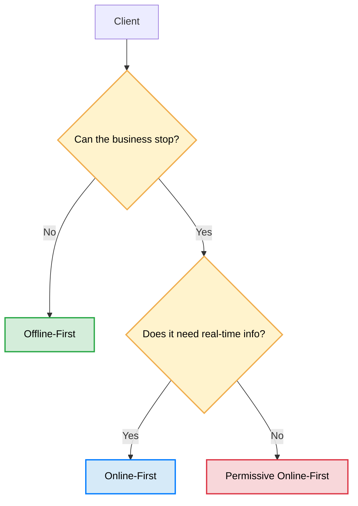

# 🏛️ Case Study 2: Connectivity Strategies in Distributed Systems

### How to select between Offline-First and Online-First according to business rules

---

# Introduction

When designing a distributed system, connectivity is usually assumed to be a permanent resource.

However, many real-world environments do not operate under this premise. An unstable connection, a saturated network, or even a complete loss of communication are part of normal system behavior.

In this context, an engineering question arises that conditions the entire architecture:

> **How should an application behave when connectivity is no longer guaranteed?**

Answering this question involves much more than deciding whether an application will be *Offline-First* or *Online-First*. It means first understanding what the business expects from each client, what their operational constraints are, and what the consequences of stopping their operations would be.

This case study documents the analytical process used to select different connectivity strategies within the same platform, demonstrating that a single solution rarely meets the needs of all users.

The presented architecture does not start from a specific technology.

It starts from an engineering question.

---

# Scope

This case study does not claim to demonstrate that there is a universal strategy for building distributed systems.

Neither does it seek to implement a reusable synchronization framework or compare technologies from a performance standpoint.

Its objective is to document the architectural reasoning that allowed selecting different connectivity strategies according to business constraints, analyzing the alternatives considered, and justifying the decisions adopted.

The technologies used represent only one possible implementation of these decisions.

---

# Business Problem

The platform is composed of three applications collaborating on the same ecosystem of services.

Although all consume the same infrastructure, their responsibilities are completely different.

Designing a single connectivity strategy for all clients would introduce unnecessary complexity in some cases or limit critical capabilities in others.

Understanding these differences was the starting point of the design process.

---

## Administration

The administrative system concentrates the global view of the operation.

Its main responsibilities include:

- User administration.
- Permissions management.
- Operational monitoring.
- Indicator visualization.
- Client state supervision.
- Consolidated information query.

The information presented must remain updated to reflect the real state of the platform.

For this reason, the availability of real-time information represents an operational necessity.

---

## Point of Sale (POS)

The Point of Sale has the most important constraint of the system.

> **The business cannot stop selling due to a loss of connectivity.**

Each sale represents a critical operation.

Temporary unavailability of the server should not prevent registering new transactions.

This implies that the client must be able to operate autonomously for extended periods, storing operations locally until communication with the platform is restored.

Operational continuity has higher priority than immediate synchronization.

---

## Logistics Application

The application used by logistics personnel presents a different scenario.

Users need to:

- Query operational information.
- Register deliveries.
- Update statuses.
- Report movements.

Although temporary loss of connectivity can occur during daily operations, temporarily stopping these activities does not represent the same impact as stopping a Point of Sale.

However, data loss is unacceptable.

The connectivity strategy had to address this difference.

---

# System Constraints

Before evaluating any technology, it was necessary to identify the constraints imposed by the business.

These constraints delimit the set of possible solutions and condition all subsequent decisions.

- The Point of Sale must continue to operate even without a connection.
- Administration needs information practically in real-time.
- The logistics application must tolerate temporary interruptions without compromising data integrity.
- All clients share the same backend, although they do not share the same operational needs.
- Synchronization must not produce duplicate operations.
- The server must retain authority over critical information.
- Authentication must remain secure even when a client remains offline for long periods.
- The system must automatically detect disconnected clients.

These constraints explain why a single connectivity strategy is not suitable for the entire platform.

---

# Architectural Objectives

From these constraints, the objectives that the solution had to meet were defined.

- Guarantee operational continuity.
- Minimize data loss.
- Maintain system consistency.
- Reduce complexity when it does not add value.
- Adapt the connectivity strategy according to the needs of each client.
- Reuse the authentication infrastructure developed in Case Study 1.
- Maintain an extensible architecture for future clients.

These objectives will subsequently serve as criteria to evaluate the different design alternatives.

---

# Questions that Guided this Case Study

Before writing a single line of code, several engineering questions arose.

Answering them allowed discarding alternatives and better understanding the constraints of the problem.

## Connectivity

- Do all clients need the same connectivity strategy?
- What operations can be stopped when connection is lost and which must continue functioning?
- How does the expected behavior of the system change after minutes, hours, or even days without connectivity?

## Persistence

- What information should be considered the source of truth in the client?
- What information must remain exclusively on the server?
- When is a local cache sufficient?
- When is a full synchronization engine necessary?

## Synchronization

- How to guarantee that an operation synchronized multiple times produces a single effect?
- How to reconcile different states between client and server?
- How to resolve conflicts generated by multiple clients?

## Observability

- How to detect disconnected clients?
- How to know the status of thousands of clients without maintaining permanent connections?
- How to report status changes to the administrator in real-time?

## Security

- How does authentication behave during long offline periods?
- What responsibilities must remain exclusively on the server side?
- How to manage sessions, temporary credentials, and mandatory password changes when connectivity is no longer guaranteed?

---

# Decision Tree

The connectivity strategy was selected following a sequence of questions.

---

# Document Navigation

- 📘 **Overview (this file)**
- 📘 [Architecture & Flows](en/ARCHITECTURE.md)
- 📘 [Design Decisions](en/DESIGNDECISIONS.md)
- 📘 [Synchronization](en/SYNCHRONIZATION.md)
- 📘 [Conflict Resolution](en/CONFLICT_RESOLUTION.md)
- 📘 [Security & Authentication](en/SECURITY.md)
- 📘 [Testing Strategy](en/TEST.md)
- 📘 [Running Guide](en/RUNNING.md)
