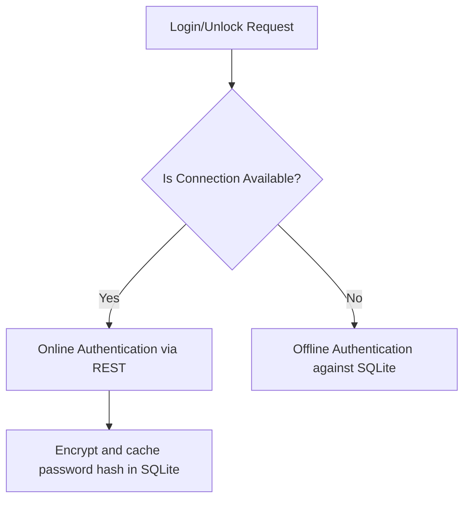

# 🔐 Security and Authentication in Distributed Environments

## Case Study 2: Connectivity Strategies in Distributed Systems

---

# Temporary Credentials & Password Transition

Administrators are the sole actors allowed to register new users.
- Users receive a temporary password via SMTP (RabbitMQ event).
- During first login, the user receives a short-lived `stepToken` and the status `PASSWORD_CHANGE_REQUIRED`.
- The user is locked out of core business endpoints until they submit a new password to `/api/auth/change-password`.

---

# Token Expiration during Network Cuts

Standard session JWTs are short-lived (15 minutes). If connection is lost, standard token refresh calls will fail.

### Hybrid Offline Session Strategy

1. **Cached Credential Hash:** Upon successful online login, the POS encrypts and stores the cashier's credentials hash and active permissions inside SQLite.
2. **Local Validation:** If offline, screen unlocks and cashier changes are validated locally.
3. **Database Cifrado:** The local SQLite file is encrypted using SQLCipher. The decryption key is protected using the Operating System's secure credential storage (Windows DPAPI/Credential Manager).

---

# Related Documents

- **ARCHITECTURE.md** — General system architecture.
- **SYNCHRONIZATION.md** — Event synchronization between clients and server.
- **CONFLICT_RESOLUTION.md** — Business conflict resolution.
- **TEST.md** — Unit testing strategy and automation.
- **DESIGNDECISIONS.md** — Design decisions and technology choices.
- **DEPLOYMENT.md** — Deployment and operations strategy.
- **RUNNING.md** — Project execution guide.
