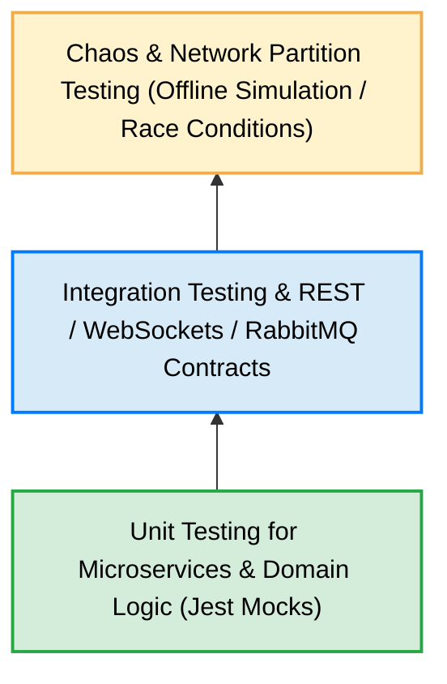
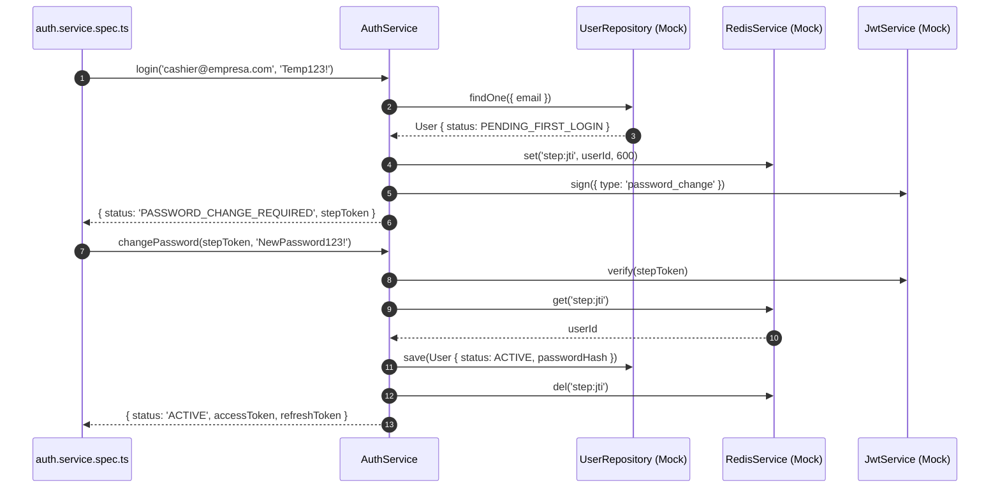
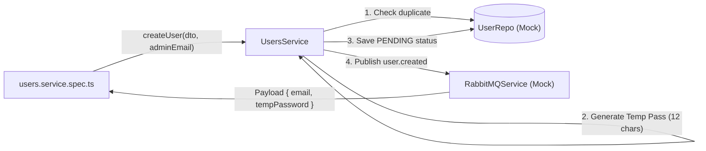
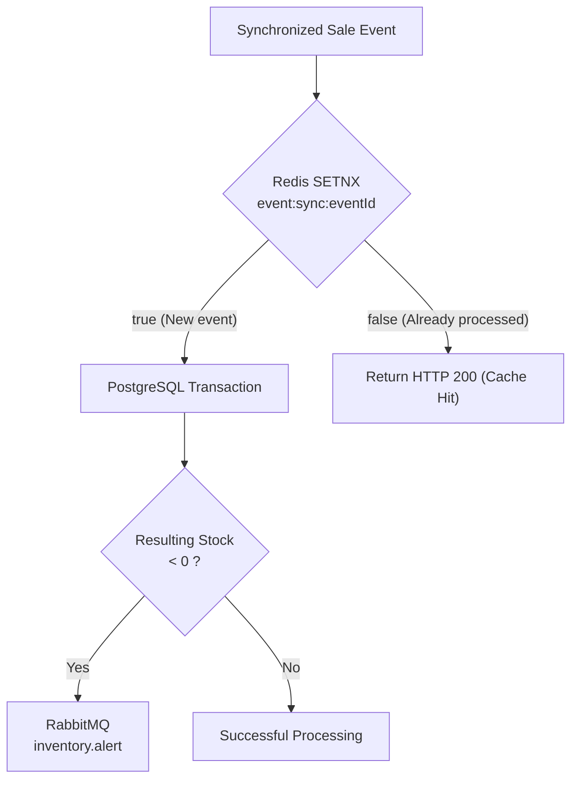
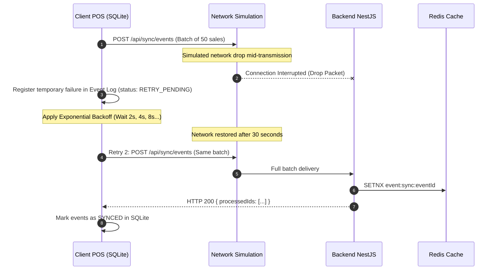
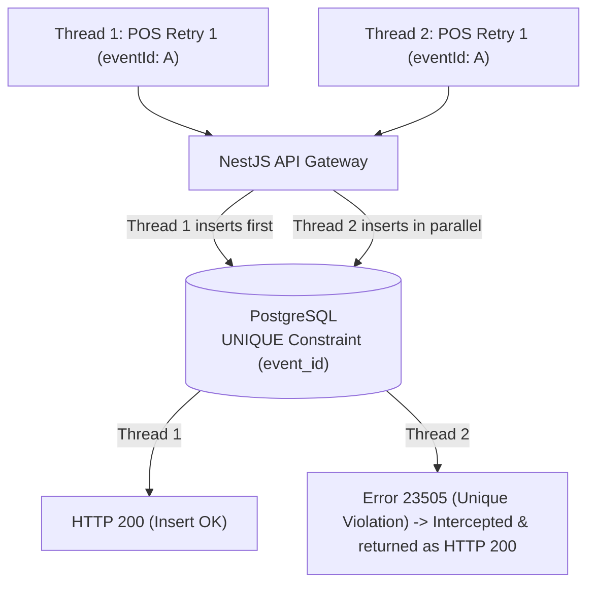

# 🧪 Unit, Integration, and Resilience Testing Strategy

## Case Study 2: Connectivity Strategies in Distributed Systems

---

# Introduction

Ensuring the stability, integrity, and operational continuity of an **Offline-First vs. Online-First** distributed architecture requires an advanced testing strategy that goes beyond traditional unit validation.

In an environment where multiple clients operate autonomously, store events locally in SQLite, experience prolonged network outages, and synchronize deferred batches using *Store and Forward*, the system must be tested against:

- Extreme network disconnections and jitter.
- Continuous retry loops and HTTP request duplication.
- Race conditions caused by concurrent access to central resources.
- Token rotation and credential expiration during isolation periods.
- Clock drift or local time manipulation on edge devices.

This document establishes the **Global Testing Strategy**, the **Automation Pyramid**, **Infrastructure Mocking** patterns, and **Resilience & Chaos Testing** procedures applied in the project.

---

# Relation to Architecture

This document is part of the technical specification for **Case Study 2**.

| Document | Responsibility |
|----------|----------------|
| **ARCHITECTURE.md** | General system architecture |
| **SECURITY.md** | Authentication, authorization, and offline security |
| **SYNCHRONIZATION.md** | Event synchronization between clients and server |
| **CONFLICT_RESOLUTION.md** | Business conflict resolution |
| **TEST.md** | Unit, integration, and resilience testing strategy |
| **DESIGNDECISIONS.md** | Design decisions matrix and technology choices |
| **DEPLOYMENT.md** | Deployment and operations strategy |
| **RUNNING.md** | Project execution guide |

---

# Distributed Testing Pyramid

The automation strategy adapts the testing pyramid for event-driven architectures and offline clients:



### 1. Unit Testing (Pyramid Base — 70% Coverage)
Tests internal service logic in complete isolation using mock objects for database dependencies (TypeORM), caching (Redis), and messaging (RabbitMQ).

### 2. Integration Testing (Middle Layer — 20% Coverage)
Verifies real interactions between the API Gateway, PostgreSQL in a Docker container, RabbitMQ queues, and Redis subscriptions.

### 3. Chaos & Network Partition Testing (Pyramid Peak — 10% Coverage)
Simulates physical network disconnections, middleware failures, unique key constraint race conditions, and POS Desktop clock drift.

---

# Test Code Structure

In the NestJS backend (`/backend`), each business service includes a corresponding `.spec.ts` unit test suite inside its modular folder:

```text
backend/src/
├── auth/
│   ├── auth.service.ts
│   ├── auth.controller.ts
│   └── auth.service.spec.ts          # Login, Step Token, and Account Activation Tests
├── users/
│   ├── users.service.ts
│   ├── users.controller.ts
│   └── users.service.spec.ts         # User Creation & RabbitMQ Tests
├── sync/
│   ├── sync.service.ts
│   ├── sync.controller.ts
│   └── sync.service.spec.ts          # Idempotency & Negative Stock Tests
├── monitoring/
│   ├── monitoring.service.ts
│   ├── monitoring.gateway.ts
│   └── monitoring.service.spec.ts     # HTTP Heartbeats, TTL & WebSockets Tests
└── notifications/
    └── email.service.ts              # Nodemailer service for SMTP dispatch
```

---

# Unit Test Suite Details

## 1. Authentication & Security Module (`auth.service.spec.ts`)

The authentication suite evaluates the user state machine and single-use token issuance.



### Evaluated Scenarios:
- **`login` in `PENDING_FIRST_LOGIN` State:**
  - Verifies that the temporary password is validated using `bcrypt.compare`.
  - Confirms the `PASSWORD_CHANGE_REQUIRED` status is returned.
  - Verifies **Step Token** generation and storage in Redis with a 600-second (10-minute) TTL.
- **`login` in `ACTIVE` State:**
  - Confirms direct issuance of full session tokens (`accessToken` 15m & `refreshToken` 7d).
- **`login` with Invalid Credentials:**
  - Verifies an `UnauthorizedException` is thrown and Redis is not called.
- **Successful `changePassword`:**
  - Validates Step Token consumption from Redis `step:{jti}`.
  - Verifies bcrypt hashing of the new password.
  - Confirms user status update to `ACTIVE`.
  - Verifies Step Token deletion in Redis to prevent replay attacks.
- **Session `refreshToken`:**
  - Validates refresh token verification and issuance of a new JWT pair.

---

## 2. User Management & Notifications Module (`users.service.spec.ts`)

This suite evaluates user provisioning initiated strictly by users with the `ADMIN` role.



### Evaluated Scenarios:
- **User Creation by Administrator:**
  - Verifies automatic generation of a 12-character random temporary password.
  - Confirms initial assignment of `PENDING_FIRST_LOGIN` status.
  - Verifies immediate publication of the `user.created` event to RabbitMQ containing the email and temporary password for dispatch via `EmailService` (Nodemailer).
- **Duplicate Email Conflict:**
  - Simulates prior email existence in the database and confirms a `ConflictException` is thrown.

---

## 3. Synchronization & Idempotency Module (`sync.service.spec.ts`)

Evaluates the event reconciliation engine and the permissive stock selling rule.



### Evaluated Scenarios:
- **Level-1 Idempotency (Redis `SETNX`):**
  - Sends an event with an `eventId` that already exists in Redis (`setnx` returns `false`).
  - Verifies that the service **bypasses the PostgreSQL transaction** and returns the event ID as successfully processed (`processedIds`), preventing double billing.
- **New Event Processing:**
  - Registers the sale in `CentralSaleEvent`.
  - Deducts the quantity sold from `CentralInventory`.
- **Permissive Sale Rule & Negative Stock Alert:**
  - Simulates an offline sale that leaves central inventory with negative stock (e.g., `stock = -1`).
  - Confirms the PostgreSQL transaction **is not aborted** (real-world sale is accepted).
  - Verifies immediate publication of the `inventory.alert` event (`type: 'NEGATIVE_STOCK'`) to RabbitMQ to notify administration.

---

## 4. Monitoring & Presence Module (`monitoring.service.spec.ts`)

Evaluates HTTP presence heartbeat reception and WebSockets propagation.

### Evaluated Scenarios:
- **HTTP Heartbeat Reception (`recordHeartbeat`):**
  - Confirms `status:pos:{posId}` key update in Redis with a 15-second TTL.
  - Verifies initial reception broadcasts an `ONLINE` status transition via `MonitoringGateway`.
- **Redis TTL Expiration Detection:**
  - Simulates a 15-second heartbeat pause.
  - Confirms internal monitor detects Redis key absence, changes map to `OFFLINE`, and emits the `pos.status.changed` WebSocket event.

---

# Resilience & Chaos Testing

In addition to isolated unit tests, the architecture design has been validated against extreme distributed system failure scenarios.

## Scenario 1: Network Partition During Synchronization



### Validation:
- The local client sync engine never loses or duplicates events during mid-transmission network drops.
- The combination of **At-Least-Once** + **Redis SETNX** guarantees eventual convergence.

---

## Scenario 2: Concurrent Race Condition



### Validation:
- If two identical requests bypass Redis in parallel (rare race condition), PostgreSQL's `UNIQUE (event_id)` constraint catches error `23505`.
- The NestJS controller intercepts error `23505` as an idempotency success and returns `HTTP 200`, preventing client-facing exceptions.

---

## Scenario 3: Clock Drift

```text
POS Client Clock (24 Hours Behind):
client_timestamp = 2026-07-17 10:00:00

Central Server Clock:
server_timestamp = 2026-07-18 10:00:00
```

### Validation:
- The backend independently persists both values in `CentralSaleEvent`.
- POS cash shift reports respect `client_timestamp`, while consolidated accounting reports and delay detection respect `server_timestamp`.

---

# Execution Commands

All tests are executed inside the NestJS project at `/backend`.

### 1. Run full unit test suite:
```bash
cd backend
npm test
```

### 2. Run unit tests in watch mode:
```bash
cd backend
npm run test:watch
```

### 3. Generate Code Coverage Report:
```bash
cd backend
npm run test:cov
```

The coverage report will be generated in HTML format inside `/backend/coverage/lcov-report/index.html`.

---

# Component Verification Matrix

| Evaluated Module | Test File | Covered Cases | Result |
|------------------|-----------|---------------|--------|
| **Auth** | `auth.service.spec.ts` | PENDING Login, Step Token, Password Change, Refresh | **PASS** |
| **Users** | `users.service.spec.ts` | Admin Creation, Temp Pass, RabbitMQ `user.created` | **PASS** |
| **Sync** | `sync.service.spec.ts` | Redis Idempotency, Error 23505, Negative Stock | **PASS** |
| **Monitoring** | `monitoring.service.spec.ts` | HTTP Heartbeats, Redis TTL Expiration, WebSockets | **PASS** |

---

# Conclusion

The testing strategy implemented in this case study demonstrates that resilience in distributed architectures is not an accidental property, but the direct result of:

1. **Unit Test Isolation:** Exhaustive dependency mocking to verify business logic without external service reliance.
2. **Multi-Layer Idempotency:** Strict deduplication verification across Redis and PostgreSQL.
3. **Network Error Handling:** Network failure simulation, exponential backoffs, and eventual consistency preservation.
4. **Notification Verification:** Ensuring asynchronous events in RabbitMQ dispatch properly without blocking main execution threads.
