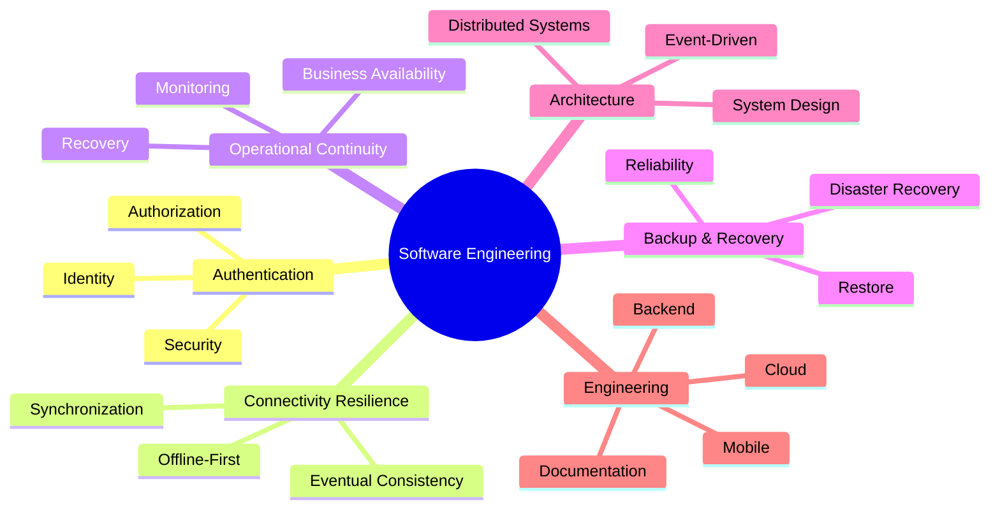

# 🛠️ Software Engineering Portfolio

> **A collection of software engineering case studies focused on architecture, distributed systems, backend engineering, and real-world engineering decisions.**

This repository documents how software systems are designed, evaluated, implemented, and evolved through practical engineering case studies.

Rather than showcasing CRUD applications or framework tutorials, every project begins with a real business problem, explores architectural alternatives, documents engineering trade-offs, and delivers a production-inspired implementation.

The goal is to demonstrate **engineering thinking**, **architectural reasoning**, and **software design**.

---

# 🧭 Engineering Focus



---

# 📚 Engineering Case Studies

| Case Study | Engineering Focus | Status |
|------------|-------------------|--------|
| 🔐 Authentication Architecture | Authentication, Security, Monolith vs Microservices | ✅ Completed |
| 📱 Offline-First POS | Connectivity Resilience, Synchronization, Offline-First | 🟡 In Progress |
| 🛰️ Distributed Synchronization Engine | Distributed Systems, Eventual Consistency | 🔵 Planned |
| 🚧 Future Case Studies | Backend, Cloud, Mobile & Software Architecture | 🔵 Planned |

---

# 🏗️ Engineering Methodology

Every case study follows the same engineering workflow.

```text
Business Problem
        ↓
Requirements Analysis
        ↓
Architectural Alternatives
        ↓
Engineering Decisions
        ↓
Implementation
        ↓
Validation
        ↓
Lessons Learned
```

Each project documents not only **how** the solution works, but also **why** it was designed that way.

---

# 🧩 Case Study Progression

The case studies are intentionally connected.

Rather than presenting isolated projects, each study introduces a new business challenge and builds upon decisions made in previous stages of the platform's evolution.

```text
Case Study 1
Authentication Architecture
(Identity, Security, Authorization)
        ↓
Case Study 2
Connectivity Strategies
(Offline-First, Synchronization, Resilience)
        ↓
Case Study 3
Backup & Recovery
(Disaster Recovery, Restore Procedures, Business Continuity)
        ↓
Case Study 4
Operational Continuity
(Monitoring, Availability, Operational Processes)
        ↓
Case Study 5
Integrated Livestock Management Platform
(Real Business System Combining All Previous Capabilities)
```

Each case study introduces new constraints, new architectural decisions, and new engineering trade-offs while preserving and extending previously established foundations.

The objective is to simulate how real-world software systems evolve as business requirements become increasingly complex.

---

# 📖 Documentation

Each case study includes engineering documentation describing the reasoning behind the implementation.

Typical documents include:

- `README.md`
- `ARCHITECTURE.md`
- `DESIGNDECISIONS.md`
- `SECURITY.md`
- `SYNCHRONIZATION.md`
- `CONFLICT_RESOLUTION.md`
- `TEST.md`
- `DEPLOYMENT.md`
- `RUNNING.md`

---

# ⚙️ Technologies

### Backend

- NestJS
- Node.js

### Frontend & Mobile

- Angular
- Flutter

### Data & Messaging

- PostgreSQL
- MySQL
- SQLite
- Redis
- RabbitMQ

### Infrastructure

- Docker
- Azure
- AWS

---

# 🎯 Core Topics

- Software Architecture
- Backend Engineering
- Distributed Systems
- Event-Driven Architecture
- Security Engineering
- Offline-First Systems
- Connectivity Resilience
- Backup & Recovery
- Cloud Architecture
- System Design

---

# 🚀 Roadmap

The portfolio will continue expanding with engineering case studies covering topics such as:

- Connectivity Resilience
- Backup & Recovery
- Distributed Synchronization
- Event-Driven Architecture
- Cloud-Native Applications
- Observability
- Backend Scalability
- Performance Engineering

---

# 👨‍💻 About

**Miguel Antonio Valdez Solis**

Software Engineer focused on backend engineering, software architecture, distributed systems, and scalable application design.

### Contact

- GitHub: https://github.com/migueval
- LinkedIn: https://www.linkedin.com/in/miguel-valdez-5b9995156
- Email: migueval123solis@gmail.com

---

> **"Software engineering is not about choosing the most complex architecture. It is about understanding the problem, evaluating trade-offs, and building the solution that best fits the context."**