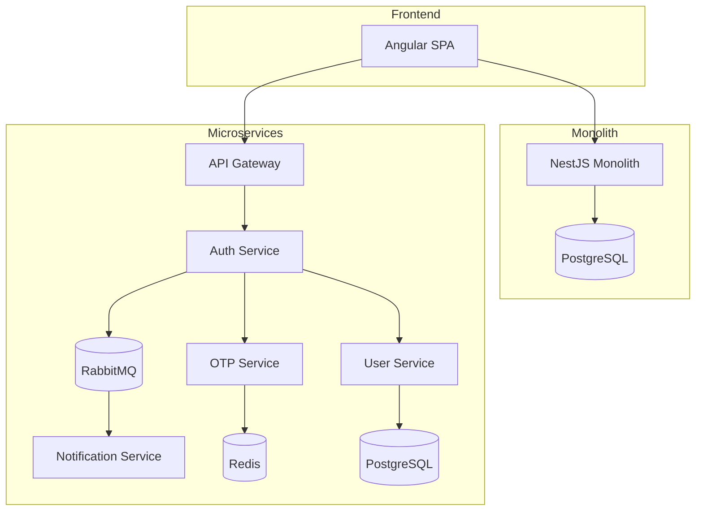
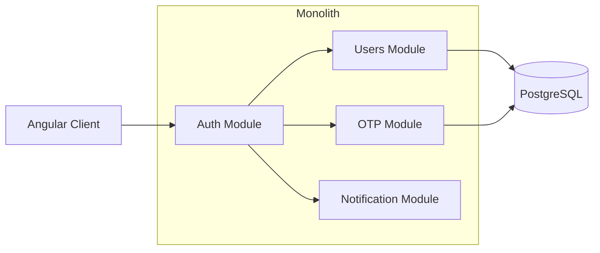
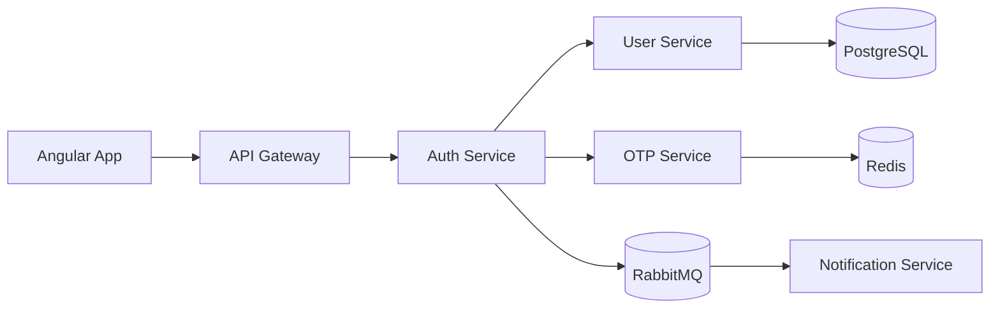
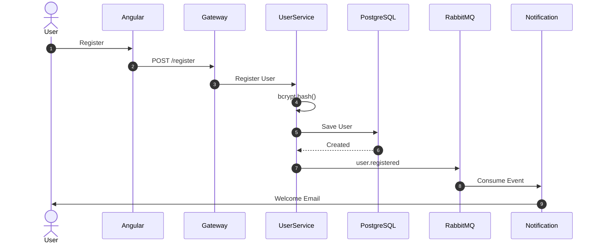
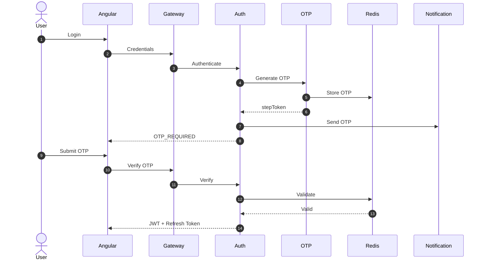

# Architecture & Design Decisions

## Navigation

- 🏠 ./README.md
- ⚙️ ./DESIGNDECISIONS.md
- 🚀 ./RUNNING.md

---

# Architecture Overview

This repository demonstrates the implementation of the same authentication requirements using two different architectural approaches.

## Business Requirements

Both implementations must support:

- User Registration
- User Authentication
- JWT Authentication
- Refresh Tokens
- Two-Factor Authentication (OTP)
- Role-Based Access Control (RBAC)
- Angular AuthGuards
- Protected Routes
- Session Management

The goal is to compare implementation trade-offs while maintaining identical functionality.

---

# High-Level Architecture



---

# Monolithic Architecture

## Overview

The monolithic implementation executes all business capabilities inside a single NestJS application.



## Components

### Auth Module

Responsible for:

- Login
- JWT Generation
- Refresh Tokens
- Session Management

### Users Module

Responsible for:

- User Registration
- Credential Storage
- User Roles

### OTP Module

Responsible for:

- OTP Generation
- OTP Validation
- Expiration Control

### Mail Module

Responsible for:

- Email Notifications
- OTP Delivery

---

## Advantages

- Simple deployment
- Easier debugging
- Lower infrastructure costs
- ACID transactions
- Faster development cycles

---

## Challenges

- Tight coupling between modules
- Shared deployment lifecycle
- Lower fault isolation
- Limited independent scalability

---

# Microservices Architecture

## Overview

The microservice implementation separates responsibilities into independent deployable services.



---

## API Gateway

Responsibilities:

- HTTP Entry Point
- Request Routing
- Authentication Validation
- Authorization Middleware

---

## User Service

Responsibilities:

- User Registration
- User Retrieval
- Roles and Permissions
- Credential Management

Storage:

- PostgreSQL

---

## Auth Service

Responsibilities:

- Login Validation
- JWT Generation
- Refresh Tokens
- Session Validation

---

## OTP Service

Responsibilities:

- OTP Generation
- OTP Validation
- TTL Control

Storage:

- Redis

---

## Notification Service

Responsibilities:

- Email Delivery
- Event Consumption
- Welcome Emails
- OTP Notifications

---

## RabbitMQ

Responsibilities:

- Event Distribution
- Asynchronous Communication
- Retry Mechanisms
- Decoupling Services

---

# API Contract

## Register User

### Request

```http
POST /api/auth/register
```

```json
{
  "name": "Miguel Valdez",
  "email": "developer@example.com",
  "password": "SecurePassword123",
  "role": "admin",
  "lang": "es"
}
```

> **Note:** `lang` is an optional string (accepts `"es"` or `"en"`, default is `"es"`) denoting the preferred communication language for automatic email templates.

### Response

```json
{
  "status": "SUCCESS",
  "message": "User successfully registered."
}
```

---

## Login

### Request

```http
POST /api/auth/login
```

```json
{
  "email": "developer@example.com",
  "password": "SecurePassword123",
  "lang": "es"
}
```

> **Note:** `lang` is an optional string (accepts `"es"` or `"en"`, default is `"es"`) used to specify the language for the generated OTP verification email templates.

### Response

```json
{
  "status": "OTP_REQUIRED",
  "stepToken": "uuid-value"
}
```

---

## Verify OTP

### Request

```http
POST /api/auth/verify-otp
```

```json
{
  "stepToken": "uuid-value",
  "code": "123456"
}
```

### Response

```json
{
  "status": "SUCCESS",
  "accessToken": "jwt-token",
  "refreshToken": "refresh-token"
}
```

---

# Registration Flow



---

# Authentication Flow



---

# Failure Isolation

## Monolith

```text
Notification Failure
        ↓
Authentication Impact
```

## Microservices

```text
Notification Failure
        ↓
RabbitMQ Queues Events
        ↓
Authentication Continues Working
```

---

# Security Model

## Password Protection

- bcrypt hashing
- Password validation
- No plain-text storage

## Authentication

- JWT Access Tokens
- Refresh Tokens
- Session Validation

## OTP

- 6-digit code
- Cryptographically secure generation
- TTL expiration (180 seconds)

## Authorization

- RBAC
- Angular AuthGuards
- Endpoint Protection

## Rate Limiting & Brute-Force Mitigation

To prevent automated scripts and brute-force attacks, we implement rate limiting using `@nestjs/throttler`:

- **Global Limit:** Maximum of 60 requests per minute by default.
- **Login Throttling (`POST /api/auth/login`):** Throttled to 5 requests per minute.
- **OTP Verification Throttling (`POST /api/auth/verify-otp`):** Throttled to 3 requests per 3 minutes (180 seconds).

### Throttled Response (HTTP 429)

If a user exceeds the request limits, the server rejects the request with a `429 Too Many Requests` status code:

```json
{
  "statusCode": 429,
  "message": "ThrottlerException: Too Many Requests"
}
```

---

# Scalability Considerations

## Monolith

Scaling method:

- Vertical Scaling
- Replicated Instances

Challenges:

- Entire application scales together

---

## Microservices

Scaling method:

- Service-by-service scaling

Example:

Authentication traffic increases:

✅ Scale Auth Service

✅ Scale Redis

✅ Keep Notification unchanged

---

# Architectural Decisions

## Why NestJS?

- Modular architecture
- Dependency Injection
- Microservice support

## Why PostgreSQL?

- Strong consistency
- ACID transactions

## Why Redis?

- High-performance temporary storage
- Native TTL support

## Why RabbitMQ?

- Reliable asynchronous communication
- Service decoupling

## Why JWT?

- Stateless authentication
- Suitable for distributed environments

---

# Lessons Learned

## Monolith

Ideal for:

- MVPs
- Small teams
- Fast delivery

## Microservices

Ideal for:

- Large systems
- Independent scaling
- High availability
- Team autonomy

No architecture is universally superior. The correct approach depends on business requirements and operational constraints.

---

# Testing Strategy

To ensure database operations, encryption, token signing, and OTP logic behave reliably without regressions, the core authentication service is protected by automated tests.

## Monolith Test Suite

Unit tests are written with **Jest** and can be run locally:

```bash
npm run test
```

The test coverage covers the following behaviors in [auth.service.spec.ts](file:///c:/Users/migue/OneDrive/Documents/idisoluciones/monolitovsmicroservicio/nestjs-monolith/src/auth/auth.service.spec.ts):
- **User Registration:** Checks that user creation, password hashing, and welcome email dispatcher work correctly.
- **Authentication (Login):** Validates credential matching (invalid email, invalid password, correct login) and checks that numeric OTP generation and storage function correctly.
- **OTP Verification:** Tests edge cases such as invalid stepToken lookup, expired OTP limits, incorrect OTP codes, and successful verification (which marks the OTP as used and signs the final JWT access token).

---

# Related Documentation

- 🏠 ./README.md
- 🚀 ./RUNNING.md