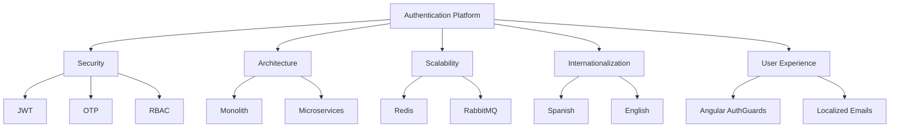
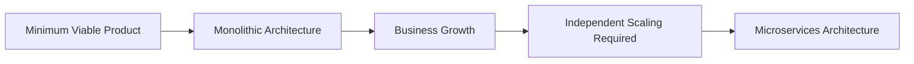
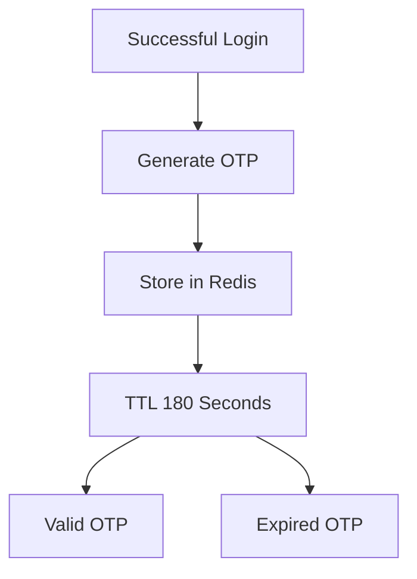
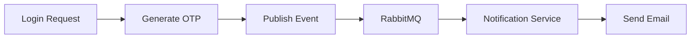
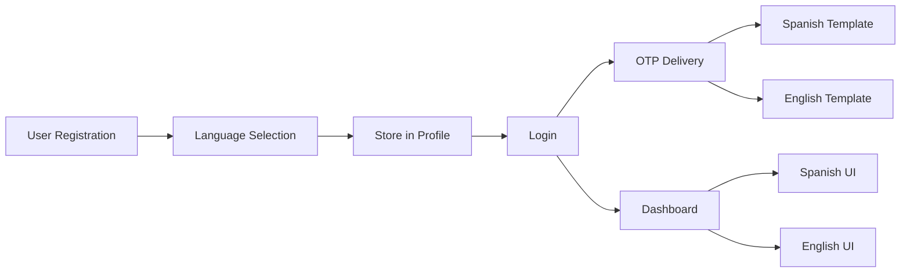
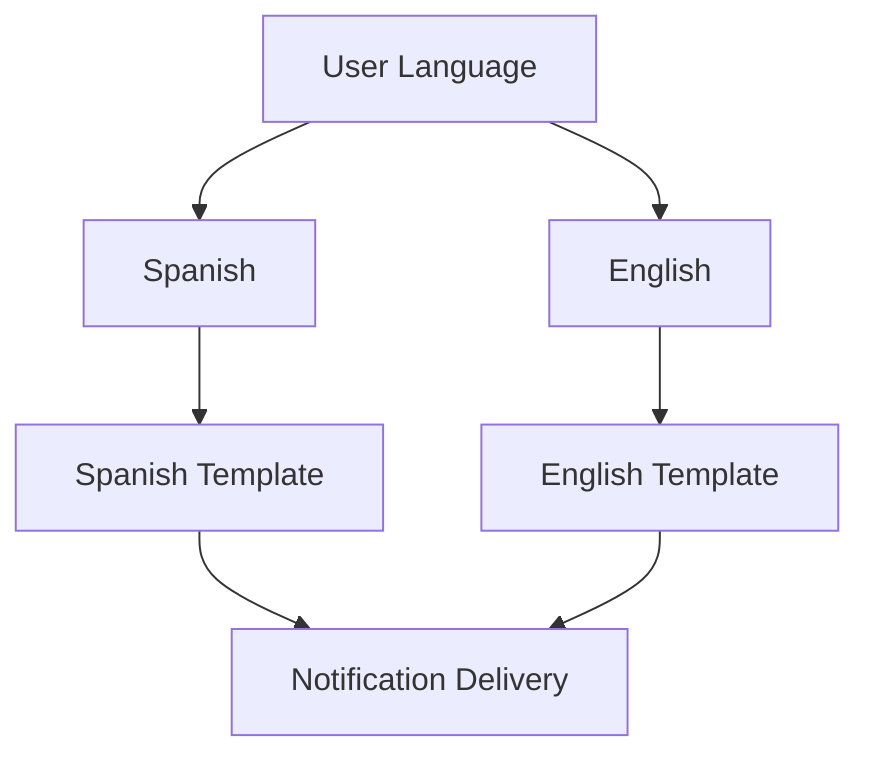
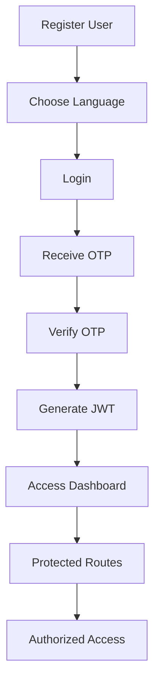
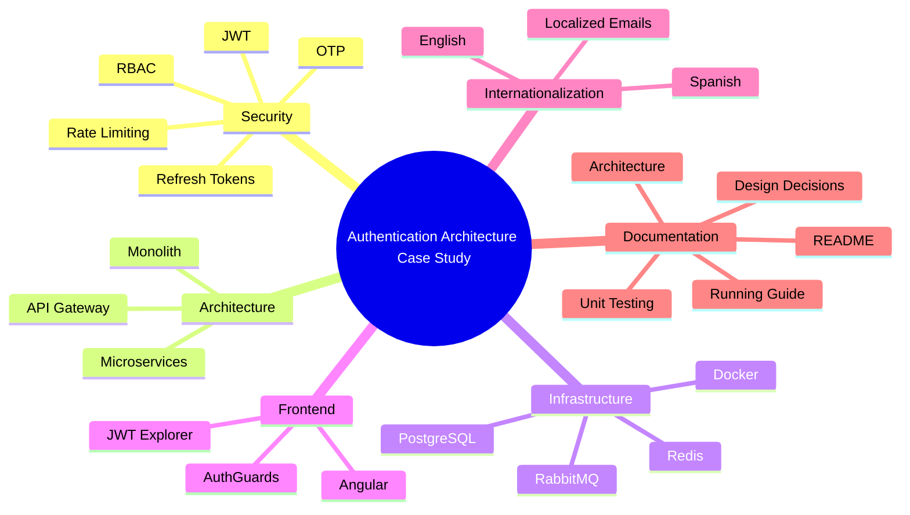

# Design Decisions & Project Rationale

## Navigation

- 🏠 ./README.md
- 🏛️ ./ARCHITECTURE.md
- 🚀 ./RUNNING.md

---

# Purpose of This Document

This document explains the engineering reasoning behind the architectural, security, infrastructure and user experience decisions adopted throughout the project.

While the repository documents **what was built** and **how it works**, this document focuses on explaining **why specific design choices were made**.

The goal is to discuss the technical trade-offs, business considerations and architectural decisions involved in building a secure authentication platform.

---

# Project Vision

This project is not intended to be another authentication tutorial.

The objective is to create a practical laboratory that demonstrates how authentication systems evolve as architectural and business requirements grow.



---

# Why Build This Project?

Authentication is one of the most common requirements in modern applications.

Most examples focus on:

- Login endpoints
- Password validation
- JWT generation

Real-world authentication systems must solve much larger challenges:

- Security
- Scalability
- Localization
- Reliability
- Service Communication
- Operational Complexity
- Architecture Design

This project was created to demonstrate these concepts in a practical, observable way.

---

# Project Goals

This project aims to answer the following questions:

- How does a monolithic architecture compare to a microservices architecture?
- How can JWT, RBAC and OTP be implemented in both approaches?
- What are the trade-offs between simplicity and scalability?
- How does fault isolation affect authentication reliability?
- When is a monolithic architecture the right choice?
- When do microservices provide measurable business value?
- How can asynchronous messaging improve resiliency?
- How should authentication data be distributed across services?
- How can multilingual authentication workflows be implemented consistently?

---

# Why Authentication?

Authentication naturally combines multiple engineering concerns.

## Security

Authentication requires:

- Password Protection
- Session Management
- Access Control
- Multi-Factor Authentication

## Architecture

Authentication services eventually become critical business components.

As systems grow, authentication often needs:

- Independent Scaling
- Service Isolation
- Distributed Communication
- Event Processing

## User Experience

Authentication is usually the first interaction users have with a platform.

A poor authentication experience directly impacts:

- User Adoption
- User Retention
- Customer Satisfaction

---

# Why Implement Both Architectures?

Many discussions comparing Monoliths and Microservices remain theoretical.

This project compares both approaches using the exact same authentication requirements.

The objective is not to determine a winner.

The objective is to understand:

- What changes?
- What stays the same?
- What complexity is introduced?
- What benefits are gained?

---

## Architectural Evolution



---

# Why Start With a Monolith?

A Monolith is often the best choice during the early stages of a project.

Benefits:

✅ Faster development

✅ Easier debugging

✅ Simpler deployment

✅ Lower infrastructure costs

✅ Simpler local development environment

✅ Easier onboarding

For most startups and MVPs, these advantages usually outweigh the architectural limitations.

---

# Why Build the Microservices Version?

Microservices were implemented to demonstrate how an authentication platform evolves when system requirements become more complex.

This version introduces:

- API Gateway
- Independent Services
- Event-Based Communication
- Service Isolation
- Independent Scaling

Benefits:

✅ Better fault isolation

✅ Independent deployments

✅ Independent scalability

✅ Better service ownership

Trade-Offs:

⚠ More infrastructure

⚠ More deployment complexity

⚠ Distributed debugging challenges

⚠ Operational overhead

---

# Why Use JWT?

JWT was selected because it is widely adopted and fits naturally into REST-based applications.

Benefits:

✅ Stateless authentication

✅ Reduced database dependency

✅ Excellent SPA support

✅ Suitable for distributed systems

✅ Easy authorization through claims

Potential Trade-Offs:

⚠ Token revocation strategies are more complex

⚠ Token size increases with additional claims

---

# Why Use Refresh Tokens?

Access tokens should remain short-lived.

Refresh tokens allow sessions to persist while maintaining security.

Benefits:

✅ Improved user experience

✅ Reduced authentication friction

✅ Better session management

✅ Stronger security posture

---

# Why Implement OTP (2FA)?

Passwords represent only one authentication factor.

A second factor significantly improves security.

Benefits:

✅ Additional account protection

✅ Better protection against compromised credentials

✅ Reduced account takeover risk

✅ Enterprise-ready authentication flow

---

# Why RBAC?

Role-Based Access Control scales better than hardcoded permissions.

Example:

```text
USER
MANAGER
ADMIN
```

Benefits:

✅ Easier maintenance

✅ Centralized authorization

✅ Clear permission hierarchy

✅ Frontend and backend consistency

---

# Why Redis?

Redis is used for temporary authentication-related data.

Examples:

- OTP Codes
- Session State
- Refresh Tokens
- Token Blacklists

Benefits:

✅ Extremely fast

✅ Native expiration support (TTL)

✅ Reduced database load

✅ Ideal for ephemeral data

---

## OTP Lifecycle



---

# Why RabbitMQ?

RabbitMQ is used to demonstrate asynchronous communication.

Instead of making users wait for emails to be delivered, events can be processed independently.

Synchronous Model:

```text
Login
 ↓
Generate OTP
 ↓
Send Email
 ↓
Return Response
```

Event-Driven Model:

```text
Login
 ↓
Generate OTP
 ↓
Publish Event
 ↓
Return Response
```

---

## Messaging Flow



Benefits:

✅ **Better response times:** The authentication gateway returns the step token immediately after publishing the event, without blocking the client thread while waiting for the SMTP network handshake.

✅ **Asynchronous Resiliency (Anti-Outage):** If the SMTP server experiences a temporary outage, RabbitMQ holds the events in a durable queue. The notification service will retry and process these pending events automatically once the mail server recovers, preventing email loss.

✅ **Fault isolation:** An email service crash or slow SMTP server does not freeze or disrupt the login workflow. The core authentication system remains fully functional.

✅ **Decoupled architecture:** Gateway and auth microservices have no knowledge of SMTP providers or configurations, keeping concern separation clean.

✅ **Message durability:** The `user_registered` and `otp_generated` event payloads are persisted in RabbitMQ queues, surviving microservice system restarts.

---

## Why RabbitMQ instead of Apache Kafka or Redis Pub/Sub?

When choosing a messaging infrastructure for asynchronous notifications (Welcome & OTP emails), several options were evaluated:

### 1. RabbitMQ vs. Apache Kafka

| Feature | RabbitMQ (Smart Broker, Dumb Consumer) | Apache Kafka (Dumb Broker, Smart Consumer) |
| :--- | :--- | :--- |
| **Model** | Traditional Message Queueing | Append-Only Distributed Log Stream |
| **Routing** | Complex routing (Exchanges, Bindings, Routing Keys) | Simple partition-key based routing |
| **Lifecycle** | Messages are deleted once consumed and acknowledged. | Messages persist according to retention limits, allowing replay. |
| **Complexity** | Lightweight, single-process, low operational cost. | Heavyweight, requires ZooKeeper/KRaft, high JVM memory. |
| **Primary Use** | Task delegation, background jobs, transactional queues. | Real-time analytics, event streaming, log aggregation. |

**Decision Justification:**
Apache Kafka is designed for high-throughput streaming (e.g., millions of telemetry logs per second). Using it for a notification pipeline is **overkill**. 
- Our system requires reliable transaction routing (Welcome & OTP emails) where once a message is processed, it is consumed and deleted. 
- RabbitMQ's AMQP protocol natively handles message acknowledgements (ACKs) and DLQs (Dead Letter Queues), ensuring that if an email fails to send, the broker retains the message for retries. 
- RabbitMQ has a negligible resource footprint, whereas Kafka requires a distributed architecture (JVM, ZooKeeper/KRaft) that would complicate local setups and Docker configurations.

### 2. RabbitMQ vs. Redis Pub/Sub

Redis is extremely fast and is already part of our stack. However, it was rejected for messaging:
- **Redis Pub/Sub is fire-and-forget:** If a consumer is offline (e.g., `notification-service` goes down for updates), the message is lost forever.
- **RabbitMQ has durable queues:** If our notification service crashes, RabbitMQ queues hold the emails safely until the service restarts, guaranteeing delivery.

---

# Why PostgreSQL?

Authentication workflows require strong consistency.

Examples:

- Users
- Credentials
- Roles
- Permissions

Benefits:

✅ ACID Transactions

✅ Data Integrity

✅ Mature Ecosystem

✅ Excellent NestJS Integration

✅ Strong Relational Capabilities

---

# Why Internationalization?

One of the main objectives of this project is to demonstrate that authentication is not only a security concern.

Authentication is also a user experience concern.

Modern systems serve users from:

- Different countries
- Different cultures
- Different languages

A consistent authentication experience should respect user preferences across every interaction.

---

# Language as Part of the User Profile

Language is treated as a business attribute rather than a visual preference.

Example:

```json
{
  "name": "Miguel Valdez",
  "email": "miguel@example.com",
  "language": "es"
}
```

```json
{
  "name": "John Doe",
  "email": "john@example.com",
  "language": "en"
}
```

This ensures consistency across the entire authentication lifecycle.

---

## Language Persistence Flow



---

# Why Localized Emails?

Many systems localize the frontend but leave notifications untranslated.

This creates inconsistent experiences.

Example:

Frontend:

```text
Spanish
```

Email:

```text
English
```

This project avoids that inconsistency.

Email templates are selected according to the user's preferred language.

---

## Localization Decision



---

## Example Templates

Spanish User:

```text
Código de Seguridad 2FA

Hola Miguel,

Tu código OTP es:

398268
```

English User:

```text
2FA Security Code

Hello John,

Your OTP code is:

398268
```

---

# Why Build a JWT Explorer?

Most users never interact directly with JWT structure.

This project exposes:

- Raw JWT
- Token Header
- Token Payload

as an educational tool.

Benefits:

✅ Better understanding of JWT architecture

✅ Easier debugging

✅ Visibility of claims

✅ Demonstrates authorization concepts

---

# Complete Authentication Journey



---

# Strong Points of the Project

## Security

- JWT Authentication
- Refresh Tokens
- OTP (2FA)
- Role-Based Access Control
- Password Hashing

---

## Architecture

- Monolithic Architecture
- Microservices Architecture
- API Gateway Pattern
- Event-Driven Architecture
- Service Isolation

---

## Infrastructure

- PostgreSQL
- Redis
- RabbitMQ
- Docker

---

## Frontend

- Angular
- AuthGuards
- JWT Explorer
- HTTP Interceptors
- Bilingual User Interface

---

## Internationalization

- English Support
- Spanish Support
- Localized Authentication Flows
- Localized Email Templates
- User Language Persistence

---

## Documentation

- README
- Architecture Guide
- Running Guide
- Design Decisions
- Architecture Diagrams

---

## Platform Capabilities



---

# Why Rate Limiting? (Brute-Force Mitigation)

Authentication systems are high-value targets for attackers. Without protections, they can execute brute-force attacks on:
1. **User Credentials:** Guessing passwords for known user emails.
2. **2FA / OTP Verification:** Guessing the 6-digit verification code. Since the OTP is numeric and has only 6 digits, there are only 1,000,000 possibilities. An attacker sending thousands of requests per second could guess the code within minutes.

## Monolithic Protection vs. Gateway Protection

This project showcases two distinct architectural approaches to rate limiting:

### 1. In-App Throttling (Monolith)
In the monolithic application, rate limiting is handled internally by `@nestjs/throttler` bound as a global `APP_GUARD`.
- **Pros:** Simple to set up, zero infrastructure overhead.
- **Cons:** Any throttled request still hits the monolith's Node.js single-threaded event loop, consuming CPU cycles and application resources.

### 2. Edge Shielding (Microservices)
In the microservices monorepo, the rate limiter is bound at the **API Gateway** level.
- **Pros:** Protects the inner microservices. Throttled requests are rejected at the edge (port 3001) before they can hit the internal TCP RPC network, prevent databases from querying user details, or consume resources in the `user-service` and `auth-service`.
- **Cons:** Adds configuration responsibility to the gateway.

---

# Why Automated Testing? (Unit Testing)

Writing automated tests is a crucial practice in backend engineering, especially for authentication logic. The `AuthService` handles registration, hashing, encryption, database transactions, caching, and notification hooks. A regression in any of these areas could lock out users or introduce critical security vulnerabilities.

This project implements Jest unit tests for the core `AuthService` to prove:
- **Isolation:** Testing the service logic independently of database states, network interfaces, or external SMTP servers by using mock implementations.
- **Reliability:** Making sure that registration, correct login, invalid login, and OTP lifecycle verifications behave exactly as expected.

---

# Lessons Learned

Authentication systems are not only responsible for validating credentials.

They also involve:

- Security
- Scalability
- Reliability
- Architecture
- Localization
- User Experience
- Maintainability

This project demonstrates how these concerns evolve when moving from a simple monolithic architecture to a distributed microservices architecture.

The most important conclusion is that there is no universally superior architecture.

The correct decision always depends on:

- Business Requirements
- Team Size
- Scalability Expectations
- Operational Complexity
- Long-Term Maintainability

---

# Related Documentation

- 🏠 ./README.md
- 🏛️ ./ARCHITECTURE.md
- 🚀 ./RUNNING.md