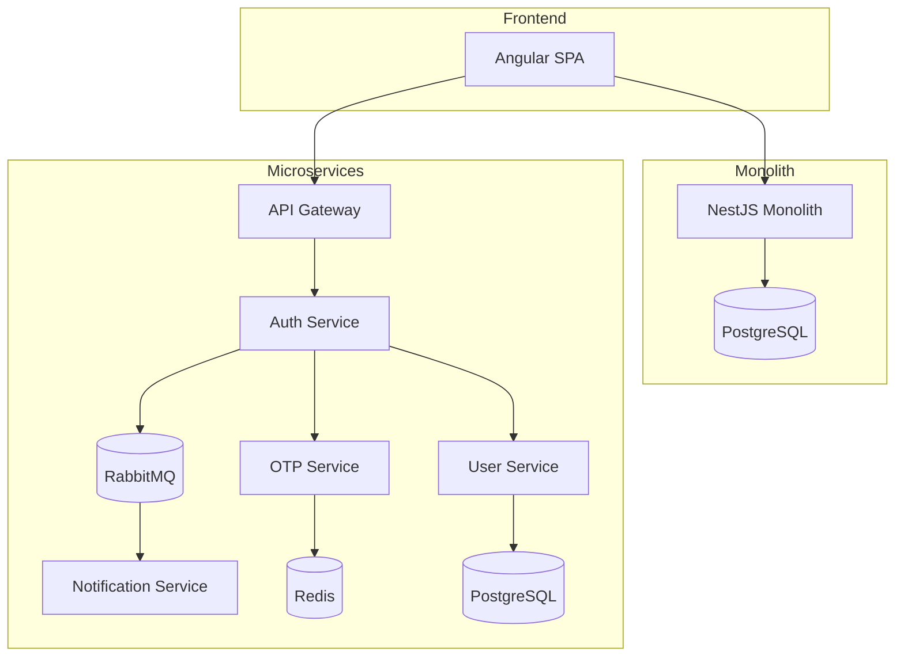

# 🏛️ Authentication Architecture Case Study

### JWT, RBAC, 2FA (OTP), Angular AuthGuards, Monolith vs Microservices

Comparative implementation of a secure authentication system using two different backend architectural approaches:

- Monolithic Architecture
- Microservices Architecture

The objective of this project is to demonstrate how the same business requirements can be implemented using different architectural patterns while evaluating scalability, resiliency, maintainability, security, fault isolation and operational complexity.

---

## Why This Project?

Most authentication tutorials focus on implementation details only.

This project aims to compare architectural trade-offs between a Monolithic Architecture and a Microservices Architecture while solving the same authentication requirements.

The focus is not only on coding the solution, but also on understanding:

- Architectural Decisions
- Scalability Strategies
- Security Practices
- Fault Isolation
- Service Communication
- Infrastructure Design
- Operational Complexity

---

## 🚀 Skills Demonstrated

### Software Architecture

- Monolithic Architecture
- Microservices Architecture
- API Gateway Pattern
- Event-Driven Architecture
- Database-per-Service Pattern
- Fault Isolation Strategies

### Backend Engineering

- NestJS
- JWT Authentication
- Refresh Tokens
- TypeORM
- PostgreSQL
- Redis
- RabbitMQ

### Security

- Two-Factor Authentication (OTP)
- Role-Based Access Control (RBAC)
- Password Hashing (bcrypt)
- JWT Session Management
- Token Rotation
- Secure API Design

### Distributed Systems

- Asynchronous Messaging
- Event Publishing and Consumption
- Service Decoupling
- Queue-Based Communication
- Scalability Considerations

### Frontend

- Angular
- AuthGuards
- HTTP Interceptors
- JWT Route Protection
- Role-Based Navigation

---

## ✨ Core Features

### Authentication

- User Registration
- JWT Authentication
- Refresh Tokens
- Password Hashing with bcrypt
- Two-Factor Authentication (OTP)

### Authorization

- Role-Based Access Control (RBAC)
- Angular AuthGuards
- Protected Routes
- JWT Interceptors

### Infrastructure

- PostgreSQL
- Redis
- RabbitMQ
- Docker
- NestJS
- Angular

---

## 📌 Business Scenario

The authentication flow consists of:

1. User Registration
2. User Authentication
3. OTP Generation
4. OTP Verification
5. JWT Access Token Generation
6. Refresh Token Generation
7. Role Validation
8. Access to Protected Resources

Both implementations provide identical business functionality but differ in architecture and operational characteristics.

---

## 📂 Repository Structure

```text
authentication-architecture-case-study/

├── README.md
├── ARCHITECTURE.md
├── RUNNING.md
│
├── angular-client/
├── nestjs-monolith/
└── nestjs-microservices/
```

---

## 🏗 Architecture Overview



---

## ⚖️ Architecture Comparison

| Characteristic | Monolith | Microservices |
|---------------|----------|---------------|
| Deployment | Single Application | Multiple Services |
| Complexity | Low | High |
| Scalability | Limited | Independent |
| Fault Isolation | Limited | High |
| Infrastructure Cost | Lower | Higher |
| Development Speed | Faster | Slower |
| Operational Complexity | Lower | Higher |

---

## 📈 Scalability Considerations

### Monolith

Scaling strategy:

- Vertical Scaling
- Replicated Instances
- Shared Database

Suitable for:

- MVPs
- Startups
- Small Development Teams

### Microservices

Scaling strategy:

- Independent Service Scaling
- Dedicated Resource Allocation
- Horizontal Scaling per Service
- Event-Based Communication

Suitable for:

- High Traffic Systems
- Large Teams
- Distributed Platforms
- Enterprise Applications

Example:

Authentication traffic spike:

✅ Scale Auth Service independently

✅ Scale Redis independently

✅ Keep Notification Service unchanged

---

## 🔒 Security Highlights

This project implements several security best practices:

- Password Hashing using bcrypt
- JWT Access Tokens
- Refresh Tokens
- Secure OTP Generation
- OTP Expiration Policies
- RBAC Authorization
- Angular AuthGuards
- Protected REST Endpoints
- Environment-Based Secrets Management

Detailed security implementation can be found in:

📘 ./ARCHITECTURE.md

---

## 📚 Documentation

| Document | Description |
|-----------|-----------|
| ./ARCHITECTURE.md | Architecture diagrams, authentication flows, data management, security model and architectural decisions |
| ./RUNNING.md | Infrastructure setup, Docker environment and local execution guide |

---

## 🚀 Quick Access

- ./ARCHITECTURE.md#architecture-overview
- ./ARCHITECTURE.md#monolithic-architecture
- ./ARCHITECTURE.md#microservices-architecture
- ./ARCHITECTURE.md#authentication-flow-microservices
- ./ARCHITECTURE.md#security-model
- ./ARCHITECTURE.md#architectural-decisions
- ./ARCHITECTURE.md#lessons-learned
- ./RUNNING.md

---

## 🔮 Future Improvements

Possible extensions for future iterations:

- OAuth2 Integration
- OpenID Connect
- Kubernetes Deployment
- Distributed Tracing
- Centralized Logging
- Prometheus Metrics
- Grafana Dashboards
- API Rate Limiting
- Multi-Tenant Authentication

---

## 👨‍💻 Author

**Miguel Antonio Valdez Solis**

Software Engineer | Full Stack Developer

Building scalable web and mobile solutions using Angular, Flutter, NestJS, PostgreSQL and modern cloud technologies.

---

## Next Step

➡️ Continue with the technical documentation:

📘 **./ARCHITECTURE.md**

or

🚀 **./RUNNING.md**
