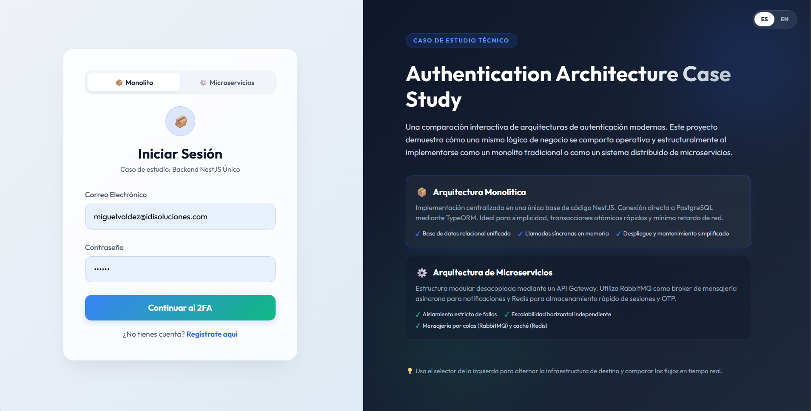
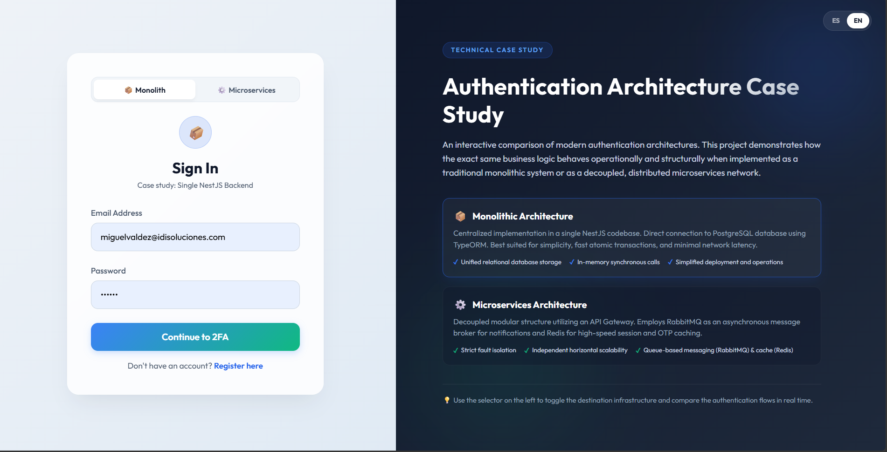
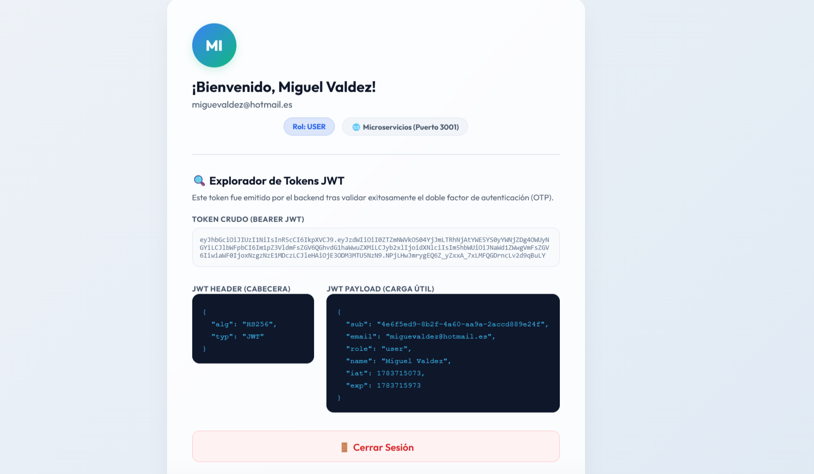
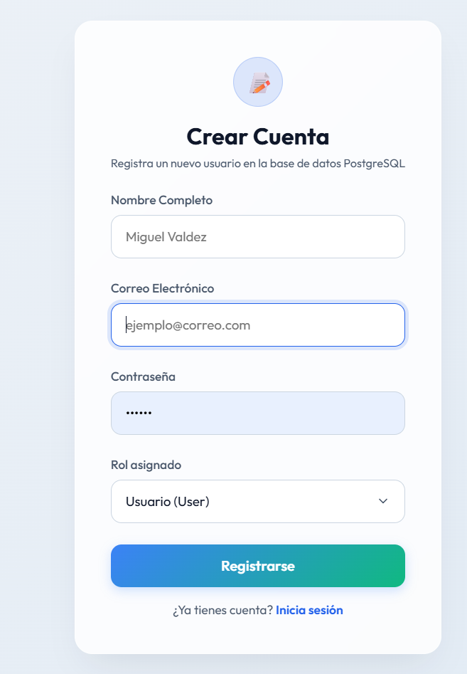
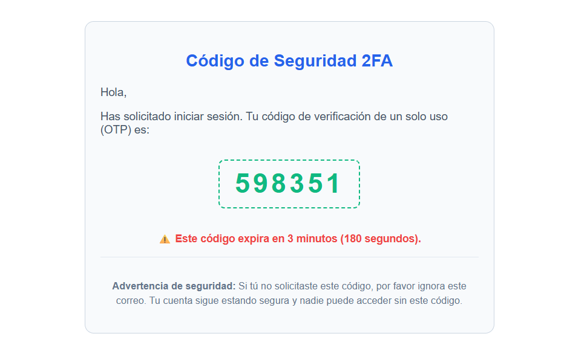
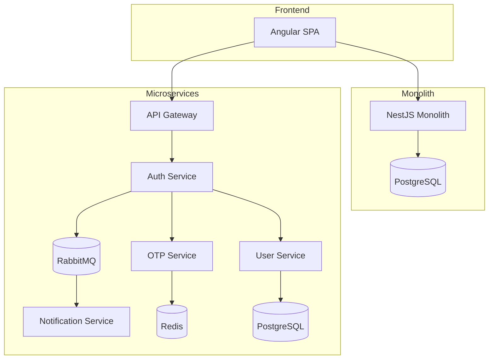

# 🏛️ Authentication Architecture Case Study

### JWT, RBAC, 2FA (OTP), Angular AuthGuards, Monolith vs Microservices

<p align="center">
  
  
</p>

Comparative implementation of a secure authentication system using two different backend architectural approaches:

- Monolithic Architecture
- Microservices Architecture

The objective of this project is to demonstrate how the same business requirements can be implemented using different architectural patterns while evaluating scalability, resiliency, maintainability, security, fault isolation and operational complexity.

---

## Why This Project?

Most authentication tutorials focus only on implementation details and framework-specific features.

This project compares architectural trade-offs between a **Monolithic Architecture** and a **Microservices Architecture** while solving the same authentication requirements.

The focus is not only on coding the solution, but also on understanding:

- Architectural Decisions
- Scalability Strategies
- Security Practices
- Fault Isolation
- Service Communication
- Infrastructure Design
- Operational Complexity

---

## 🎯 Project Goals

This project aims to answer the following questions:

- How does a monolith compare to a microservices architecture?
- How can JWT, RBAC and OTP be implemented in both approaches?
- What are the trade-offs between simplicity and scalability?
- How does fault isolation affect authentication reliability?
- When is a monolithic architecture the right choice?
- When do microservices provide measurable business value?
- How can asynchronous messaging improve resiliency?
- How should authentication data be distributed across services?

---

## 🚀 Skills Demonstrated

### Software Architecture

- Monolithic Architecture
- Microservices Architecture
- API Gateway Pattern
- Event-Driven Architecture
- Database-per-Service Pattern
- Fault Isolation Strategies

### Backend Engineering

- NestJS
- TypeORM
- JWT Authentication
- Refresh Tokens
- PostgreSQL
- Redis
- RabbitMQ
- Automated Testing (Unit tests with Jest)

### Security

- Two-Factor Authentication (OTP)
- Role-Based Access Control (RBAC)
- Password Hashing (bcrypt)
- JWT Session Management
- Refresh Tokens
- Secure API Design
- Rate Limiting & Brute-Force Throttling (@nestjs/throttler)

### Distributed Systems

- Asynchronous Messaging
- Event Publishing and Consumption
- Service Decoupling
- Queue-Based Communication
- Horizontal Scalability

### Frontend

- Angular
- AuthGuards
- HTTP Interceptors
- JWT Route Protection
- Role-Based Navigation

---

## ✨ Core Features

<p align="center">
  
</p>

### Authentication

- User Registration
- User Authentication
- JWT Authentication
- Refresh Tokens
- Password Hashing with bcrypt
- Two-Factor Authentication (OTP)
- Rate Limiting & Brute-Force Throttling

### Authorization

- Role-Based Access Control (RBAC)
- Angular AuthGuards
- Protected Routes
- HTTP Interceptors

### Infrastructure

- PostgreSQL
- Redis
- RabbitMQ
- Docker
- NestJS
- Angular

### Testing

- Automated Unit Testing (Jest)
- Core AuthService coverage (register, login, verifyOtp)
- Dependency Mocking (repositories, mailers, JWT services)

---

## 📌 Business Scenario

The authentication workflow consists of:

1. User Registration
2. User Authentication
3. OTP Generation
4. OTP Verification
5. JWT Access Token Generation
6. Refresh Token Generation
7. Role Validation
8. Access to Protected Resources

Both implementations provide identical functionality while using entirely different architectural approaches.

<p align="center">
  
  
</p>

---

## 📂 Repository Structure

```text
authentication-architecture-case-study/

├── README.md
├── ARCHITECTURE.md
├── RUNNING.md
│
├── angular-client/
├── nestjs-monolith/
└── nestjs-microservices/
```

---

## 🏗️ Architecture Overview



---

## ⚖️ Architecture Comparison

| Characteristic | Monolith | Microservices |
|---------------|----------|---------------|
| Deployment | Single Application | Multiple Services |
| Complexity | Low | High |
| Scalability | Limited | Independent |
| Fault Isolation | Limited | High |
| Infrastructure Cost | Lower | Higher |
| Development Speed | Faster | Slower |
| Operational Complexity | Lower | Higher |

---

## 📈 Scalability Considerations

### Monolith

Scaling strategy:

- Vertical Scaling
- Replicated Instances
- Shared Database

Best suited for:

- MVPs
- Startups
- Small Development Teams

### Microservices

Scaling strategy:

- Independent Service Scaling
- Dedicated Resource Allocation
- Horizontal Scaling
- Event-Driven Communication

Best suited for:

- Enterprise Applications
- High-Traffic Systems
- Distributed Teams
- Independent Service Ownership

### Example Scenario

Authentication traffic suddenly increases:

✅ Scale Auth Service independently

✅ Scale Redis independently

✅ Keep Notification Service unchanged

✅ Preserve system efficiency

---

## 🔒 Security Highlights

This project implements several security best practices:

- Password Hashing using bcrypt
- JWT Access Tokens
- Refresh Tokens
- Role-Based Access Control
- Secure OTP Generation
- OTP Expiration Policies
- Angular AuthGuards
- Protected REST Endpoints
- Environment-Based Secrets Management

More details are available in:

📘 ./ARCHITECTURE.md

---

## 📚 Documentation

| Document | Description |
|-----------|-----------|
| ./ARCHITECTURE.md | Architecture diagrams, authentication flows, security, data management and architectural decisions |
| ./DESIGNDECISIONS.md | In-depth engineering rationale behind security, design, and architecture choices |
| ./RUNNING.md | Infrastructure setup, Docker configuration and local execution |

---

## 🚀 Quick Access

- ./ARCHITECTURE.md#architecture-overview
- ./ARCHITECTURE.md#monolithic-architecture
- ./ARCHITECTURE.md#microservices-architecture
- ./ARCHITECTURE.md#authentication-flow
- ./ARCHITECTURE.md#security-model
- ./ARCHITECTURE.md#architectural-decisions
- ./ARCHITECTURE.md#lessons-learned
- ./DESIGNDECISIONS.md
- ./RUNNING.md

---

## 🔮 Future Improvements

Potential future enhancements:

- OAuth2 Integration
- OpenID Connect
- SSO (Single Sign-On)
- Kubernetes Deployment
- Distributed Tracing
- Centralized Logging
- Prometheus Monitoring
- Grafana Dashboards
- Rate Limiting
- Multi-Tenant Authentication

---

## 👨‍💻 Author

**Miguel Antonio Valdez Solis**

Software Engineer | Full Stack Developer

Building scalable web and mobile solutions using Angular, Flutter, NestJS, PostgreSQL and modern cloud technologies.

---

## Next Step

➡️ Continue with the technical documentation:

📘 ./ARCHITECTURE.md

or

🚀 ./RUNNING.md